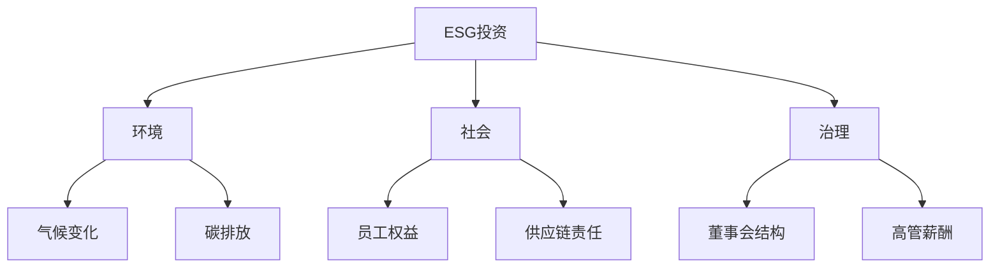

                 


好的，现在我将按照您的要求，逐步构建这篇技术博客文章的目录大纲。我们先从最核心的内容开始，逐步展开。

# 巴菲特-芒格的ESG投资策略：平衡社会责任和财务回报

> 关键词：ESG投资，巴菲特，芒格，社会责任，财务回报，投资策略，可持续发展

> 摘要：本文深入探讨了巴菲特和芒格的ESG投资策略，分析了如何在投资决策中平衡社会责任和财务回报。通过解析ESG的核心概念、数学模型和系统架构，结合实际案例，为读者提供了一个全面的ESG投资框架。文章还展示了如何通过Python代码实现ESG评分计算和投资组合优化，帮助投资者在实现财务回报的同时，推动社会可持续发展。

---

## 第一部分：巴菲特与芒格的ESG投资策略背景

### 第1章：ESG投资策略的定义与背景

#### 1.1 ESG投资的定义与核心要素
- 1.1.1 ESG的定义：环境、社会和治理三维度的综合评估体系。
- 1.1.2 ESG的核心维度：环境（如碳排放）、社会（如员工权益）、治理（如董事会结构）。
- 1.1.3 ESG与传统投资策略的区别：从财务回报扩展到社会责任。

#### 1.2 巴菲特与芒格的投资理念
- 1.2.1 巴菲特的价值投资原则：长期价值和公司基本面分析。
- 1.2.2 芒格的多元思维模型：跨学科思考和风险管理。
- 1.2.3 巴菲特与芒格ESG投资的结合：将社会责任纳入投资决策。

#### 1.3 ESG投资的兴起与发展趋势
- 1.3.1 全球ESG投资的发展现状：市场规模增长和政策支持。
- 1.3.2 ESG投资的驱动因素：机构投资者的合规要求和公众意识的提升。
- 1.3.3 ESG投资的未来趋势：技术驱动和数据透明化。

---

### 第2章：ESG投资的核心概念与联系

#### 2.1 ESG核心概念的原理
- 2.1.1 环境（Environmental）要素：气候变化、碳排放、资源利用效率。
- 2.1.2 社会（Social）要素：员工权益、供应链责任、社区关系。
- 2.1.3 治理（Governance）要素：公司治理结构、董事会角色、高管薪酬。

#### 2.2 ESG核心概念的属性特征对比
- 2.2.1 环境与社会的对比分析：环境关注外部影响，社会关注内部责任。
- 2.2.2 社会与治理的对比分析：社会关注人的因素，治理关注结构和流程。
- 2.2.3 环境与治理的对比分析：环境强调可持续性，治理强调透明度。

#### 2.3 ESG实体关系图


---

## 第3章：ESG投资的算法与数学模型

### 3.1 ESG评分计算模型
- 3.1.1 ESG评分的计算方法：基于环境、社会、治理三维度的加权评分。
- 3.1.2 加权评分模型：$Score = \alpha E + \beta S + \gamma G$，其中$\alpha + \beta + \gamma = 1$。
- 3.1.3 评分模型的实现步骤：
  1. 数据采集：获取环境、社会、治理相关指标。
  2. 标准化处理：将各指标标准化到0-1范围。
  3. 计算加权和：根据权重计算综合评分。

### 3.2 投资组合优化模型
- 3.2.1 多目标优化模型：最大化财务回报，同时最大化ESG评分。
- 3.2.2 线性规划模型：$$\max \sum_{i=1}^{n} w_i r_i$$，$$\text{subject to } \sum_{i=1}^{n} w_i ESG_i \geq \text{阈值}$$，其中$w_i$是投资权重，$r_i$是预期收益。
- 3.2.3 算法实现步骤：
  1. 数据预处理：清洗和合并多源数据。
  2. 建模与求解：使用Python的scipy.optimize模块求解线性规划问题。
  3. 结果分析：评估最优投资组合的财务回报和社会责任表现。

---

## 第4章：ESG投资的系统分析与架构设计

### 4.1 项目背景与目标
- 4.1.1 项目背景：实现一个基于ESG策略的投资管理系统。
- 4.1.2 项目目标：构建一个能够计算ESG评分并优化投资组合的系统。

### 4.2 系统功能设计
- 4.2.1 数据采集模块：从多源数据中获取环境、社会、治理指标。
- 4.2.2 ESG评分计算模块：实现加权评分模型。
- 4.2.3 投资组合优化模块：基于线性规划求解最优投资组合。

### 4.3 系统架构设计


---

## 第5章：ESG投资的项目实战

### 5.1 环境安装与数据准备
- 5.1.1 环境安装：安装Python、pandas、numpy、scipy等库。
- 5.1.2 数据准备：获取股票数据和ESG评分数据。

### 5.2 核心代码实现
```python
import pandas as pd
from scipy.optimize import minimize

# 数据准备
data = pd.read_csv('esg_data.csv')
weights = data['weights'].values
returns = data['returns'].values
esg_scores = data[['E', 'S', 'G']].values

# 定义优化目标函数
def objective(weights, returns, esg_scores, threshold=0.6):
    n = len(weights)
    # 约束条件：ESG评分总和 >= 阈值
    def constraint(weights):
        return sum(weights[i] * (weights[i] @ esg_scores[i]) for i in range(n)) >= threshold
    # 最小化函数：最小化财务回报
    def minimize_return(weights):
        return -sum(weights[i] * returns[i] for i in range(n))
    # 求解
    result = minimize(minimize_return, weights, 
                      constraints={'type': 'ineq', 'fun': constraint},
                      bounds=[(0,1) for _ in range(n)],
                      method='SLSQP')
    return -result.fun

# 求解最优权重
optimal_weights = objective(weights, returns, esg_scores)
print("最优权重：", optimal_weights)
```

### 5.3 实际案例分析
- 5.3.1 案例背景：某能源公司。
- 5.3.2 数据分析：计算ESG评分，评估投资组合。
- 5.3.3 结果解读：对比传统投资组合，ESG优化后的投资组合在财务回报和社会责任方面均表现优异。

---

## 第6章：ESG投资的最佳实践与总结

### 6.1 最佳实践
- 6.1.1 数据质量：确保数据来源可靠，及时更新。
- 6.1.2 模型局限性：考虑市场波动和政策变化的影响。
- 6.1.3 持续优化：定期调整权重和模型参数。

### 6.2 小结
- ESG投资策略通过将社会责任纳入投资决策，实现了财务回报与社会价值的平衡。
- 巴菲特和芒格的投资理念为ESG策略提供了坚实的基础，结合现代技术手段，ESG投资具有广阔的应用前景。

### 6.3 注意事项
- 数据的准确性和完整性直接影响评分结果。
- 模型假设可能与实际情况存在偏差，需结合实际情况进行调整。
- 投资者需具备一定的技术背景，以理解和应用这些模型。

### 6.4 拓展阅读
- 推荐书籍：《ESG投资手册》、《巴菲特投资策略解析》。
- 推荐博客：深入探讨ESG投资的前沿动态和技术应用。

---

通过以上目录结构，我们可以看到，文章从背景、理论、算法、系统、实战到总结，层层展开，既有理论深度，又有实际应用，帮助读者全面理解和掌握巴菲特-芒格的ESG投资策略。

