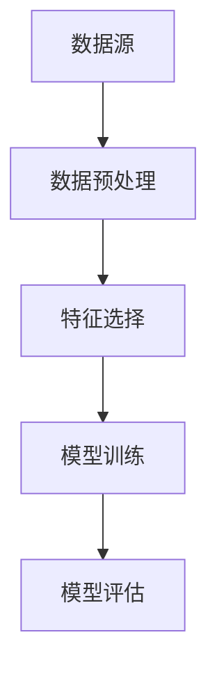
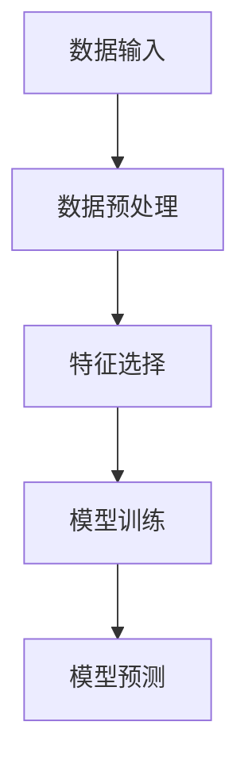
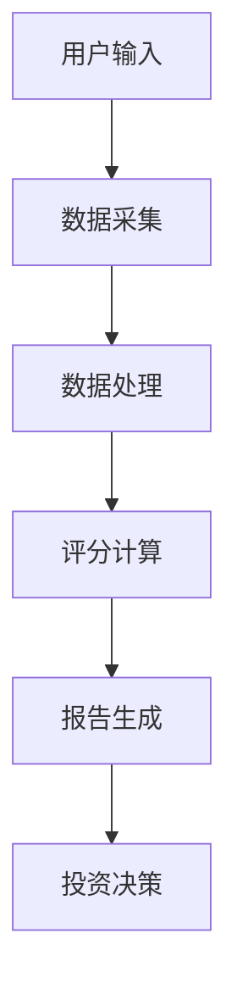
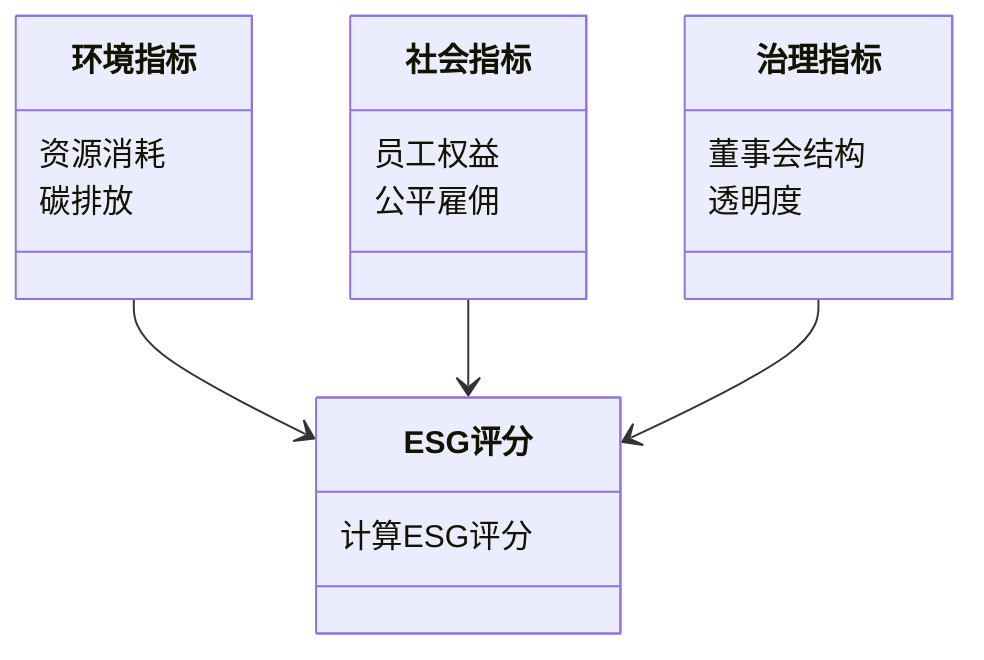
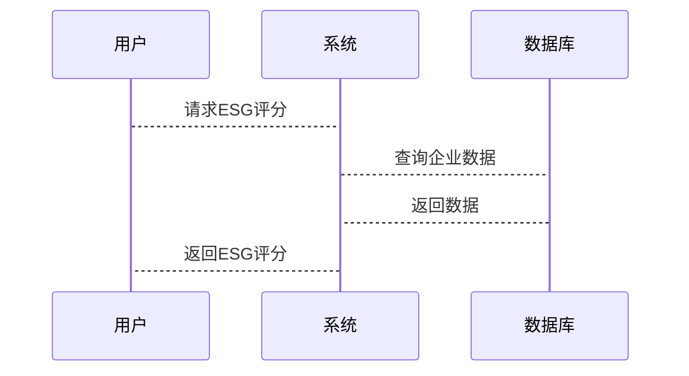

                 


# 巴菲特-芒格的ESG投资观：平衡利润和社会责任

> 关键词：ESG投资，巴菲特，芒格，社会责任，投资策略

> 摘要：本文深入探讨了巴菲特和芒格的ESG投资理念，分析了如何在追求利润的同时兼顾社会责任。通过详细的技术分析和案例研究，本文揭示了ESG投资的核心要素、算法原理和系统架构，为读者提供了一个全面的视角来理解这一投资策略。

---

# 第1章: 巴菲特与芒格的ESG投资观概述

## 1.1 ESG投资的定义与背景

### 1.1.1 什么是ESG投资
ESG投资是一种基于环境（Environmental）、社会（Social）和治理（Governance）三个维度的投资策略。投资者通过评估企业在这些方面的表现，选择那些在可持续发展方面表现优异的企业进行投资。

### 1.1.2 ESG投资的起源与发展
ESG投资起源于20世纪60年代的社会责任投资（SRI），随着全球对环境保护和社会责任的关注增加，ESG投资逐渐成为主流。

### 1.1.3 ESG投资的核心理念
ESG投资的核心理念是通过关注企业的可持续发展能力，实现长期的超额收益。这种投资策略不仅关注企业的财务表现，还关注其对环境、社会和治理的影响。

## 1.2 巴菲特与芒格的ESG投资观点

### 1.2.1 巴菲特的投资哲学
巴菲特的投资哲学以价值投资为核心，注重企业的基本面和长期盈利能力。他认为，企业应具备强大的竞争优势和良好的治理结构。

### 1.2.2 芒格的价值投资理念
芒格强调投资中的道德和价值观，认为企业应具备良好的社会声誉和道德标准。他主张通过长期投资优质企业来实现财富增长。

### 1.2.3 巴菲特与芒格ESG投资观的异同
巴菲特和芒格的ESG投资观都强调企业的长期价值，但巴菲特更关注财务表现，而芒格更关注企业的社会影响。

## 1.3 ESG投资的现状与趋势

### 1.3.1 全球ESG投资的发展现状
近年来，全球ESG投资规模快速增长，越来越多的投资者开始关注企业的可持续发展表现。

### 1.3.2 ESG投资的未来趋势
随着全球气候变化和社会问题的加剧，ESG投资将成为未来投资的重要方向。

### 1.3.3 ESG投资对企业的深远影响
企业通过提升ESG表现，可以增强投资者信心，降低融资成本，并提升品牌价值。

---

# 第2章: ESG投资的核心要素与框架

## 2.1 ESG的三个维度

### 2.1.1 环境（Environmental）
环境因素关注企业的资源消耗、碳排放和环境保护措施。例如，企业是否采用可再生能源，是否减少污染排放。

### 2.1.2 社会（Social）
社会因素关注企业的社会责任，包括员工权益、社区参与和公平雇佣。例如，企业是否关注员工福利，是否支持弱势群体。

### 2.1.3 治理（Governance）
治理因素关注企业的管理和透明度，包括董事会结构、公司治理和内部控制。例如，企业是否建立有效的风险管理机制。

## 2.2 ESG投资框架的构建

### 2.2.1 ESG评分体系的建立
ESG评分体系通过量化企业的环境、社会和治理表现，为企业提供一个综合评分。

### 2.2.2 ESG投资的评估标准
投资者可以根据ESG评分和行业基准，选择那些在ESG方面表现优异的企业进行投资。

### 2.2.3 ESG数据的来源与处理
ESG数据主要来源于企业公开报告、第三方评级机构和政府监管机构。投资者需要对这些数据进行清洗和标准化处理。

## 2.3 ESG核心要素对比

### 2.3.1 ESG三要素的属性特征对比表
| 要素   | 属性特征             |
|--------|----------------------|
| 环境   | 资源消耗、碳排放       |
| 社会   | 员工权益、公平雇佣     |
| 治理   | 董事会结构、透明度     |

### 2.3.2 ESG三要素的ER实体关系图
```mermaid
erd
    left join
    entity 环境 {
        id
        资源消耗
        碳排放
    }
    entity 社会 {
        id
        员工权益
        公平雇佣
    }
    entity 治理 {
        id
        董事会结构
        透明度
    }
```

---

# 第3章: ESG评分模型的构建与实现

## 3.1 ESG评分模型的算法原理

### 3.1.1 数据预处理与特征选择
数据预处理包括清洗缺失值和异常值。特征选择关注环境、社会和治理相关指标。

### 3.1.2 模型训练与优化
使用机器学习算法（如随机森林、支持向量机）对ESG数据进行建模，并通过交叉验证优化模型参数。

### 3.1.3 模型评估与验证
通过准确率、召回率和F1分数评估模型性能，并使用测试集验证模型的泛化能力。

## 3.2 ESG评分模型的数学公式与实现代码

### 3.2.1 ESG评分的线性回归模型
线性回归模型用于预测企业ESG评分：
$$ y = \beta_0 + \beta_1x_1 + \beta_2x_2 + \beta_3x_3 + \epsilon $$
其中，$y$是ESG评分，$x_1$、$x_2$、$x_3$是环境、社会和治理指标，$\epsilon$是误差项。

### 3.2.2 ESG评分的机器学习模型
随机森林模型用于分类企业ESG表现：
```python
from sklearn.ensemble import RandomForestClassifier
model = RandomForestClassifier(n_estimators=100, random_state=42)
model.fit(X_train, y_train)
y_pred = model.predict(X_test)
```

## 3.3 ESG评分模型的流程图

### 3.3.1 数据流图


### 3.3.2 算法流程图


---

# 第4章: ESG投资的系统架构与设计

## 4.1 ESG投资系统的功能设计

### 4.1.1 系统功能模块划分
系统功能模块包括数据采集、评分计算、报告生成和投资决策。

### 4.1.2 系统功能流程图


### 4.1.3 系统功能的领域模型类图


## 4.2 ESG投资系统的架构设计

### 4.2.1 系统架构图


### 4.2.2 系统接口设计
系统接口包括数据接口（用于获取ESG数据）和用户接口（用于查询和分析ESG评分）。

### 4.2.3 系统交互序列图


---

# 第5章: ESG投资的项目实战

## 5.1 环境安装与配置

### 5.1.1 安装Python环境
安装Python 3.8及以上版本，并安装必要的库：
```bash
pip install numpy pandas scikit-learn
```

## 5.2 核心代码实现

### 5.2.1 数据预处理代码
```python
import pandas as pd
# 读取数据
data = pd.read_csv('esg_data.csv')
# 删除缺失值
data.dropna(inplace=True)
# 标准化处理
from sklearn.preprocessing import StandardScaler
scaler = StandardScaler()
data_scaled = scaler.fit_transform(data)
```

### 5.2.2 模型训练代码
```python
from sklearn.ensemble import RandomForestRegressor
model = RandomForestRegressor(n_estimators=100, random_state=42)
model.fit(X_train, y_train)
```

## 5.3 案例分析与解读

### 5.3.1 案例分析
以某企业为例，分析其环境、社会和治理表现，并计算ESG评分。

### 5.3.2 案例解读
通过ESG评分，投资者可以识别出在可持续发展方面表现优异的企业，并进行长期投资。

## 5.4 项目小结

### 5.4.1 项目总结
通过本项目，我们掌握了ESG评分模型的构建与实现方法，并验证了其在实际投资中的应用价值。

### 5.4.2 经验总结
在实际操作中，需要关注数据的准确性和模型的可解释性，以确保ESG评分的客观性和可靠性。

---

# 第6章: ESG投资的最佳实践

## 6.1 小结

### 6.1.1 核心观点回顾
ESG投资是一种平衡利润和社会责任的投资策略，通过关注企业的可持续发展表现，实现长期的超额收益。

### 6.1.2 投资理念总结
投资者应关注企业的环境、社会和治理表现，选择那些在可持续发展方面表现优异的企业进行投资。

## 6.2 注意事项

### 6.2.1 数据质量
确保数据的准确性和完整性，避免因数据问题影响评分结果。

### 6.2.2 模型选择
根据实际需求选择合适的模型，并进行充分的验证和优化。

### 6.2.3 投资风险
ESG投资虽然注重长期价值，但也存在一定的市场风险，投资者需做好风险管理工作。

## 6.3 拓展阅读

### 6.3.1 相关书籍
- 《巴菲特致股东的信》
- 《ESG投资指南》

### 6.3.2 相关网站
- MSCI ESG评级
- 瑞士信贷ESG报告

---

# 结语

通过本文的深入探讨，我们不仅了解了巴菲特和芒格的ESG投资观，还掌握了ESG投资的核心要素、算法原理和系统架构。未来，随着全球对可持续发展的关注增加，ESG投资将成为一种重要的投资策略，帮助投资者在追求利润的同时，兼顾社会责任，实现长期的可持续发展。

