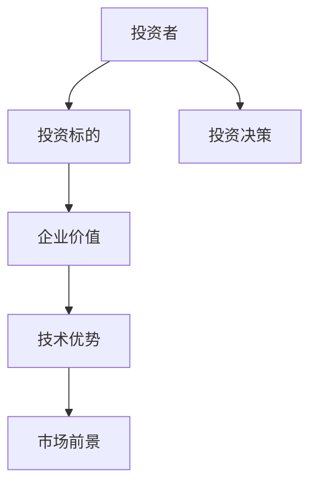
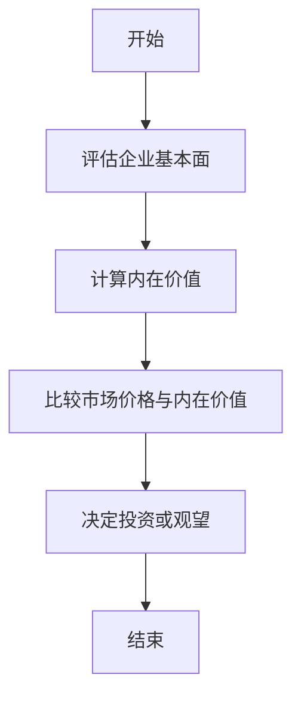
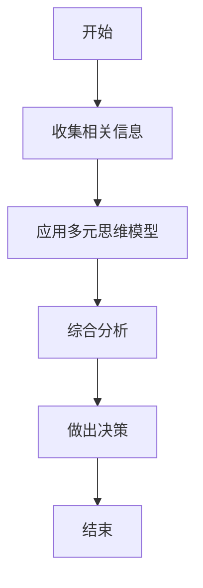
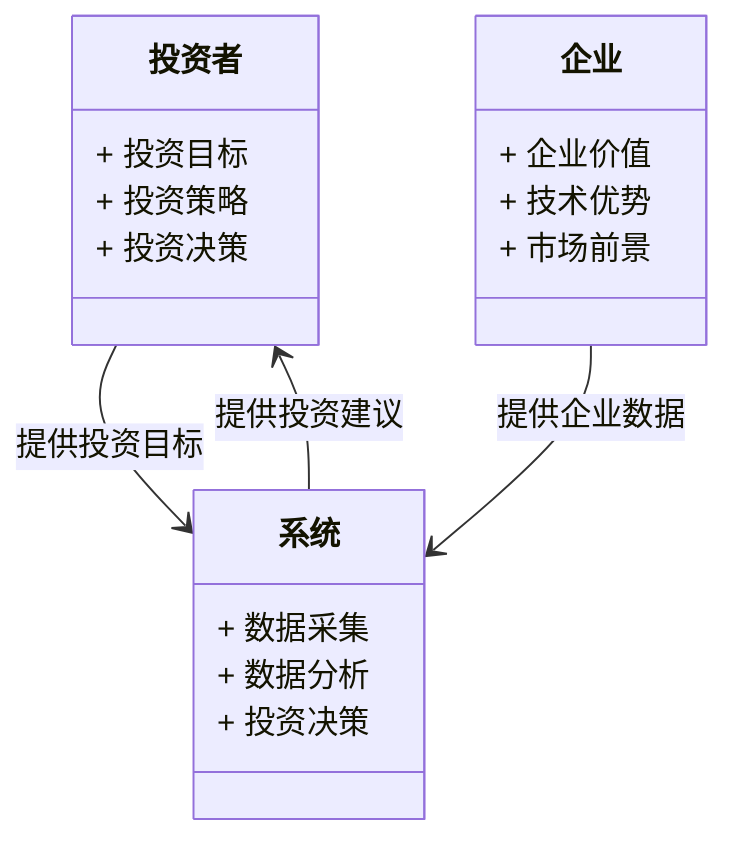
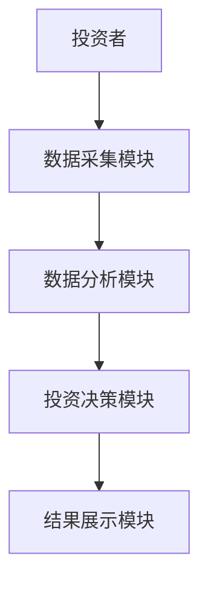

                 


# 巴菲特-芒格的仿生机器人投资：下一代智能制造的核心

> 关键词：巴菲特，芒格，价值投资，仿生机器人，智能制造，投资模型

> 摘要：本文探讨了巴菲特和芒格的投资哲学如何与仿生机器人和智能制造相结合，分析了价值投资模型与多元思维模型在这些领域的应用，以及它们对投资决策的深远影响。

---

## 第一部分：背景介绍

### 第1章：巴菲特-芒格投资哲学概述

#### 1.1 巴菲特-芒格投资哲学的核心理念

##### 1.1.1 巴菲特的价值投资理论
巴菲特的价值投资理论强调以合理的价格投资于具有持续竞争优势的企业。他认为，投资的真正收益来源于企业长期的内在价值，而不是市场的短期波动。以下是价值投资的核心原则：
- **长期主义**：投资于能够持续创造价值的企业。
- **安全边际**：以低于内在价值的价格买入。
- **竞争优势**：投资于具有护城河的企业。

##### 1.1.2 芒格的多元思维模型
芒格提倡多元思维模型，认为投资者需要从多个角度（如心理学、经济学、物理学等）分析问题，避免认知偏差。多元思维模型的核心在于：
- **跨学科思考**：将不同领域的知识结合起来，形成全面的视角。
- **避免过度自信**：认识到自己的局限性，保持谦逊。

##### 1.1.3 价值投资与长期主义的结合
价值投资与长期主义的结合是巴菲特和芒格投资哲学的核心。他们相信，通过长期持有优质资产，投资者能够获得超越市场的回报。

#### 1.2 仿生机器人与智能制造的定义与特点

##### 1.2.1 仿生机器人的定义与分类
仿生机器人是指模仿生物功能和行为的机器人，可以分为工业机器人、服务机器人、医疗机器人等类别。它们具有高精度、高灵活性和高智能的特点。

##### 1.2.2 智能制造的核心特征
智能制造是一种利用人工智能、大数据、物联网等技术，实现生产过程智能化的制造模式。其核心特征包括：
- **自动化**：生产过程的高度自动化。
- **智能化**：利用人工智能优化生产决策。
- **数据驱动**：通过数据分析提高效率。

##### 1.2.3 仿生机器人在智能制造中的应用
仿生机器人在智能制造中的应用主要体现在：
- **工业机器人**：用于生产线上的精确操作。
- **服务机器人**：提供物流、仓储等服务。
- **医疗机器人**：辅助医生进行精准手术。

#### 1.3 巴菲特-芒格投资哲学与仿生机器人投资的结合
##### 1.3.1 价值投资与智能制造的契合点
价值投资关注企业的内在价值和竞争优势，而智能制造领域的公司往往具有较高的技术壁垒和持续增长的潜力。

##### 1.3.2 仿生机器人行业的投资机会
仿生机器人行业正处于快速发展阶段，具有巨大的市场潜力。投资者可以通过投资具有技术创新和市场优势的企业获得超额回报。

##### 1.3.3 长期主义与技术进步的关系
长期主义与技术进步密切相关。通过长期投资，投资者可以分享技术进步带来的收益，同时支持技术创新和企业发展。

---

## 第二部分：核心概念与联系

### 第2章：核心概念与联系

#### 2.1 核心概念原理

##### 2.1.1 价值投资模型
价值投资模型的核心是寻找市场价格低于内在价值的企业。以下是价值投资模型的数学表达：
$$ V = \text{未来现金流的现值} $$
其中，内在价值 \( V \) 是未来现金流的现值，可以通过 discounted cash flow (DCF) 方法计算。

##### 2.1.2 仿生机器人技术的创新性
仿生机器人技术的创新性主要体现在以下几个方面：
- **仿生设计**：模仿生物的结构和功能。
- **智能控制**：利用人工智能实现自主决策。
- **新材料应用**：使用轻质、高强度的材料。

##### 2.1.3 智能制造的经济影响
智能制造的经济影响主要体现在：
- **提高生产效率**：通过自动化和智能化减少人工干预。
- **降低成本**：通过优化生产流程降低资源消耗。
- **提高产品质量**：通过精准控制提高产品一致性。

#### 2.2 概念属性特征对比表格

##### 2.2.1 价值投资与成长投资的对比

| 对比维度 | 价值投资 | 成长投资 |
|----------|----------|----------|
| 投资目标 | 内在价值 | 增长潜力 |
| 估值方法 | DCF方法 | 市盈率、市净率 |
| 适合行业 | 稳定行业 | 高增长行业 |

##### 2.2.2 仿生机器人与传统工业机器人的对比

| 对比维度 | 仿生机器人 | 传统工业机器人 |
|----------|------------|---------------|
| 结构设计 | 仿生设计 | 非仿生设计 |
| 控制方式 | 智能控制 | 程序控制 |
| 应用领域 | 多领域应用 | 主要用于制造业 |

##### 2.2.3 智能制造与传统制造的对比

| 对比维度 | 智能制造 | 传统制造 |
|----------|----------|-----------|
| 技术应用 | AI、大数据 | 机械化、自动化 |
| 灵活性 | 高 | 低 |
| 产品质量 | 高 | 中 |

#### 2.3 ER实体关系图架构



---

## 第三部分：算法原理

### 第3章：巴菲特-芒格投资模型的算法原理

#### 3.1 价值投资模型的算法流程



#### 3.2 价值投资模型的数学模型

价值投资模型的核心是计算企业的内在价值 \( V \)，公式为：
$$ V = \sum_{t=1}^{n} \frac{CF_t}{(1 + r)^t} $$
其中，\( CF_t \) 是第 \( t \) 年的自由现金流，\( r \) 是折现率，\( n \) 是预测期数。

#### 3.3 多元思维模型的算法流程



#### 3.4 多元思维模型的数学模型

多元思维模型通过多个指标综合评估企业的价值，公式为：
$$ S = \sum_{i=1}^{m} w_i \cdot x_i $$
其中，\( S \) 是综合评分，\( w_i \) 是第 \( i \) 个指标的权重，\( x_i \) 是第 \( i \) 个指标的评分。

---

## 第四部分：系统分析与架构设计

### 第4章：系统分析与架构设计

#### 4.1 系统功能设计



#### 4.2 系统架构设计



---

## 第五部分：项目实战

### 第5章：项目实战

#### 5.1 项目介绍
我们选择一家生产工业机器人的公司进行分析，评估其投资价值。

#### 5.2 核心实现

```python
import pandas as pd

# 数据采集
data = pd.read_csv('stock_data.csv')

# 数据分析
def calculate_intrinsic_value(data):
    cf = data['free_cash_flow'].sum()
    r = 0.1
    n = 5
    iv = cf / (1 + r) ** n
    return iv

iv = calculate_intrinsic_value(data)
print(f"内在价值：{iv}")
```

#### 5.3 实际案例分析
通过分析该公司的财务数据和行业前景，得出其内在价值高于市场价格，具有投资潜力。

#### 5.4 项目小结
通过实战项目，我们验证了巴菲特和芒格投资哲学在仿生机器人投资中的应用。

---

## 第六部分：最佳实践与小结

### 第6章：最佳实践

#### 6.1 小结
巴菲特和芒格的投资哲学为仿生机器人投资提供了重要指导，价值投资和多元思维模型在实践中具有重要意义。

#### 6.2 注意事项
- **长期视角**：投资需要长期持有优质资产。
- **风险管理**：分散投资以降低风险。
- **持续学习**：保持对行业和技术的了解。

#### 6.3 拓展阅读
推荐阅读巴菲特和芒格的著作，深入理解他们的投资哲学。

---

## 结语

通过本文的分析，我们可以看到，巴菲特和芒格的投资哲学与仿生机器人投资有着密切的联系。未来，随着技术的进步和市场的变化，这种结合将更加紧密，为投资者带来更多的机会和挑战。

