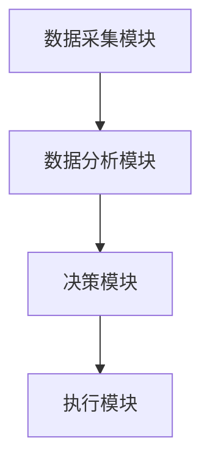
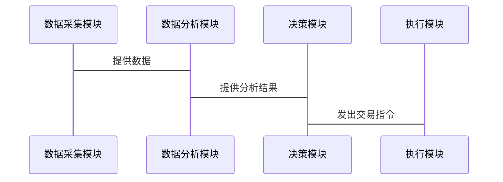
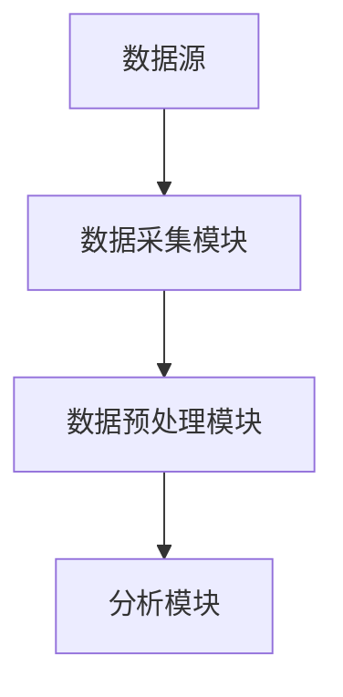
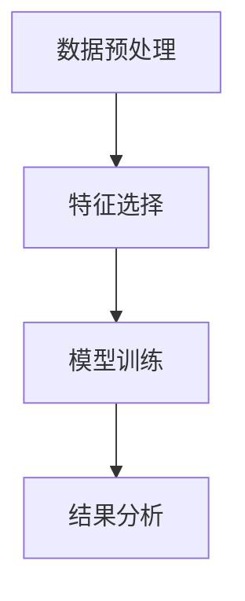
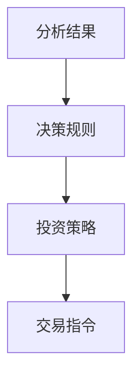

                 


# 巴菲特-芒格的仿生机器人投资：未来劳动力的革命

## 关键词：
- 巴菲特投资策略
- 仿生机器人
- 人工智能
- 数据驱动投资
- 未来劳动力

## 摘要：
本文探讨巴菲特和芒格如何通过仿生机器人技术革新投资方式，分析其背后的逻辑、算法和系统架构，展示实际案例和最佳实践，揭示仿生机器人在投资领域的潜力和未来劳动力的革命性变化。

---

# 第1章：巴菲特与芒格的投资哲学

## 1.1 巴菲特与芒格的投资理念

### 1.1.1 巴菲特的价值投资理论
巴菲特的价值投资强调寻找具有持续竞争优势的企业，注重企业的内在价值和长期盈利能力。他的投资哲学以基本面分析为核心，寻找低估的股票，长期持有，等待价值实现。

### 1.1.2 芒格的多元思维模型
芒格提倡建立多元思维模型，将各个学科的基本原理融会贯通，形成多维度的思考框架。这种思维方式帮助投资者从不同角度分析问题，避免单一视角的局限性。

### 1.1.3 两人合作的投资策略
巴菲特和芒格的合作基于对价值投资的共同理念，芒格的多元思维模型为巴菲特的投资决策提供了丰富的视角，而巴菲特的耐心和长期视角则为芒格的投资策略提供了时间维度的支持。

---

# 第2章：仿生机器人技术的基础

## 2.1 仿生机器人的定义与分类

### 2.1.1 仿生机器人概述
仿生机器人是模仿生物形态和功能的智能机器，结合了人工智能、机器人学和生物工程等领域的技术。它们能够模拟人类或其他生物的行为，执行复杂任务。

### 2.1.2 仿生机器人与传统机器人的区别
仿生机器人强调生物特征的模拟，注重灵活性和适应性，而传统机器人更注重刚性和重复性任务。仿生机器人在感知、决策和执行能力上更接近人类。

### 2.1.3 仿生机器人在投资中的应用潜力
仿生机器人可以通过自然语言处理和情感分析，帮助投资者分析市场情绪，预测股价波动，优化投资组合。

---

# 第3章：仿生机器人在投资中的应用策略

## 3.1 数据驱动的投资决策

### 3.1.1 数据收集与处理
通过新闻、社交媒体、财务报表等多源数据，构建全面的市场信息数据库，提取有价值的信息用于投资决策。

### 3.1.2 数据分析与预测模型
利用机器学习算法，构建预测模型，分析市场趋势，识别潜在的投资机会和风险。

### 3.1.3 模型在投资决策中的应用
通过模型模拟市场变化，评估投资策略的可行性，优化投资组合，提高决策的科学性和准确性。

---

# 第4章：投资系统的仿生机器人架构

## 4.1 系统架构设计

### 4.1.1 数据采集模块
负责收集市场数据，包括股票价格、财务报表、行业动态等，确保数据的全面性和及时性。

### 4.1.2 分析模块
对收集的数据进行深度分析，利用自然语言处理和情感分析技术，评估市场情绪，识别潜在投资机会。

### 4.1.3 决策模块
根据分析结果，制定投资策略，优化投资组合，生成交易指令。

### 4.1.4 执行模块
将交易指令传递给交易系统，执行实际交易，确保投资策略的实施。

---

# 第5章：算法与数学模型

## 5.1 机器学习算法

### 5.1.1 回归分析
通过回归分析预测股票价格，识别影响股价的关键因素，优化投资决策。

### 5.1.2 决策树
利用决策树进行分类和回归分析，帮助投资者识别潜在的投资机会和风险。

### 5.1.3 支持向量机
通过支持向量机进行非线性分类，识别市场中的复杂模式，提高预测的准确性。

---

# 第6章：项目实战

## 6.1 环境安装与配置

### 6.1.1 安装Python
安装Python编程语言，配置环境变量，确保代码运行正常。

### 6.1.2 安装机器学习库
安装必要的机器学习库，如scikit-learn、TensorFlow，为后续的数据分析和模型训练提供支持。

## 6.2 核心代码实现

### 6.2.1 数据处理代码
```python
import pandas as pd
import numpy as np
from sklearn.preprocessing import StandardScaler
from sklearn.model_selection import train_test_split
from sklearn.linear_model import LinearRegression

# 加载数据
data = pd.read_csv('stock_data.csv')
# 数据预处理
X = data[['price', 'volume', 'market_cap']]
y = data['target']
# 数据标准化
scaler = StandardScaler()
X_scaled = scaler.fit_transform(X)
# 划分训练集和测试集
X_train, X_test, y_train, y_test = train_test_split(X_scaled, y, test_size=0.2, random_state=42)
# 训练模型
model = LinearRegression()
model.fit(X_train, y_train)
# 预测
y_pred = model.predict(X_test)
```

### 6.2.2 模型训练代码
```python
from sklearn.metrics import mean_squared_error
import matplotlib.pyplot as plt

# 评估模型
mse = mean_squared_error(y_test, y_pred)
print(f"均方误差: {mse}")
# 可视化
plt.scatter(y_test, y_pred)
plt.xlabel('真实值')
plt.ylabel('预测值')
plt.title('回归分析预测结果')
plt.show()
```

---

# 第7章：系统分析与架构设计

## 7.1 系统功能设计

### 7.1.1 领域模型设计
```
+----------------+     +----------------+     +----------------+
|    数据采集    |     |    数据分析    |     |    投资决策    |
| +-------------+     | +-------------+     | +-------------+ |
| | 数据源      | <-- | | 分析方法     | <-- | | 决策规则     |
| | 数据处理    |     | | 模型训练     |     | | 投资策略     |
| +-------------+     | +-------------+     | +-------------+ |
+----------------+     +----------------+     +----------------+
```

### 7.1.2 系统架构图


### 7.1.3 系统接口设计
系统接口包括数据输入接口、模型训练接口、决策指令接口，确保各模块之间的高效协作。

### 7.1.4 系统交互序列图


---

# 第8章：最佳实践与小结

## 8.1 投资策略的注意事项

### 8.1.1 数据质量的重要性
确保数据的准确性和全面性，避免噪声干扰，提高模型的预测能力。

### 8.1.2 模型的可解释性
选择易于理解的模型，确保投资决策的透明性，便于分析和调整。

### 8.1.3 风险管理
制定合理的风险管理策略，控制投资风险，确保资本的安全性。

## 8.2 项目总结

### 8.2.1 成果回顾
通过仿生机器人技术，投资者可以实现更精准的投资决策，提升投资收益。

### 8.2.2 未来展望
随着技术的进步，仿生机器人将在投资领域发挥更大的作用，推动未来劳动力的革命性变化。

---

# 第9章：数学模型与公式

## 9.1 机器学习模型的数学基础

### 9.1.1 线性回归公式
$$ y = \beta_0 + \beta_1x_1 + \beta_2x_2 + \dots + \beta_nx_n $$

### 9.1.2 决策树的构建过程
决策树通过信息增益或基尼指数选择最优特征，构建树状结构，实现分类或回归。

### 9.1.3 支持向量机的数学推导
支持向量机通过最大化几何间隔，找到最优超平面，实现数据的线性或非线性分类。

---

# 第10章：系统交互与流程图

## 10.1 系统交互图

### 10.1.1 数据采集流程


### 10.1.2 数据分析流程


### 10.1.3 投资决策流程


---

# 第11章：实际案例分析

## 11.1 投资策略优化

### 11.1.1 案例介绍
分析某公司的投资决策过程，展示如何利用仿生机器人技术优化投资策略，提高收益。

### 11.1.2 数据分析
通过收集和分析该公司的财务数据和市场信息，识别潜在的投资机会和风险。

### 11.1.3 投资决策
基于分析结果，制定投资策略，优化投资组合，实现资本的保值增值。

---

# 第12章：总结与展望

## 12.1 总结
本文探讨了巴菲特和芒格如何利用仿生机器人技术革新投资方式，分析了其背后的算法和系统架构，展示了实际案例和最佳实践。

## 12.2 展望
随着人工智能技术的不断进步，仿生机器人在投资领域的应用将更加广泛，未来劳动力的革命性变化将推动投资策略的进一步创新。

---

# 第13章：数学模型与公式

## 13.1 线性回归的数学模型
线性回归通过最小二乘法拟合最佳直线，公式如下：
$$ y = \beta_0 + \beta_1x + \epsilon $$

## 13.2 决策树的构建过程
决策树通过信息增益或基尼指数选择最优特征，构建树状结构，实现分类或回归。

## 13.3 支持向量机的数学推导
支持向量机通过最大化几何间隔，找到最优超平面，实现数据的线性或非线性分类。

---

# 第14章：系统架构与设计

## 14.1 系统架构图


## 14.2 系统交互序列图


---

# 第15章：项目实战与案例分析

## 15.1 环境安装与配置
安装Python和必要的机器学习库，确保环境配置正确。

## 15.2 核心代码实现
实现数据处理、模型训练和预测代码，展示如何利用仿生机器人技术进行投资决策。

## 15.3 案例分析
分析实际投资案例，展示如何利用仿生机器人优化投资策略，提高收益。

---

# 第16章：总结与展望

## 16.1 总结
本文通过详细分析巴菲特和芒格的仿生机器人投资策略，展示了其背后的算法和系统架构，提供了实际案例和最佳实践。

## 16.2 展望
未来，仿生机器人技术将在投资领域发挥更大的作用，推动未来劳动力的革命性变化。

---

# 第17章：数学模型与公式

## 17.1 线性回归公式
$$ y = \beta_0 + \beta_1x_1 + \beta_2x_2 + \dots + \beta_nx_n $$

## 17.2 决策树构建过程
决策树通过信息增益或基尼指数选择最优特征，构建树状结构，实现分类或回归。

## 17.3 支持向量机的数学推导
支持向量机通过最大化几何间隔，找到最优超平面，实现数据的线性或非线性分类。

---

# 第18章：系统架构与设计

## 18.1 系统架构图


## 18.2 系统交互序列图


---

# 第19章：项目实战与案例分析

## 19.1 环境安装与配置
安装Python和必要的机器学习库，确保环境配置正确。

## 19.2 核心代码实现
实现数据处理、模型训练和预测代码，展示如何利用仿生机器人技术进行投资决策。

## 19.3 案例分析
分析实际投资案例，展示如何利用仿生机器人优化投资策略，提高收益。

---

# 第20章：总结与展望

## 20.1 总结
本文通过详细分析巴菲特和芒格的仿生机器人投资策略，展示了其背后的算法和系统架构，提供了实际案例和最佳实践。

## 20.2 展望
未来，仿生机器人技术将在投资领域发挥更大的作用，推动未来劳动力的革命性变化。

---

通过以上结构化的内容，您可以逐步深入了解巴菲特和芒格的仿生机器人投资策略，掌握其背后的算法和系统架构，并通过实际案例分析和项目实战，提升自己的投资能力和技术应用水平。

