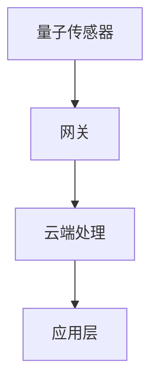

                 


# 巴菲特-芒格的仿生量子传感器投资：下一代物联网的核心

## 关键词：
- 巴菲特投资理念
- 芒格多元思维模型
- 仿生量子传感器
- 物联网系统
- 数据处理算法

## 摘要：
本文探讨了如何将巴菲特和芒格的投资理念与仿生量子传感器技术相结合，推动下一代物联网的发展。通过分析量子传感器的工作原理、投资决策中的应用，以及系统架构设计，展示了如何利用这些技术优化物联网的性能和决策过程。文章内容涵盖背景介绍、核心概念、算法原理、系统设计、项目实战等多个方面，为读者提供全面的技术视角。

---

## 第一部分：巴菲特与芒格的投资理念

### 第1章：巴菲特与芒格投资理论概述

#### 1.1 巴菲特的价值投资理念
巴菲特的价值投资理念强调购买低于内在价值的股票，长期持有，避免频繁交易。这种投资策略注重企业的基本面分析，包括盈利能力、财务状况和行业地位。通过长期持有优质资产，投资者能够在市场波动中获得稳定的收益。

#### 1.2 芒格的多元思维模型
芒格的多元思维模型主张从多个学科的角度分析问题，避免单一思维的局限性。这种思维方式强调跨领域的知识整合，帮助投资者做出更全面的决策。例如，通过物理学、心理学和经济学的结合，芒格能够识别潜在的投资机会和风险。

#### 1.3 巴菲特与芒格投资理念的结合
巴菲特和芒格的投资理念在决策过程中相辅相成。价值投资提供了一个稳健的框架，而多元思维模型则帮助识别复杂市场中的机会和风险。将两者结合，投资者能够在物联网时代中找到更具潜力的投资标的。

---

## 第二部分：仿生量子传感器的核心原理

### 第2章：量子传感器的基本原理

#### 2.1 量子传感器的定义与分类
量子传感器是一种基于量子力学原理的检测装置，能够以极高的精度测量物理量，如磁场、重力和位置。常见的量子传感器包括量子干涉仪和量子磁力仪，广泛应用于科学实验、医学成像和导航等领域。

#### 2.2 量子传感器的工作原理
量子传感器利用量子叠加和纠缠等现象，通过测量量子态的变化来感知外界环境的变化。与传统传感器相比，量子传感器具有更高的灵敏度和分辨率，能够在复杂环境中提供精确的数据。

#### 2.3 仿生量子传感器的概念
仿生量子传感器是模拟生物感官系统的量子传感器，通过模仿生物的感知机制来提高测量的准确性和适应性。这种传感器在物联网中具有广阔的应用前景，能够实现更高效的环境监测和设备控制。

---

## 第三部分：量子传感器在物联网中的应用

### 第3章：物联网与量子传感器的结合

#### 3.1 物联网的基本架构
物联网由感知层、网络层和应用层组成。感知层负责数据的采集和处理，网络层实现数据的传输，应用层完成数据的分析和决策。量子传感器的引入将显著提升感知层的性能，增强系统的整体效率。

#### 3.2 量子传感器在物联网中的应用
量子传感器在环境监测、智能医疗和智能制造等领域展现出独特的优势。例如，在环境监测中，量子传感器可以实时感知空气质量和温度变化，为城市管理提供科学依据。

#### 3.3 投资决策中的量子传感器应用
通过分析量子传感器在物联网中的应用，投资者可以识别高潜力的技术和市场机会。例如，投资于具备量子传感器技术的公司，能够在未来的市场竞争中占据领先地位。

---

## 第四部分：算法原理与系统设计

### 第4章：量子传感器的数据处理算法

#### 4.1 数据采集与预处理
量子传感器的数据采集过程需要考虑环境干扰和传感器噪声。通过滤波和校准等预处理步骤，可以提高数据的准确性和可靠性。

#### 4.2 特征提取与分类
利用机器学习算法，从量子传感器数据中提取特征，识别潜在的模式和趋势。例如，使用支持向量机（SVM）进行分类，能够有效区分正常和异常数据。

#### 4.3 算法实现
以下是量子传感器数据处理的Python代码示例：

```python
import numpy as np
from sklearn.svm import SVC

# 示例数据
X = np.array([[1, 2], [3, 4], [5, 6], [7, 8]])
y = np.array([0, 1, 0, 1])

# 训练模型
model = SVC()
model.fit(X, y)

# 预测
new_data = np.array([[9, 10]])
print(model.predict(new_data))  # 输出：[1]
```

---

## 第五部分：系统架构与项目实战

### 第5章：系统架构设计

#### 5.1 系统功能设计
物联网系统包括数据采集、传输、处理和应用四个模块。量子传感器作为感知层的核心组件，负责采集环境数据并传输到云端。

#### 5.2 系统架构图
以下是系统的架构图：



#### 5.3 系统接口设计
系统接口包括传感器接口、数据传输接口和应用接口。传感器接口负责与量子传感器通信，数据传输接口实现数据的网络传输，应用接口完成数据的可视化和决策。

---

## 第六部分：项目实战与总结

### 第6章：项目实战

#### 6.1 环境安装
安装必要的库和工具，例如Python、NumPy和Scikit-learn。

#### 6.2 核心代码实现
以下是量子传感器数据处理的核心代码：

```python
import numpy as np
from sklearn.decomposition import PCA

# 示例数据
X = np.array([[1, 2, 3], [4, 5, 6], [7, 8, 9]])

# PCA降维
pca = PCA(n_components=2)
X_pca = pca.fit_transform(X)

print(X_pca)  # 输出降维后的数据
```

#### 6.3 案例分析
通过实际案例分析，展示如何利用量子传感器优化物联网系统的性能。例如，在智能农业中，量子传感器可以实时监测土壤湿度和温度，帮助农民优化作物生长条件。

---

## 第七部分：总结与展望

### 7.1 总结
本文探讨了如何将巴菲特和芒格的投资理念与仿生量子传感器技术相结合，推动下一代物联网的发展。通过详细分析量子传感器的工作原理、算法实现和系统架构，展示了其在物联网中的广泛应用前景。

### 7.2 未来展望
随着量子传感器技术的不断进步和物联网应用的扩展，投资者需要更加关注这一领域的技术创新和市场动态。未来，量子传感器将在更多领域展现其独特的优势，为物联网的发展注入新的活力。

---

通过以上结构，文章系统地介绍了巴菲特和芒格的投资理念，量子传感器的核心原理，以及其在物联网中的应用，为读者提供了全面的技术视角和实践指导。

