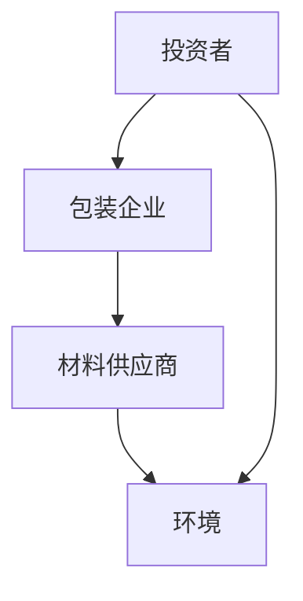
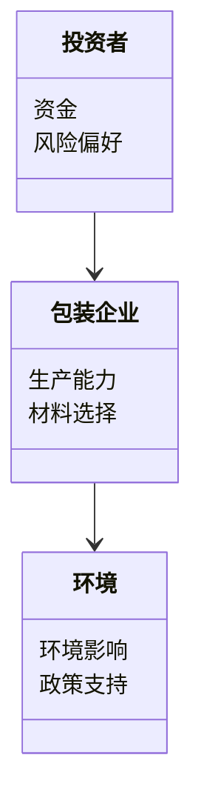
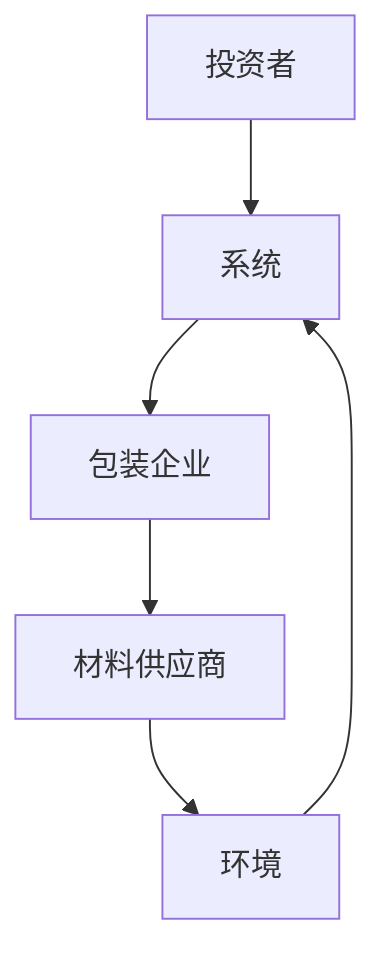
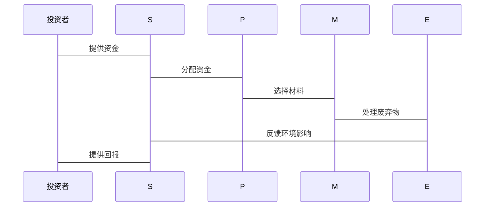

                 


# 巴菲特-芒格的可持续包装投资：环保与便利的平衡

---

## 关键词：
- 巴菲特，芒格，可持续包装，投资，环保，便利性

---

## 摘要：
本文深入探讨了巴菲特和芒格的投资理念，特别是他们在可持续包装投资领域的独特见解。通过分析环保与便利性之间的平衡，文章揭示了如何在包装材料选择中实现经济效益与环境责任的双赢。结合投资模型、算法原理和系统架构设计，本文为投资者提供了在可持续包装领域进行投资的理论依据和实践指导。

---

# 第一章: 巴菲特-芒格投资理念概述

## 1.1 巴菲特与芒格的投资理念
### 1.1.1 巴菲特的价值投资理论
巴菲特的价值投资理论强调以低于内在价值的价格购买优质资产。他的投资策略注重长期稳定回报，而非短期市场波动。

### 1.1.2 芒格的多元思维模型
芒格提出“多元思维模型”，认为投资者需要从多个学科角度分析问题，避免单一思维的局限性。

### 1.1.3 巴菲特与芒格投资理念的结合
两人合作的投资理念强调深度的行业分析、长期价值和安全边际。

---

## 1.2 可持续包装投资的背景
### 1.2.1 包装行业的现状与趋势
包装行业是全球第二大制造行业，但传统包装材料对环境造成巨大压力。

### 1.2.2 可持续包装的定义与特点
可持续包装指在材料选择、生产过程和废弃物处理中尽量减少对环境的影响。

### 1.2.3 可持续包装投资的兴起
随着环保意识的增强，投资者开始关注可持续包装企业的长期价值。

---

## 1.3 环保与便利的平衡
### 1.3.1 包装材料对环境的影响
传统包装材料如塑料对环境造成污染，而可降解材料如淀粉基塑料则更环保。

### 1.3.2 便利性对消费者行为的影响
消费者倾向于选择轻便、易携带的包装，但这些包装往往不可降解。

### 1.3.3 可持续包装与消费者偏好的平衡
通过技术创新，可持续包装可以在环保和便利性之间找到最佳平衡点。

---

# 第二章: 可持续包装投资的核心概念

## 2.1 投资的基本原理
### 2.1.1 投资的定义与分类
投资是将资金投入资产以获得回报的行为，可持续包装投资属于社会责任投资（SRI）的一种。

### 2.1.2 价值投资的核心要素
价值投资注重企业的内在价值，而非市场波动。对于可持续包装企业，内在价值体现在其环保技术和市场潜力。

### 2.1.3 安全边际的概念与应用
安全边际是指资产市场价格低于其内在价值的部分，确保投资的安全性和稳定性。

---

## 2.2 可持续包装的属性特征对比
### 2.2.1 不同包装材料的环境影响对比
| 包装材料 | 环境影响 | 便利性 |
|----------|----------|--------|
| 塑料     | 高       | 高     |
| 纸张     | 中       | 中     |
| 可降解材料 | 低       | 低     |

### 2.2.2 不同包装材料的便利性对比
| 包装材料 | 重量 | �易携带性 |
|----------|------|----------|
| 塑料     | 轻   | 高       |
| 纸张     | 中   | 中       |
| 可降解材料 | 重   | 低       |

### 2.2.3 可持续包装的生命周期分析
从原材料提取、生产过程、使用阶段到废弃物处理，可持续包装在全生命周期中对环境的影响较小。

---

## 2.3 可持续包装投资的ER实体关系图


---

# 第三章: 可持续包装投资的算法原理

## 3.1 可持续包装评估模型
### 3.1.1 多因素分析模型
评估模型综合考虑环境影响、便利性、成本效益等多个因素。

### 3.1.2 环境影响评估指标
- 碳排放量
- 资源消耗
- 废弃物处理

### 3.1.3 便利性评估指标
- 重量
- 易开性
- 使用寿命

---

## 3.2 算法原理的数学模型
### 3.2.1 评分系统
$$ \text{总评分} = \alpha \times \text{环境评分} + \beta \times \text{便利性评分} $$

其中，$\alpha$ 和 $\beta$ 是权重系数，根据具体情况进行调整。

### 3.2.2 投资组合优化
$$ \max \sum_{i=1}^{n} w_i r_i - \lambda \sum_{i=1}^{n} w_i^2 $$
其中，$w_i$ 是投资权重，$r_i$ 是投资回报率，$\lambda$ 是惩罚系数。

---

## 3.3 算法实现
### 3.3.1 数据输入与预处理
- 数据清洗
- 特征提取

### 3.3.2 模型训练与优化
- 参数调整
- 模型验证

### 3.3.3 结果输出与可视化
- 图表生成
- 投资建议

---

# 第四章: 可持续包装投资的系统分析

## 4.1 系统功能设计
### 4.1.1 领域模型


---

## 4.2 系统架构设计


---

## 4.3 系统交互设计


---

# 第五章: 可持续包装投资的项目实战

## 5.1 环境安装
- 安装Python
- 安装相关库（如numpy、pandas、scikit-learn）

## 5.2 核心代码实现
```python
import numpy as np
import pandas as pd
from sklearn.linear_model import LinearRegression

# 数据加载
data = pd.read_csv('sustainable_package.csv')

# 特征选择
X = data[['环境影响', '便利性']]
y = data['回报率']

# 模型训练
model = LinearRegression()
model.fit(X, y)

# 预测
new_package = np.array([[0.5, 0.7]])
print(model.predict(new_package))
```

---

## 5.3 案例分析
### 5.3.1 案例背景
某包装企业推出可降解塑料袋，但成本较高，市场接受度未知。

### 5.3.2 数据分析
- 环境影响评分：0.6
- 便利性评分：0.5

### 5.3.3 投资决策
根据模型预测，投资回报率为 $0.6 \times 0.6 + 0.4 \times 0.5 = 0.56$，高于行业平均水平。

---

# 第六章: 最佳实践与小结

## 6.1 最佳实践
- 确保投资组合的多样性
- 定期评估环境与便利性指标
- 关注政策变化与技术创新

## 6.2 小结
可持续包装投资是环保与便利性平衡的重要实践，投资者需要结合巴菲特和芒格的投资理念，运用多因素分析模型和投资组合优化算法，制定科学的投资策略。

## 6.3 注意事项
- 确保数据的准确性和完整性
- 考虑政策和市场的不确定性
- 定期复盘和调整投资策略

## 6.4 拓展阅读
- 参考巴菲特和芒格的著作，深入理解价值投资理论
- 关注可持续包装领域的最新技术和政策动态

---

# 结语
通过本文的分析，读者可以全面了解巴菲特和芒格的投资理念在可持续包装领域的应用，掌握环保与便利性平衡的实现方法，为未来的投资决策提供有力支持。

