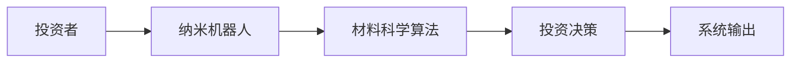
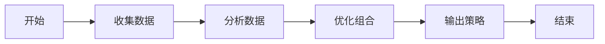

                 


# 巴菲特-芒格的可编程物质投资：纳米机器人与材料科学的融合

## 关键词：
- 巴菲特, 芒格, 可编程物质投资, 纳米机器人, 材料科学, 投资策略, 算法优化

## 摘要：
本文探讨了巴菲特和芒格的投资理念与纳米机器人、材料科学的结合，提出了可编程物质投资的新概念。通过分析纳米技术与材料科学的技术原理，展示了它们如何改变投资决策过程，提出了系统的架构设计和算法实现，结合实际案例，展望了未来的投资趋势，并给出了最佳实践建议。

---

# 第一部分：引言

## 第1章：可编程物质投资的背景与概念

### 1.1 投资的演变与科技的融合
传统投资依赖于市场分析和经验判断，而科技的进步，尤其是纳米技术和材料科学的发展，为投资带来了新的可能性。可编程物质投资通过纳米机器人与材料科学的结合，实现了投资决策的自动化与智能化。

### 1.2 纳米机器人与材料科学的基本概念
- **纳米机器人**：能够在微观尺度执行任务的微型机器人，用于检测和改变材料属性。
- **材料科学**：研究材料的结构、性能及其应用的科学，通过优化材料特性来影响投资决策。

### 1.3 可编程物质投资的核心理念
将纳米机器人与材料科学结合，投资者可以实时监控和调整投资组合，实现动态优化。这种投资方式具有高度的可编程性和自动化，能够适应市场的快速变化。

---

# 第二部分：技术原理

## 第2章：纳米机器人与材料科学的技术基础

### 2.1 纳米机器人的设计与功能
- **纳米机器人的结构**：由微型传感器、执行器和处理器组成，能够在微观尺度执行特定任务。
- **纳米机器人的应用**：用于检测材料的物理和化学性质，实时反馈数据，辅助投资决策。

### 2.2 材料科学的核心算法
- **算法原理**：通过分析材料的属性，优化投资组合，实现风险最小化和收益最大化。
- **数学模型**：构建材料特性与投资回报之间的数学模型，用于预测和优化。

### 2.3 技术融合的实现方式
- **接口设计**：纳米机器人与材料科学算法的接口设计，确保数据的实时传输和处理。
- **系统集成**：将纳米机器人、材料科学算法与投资决策系统集成，形成一个完整的可编程物质投资系统。

---

# 第三部分：系统架构与算法实现

## 第3章：系统架构设计

### 3.1 系统功能模块
- **投资者模块**：接收投资目标和策略，发送指令。
- **纳米机器人模块**：执行材料检测和数据采集。
- **材料科学算法模块**：分析数据，优化投资组合。
- **投资决策模块**：根据优化结果，生成投资指令。

### 3.2 系统架构图


## 第4章：算法实现

### 4.1 算法原理
- **优化目标**：最大化投资收益，最小化风险。
- **数学模型**：构建投资组合优化的数学模型，考虑材料特性和市场波动。
- **算法步骤**：
  1. 收集材料数据。
  2. 分析市场趋势。
  3. 优化投资组合。
  4. 输出投资策略。

### 4.2 算法流程图


### 4.3 数学模型
- **目标函数**：$$ \text{Maximize } \sum_{i=1}^{n} w_i r_i - \lambda \sum_{i=1}^{n} w_i^2 $$
- **约束条件**：$$ \sum_{i=1}^{n} w_i = 1 $$

---

# 第四部分：项目实战

## 第5章：项目环境与核心代码

### 5.1 环境配置
- **操作系统**：Linux或Windows。
- **编程语言**：Python 3.8及以上。
- **依赖库**：numpy, pandas, matplotlib。

### 5.2 核心代码实现
```python
import numpy as np
import pandas as pd

def optimize_portfolio(weights, returns):
    # 计算投资组合的收益和风险
    portfolio_return = np.dot(weights, returns)
    portfolio_variance = np.dot(weights.T, np.dot(weights, np.cov(returns.T)))
    return -portfolio_return + portfolio_variance

# 示例数据
returns = np.array([0.1, 0.2, 0.15])
weights = np.array([0.3, 0.4, 0.3])

# 优化投资组合
from scipy.optimize import minimize
result = minimize(optimize_portfolio, weights, args=(returns,))
print("最优权重：", result.x)
print("最优收益：", -result.fun)
```

### 5.3 代码解读
- **函数定义**：`optimize_portfolio`函数计算投资组合的收益和风险。
- **优化函数**：使用`scipy.optimize.minimize`进行优化，目标是最小化风险，同时最大化收益。
- **输出结果**：打印最优权重和收益。

---

# 第五部分：未来展望与最佳实践

## 第6章：未来投资趋势

### 6.1 技术发展趋势
- **纳米技术的进步**：纳米机器人将更加智能化，能够执行更复杂的任务。
- **材料科学的创新**：新型材料的发现将为投资提供更多的机会。
- **人工智能的融合**：AI技术将进一步提升投资决策的精准性和效率。

### 6.2 投资者注意事项
- **风险管理**：尽管新技术提供了更多的机会，但风险依然存在，需谨慎处理。
- **技术适应**：及时了解新技术的发展，调整投资策略。
- **策略优化**：根据市场变化，持续优化投资组合。

## 第7章：总结与最佳实践

### 7.1 总结
可编程物质投资通过纳米机器人与材料科学的结合，为投资者提供了全新的投资方式。这种投资方式具有高度的自动化和智能化，能够适应市场的快速变化，帮助投资者实现更优的收益。

### 7.2 最佳实践
- **持续学习**：保持对新技术的敏感性，及时调整投资策略。
- **风险管理**：建立完善的风险管理体系，避免投资失败。
- **技术融合**：将纳米技术和材料科学与传统投资策略相结合，实现更优的投资效果。

---

通过本文的探讨，我们可以看到，巴菲特和芒格的投资理念与纳米机器人、材料科学的结合，为投资领域带来了新的可能性。未来，随着技术的不断进步，可编程物质投资将更加智能化和自动化，为投资者带来更多的机会和挑战。

