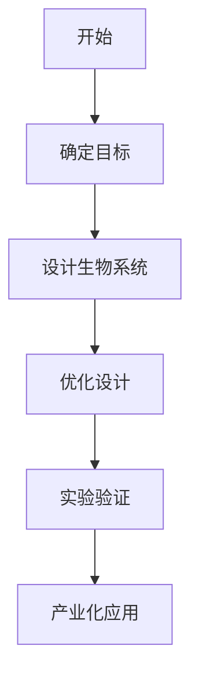

                 

# 巴菲特-芒格的合成生物学投资：生命编程的产业化

## 关键词
- 合成生物学
- 巴菲特投资
- 芒格投资
- 生命编程
- 产业化

## 摘要
合成生物学作为一门新兴的交叉学科，正在改变生命科学和工业生产的格局。巴菲特和芒格的投资理念，特别是长期价值投资和多元思维模型，为合成生物学企业的评估提供了独特的视角。本文深入探讨合成生物学的核心概念、其在各产业中的应用，以及巴菲特和芒格的投资策略如何在这一领域发挥作用。通过实际案例分析和系统架构设计，本文揭示了合成生物学投资的潜在机会和风险，为投资者提供了科学的决策参考。

---

# 第一部分: 合成生物学的背景与核心概念

## 第1章: 合成生物学的基本概念

### 1.1 合成生物学的定义
合成生物学是通过工程学的方法设计和构建新的生物系统，或者对现有的生物系统进行改造，以实现特定的功能。其核心在于将生命视为可编程的系统，通过精确的设计和优化，创造出具有特定用途的生物元件、装置和系统。

### 1.2 合成生物学的核心特征
1. **模块化设计**：将生物系统分解为可替换的模块，便于优化和重组。
2. **可编程性**：通过基因编辑等技术，赋予生物系统可编程的特性。
3. **智能化**：利用合成生物学技术，实现生物系统的自动化和智能化。

### 1.3 合成生物学与传统生物学的区别
- **目标**：传统生物学注重发现和理解自然规律，而合成生物学则关注设计和构建新的生物系统。
- **方法**：传统生物学以观察和实验为主，合成生物学则强调工程化设计和构建。
- **应用**：合成生物学在医疗、农业、化工等领域具有广泛的应用潜力。

---

## 第2章: 合成生物学的投资价值

### 2.1 合成生物学在医疗健康领域的应用
1. **癌症治疗**：通过合成生物学技术设计智能药物递送系统，提高治疗效果。
2. **疫苗开发**：利用合成生物学技术快速设计和优化疫苗，提高免疫效果。

### 2.2 合成生物学在农业与食品生产中的潜力
1. **基因编辑作物**：通过合成生物学技术改良农作物，提高抗病性和产量。
2. **合成食品**：利用合成生物学技术生产人工肉、乳制品等，减少对传统农业的依赖。

### 2.3 合成生物学在化工与材料科学中的创新
1. **生物催化剂**：通过合成生物学技术设计高效的生物催化剂，用于化学合成。
2. **生物塑料**：利用合成生物学技术生产可降解的生物塑料，减少环境污染。

---

# 第二部分: 巴菲特与芒格的投资理念

## 第3章: 巴菲特的价值投资理论

### 3.1 巴菲特的投资哲学
1. **长期价值投资**：关注企业的长期价值，而非短期市场波动。
2. **企业护城河**：寻找具有强大竞争优势的企业，确保其长期盈利能力。
3. **安全边际**：在投资时留有安全边际，以降低投资风险。

### 3.2 巴菲特的选股标准
1. **高净资产收益率（ROE）**：选择ROE高的企业，确保资金的高效利用。
2. **稳定的收益来源**：关注企业稳定的收益来源，确保持续的现金流。
3. **优秀的管理层**：选择管理能力强、诚信可靠的管理层。

---

## 第4章: 芒格的多元思维模型

### 4.1 多元思维模型概述
1. **跨学科视角**：芒格强调从多个学科的角度分析问题，避免单一思维的局限性。
2. **决策框架**：通过多元思维模型构建决策框架，提高决策的准确性和全面性。
3. **风险控制**：通过多元思维模型识别和评估潜在风险，制定有效的风险管理策略。

### 4.2 芒格的决策框架
1. **问题分析**：从多个角度分析问题，全面理解其本质。
2. **解决方案**：基于多元思维模型，提出创新的解决方案。
3. **风险管理**：通过多元思维模型识别潜在风险，并制定应对策略。

---

# 第三部分: 合成生物学与巴菲特-芒格投资理念的结合

## 第5章: 合成生物学领域的投资机会

### 5.1 合成生物学企业的估值方法
1. **技术评估**：评估企业的技术优势和创新潜力。
2. **市场潜力**：分析合成生物学技术的市场需求和商业化潜力。
3. **竞争分析**：评估企业在行业中的竞争优势和市场地位。

### 5.2 合成生物学技术的商业化潜力
1. **医疗领域**：合成生物学技术在癌症治疗和疫苗开发中的应用前景。
2. **农业领域**：基因编辑作物和合成食品的市场潜力。
3. **化工领域**：生物催化剂和生物塑料的商业化应用。

---

## 第6章: 巴菲特-芒格投资策略在合成生物学中的应用

### 6.1 从长期价值角度评估合成生物学企业
1. **企业长期价值**：关注合成生物学企业在未来几年的盈利能力和增长潜力。
2. **技术优势**：评估企业的技术壁垒和创新潜力。
3. **市场地位**：分析企业在行业中的市场地位和竞争优势。

### 6.2 通过多元思维模型分析合成生物学技术的风险与机遇
1. **技术风险**：评估合成生物学技术的不确定性和潜在风险。
2. **市场风险**：分析合成生物学技术的市场需求和商业化潜力。
3. **竞争风险**：评估企业在行业中的竞争环境和竞争优势。

---

## 第7章: 合成生物学投资的核心概念与联系

### 7.1 合成生物学的核心概念原理
1. **基因编辑技术**：通过CRISPR等技术实现基因的精准编辑和优化。
2. **代谢工程**：通过优化代谢途径提高生物系统的生产效率。
3. **合成生物学的经济价值**：评估合成生物学技术的经济价值和市场潜力。

### 7.2 核心概念属性特征对比表格
| **核心概念** | **合成生物学** | **传统生物技术** | **化学合成** |
|--------------|----------------|------------------|--------------|
| **技术特点** | 工程化设计，模块化构建 | 实验驱动，非工程化 | 化学合成，非生物驱动 |
| **应用领域** | 医疗、农业、化工 | 医疗、农业 | 化工、材料 |

### 7.3 ER实体关系图架构的 Mermaid 流程图

---

## 第8章: 合成生物学投资的算法原理

### 8.1 合成生物学技术的数学模型
合成生物学技术的设计和优化可以通过数学模型进行模拟和预测。例如，代谢途径的优化可以通过线性规划模型进行求解。

$$ \text{最大化} \sum_{i=1}^{n} c_i x_i $$
$$ \text{约束} \sum_{i=1}^{n} a_i x_i \leq b $$

### 8.2 合成生物学技术的流程图

---

## 第9章: 合成生物学投资的系统架构设计

### 9.1 系统功能设计
1. **需求分析**：确定合成生物学技术的需求和目标。
2. **功能设计**：设计合成生物学系统的功能模块。
3. **系统优化**：通过优化算法提高系统的效率和性能。

### 9.2 系统架构设计

---

## 第10章: 合成生物学投资的实际案例分析

### 10.1 投资案例
1. **案例一**：某合成生物学企业在医疗领域的成功应用。
2. **案例二**：某合成生物学企业在农业领域的创新应用。

### 10.2 项目实战
1. **环境安装**：安装必要的软件和工具。
2. **核心实现**：实现合成生物学技术的核心算法。
3. **代码解读**：解读核心算法的实现代码。
4. **案例分析**：通过实际案例分析合成生物学技术的投资机会和风险。

---

## 第11章: 合成生物学投资的总结与展望

### 11.1 总结
合成生物学作为一门新兴的交叉学科，具有广阔的投资价值和潜力。巴菲特和芒格的投资理念为合成生物学企业的评估提供了科学的决策框架。

### 11.2 展望
未来，随着合成生物学技术的不断发展和应用，其在医疗、农业、化工等领域的潜力将更加显著。投资者应密切关注合成生物学技术的发展趋势，抓住投资机会。

### 11.3 最佳实践 tips
1. **关注技术发展**：密切关注合成生物学技术的最新进展。
2. **评估企业潜力**：从技术、市场和管理等多个角度评估企业的潜力。
3. **风险管理**：制定有效的风险管理策略，降低投资风险。

---

通过本文的分析和探讨，读者可以深入了解合成生物学的核心概念、投资价值以及巴菲特和芒格投资理念的应用。希望本文能为投资者提供科学的决策参考，抓住合成生物学投资的机遇，实现长期的财富增长。

