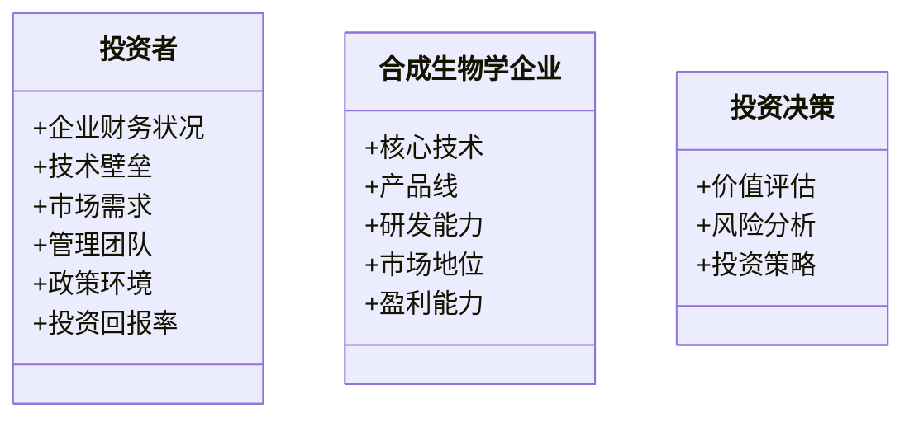
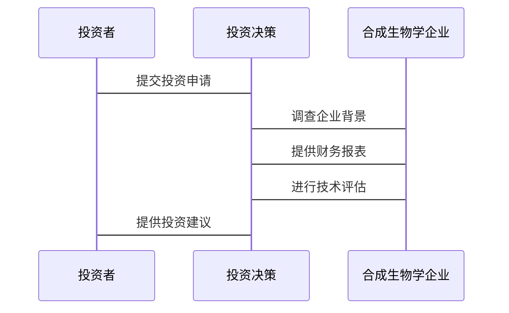

                 


# 巴菲特-芒格的合成生物学投资：重新定义生命科学

> 关键词：巴菲特，芒格，合成生物学，投资策略，生命科学，技术驱动

> 摘要：本文探讨了巴菲特和芒格如何通过合成生物学的投资策略重新定义生命科学。结合他们的投资哲学与合成生物学的技术驱动特性，分析了这一领域的投资机会、风险以及未来趋势。

---

# 引言

## 1. 巴菲特与芒格的投资哲学

### 1.1 巴菲特的价值投资理论

巴菲特的价值投资理论以“长期主义”为核心，强调寻找具有强大护城河、优秀管理团队和持续盈利能力的企业。他的投资理念可以总结为以下几个方面：

1. **价值投资的核心**：寻找市场价格低于内在价值的企业。
2. **护城河的重要性**：关注企业是否具备竞争优势，能够在长期中保持高利润率。
3. **管理团队的质量**：优秀的管理团队是企业长期成功的关键因素。

### 1.2 芒格的多元思维模型

芒格的“多元思维模型”强调将多个学科的知识结合起来，形成一个完整的知识框架。这种思维方式帮助投资者在决策时能够从多个角度分析问题，避免单一视角的局限性。

1. **跨学科思维**：芒格认为，投资者需要了解经济学、心理学、生物学等多个领域的知识。
2. **决策框架**：通过构建多个思维模型，芒格能够快速识别潜在的投资机会和风险。

---

## 2. 合成生物学的基本概念与应用

### 2.1 合成生物学的定义与背景

合成生物学是通过工程学的方法设计和构建新的生物系统，或者对现有的生物系统进行重新设计。其核心目标是利用生物学的原理来解决实际问题。

1. **起源与发展**：合成生物学起源于20世纪末，随着基因编辑技术（如CRISPR）的发展而迅速崛起。
2. **核心技术**：包括基因编辑、生物传感器、代谢工程等。

### 2.2 合成生物学的主要应用领域

合成生物学的应用领域广泛，包括：

1. **医药与健康**：用于开发新型药物、疫苗和 diagnostics。
2. **环境保护**：用于开发高效的生物降解技术，处理污染问题。
3. **工业生产**：用于生产生物基材料和化学品，减少对化石燃料的依赖。

---

## 3. 巴菲特与芒格的投资哲学与合成生物学的结合

### 3.1 巴菲特与芒格对合成生物学的投资逻辑

1. **长期价值**：巴菲特和芒格认为，合成生物学是一个具有长期增长潜力的领域，特别是在解决全球性问题（如气候变化、健康危机）方面具有重要意义。
2. **护城河与竞争优势**：他们关注那些具备强大研发能力和知识产权优势的合成生物学企业。
3. **管理团队**：优秀的管理团队是成功的关键，尤其是在高风险的合成生物学领域。

### 3.2 合成生物学企业的筛选标准

1. **技术壁垒**：企业是否具备独特的技术优势和专利保护。
2. **市场需求**：产品是否能够满足明确的市场需求。
3. **财务状况**：企业的财务健康状况和盈利能力。

---

## 4. 合成生物学的投资机会与风险分析

### 4.1 合成生物学行业的现状与未来趋势

1. **市场规模**：合成生物学市场的规模正在快速增长，预计未来几年将呈现指数级增长。
2. **技术创新**：随着技术的进步，合成生物学在多个领域的应用将更加广泛。
3. **政策支持**：各国政府对合成生物学的支持力度不断加大，特别是在环保和能源领域。

### 4.2 投资风险与应对策略

1. **技术风险**：合成生物学的技术尚处于发展阶段，存在研发失败的可能性。
2. **市场风险**：市场需求可能不如预期，导致企业难以盈利。
3. **政策风险**：政策的变化可能对合成生物学企业产生重大影响。

---

## 5. 合成生物学的关键技术与投资策略

### 5.1 关键技术分析

1. **基因编辑技术**：如CRISPR-Cas9，是合成生物学的核心技术之一。
2. **生物传感器**：用于检测环境中的特定分子，具有广泛的应用潜力。
3. **代谢工程**：通过优化生物体的代谢途径，提高生产效率。

### 5.2 投资策略

1. **技术驱动型企业**：投资那些具备核心技术优势的企业。
2. **市场需求导向**：选择那些能够满足明确市场需求的企业。
3. **长期投资**：合成生物学是一个需要长期投入的领域，投资者需要具备耐心。

---

## 6. 合成生物学企业的商业模式与市场动态

### 6.1 商业模式分析

1. **技术授权**：企业通过授权技术使用获得收入。
2. **产品销售**：直接销售基于合成生物学技术开发的产品。
3. **服务提供**：为企业提供定制化的合成生物学解决方案。

### 6.2 市场动态

1. **竞争格局**：合成生物学领域的竞争日益激烈，技术创新是关键。
2. **合作与并购**：企业之间的合作和并购将成为行业发展的主要趋势。

---

## 7. 系统分析与架构设计方案

### 7.1 问题场景介绍

合成生物学的投资需要从多个维度进行分析，包括技术、市场、财务等。为了更好地进行投资决策，我们需要构建一个综合的分析框架。

### 7.2 领域模型（Mermaid 类图）



### 7.3 系统架构设计（Mermaid 架构图）


### 7.4 系统交互（Mermaid 序列图）



---

## 8. 项目实战

### 8.1 环境安装

1. 安装Python和必要的库（如pandas、numpy、matplotlib）。
2. 安装Mermaid工具，用于绘制图表。

### 8.2 核心代码实现

```python
import pandas as pd
import numpy as np
import matplotlib.pyplot as plt

# 示例数据：合成生物学企业的财务数据
data = {
    'Year': [2018, 2019, 2020, 2021, 2022],
    'Revenue': [100, 150, 200, 250, 300],
    'Profit': [20, 30, 40, 50, 60]
}

df = pd.DataFrame(data)
plt.plot(df['Year'], df['Revenue'], label='Revenue')
plt.plot(df['Year'], df['Profit'], label='Profit')
plt.xlabel('Year')
plt.ylabel('Value')
plt.legend()
plt.show()
```

### 8.3 案例分析

以某合成生物学企业为例，分析其财务状况、技术优势和市场前景。

---

## 9. 总结与展望

### 9.1 总结

巴菲特和芒格的投资哲学为合成生物学的投资提供了重要的指导。通过长期价值投资和多元思维模型，投资者可以在合成生物学领域找到具有潜力的投资机会。

### 9.2 展望

随着技术的进步和市场的成熟，合成生物学的投资前景将更加广阔。投资者需要密切关注行业动态，灵活调整投资策略。

---

通过以上内容，我们希望能够为读者提供一个全面的视角，帮助他们在合成生物学的投资领域中做出明智的决策。

