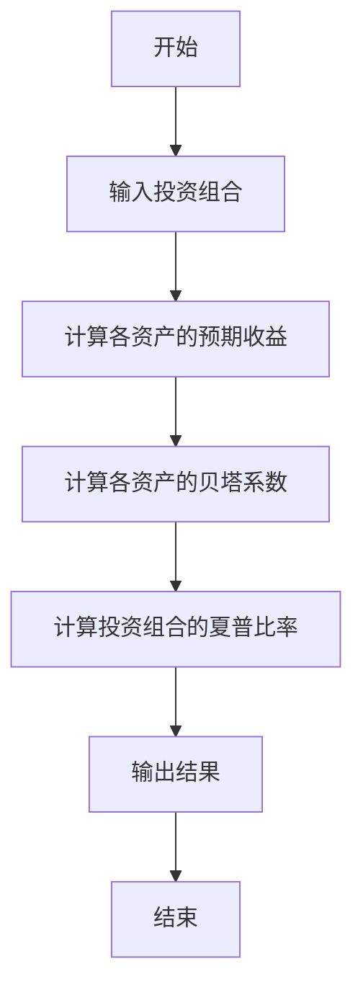
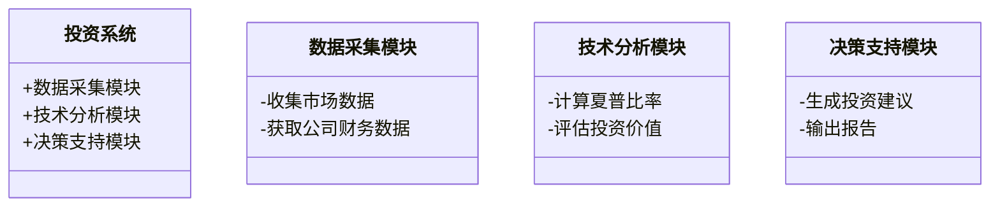

                 


# 巴菲特-芒格的合成食品投资：解决全球粮食危机

## 关键词
- 巴菲特, 芒格, 合成食品, 投资策略, 全球粮食危机, 算法模型, 系统架构

## 摘要
本文探讨了巴菲特和芒格通过投资合成食品解决全球粮食危机的策略。首先介绍了合成食品的技术和市场现状，分析了全球粮食危机的背景，接着深入探讨了巴菲特和芒格的投资哲学和逻辑，随后详细讲解了投资决策的算法模型和系统架构，最后通过实战案例展示了如何将这些策略应用于实际项目中，总结了投资的最佳实践。

---

## 第一部分: 合成食品的定义与发展

### 第1章: 合成食品的基本概念

#### 1.1 合成食品的定义
合成食品是指通过生物工程、化学合成或其他先进技术制造的食品，与传统农业种植的食品不同，它不依赖于传统农业资源，可以更高效地生产。

#### 1.2 合成食品的技术基础
- **生物工程**：利用基因编辑技术（如CRISPR）改造微生物，使其生产特定的蛋白质或营养成分。
- **化学合成**：通过化学反应直接合成氨基酸、脂肪酸等基本营养成分。
- **细胞培养肉**：通过培养动物细胞制造肉类产品。

#### 1.3 合成食品的市场现状
- **市场需求**：随着全球人口增长和资源短缺，合成食品因其高效性和可持续性受到关注。
- **技术进展**：合成食品技术逐步成熟，生产成本下降，逐渐具备商业可行性。
- **市场竞争**：已有公司如Beyond Meat和Impossible Foods在植物基肉制品领域取得进展，合成肉的研究也在逐步推进。

### 第2章: 全球粮食危机的背景分析

#### 2.1 粮食危机的现状
- **人口增长**：全球人口预计在未来几十年内增长到90亿，粮食需求将大幅增加。
- **资源限制**：传统农业面临水资源短缺、土地退化等问题，难以满足未来需求。
- **气候变化**：极端天气事件频发，影响粮食产量，加剧粮食危机。

#### 2.2 粮食价格波动的影响
- **价格波动**：粮食价格的剧烈波动对全球经济和民生造成重大影响，尤其是发展中国家。
- **供应链问题**：疫情和地缘政治冲突导致供应链中断，进一步加剧粮食危机。

#### 2.3 粮食安全的挑战
- **粮食浪费**：全球每年浪费约13亿吨粮食，相当于全球粮食产量的30%。
- **分配不均**：粮食资源在地区间分配不均，导致部分地区长期处于饥饿状态。
- **营养不均衡**：贫困地区难以获得多样化和高质量的营养，导致健康问题。

### 第3章: 巴菲特与芒格投资合成食品的逻辑

#### 3.1 巴菲特的价值投资理论
巴菲特的价值投资理论强调寻找被市场低估的公司，长期持有，关注公司的基本面和长期盈利能力。

#### 3.2 芒格的多元思维模型
芒格强调通过多学科思维模型来分析问题，寻找投资机会，避免决策错误。

#### 3.3 投资合成食品的逻辑
- **技术可行性**：合成食品技术逐渐成熟，具备大规模生产的潜力。
- **市场需求**：随着健康意识和环保意识的提高，消费者对合成食品的需求逐渐增加。
- **成本优势**：合成食品的生产成本可能低于传统农业，尤其在土地和水资源有限的情况下。

---

## 第二部分: 投资决策的算法模型

### 第4章: 投资组合优化的数学模型

#### 4.1 资本资产定价模型（CAPM）
CAPM用于评估资产的预期收益，公式为：
$$
E(R_i) = R_f + \beta_i (E(R_m) - R_f)
$$
其中，\(E(R_i)\)是资产的预期收益，\(R_f\)是无风险利率，\(\beta_i\)是资产的贝塔系数，\(E(R_m)\)是市场预期收益。

#### 4.2 风险调整后的收益计算
通过计算夏普比率来评估投资组合的风险调整后收益：
$$
\text{夏普比率} = \frac{E(R_p) - R_f}{\sigma_p}
$$
其中，\(E(R_p)\)是投资组合的预期收益，\(R_f\)是无风险利率，\(\sigma_p\)是投资组合的收益标准差。

#### 4.3 算法流程图


### 第5章: 投资系统的架构设计

#### 5.1 系统功能模块设计
- **数据采集**：收集合成食品相关公司的财务数据、市场数据等。
- **技术分析**：利用CAPM模型评估公司的投资价值。
- **决策支持**：根据分析结果生成投资建议。

#### 5.2 系统架构图


---

## 第三部分: 项目实战与案例分析

### 第6章: 项目实战

#### 6.1 环境安装
- **Python版本**：建议使用Python 3.8及以上版本。
- **依赖安装**：安装pandas、numpy、scipy等库。

#### 6.2 核心代码实现
```python
import numpy as np
import pandas as pd
from sklearn.linear_model import LinearRegression

# 示例数据
data = pd.DataFrame({
    '收益': [0.1, 0.08, 0.12, 0.09, 0.11],
    '波动率': [0.2, 0.15, 0.18, 0.16, 0.17]
})

# 计算夏普比率
def calculate_sharpe_ratio(returns, risk_free_rate=0.01):
    excess_returns = returns - risk_free_rate
    return np.mean(excess_returns) / np.std(excess_returns)

sharpe_ratio = calculate_sharpe_ratio(data['收益'])
print(f"夏普比率: {sharpe_ratio}")
```

#### 6.3 实际案例分析
以一家合成食品公司为例，分析其投资价值：
1. **数据采集**：收集过去5年的财务数据和市场数据。
2. **技术分析**：利用CAPM模型评估其预期收益和风险。
3. **决策支持**：根据分析结果决定是否投资。

---

## 第四部分: 最佳实践与总结

### 第7章: 最佳实践

#### 7.1 投资策略
- **长期投资**：巴菲特和芒格的长期投资策略适用于合成食品领域的投资。
- **风险管理**：通过分散投资和风险模型控制投资风险。

#### 7.2 风险管理
- **市场风险**：关注合成食品技术的进展和市场需求的变化。
- **技术风险**：评估合成食品技术的可行性和商业化潜力。

#### 7.3 未来展望
合成食品技术的进一步发展和商业化将为解决全球粮食危机提供重要支持，投资者应持续关注这一领域的技术和市场动态。

---

## 总结
通过巴菲特和芒格的投资哲学和策略，结合合成食品的技术优势和市场潜力，投资者可以有效地将合成食品作为解决全球粮食危机的重要投资方向。本文详细分析了投资决策的算法模型和系统架构，并通过实战案例展示了如何将这些策略应用于实际项目中。未来，随着合成食品技术的进一步发展，这一领域的投资潜力将更加巨大。

--- 

希望这篇文章能为您提供有价值的见解和实用的指导。

