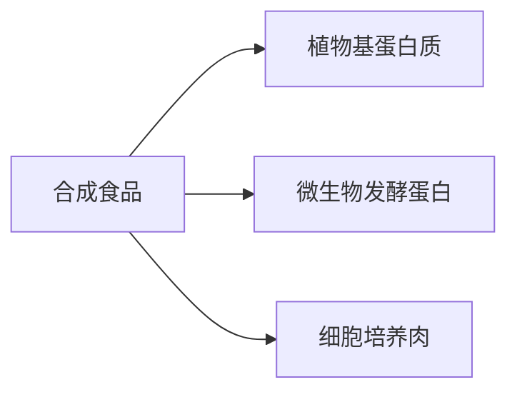

                 


```markdown
# 巴菲特-芒格的合成食品投资：解决全球粮食安全的新途径

> 关键词：巴菲特、芒格、合成食品、投资策略、粮食安全、技术分析

> 摘要：本文探讨巴菲特和芒格对合成食品的投资逻辑，分析合成食品技术的潜力及其在解决全球粮食安全问题中的作用。通过详细的技术分析和投资策略，揭示合成食品行业的投资价值和未来发展趋势。

---

## 第1章：合成食品与粮食安全的挑战

### 1.1 合成食品的定义与背景

#### 1.1.1 合成食品的概念
合成食品是指通过生物工程、化学合成或其他先进技术制造的食品，不依赖传统农业。这包括植物基蛋白质、微生物发酵蛋白和细胞培养肉。

#### 1.1.2 全球粮食安全的问题
- 人口增长导致粮食需求上升。
- 气候变化和资源短缺威胁粮食供应。
- 传统农业的环境负担加重。

#### 1.1.3 合成食品的潜力与解决方案
合成食品提供了一种可持续的替代方案，减少对环境的影响，同时提高粮食供应的安全性。

### 图1-1：合成食品的概念框架


---

## 第2章：巴菲特与芒格的投资哲学

### 2.1 巴菲特的投资理念

#### 2.1.1 巴菲特的价值投资原则
- 长期投资，寻找具有持续竞争优势的公司。
- 重视公司基本面，如财务状况、管理层能力和市场地位。

#### 2.1.2 巴菲特对长期趋势的判断
- 关注行业趋势，选择符合未来发展方向的行业。
- 合成食品符合可持续发展的趋势。

#### 2.1.3 巴菲特对合成食品行业的关注
- 看好合成食品的技术进步和市场潜力。

### 2.2 芒格的多元思维模型

#### 2.2.1 芒格的决策框架
- 多维度分析问题，考虑技术和市场的综合影响。
- 强调安全边际，避免高风险投资。

#### 2.2.2 芒格对合成食品行业的看法
- 认为合成食品是传统农业的替代品，具有广阔的市场前景。
- 强调技术创新对行业发展的推动作用。

---

## 第3章：合成食品的技术发展

### 3.1 合成食品的技术路径

#### 3.1.1 植物基蛋白质技术
- 使用大豆、豌豆等植物蛋白模拟动物肉质。
- 技术难点：风味和质地的优化。

#### 3.1.2 微生物发酵技术
- 利用酵母等微生物生产蛋白质。
- 优点：生产效率高，成本较低。

#### 3.1.3 细胞培养肉技术
- 通过细胞培养技术生产真实肉质。
- 技术挑战：成本高，生产规模小。

### 图3-1：合成食品技术路线图


### 3.2 合成食品的技术挑战

#### 3.2.1 生产成本问题
- 当前技术成本较高，限制了商业化进程。
- 技术进步将降低成本。

#### 3.2.2 技术瓶颈与突破
- 味道和质地接近传统肉类的技术难题。
- 微生物发酵技术的优化。

#### 3.2.3 规模化生产的可行性
- 大规模生产的技术可行性。
- 供应链管理的挑战。

---

## 第4章：合成食品的市场现状

### 4.1 全球合成食品市场分析

#### 4.1.1 市场规模与增长趋势
- 市场规模持续增长，预计未来几年将快速增长。
- 主要驱动因素：健康饮食趋势和环保意识。

#### 4.1.2 主要市场参与者
- Beyond Meat、Impossible Foods等公司。
- 主要投资机构：巴菲特和芒格的投资布局。

#### 4.1.3 市场驱动因素
- 消费者对健康食品的需求增加。
- 政府政策支持可持续发展。

### 图4-1：合成食品市场参与者


### 4.2 合成食品的消费者接受度

#### 4.2.1 消费者行为分析
- 消费者更倾向于健康和环保的食品选择。
- 对合成食品的接受度逐步提高。

#### 4.2.2 健康与环保意识的影响
- 健康饮食趋势推动合成食品需求。
- 环保压力促使消费者选择可持续产品。

#### 4.2.3 市场教育与推广策略
- 提高消费者对合成食品的认知。
- 加强品牌建设和产品创新。

---

## 第5章：合成食品的投资逻辑

### 5.1 合成食品行业的投资价值

#### 5.1.1 行业增长潜力
- 市场需求持续增长，行业潜力巨大。
- 技术进步推动行业快速发展。

#### 5.1.2 技术进步带来的投资机会
- 创新技术降低生产成本。
- 技术突破提升产品竞争力。

#### 5.1.3 市场需求的持续增长
- 消费者需求多样化，市场空间广阔。

### 图5-1：合成食品投资价值分析


### 5.2 巴菲特与芒格的投资策略

#### 5.2.1 长期价值投资的适用性
- 合成食品行业具有长期增长潜力。
- 选择具有强大竞争优势的公司。

#### 5.2.2 行业趋势的判断
- 判断合成食品行业的未来发展趋势。
- 选择符合长期趋势的公司进行投资。

#### 5.2.3 公司基本面的分析
- 评估公司的财务状况、管理层能力和市场地位。
- 确保投资标的具备长期竞争力。

---

## 第6章：合成食品产业链的投资机会

### 6.1 合成食品产业链分析

#### 6.1.1 上游产业
- 原材料供应商：提供植物蛋白、微生物菌种等。
- 技术研发机构：推动技术创新。

#### 6.1.2 中游产业
- 生产企业：负责合成食品的生产。
- 加工企业：进行产品加工和包装。

#### 6.1.3 下游产业
- 零售商：销售合成食品。
- 消费者：最终用户。

### 图6-1：合成食品产业链结构


### 6.2 投资机会分析

#### 6.2.1 上游产业的投资机会
- 投资于原材料供应商，确保供应链稳定。
- 投资于技术研发机构，推动技术创新。

#### 6.2.2 中游产业的投资机会
- 投资于生产企业，分享规模化生产的收益。
- 投资于加工企业，利用成本优势。

#### 6.2.3 下游产业的投资机会
- 投资于零售商，抓住市场增长的机遇。
- 投资于品牌建设，提升市场竞争力。

---

## 第7章：合成食品的投资策略与风险管理

### 7.1 合成食品行业的投资策略

#### 7.1.1 长期投资与短期投资结合
- 长期投资：关注行业发展趋势。
- 短期投资：抓住市场波动带来的机会。

#### 7.1.2 分散投资与集中投资结合
- 分散投资：降低风险。
- 集中投资：抓住重点企业。

### 7.2 投资风险管理

#### 7.2.1 技术风险
- 技术失败可能导致投资损失。
- 需密切关注技术进展。

#### 7.2.2 市场风险
- 市场需求变化可能影响投资收益。
- 需保持对市场的敏感性。

#### 7.2.3 供应链风险
- 供应链中断可能影响生产。
- 需建立稳定的供应链。

---

## 第8章：案例分析：巴菲特与芒格的合成食品投资

### 8.1 案例分析：Beyond Meat

#### 8.1.1 公司概况
- 专注于植物基蛋白质产品的研发和生产。
- 成功上市并获得巴菲特的投资。

#### 8.1.2 投资逻辑
- 公司具有强大的技术研发能力。
- 市场需求旺盛，具备长期增长潜力。

### 8.2 案例分析：Impossible Foods

#### 8.2.1 公司概况
- 专注于微生物发酵技术生产蛋白质。
- 获得芒格的投资。

#### 8.2.2 投资逻辑
- 技术创新能力强。
- 市场前景广阔。

---

## 第9章：结论与展望

### 9.1 结论

#### 9.1.1 巴菲特与芒格的投资逻辑
- 合成食品行业具有长期增长潜力。
- 投资需结合技术进步和市场需求。

#### 9.1.2 合成食品的技术与市场前景
- 技术进步将推动行业快速发展。
- 市场需求将保持持续增长。

### 9.2 未来展望

#### 9.2.1 技术创新的未来方向
- 细胞培养肉的技术突破。
- 微生物发酵技术的优化。

#### 9.2.2 市场发展的未来趋势
- 健康饮食趋势的持续推动。
- 可持续发展政策的支持。

#### 9.2.3 投资机会的未来展望
- 合成食品行业的投资价值将不断提升。
- 需密切关注行业动态和市场变化。

---

## 附录：术语表

- 合成食品：通过生物工程等技术制造的食品。
- 植物基蛋白质：来源于植物的蛋白质。
- 微生物发酵技术：利用微生物生产蛋白质的技术。
- 细胞培养肉：通过细胞培养技术生产的肉类产品。

---

## 参考文献

1. 巴菲特股东大会演讲
2. 芒格股东大会演讲
3. 合成食品行业的研究报告
4. 相关学术论文

---

通过以上章节的详细分析，可以看出巴菲特和芒格对合成食品的投资不仅具有商业价值，更具有社会意义。合成食品作为解决全球粮食安全的重要途径，其技术和市场潜力巨大，值得长期关注和投资。
```

