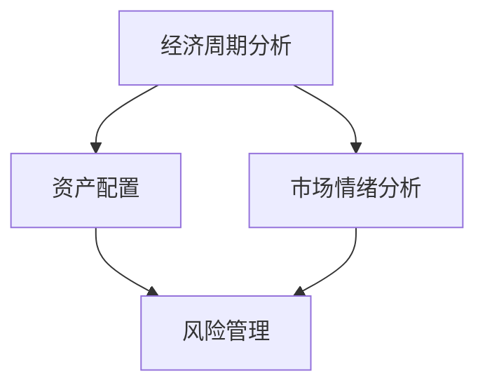
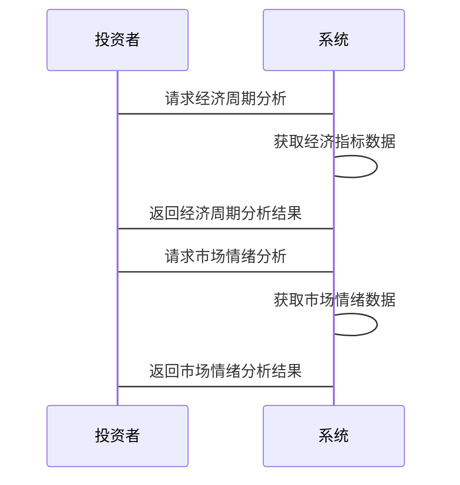

                 


# 巴菲特-芒格的周期投资观：如何在经济周期中获利

> 关键词：巴菲特, 芮格, 周期投资, 经济周期, 价值投资, 安全边际, 投资策略

> 摘要：本文深入探讨了巴菲特和芒格的周期投资观，分析了经济周期对企业价值和投资策略的影响，结合实际案例和数学模型，系统阐述了如何在不同经济阶段优化投资组合，规避风险，实现长期稳健收益。

---

# 目录

## 第一章: 巴菲特与芒格的投资理念概述

### 1.1 巴菲特与芒格的背景介绍

#### 1.1.1 巴菲特的生平与投资哲学
沃伦·巴菲特（Warren Buffett）被誉为“股神”，他的投资哲学以价值投资为核心，强调购买优质资产并在合理价格买入，长期持有。其核心思想是寻找具有持续竞争优势的企业，并以合理的价格进行投资。

#### 1.1.2 芮格的智慧与决策框架
查理·芒格（Charlie Munger）是巴菲特的长期合作伙伴，其决策框架强调逆向思维、避免情绪化决策和追求复利效应。芒格的智慧体现在他对心理偏差的深刻理解以及对跨学科知识的广泛应用。

#### 1.1.3 两人合作的投资理念
巴菲特和芒格的合作基于共同的价值观：寻找具有持续竞争优势的企业，以合理价格买入，长期持有，并在周期波动中进行资产配置。

---

### 1.2 巴菲特-芒格投资体系的核心要素

#### 1.2.1 股票投资的本质
股票投资的本质是购买企业的部分所有权。巴菲特认为，投资的核心是理解企业的基本面，而不是关注市场的短期波动。

#### 1.2.2 价值投资的定义与特征
价值投资是一种以低于公平价值的价格购买优质资产的投资策略。其特征包括：
- 以内在价值为导向
- 长期持有优质资产
- 逆市买入，牛市卖出

#### 1.2.3 经济周期与投资策略的关系
经济周期对企业价值和投资策略有重要影响。巴菲特和芒格认为，投资者应根据经济周期的阶段调整投资策略，避免在市场高点投资，而应在市场低点增加优质资产的配置。

---

## 第二章: 经济周期与市场周期的分析

### 2.1 经济周期的基本理论

#### 2.1.1 经济周期的四个阶段
经济周期通常分为四个阶段：衰退、复苏、繁荣和衰退。每个阶段的特点如下：
- **衰退阶段**：经济活动下降，企业盈利减少，失业率上升。
- **复苏阶段**：经济开始恢复，企业盈利逐步回升。
- **繁荣阶段**：经济 overheating，企业盈利高速增长。
- **衰退阶段**：经济再次陷入衰退，企业盈利下降。

#### 2.1.2 市场周期与经济周期的关系
市场周期与经济周期密切相关，但并不完全同步。市场周期受投资者情绪影响较大，而经济周期主要受实体经济因素影响。

#### 2.1.3 市场情绪与周期波动
市场情绪在周期波动中起着重要作用。投资者情绪在市场高点通常过于乐观，在市场低点通常过于悲观。

---

### 2.2 巴菲特-芒格视角下的周期分析

#### 2.2.1 经济周期对企业价值的影响
经济周期对企业价值的影响主要体现在企业盈利和资产价值的变化上。在衰退阶段，企业盈利下降，但在繁荣阶段，企业盈利上升。

#### 2.2.2 市场周期与企业周期的差异
市场周期主要受投资者情绪影响，而企业周期主要受企业基本面影响。巴菲特和芒格强调，投资者应关注企业周期，而非市场周期。

#### 2.2.3 投资者如何在周期中获利
投资者应在市场低点买入优质资产，在市场高点卖出。具体策略包括：
- 在衰退阶段寻找被低估的优质资产。
- 在复苏阶段逐步增加资产配置。
- 在繁荣阶段减少资产配置，避免高位风险。

---

## 第三章: 价值投资的核心原理

### 3.1 价值投资的定义与特征

#### 3.1.1 价值投资的三要素
价值投资的核心在于寻找具有以下特征的企业：
- 高质量的管理层
- 强大的竞争优势
- 合理的估值

#### 3.1.2 价值投资与成长投资的区别
价值投资注重企业的内在价值和合理估值，而成长投资注重企业的成长潜力和高增长率。两者的主要区别在于投资目标和风险偏好。

#### 3.1.3 价值投资的长期视角
价值投资强调长期视角，认为市场短期波动不影响企业的长期价值。投资者应以长期持有的方式获取收益。

---

### 3.2 巴菲特的"安全边际"概念

#### 3.2.1 安全边际的定义
安全边际是指股票的市场价格低于其内在价值的部分。巴菲特认为，安全边际是投资成功的重要保障。

#### 3.2.2 安全边际的计算方法
安全边际 = 内在价值 - 市场价格

#### 3.2.3 安全边际在周期投资中的应用
在经济衰退阶段，市场情绪低落，股票价格通常低于其内在价值，此时是买入优质资产的良机。

---

### 3.3 芮格的"逆向思维"投资策略

#### 3.3.1 逆向思维的定义
逆向思维是指在市场大多数人悲观时买入，市场大多数人乐观时卖出。

#### 3.3.2 逆向思维在周期投资中的应用
在经济衰退阶段，市场情绪悲观，企业价值被低估，此时是买入优质资产的良机。在经济繁荣阶段，市场情绪乐观，企业价值被高估，此时应减少资产配置。

#### 3.3.3 逆向思维与市场情绪的关系
逆向思维要求投资者忽略市场情绪，专注于企业的基本面和内在价值。

---

## 第四章: 经济周期中的投资策略

### 4.1 经济周期的识别与预测

#### 4.1.1 经济周期的指标分析
常用的经济周期指标包括：
- GDP增长率
- 失业率
- 消费者价格指数（CPI）
- 利率水平

#### 4.1.2 市场情绪的判断方法
市场情绪可以通过以下方式判断：
- 股票市场的波动率
- 投资者的交易量
- 媒体的市场报道

#### 4.1.3 周期波动的数学模型
常用的周期波动数学模型包括：
- 布朗运动模型
- 马尔可夫链模型
- 随机游走模型

---

### 4.2 不同经济阶段的投资策略

#### 4.2.1 经济衰退期的投资策略
- 买入被低估的优质资产
- 增加现金储备，避免高风险投资

#### 4.2.2 经济复苏期的投资策略
- 逐步增加资产配置
- 选择具有较强竞争优势的企业

#### 4.2.3 经济繁荣期的投资策略
- 减少资产配置，避免高位风险
- 选择具有防御性的资产

---

## 第五章: 巴菲特-芒格周期投资观的实战案例

### 5.1 巴菲特的经典投资案例分析

#### 5.1.1 可口可乐的投资案例
巴菲特于1988年开始投资可口可乐，认为其具有强大的品牌优势和持续的盈利能力。尽管在投资期间经历了多次市场波动，但可口可乐的长期表现优异。

#### 5.1.2 伯克希尔 Hathaway 的投资案例
伯克希尔 Hathaway 是巴菲特的旗舰公司，其投资策略以价值投资为核心，长期持有优质资产。

#### 5.1.3 避免投资陷阱的教训
巴菲特强调避免投资具有高风险和不确定性的企业，如高科技企业和新兴行业。

---

## 第六章: 巴菲特-芒格周期投资观的系统架构

### 6.1 系统功能设计

#### 6.1.1 核心模块
- 经济周期分析模块
- 市场情绪分析模块
- 资产配置模块
- 风险管理模块

#### 6.1.2 数据流
- 经济指标数据
- 市场价格数据
- 企业基本面数据

---

### 6.2 系统架构设计

#### 6.2.1 系统架构图


---

### 6.3 系统接口设计

#### 6.3.1 经济周期分析接口
```python
def get_economic_cycle():
    # 获取经济周期指标
    pass
```

#### 6.3.2 市场情绪分析接口
```python
def get_market_sentiment():
    # 获取市场情绪指标
    pass
```

---

### 6.4 系统交互序列图



---

## 第七章: 总结与展望

### 7.1 总结
巴菲特和芒格的周期投资观强调长期价值投资、安全边际和逆向思维。投资者应在经济衰退阶段买入优质资产，在经济繁荣阶段减少资产配置，避免高位风险。

### 7.2 展望
未来，随着全球经济的不确定性增加，巴菲特和芒格的周期投资观将更加重要。投资者应结合经济周期和市场周期，优化资产配置，规避风险，实现长期稳健收益。

---

通过以上章节的详细分析，我们系统地阐述了巴菲特和芒格的周期投资观，并结合实际案例和数学模型，为投资者提供了实用的投资策略和系统架构。

