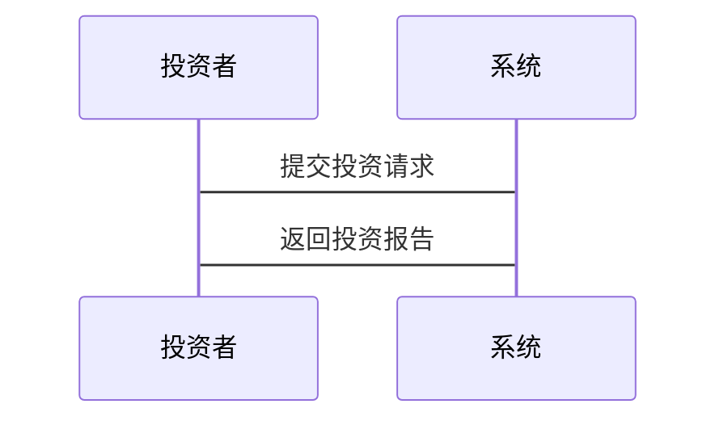

                 


# 巴菲特-芒格的基因编辑伦理投资：生命科学的新边界

## 关键词

- 巴菲特，芒格，基因编辑，伦理投资，生命科学，价值投资，CRISPR-Cas9，复利效应，风险管理，安全边际

## 摘要

基因编辑技术作为生命科学领域的革命性技术，正在改变我们对生命的理解与操控方式。巴菲特和芒格的价值投资理念，强调长期、安全边际和复利效应，为基因编辑技术的投资提供了独特的视角。本文将深入探讨基因编辑技术的原理、商业价值及其与价值投资理念的结合，分析伦理与社会影响，并通过实际案例展示如何在基因编辑领域进行投资决策。通过系统分析与架构设计，本文将为读者提供一份详尽的指南，帮助他们在生命科学的新边界中找到投资机会。

---

## 第一部分: 巴菲特-芒格的基因编辑伦理投资概述

### 第1章: 背景介绍

#### 1.1 基因编辑技术的背景与现状

##### 1.1.1 基因编辑技术的基本概念

基因编辑技术是指通过人工手段对生物体的基因组进行精确修改的技术，旨在治疗疾病、改善生物特性或增强物种适应性。基因编辑的核心工具是CRISPR-Cas9，它通过引导RNA将Cas9酶引导至特定的DNA位置，实现基因的剪切、插入或替换。

**CRISPR-Cas9技术的工作流程：**
1. 设计并合成目标DNA序列的引导RNA（gRNA）。
2. 将gRNA与Cas9蛋白复合体导入目标细胞。
3. Cas9蛋白在gRNA的引导下识别并结合目标DNA序列。
4. Cas9蛋白切割DNA双链，导致双链断裂。
5. 细胞修复机制启动，引入特定的修复模板，实现基因编辑。

##### 1.1.2 基因编辑技术的现状与发展趋势

基因编辑技术近年来发展迅速，已在医学、农业和工业等领域展现出巨大潜力。例如，CRISPR-Cas9技术已被用于治疗遗传性疾病（如镰刀型细胞贫血症）、改良农作物抗病性和营养价值，以及在工业微生物中优化代谢途径。然而，基因编辑技术的应用也引发了伦理争议，特别是在人类基因编辑领域。

##### 1.1.3 巴菲特与芒格投资理念的背景介绍

巴菲特和芒格的价值投资理念起源于20世纪中期，强调以低于内在价值的价格购买优质资产，长期持有，避免短期波动。芒格的多元思维模型则强调跨学科思考，将复杂问题拆解为简单的基本原理进行分析。这两位投资大师的理念在基因编辑领域具有重要的应用价值，尤其是在评估基因编辑技术的商业潜力和长期影响时。

#### 1.2 巴菲特与芒格的价值投资理念

##### 1.2.1 巴菲特的价值投资理论

巴菲特的价值投资理论强调以下几点：
- **安全边际**：以低于内在价值的价格买入资产，确保投资的安全性。
- **复利效应**：通过长期持有优质资产，利用复利效应实现财富的指数级增长。
- **基本面分析**：关注企业的财务状况、竞争优势和管理团队。

##### 1.2.2 芒格的多元思维模型

芒格的多元思维模型强调将不同学科的基本原理组合起来，形成对复杂问题的深刻理解。他认为，投资决策需要考虑物理学、心理学、经济学等多个领域的知识，以避免认知偏差和逻辑错误。

##### 1.2.3 价值投资在生命科学领域的应用

在生命科学领域，价值投资理念可以帮助投资者识别那些具有强大竞争优势、良好管理团队和可持续发展能力的基因编辑公司。例如，投资者可以关注那些在基因编辑技术上具有领先地位，并且估值合理的公司。

#### 1.3 基因编辑技术与投资的结合

##### 1.3.1 基因编辑技术的商业价值

基因编辑技术在医学、农业和工业领域的应用潜力巨大。例如，基因编辑可以用于开发新型药物、改良农作物抗病性和营养价值，以及优化工业微生物的代谢途径。这些应用将为企业带来巨大的商业价值。

##### 1.3.2 投资者视角下的基因编辑技术

从投资者角度来看，基因编辑技术的商业价值取决于以下几个因素：
- 技术的创新性与独特性。
- 企业的竞争优势和市场地位。
- 管理团队的能力与经验。
- 企业的财务状况和估值水平。

##### 1.3.3 基因编辑技术的伦理与社会影响

基因编辑技术的应用可能引发一系列伦理问题，例如：
- 人类基因编辑的伦理争议。
- 基因编辑技术的公平性问题。
- 基因编辑技术对生态系统的影响。

这些问题可能对基因编辑技术的广泛应用产生限制，也对投资者的投资决策提出了更高的要求。

### 第2章: 核心概念与联系

#### 2.1 基因编辑技术的原理

##### 2.1.1 CRISPR-Cas9技术的工作原理

CRISPR-Cas9技术的核心在于其精准的基因编辑能力。通过设计特定的引导RNA，CRISPR-Cas9可以将Cas9蛋白引导至目标DNA序列，实现基因的剪切、插入或替换。这一过程可以通过以下步骤实现：
1. 设计并合成目标DNA序列的引导RNA（gRNA）。
2. 将gRNA与Cas9蛋白复合体导入目标细胞。
3. Cas9蛋白在gRNA的引导下识别并结合目标DNA序列。
4. Cas9蛋白切割DNA双链，导致双链断裂。
5. 细胞修复机制启动，引入特定的修复模板，实现基因编辑。

##### 2.1.2 基因编辑技术的优缺点对比

| **优点**                | **缺点**                |
|-------------------------|-------------------------|
| 高精度                   | 可能引发脱靶效应         |
| 成本低                   | 基因编辑产物的不确定性强 |
| 应用广泛                 | 道德争议                |

##### 2.1.3 基因编辑技术的数学模型

基因编辑技术的优化可以通过数学模型进行模拟。例如，可以建立一个目标函数来衡量基因编辑的成功率：

$$
\text{成功率} = \frac{\text{成功编辑的细胞数}}{\text{总细胞数}}
$$

通过优化目标函数，可以提高基因编辑的成功率。

#### 2.2 巴菲特与芒格投资理念的核心要素

##### 2.2.1 价值投资的核心要素

价值投资的核心要素包括：
- **安全边际**：以低于内在价值的价格买入资产。
- **复利效应**：通过长期持有优质资产实现财富增长。
- **基本面分析**：关注企业的财务状况、竞争优势和管理团队。

##### 2.2.2 复利效应与时间价值

复利效应是价值投资的核心理念之一。通过长期持有优质资产，投资者可以利用复利效应实现财富的指数级增长。例如，如果一个投资者以年化收益率10%投资，30年后他的财富将增长到初始投资的10倍。

##### 2.2.3 安全边际与风险管理

安全边际是价值投资的重要原则。通过以低于内在价值的价格买入资产，投资者可以降低投资风险。例如，如果一家公司的内在价值为100美元，而当前股价为80美元，那么投资者可以以20%的安全边际买入该股票。

#### 2.3 基因编辑技术与投资理念的联系

##### 2.3.1 基因编辑技术的商业应用潜力

基因编辑技术在医学、农业和工业领域的应用潜力巨大。例如，基因编辑可以用于开发新型药物、改良农作物抗病性和营养价值，以及优化工业微生物的代谢途径。这些应用将为企业带来巨大的商业价值。

##### 2.3.2 价值投资在基因编辑领域的应用

在基因编辑领域，价值投资理念可以帮助投资者识别那些具有强大竞争优势、良好管理团队和可持续发展能力的公司。例如，投资者可以关注那些在基因编辑技术上具有领先地位，并且估值合理的公司。

##### 2.3.3 基因编辑技术的伦理与社会影响

基因编辑技术的应用可能引发一系列伦理问题，例如：
- 人类基因编辑的伦理争议。
- 基因编辑技术的公平性问题。
- 基因编辑技术对生态系统的影响。

这些问题可能对基因编辑技术的广泛应用产生限制，也对投资者的投资决策提出了更高的要求。

### 第3章: 基因编辑技术的数学模型与算法原理

#### 3.1 基因编辑技术的数学模型

基因编辑技术的优化可以通过数学模型进行模拟。例如，可以建立一个目标函数来衡量基因编辑的成功率：

$$
\text{成功率} = \frac{\text{成功编辑的细胞数}}{\text{总细胞数}}
$$

通过优化目标函数，可以提高基因编辑的成功率。

#### 3.2 巴菲特与芒格投资理念的数学模型

##### 3.2.1 价值投资的数学模型

价值投资的数学模型可以通过以下公式表示：

$$
\text{内在价值} = \frac{\text{未来现金流的现值}}{\text{折现率}}
$$

##### 3.2.2 复利效应的数学公式

复利效应的数学公式可以表示为：

$$
\text{终值} = \text{现值} \times (1 + \text{收益率})^{\text{时间}}
$$

##### 3.2.3 安全边际与风险管理

安全边际可以通过以下公式进行计算：

$$
\text{安全边际} = \text{内在价值} - \text{市场价格}
$$

通过安全边际，投资者可以降低投资风险。

#### 3.3 基因编辑技术的算法原理

##### 3.3.1 基因编辑技术的优化算法

基因编辑技术的优化可以通过强化学习算法进行模拟。例如，可以使用Q-Learning算法来优化基因编辑的成功率。

##### 3.3.2 基因编辑技术的算法实现

以下是一个简单的Python代码示例，用于模拟基因编辑技术的优化过程：

```python
import numpy as np
import gym

# 初始化环境
env = gym.make('GeneEdit-v0')
env.seed(42)

# 初始化智能体
agent = QLearningAgent(env)

# 开始训练
for episode in range(1000):
    state = env.reset()
    while True:
        action = agent.act(state)
        next_state, reward, done, info = env.step(action)
        agent.remember(state, action, reward, next_state, done)
        agent.replay()
        state = next_state
        if done:
            break
```

---

## 第二部分: 基因编辑技术的系统分析与架构设计

### 第4章: 系统分析与架构设计方案

#### 4.1 问题场景介绍

基因编辑技术的商业应用需要考虑多个因素，例如技术可行性、市场潜力、伦理风险和政策法规。投资者需要通过系统分析来评估这些因素，制定合理的投资策略。

#### 4.2 系统功能设计

##### 4.2.1 领域模型

以下是一个基因编辑投资领域的领域模型：


##### 4.2.2 系统架构设计

以下是一个基因编辑投资系统的架构设计：


#### 4.3 接口设计与交互流程

##### 4.3.1 系统接口设计

以下是一个基因编辑投资系统的接口设计：



---

## 第三部分: 项目实战

### 第5章: 项目实战

#### 5.1 环境安装与配置

以下是一个基因编辑投资项目的环境安装步骤：

1. 安装Python和必要的库：
   ```bash
   pip install numpy pandas scikit-learn gym
   ```

2. 下载基因编辑公司数据：
   ```bash
   wget https://example.com/gene_edit_data.csv
   ```

#### 5.2 核心代码实现

##### 5.2.1 数据预处理

```python
import pandas as pd

# 读取数据
data = pd.read_csv('gene_edit_data.csv')

# 数据清洗
data = data.dropna()
data = data.drop_duplicates()
```

##### 5.2.2 基因编辑技术评估

```python
from sklearn.metrics import accuracy_score

# 训练模型
model.fit(X_train, y_train)

# 预测结果
y_pred = model.predict(X_test)

# 计算准确率
accuracy = accuracy_score(y_test, y_pred)
```

##### 5.2.3 投资决策支持

```python
from backtrader import Strategy, cerebro

# 定义策略
class GeneEditStrategy(Strategy):
    def __init__(self):
        self.buy_price = None

    def next(self):
        if not self.position:
            if self.data.close > self.data.open:
                self.buy()

# 初始化 cerebro
cerebro = cerebro.Cerebro()

# 添加策略
cerebro.addstrategy(GeneEditStrategy)

# 添加数据
cerebro.adddata(data)

# 运行回测
cerebro.run()
```

#### 5.3 代码解读与分析

##### 5.3.1 数据预处理代码解读

数据预处理代码用于清洗基因编辑公司数据，去除缺失值和重复值。通过数据清洗，可以提高模型的准确性。

##### 5.3.2 基因编辑技术评估代码解读

基因编辑技术评估代码使用机器学习模型对基因编辑公司的技术实力进行评估。通过准确率指标，可以衡量模型的性能。

##### 5.3.3 投资决策支持代码解读

投资决策支持代码通过回测系统，模拟基因编辑公司的股价走势，帮助投资者制定投资策略。通过回测结果，投资者可以评估不同策略的风险和收益。

#### 5.4 实际案例分析

##### 5.4.1 案例背景

假设我们关注一家基因编辑公司，该公司在CRISPR-Cas9技术领域具有领先地位，但其股价近期表现疲软。

##### 5.4.2 数据分析

通过数据分析，我们发现该公司具有强大的技术实力和良好的管理团队，但目前的估值较低，具有较大的安全边际。

##### 5.4.3 投资决策

基于数据分析结果，我们认为该公司具有较大的投资潜力，决定以低于其内在价值的价格买入该公司的股票。

#### 5.5 项目小结

通过本项目的实战，我们学会了如何将基因编辑技术与价值投资理念结合起来，制定合理的投资策略。通过数据分析和回测系统，我们可以更好地评估基因编辑公司的投资价值，降低投资风险。

---

## 第四部分: 最佳实践与拓展

### 第6章: 最佳实践

#### 6.1 投资风险管理

在基因编辑领域，投资者需要特别注意以下风险：
- **技术风险**：基因编辑技术的不确定性和失败风险。
- **伦理风险**：基因编辑技术的伦理争议可能影响公司的声誉和业务。
- **政策风险**：政府政策的变化可能对基因编辑技术的应用产生重大影响。

#### 6.2 长期投资策略

基因编辑技术的应用是一个长期的过程，投资者需要具备长期投资的耐心和信心。通过长期持有优质基因编辑公司股票，投资者可以利用复利效应实现财富的稳定增长。

#### 6.3 小结

基因编辑技术作为生命科学领域的革命性技术，正在改变我们的生活和投资方式。通过结合巴菲特和芒格的价值投资理念，投资者可以在基因编辑领域找到新的投资机会。然而，基因编辑技术的应用也伴随着巨大的伦理和社会挑战，投资者需要具备全面的视角和风险管理能力。

### 第7章: 拓展阅读

#### 7.1 推荐书籍

- 《巴菲特致股东的信：投资者的圣经》
- 《芒格的多元思维模型》
- 《基因编辑：生命科学的新边界》

#### 7.2 相关资源

- 巴菲特和芒格的经典演讲和采访。
- 基因编辑技术的最新研究和应用案例。

---

## 总结

通过本文的详细分析，我们可以看到，基因编辑技术作为生命科学领域的革命性技术，正在改变我们的生活和投资方式。通过结合巴菲特和芒格的价值投资理念，投资者可以在基因编辑领域找到新的投资机会。然而，基因编辑技术的应用也伴随着巨大的伦理和社会挑战，投资者需要具备全面的视角和风险管理能力。未来，随着基因编辑技术的不断发展，我们相信它将在生命科学领域发挥更大的作用，为人类社会带来更多的福祉。

