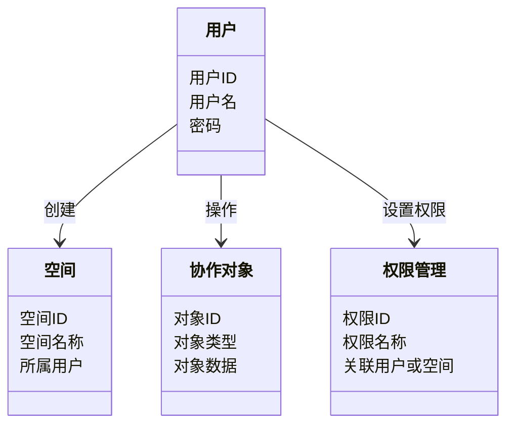

                 


# 巴菲特-芒格的增强现实协作工具投资：远程办公的未来

## 关键词：
- 巴菲特, 芒格, 增强现实, 协作工具, 远程办公, 投资策略, 未来趋势

## 摘要：
本文探讨了巴菲特和芒格的投资理念，特别是他们如何将这些理念应用于增强现实协作工具，分析其在远程办公中的潜力和未来趋势。文章详细介绍了AR协作工具的技术基础、系统架构、投资分析以及实际案例，为读者提供了全面的理解和洞察。

---

## 第一部分：巴菲特与芒格的投资理念

### 第1章：巴菲特与芒格的投资哲学

#### 1.1 巴菲特的价值投资理念
- **1.1.1 巴菲特的投资哲学概述**
  巴菲特强调投资于具有强大护城河、持续盈利能力且由优秀管理层领导的公司。他偏好那些在长期竞争中能够保持优势地位的企业。

- **1.1.2 芒格的多元思维模型**
  芒格提倡通过多个学科的交叉应用来理解问题，寻找投资机会时，他会从物理学、心理学、经济学等多个角度分析企业的内在价值。

- **1.1.3 巴菲特与芒格投资理念的结合**
  两人共同强调基本面分析、长期投资和风险管理，他们的合作不仅提升了投资决策的深度，还优化了对市场趋势的预判能力。

#### 1.2 投资决策的核心要素
- **1.2.1 企业基本面分析**
  包括收入、利润、现金流和资产负债表等财务指标的分析，以评估企业的健康状况和盈利能力。

- **1.2.2 财务报表分析**
  通过分析资产负债表、利润表和现金流量表，评估企业的财务状况和潜在风险。

- **1.2.3 企业竞争优势分析**
  研究企业的市场地位、品牌影响力、成本优势和技术壁垒等，判断其在行业中的竞争优势。

### 第2章：增强现实协作工具的市场分析

#### 2.1 增强现实协作工具的定义与发展
- **2.1.1 AR技术的基本概念**
  增强现实（AR）是一种将数字信息叠加在物理世界的技术，通过摄像头、传感器和算法实现。

- **2.1.2 AR技术的发展历程**
  从早期的军事应用到如今的民用领域，AR技术经历了从概念验证到商业化应用的快速发展。

- **2.1.3 AR协作工具的应用场景**
  包括远程会议、教育培训、建筑设计和虚拟协作等多个领域，展示了其广泛的应用潜力。

#### 2.2 远程办公的现状与趋势
- **2.2.1 远程办公的兴起背景**
  疫情的全球大流行加速了远程办公的普及，企业开始寻求更高效的协作工具来支持远程团队的工作。

- **2.2.2 远程办公的挑战与机遇**
  挑战包括沟通效率低下、团队协作困难；机遇则在于降低运营成本、吸引全球人才和提高灵活性。

- **2.2.3 AR协作工具在远程办公中的潜力**
  通过提供沉浸式的虚拟协作环境，AR工具可以显著提升远程团队的协作效率和沟通体验。

---

## 第二部分：增强现实协作工具的技术基础

### 第3章：AR协作工具的技术实现

#### 3.1 AR协作工具的核心技术
- **3.1.1 三维建模与渲染**
  使用计算机图形学技术创建和渲染三维模型，确保在虚拟空间中呈现真实的视觉效果。

- **3.1.2 实时协作与同步**
  通过分布式系统和同步算法，确保多个用户在虚拟空间中的协作同步，避免数据冲突。

- **3.1.3 多设备兼容性**
  支持多种设备（如手机、平板、PC和AR头显）的接入和协作，提升用户的使用便利性。

#### 3.2 AR协作工具的实现流程
- **3.2.1 用户需求分析**
  了解目标用户的使用场景和需求，设计符合用户习惯的协作工具。

- **3.2.2 系统设计与架构**
  设计系统的整体架构，包括前端、后端、数据存储和网络通信等模块。

- **3.2.3 开发与测试**
  进行模块化开发，通过单元测试、集成测试和用户测试确保系统的稳定性和可靠性。

### 第4章：AR协作工具的功能设计

#### 4.1 核心功能模块
- **4.1.1 虚拟空间创建**
  用户可以在虚拟空间中创建和定制协作环境，支持多人同时进入和互动。

- **4.1.2 实时协作功能**
  包括文件共享、协同编辑、实时聊天和虚拟白板等功能，提升团队的协作效率。

- **4.1.3 三维交互设计**
  提供直观的三维操作界面，用户可以通过手势、语音和注视点等方式进行交互。

#### 4.2 用户体验优化
- **4.2.1 界面设计**
  采用简洁直观的用户界面，确保用户能够快速上手并高效使用。

- **4.2.2 操作反馈**
  提供即时的用户反馈，如操作确认和错误提示，提升用户的操作体验。

- **4.2.3 性能优化**
  优化系统的响应速度和运行效率，确保在低延迟下提供流畅的协作体验。

---

## 第三部分：系统架构与实现

### 第5章：系统架构设计

#### 5.1 问题场景介绍
- 描述一个典型的远程协作场景，例如多个团队成员在一个虚拟空间中共同完成一个项目。

#### 5.2 项目介绍
- 本项目旨在开发一个基于AR技术的协作工具，支持多人实时协作和沉浸式体验。

#### 5.3 系统功能设计
- **5.3.1 领域模型设计**
  使用Mermaid类图描述系统的领域模型，包括用户、空间、协作对象和权限管理等核心实体。



#### 5.4 系统架构设计
- 使用Mermaid架构图展示系统的整体架构，包括前端、后端、数据存储和通信模块。


#### 5.5 系统接口设计
- 描述系统的主要接口及其功能，例如用户认证接口、空间创建接口和协作数据同步接口。

#### 5.6 系统交互设计
- 使用Mermaid序列图展示用户与系统之间的交互流程，例如用户登录、创建空间和协作对象操作。

---

## 第四部分：项目实战

### 第6章：项目实战

#### 6.1 环境安装
- 安装必要的开发工具和依赖库，例如Python、PyTorch、OpenCV和WebGL库。

#### 6.2 核心代码实现
- **6.2.1 用户认证功能**
  使用Python编写用户认证接口，结合JWT进行身份验证。

```python
from fastapi import FastAPI
from fastapi.security import HTTPBearer, HTTPAuthorizationCredentials, HTTPException
from typing import Optional
import jwt
import datetime

app = FastAPI()
security = HTTPBearer()

@app.post('/login')
async def login(credentials: HTTPAuthorizationCredentials):
    # 验证密码和用户是否存在
    # 假设数据库中存在该用户
    return {
        "token": jwt.encode({'user': 'user_id', 'exp': datetime.datetime.utcnow() + datetime.timedelta(days=7)}, 'secret_key')
    }
```

- **6.2.2 虚拟空间创建**
  使用WebGL库渲染三维空间，并通过WebSocket实现多人实时协作。

```javascript
class ARSpace {
    constructor() {
        this.users = [];
        this.objects = [];
        this.listeners = [];
    }

    addUser(user) {
        this.users.push(user);
        this.notifyListeners('userJoined', user);
    }

    addObject(object) {
        this.objects.push(object);
        this.notifyListeners('objectAdded', object);
    }

    notifyListeners(eventType, data) {
        this.listeners.forEach(listener => {
            listener[eventType](data);
        });
    }
}
```

#### 6.3 项目小结
- 总结项目实现的关键点和遇到的挑战，例如实时协作的延迟问题和跨平台兼容性问题。

---

## 第五部分：最佳实践与投资建议

### 第7章：最佳实践与投资建议

#### 7.1 投资要点
- **7.1.1 选择具有技术优势的公司**
  投资那些在AR协作工具领域具有核心技术优势的企业，例如在三维建模和实时协作算法方面有显著优势的公司。

- **7.1.2 关注市场需求**
  研究企业的目标市场和用户群体，选择那些市场需求大、用户粘性高的企业。

#### 7.2 注意事项
- 避免盲目跟风，关注企业的财务状况和管理层能力。
- 考虑技术风险和市场风险，制定合理的风险控制策略。

#### 7.3 拓展阅读
- 推荐一些相关的书籍和资源，例如《巴菲特投资之道》、《增强现实技术与应用》等，帮助读者深入了解投资和AR技术。

---

## 第六部分：总结与展望

### 第8章：总结与展望

#### 8.1 未来趋势
- 随着5G网络和云计算技术的发展，AR协作工具的性能和稳定性将进一步提升，用户体验将更加流畅。

#### 8.2 投资机会
- 未来几年，AR协作工具市场将快速增长，投资者可以关注那些在技术创新和市场拓展方面具有优势的企业。

---

通过以上结构，本文详细探讨了巴菲特和芒格的投资理念，分析了增强现实协作工具的技术基础和市场潜力，并提供了系统的实现方案和投资建议。希望读者能够从多个角度深入了解这一领域的投资机会和未来发展趋势。

