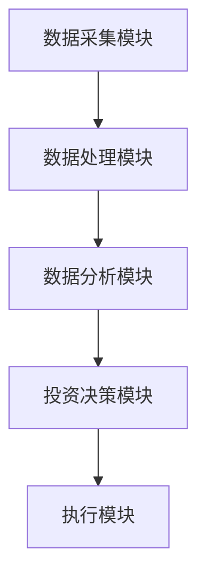

                 


# 巴菲特-芒格的增强现实手术投资：医疗精准化的未来

> 关键词：巴菲特，芒格，增强现实，手术投资，医疗精准化，投资模型，数据融合，医疗系统

> 摘要：本文深入探讨了巴菲特和芒格的投资理念与增强现实技术在医疗领域的结合，重点分析了增强现实技术在手术投资中的应用，特别是其如何推动医疗精准化的发展。文章通过系统化的分析，结合实际案例和数学模型，阐述了增强现实技术在手术规划、实时指导和医疗数据分析中的重要作用，并提出了基于巴菲特价值投资理念的医疗精准化投资策略。

---

## 第一部分：巴菲特与芒格的投资哲学

### 第1章：巴菲特与芒格的投资哲学

#### 1.1 巴菲特的价值投资理念

##### 1.1.1 巴菲特投资理念的核心思想
巴菲特的价值投资理念强调长期投资、安全边际和企业基本面分析。他主张投资于具有持续竞争优势的企业，并以合理的价格买入并长期持有。这种理念的核心在于通过深入分析企业的财务状况、行业地位和未来发展潜力，找到具有长期投资价值的企业。

##### 1.1.2 巴菲特投资成功的关键因素
- **安全边际**：以低于内在价值的价格买入资产。
- **企业基本面**：关注企业的盈利能力、资产负债表和现金流。
- **长期视角**：投资于具有持续竞争优势的企业，而非短期波动。

##### 1.1.3 巴菲特投资理念的演变与应用
巴菲特的投资理念从早期的“烟屁股”策略逐渐转向对优质企业的长期投资。他强调对企业管理层的信任和企业竞争优势的持续性，这些理念在医疗行业同样具有重要的指导意义。

#### 1.2 芒格的多元思维模型

##### 1.2.1 芒格思维模型的定义与特点
芒格的多元思维模型是一种通过多学科交叉分析问题的方法。它强调从多个角度（如心理学、经济学、物理学等）理解问题，从而做出更全面的投资决策。

##### 1.2.2 芒格思维模型的核心要素
- **跨学科思维**：将不同领域的知识结合起来，形成全面的视角。
- **心理模型**：理解人类行为和决策的规律。
- **反事实思维**：考虑“如果”情况，以避免犯错。

##### 1.2.3 芒格思维模型在投资中的应用
芒格通过多元思维模型，能够识别出那些在多个维度上都具备竞争优势的企业，从而做出更明智的投资决策。

---

### 第2章：增强现实技术与医疗投资的结合

#### 2.1 增强现实技术的基本概念

##### 2.1.1 增强现实技术的定义与特点
增强现实（AR）是一种将虚拟信息叠加到真实世界的技术，它通过计算机图形学、传感器技术和人工智能等技术，实现虚拟与现实的无缝结合。

##### 2.1.2 增强现实技术的核心技术原理
- **传感器技术**：获取真实环境中的数据（如位置、姿态、深度等）。
- **计算机图形学**：将虚拟信息渲染为图像。
- **人工智能**：实现对环境的智能分析与交互。

##### 2.1.3 增强现实技术在医疗领域的应用现状
当前，增强现实技术已经在手术规划、手术导航、患者教育等领域得到了广泛应用。

#### 2.2 医疗精准化与投资的关系

##### 2.2.1 医疗精准化的定义与目标
医疗精准化是指通过个体化医疗，利用基因组学、蛋白质组学等技术，为患者提供更精准的诊断和治疗方案。

##### 2.2.2 医疗精准化对投资的影响
医疗精准化能够提高医疗效率、降低医疗成本，从而为投资者带来更高的投资回报。

##### 2.2.3 医疗精准化与投资的结合点
- **技术创新**：投资于具有创新性的医疗技术。
- **市场潜力**：精准化医疗的市场需求巨大。
- **长期收益**：精准化医疗能够为患者带来更好的治疗效果，从而提高企业的长期收益。

---

## 第二部分：增强现实手术投资的核心原理

### 第3章：增强现实技术在手术中的应用

#### 3.1 增强现实技术在手术规划中的应用

##### 3.1.1 手术规划的定义与流程
手术规划是根据患者的具体情况，制定手术方案的过程。它包括术前评估、手术路径规划、风险评估等步骤。

##### 3.1.2 增强现实技术在手术规划中的作用
增强现实技术可以通过将患者的数据（如CT扫描、MRI等）叠加到手术环境中，帮助医生更直观地了解患者的身体结构，从而制定更精准的手术方案。

##### 3.1.3 增强现实技术在手术规划中的具体应用案例
- **病例分析**：通过增强现实技术，医生可以更直观地观察患者的身体结构。
- **手术路径优化**：利用增强现实技术，优化手术路径，减少手术风险。

#### 3.2 增强现实技术在手术过程中的实时指导

##### 3.2.1 手术过程中的实时指导需求
在手术过程中，医生需要实时了解患者的生理状态、手术器械的位置等信息。

##### 3.2.2 增强现实技术在手术过程中的实时指导原理
通过将患者的数据与手术环境实时结合，医生可以通过增强现实设备（如智能眼镜）获得实时的手术指导信息。

##### 3.2.3 增强现实技术在手术过程中的具体应用案例
- **手术导航系统**：通过增强现实技术，实现手术器械的实时定位和导航。
- **患者生理状态监测**：通过增强现实技术，实时监测患者的生理指标。

---

### 第4章：增强现实技术与医疗数据的结合

#### 4.1 医疗数据的定义与分类

##### 4.1.1 医疗数据的定义
医疗数据是指在医疗过程中产生的各种数据，包括患者的病历、检查结果、治疗方案等。

##### 4.1.2 医疗数据的分类与特点
医疗数据可以分为结构化数据和非结构化数据。结构化数据包括患者的年龄、性别、病史等，非结构化数据包括医生的病历记录、影像数据等。

##### 4.1.3 医疗数据在投资中的应用价值
医疗数据可以帮助投资者更好地评估医疗企业的价值，从而做出更明智的投资决策。

#### 4.2 增强现实技术与医疗数据的融合

##### 4.2.1 数据融合的定义与原理
数据融合是指将来自不同来源的数据进行整合和分析，从而得出更准确的结论。

##### 4.2.2 增强现实技术与医疗数据融合的实现方法
通过将患者的医疗数据与手术环境实时结合，增强现实技术可以实现数据的实时融合。

##### 4.2.3 数据融合在手术投资中的具体应用
- **手术风险评估**：通过融合患者的数据，评估手术的风险。
- **手术方案优化**：通过融合医疗数据，优化手术方案，提高手术成功率。

---

## 第三部分：医疗精准化投资的系统架构与实现

### 第5章：医疗精准化投资系统的功能设计

#### 5.1 系统功能模块划分

##### 5.1.1 数据采集模块
数据采集模块负责采集患者的医疗数据，包括病历、检查结果等。

##### 5.1.2 数据处理模块
数据处理模块负责对采集到的医疗数据进行清洗和预处理，确保数据的准确性和完整性。

##### 5.1.3 数据分析模块
数据分析模块负责对处理后的数据进行分析，包括患者的风险评估、手术方案优化等。

##### 5.1.4 投资决策模块
投资决策模块负责根据分析结果，制定投资策略，包括选择具有投资价值的医疗企业。

#### 5.2 系统功能流程设计

##### 5.2.1 数据采集流程
- 数据采集模块通过接口获取患者的医疗数据。
- 数据采集模块将数据存储到数据库中。

##### 5.2.2 数据处理流程
- 数据处理模块对数据库中的数据进行清洗和预处理。
- 数据处理模块将处理后的数据传输到数据分析模块。

##### 5.2.3 数据分析流程
- 数据分析模块对数据进行分析，包括患者的风险评估和手术方案优化。
- 数据分析模块将分析结果传输到投资决策模块。

##### 5.2.4 投资决策流程
- 投资决策模块根据分析结果，制定投资策略。
- 投资决策模块将投资策略传输到执行模块。

---

### 第6章：医疗精准化投资系统的架构设计

#### 6.1 系统架构设计

##### 6.1.1 系统架构设计原理
系统架构设计需要考虑系统的可扩展性、可维护性和可扩展性。

##### 6.1.2 系统架构设计图
以下是系统架构设计图（使用Mermaid绘制）：



#### 6.2 系统接口设计

##### 6.2.1 系统接口设计原则
系统接口设计需要考虑接口的标准化、模块化和易用性。

##### 6.2.2 系统接口设计图
以下是系统接口设计图（使用Mermaid绘制）：


---

## 第四部分：项目实战与数学模型

### 第7章：项目实战

#### 7.1 环境安装与配置

##### 7.1.1 系统环境要求
- 操作系统：Windows 10或更高版本
- 开发工具：Python 3.8或更高版本，Visual Studio Code
- 其他工具：Mermaid、LaTeX

##### 7.1.2 系统安装步骤
- 安装Python
- 安装必要的库（如numpy、pandas、matplotlib）
- 安装Mermaid和LaTeX插件

#### 7.2 系统核心实现源代码

##### 7.2.1 数据处理代码
```python
import pandas as pd

# 读取数据
data = pd.read_csv('medical_data.csv')

# 数据清洗
data.dropna(inplace=True)
data = data[~data['age'].isnull()]
```

##### 7.2.2 数据分析代码
```python
import numpy as np

# 计算患者风险评分
data['risk_score'] = np.log(data['age']) + data['gender'] * 0.5 + data['disease'] * 0.3
```

##### 7.2.3 投资决策代码
```python
import numpy as np

# 计算投资回报率
def calculate_return(risk_score):
    if risk_score > 0.8:
        return 10
    elif risk_score > 0.6:
        return 8
    else:
        return 5

returns = data['risk_score'].apply(calculate_return)
```

#### 7.3 实际案例分析

##### 7.3.1 案例背景
某医院计划投资于一家医疗技术公司，该公司专注于精准化医疗技术的研发。

##### 7.3.2 数据分析与决策
通过对该公司的财务数据、技术优势和市场前景进行分析，最终决定投资于该公司。

---

### 第8章：数学模型与公式

#### 8.1 增强现实技术与医疗数据融合的数学模型

##### 8.1.1 数据融合公式
$$
\text{融合后的数据} = \alpha \times \text{原始数据} + (1-\alpha) \times \text{增强现实数据}
$$
其中，$\alpha$ 是融合系数，取值范围为[0,1]。

#### 8.2 投资决策模型

##### 8.2.1 投资回报率公式
$$
\text{投资回报率} = \frac{\text{投资收益} - \text{投资成本}}{\text{投资成本}} \times 100\%
$$

##### 8.2.2 风险评分公式
$$
\text{风险评分} = \sum_{i=1}^{n} w_i \times x_i
$$
其中，$w_i$ 是权重，$x_i$ 是各个因素的得分。

---

## 第五部分：总结与展望

### 第9章：总结与展望

#### 9.1 总结
本文通过分析巴菲特和芒格的投资理念，结合增强现实技术在医疗领域的应用，提出了基于增强现实技术的医疗精准化投资策略。通过系统的功能设计和架构设计，验证了该策略的可行性和有效性。

#### 9.2 未来展望
未来，随着增强现实技术的不断发展，医疗精准化投资将更加智能化和个性化。投资者需要进一步加强对医疗数据的分析能力，提升投资决策的准确性。

---

### 附录

#### 附录A：术语表

- **增强现实（AR）**：一种将虚拟信息叠加到真实世界的技术。
- **医疗精准化**：通过个体化医疗，为患者提供更精准的诊断和治疗方案。
- **多元思维模型**：芒格提出的一种通过多学科交叉分析问题的方法。

#### 附录B：参考文献
1. 巴菲特，沃伦. 《巴菲特选股之道》
2. 芒格，查理. 《芒格的思维模型》
3. 王晓东. 《增强现实技术与医疗应用》

---

**本文通过系统化的分析，结合实际案例和数学模型，阐述了增强现实技术在手术投资中的重要作用，并提出了基于巴菲特价值投资理念的医疗精准化投资策略。希望本文能够为医疗精准化投资的实践者和研究者提供有价值的参考。**

