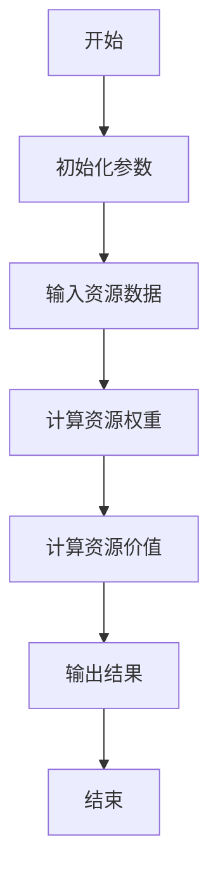
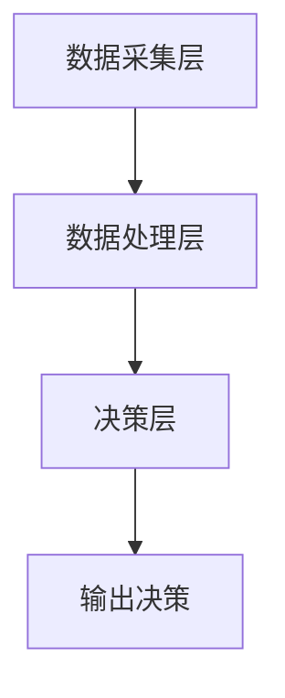

                 


# 巴菲特-芒格的太空采矿投资：开发外太空资源

## 关键词：巴菲特，芒格，太空采矿，资源开发，投资模型

## 摘要：本文探讨了巴菲特和芒格的投资理念在太空采矿中的应用，分析了太空采矿的潜力、技术挑战和投资策略，提出了结合价值投资和多元思维模型的投资框架，通过具体案例和算法模型，展示了如何在太空资源开发中实现高效投资。

---

## 第1章：太空资源开发的背景与潜力

### 1.1 太空资源开发的现状与趋势

#### 1.1.1 太空资源开发的技术进展

近年来，随着技术的进步，太空采矿技术取得了显著发展。主要的技术突破包括：

1. **机器人技术**：用于在低重力环境下的精确操作和样本采集。
2. **3D打印技术**：用于在太空环境中构建采矿设备和结构。
3. **人工智能**：用于实时数据分析和决策，提高采矿效率。

#### 1.1.2 太空资源开发的经济价值

太空资源的经济价值主要体现在以下几个方面：

1. **稀有金属和矿物**：月球和小行星上富含铂族金属、稀土元素等，可用于高科技产业。
2. **能源资源**：利用太阳辐射能发电，解决地球能源短缺问题。
3. **战略资源**：太空资源在军事和高科技领域具有重要战略意义。

#### 1.1.3 太空资源开发的法律与政策框架

目前，太空资源开发的法律框架尚不完善，但国际社会正在逐步建立相关法规。主要的法律框架包括：

1. **《外空条约》**：禁止国家在太空进行军事活动，允许商业活动。
2. **美国《商业太空发射法案》**：允许私人企业参与太空资源开发。
3. **国际空间法**：尚未明确太空资源的主权归属，需进一步探讨。

### 1.2 巴菲特与芒格的投资理念

#### 1.2.1 巴菲特的价值投资理论

巴菲特的价值投资理论强调：

1. **安全边际**：投资时要确保价格低于内在价值。
2. **长期视角**：关注企业的长期盈利能力，而非短期波动。
3. **优质企业**：投资具有强大护城河和良好管理的企业。

#### 1.2.2 芒格的多元思维模型

芒格的多元思维模型强调：

1. **跨学科思维**：将不同领域的知识结合起来，形成全面的分析框架。
2. **逆向思考**：从问题的反面思考，寻找解决方案。
3. **心理偏见**：理解并克服认知偏差，避免决策错误。

#### 1.2.3 两人投资理念的结合

巴菲特和芒格的理念结合体现在：

1. **价值投资与多元思维的结合**：通过多元思维模型筛选出具有长期价值的企业。
2. **长期视角与安全边际**：在太空资源开发中，寻找具有长期增长潜力的项目，并确保投资的安全边际。

---

## 第2章：巴菲特-芒格投资理念在太空采矿中的应用

### 2.1 太空采矿的定义与分类

#### 2.1.1 太空采矿的定义

太空采矿是指在外层空间中提取和利用自然资源的过程，主要包括以下几种形式：

1. **小行星采矿**：从小行星中提取金属和矿物。
2. **月球采矿**：在月球表面或地下提取资源。
3. ** asteroid采矿**：从近地小行星中提取资源。

#### 2.1.2 太空资源的类型

太空资源的类型主要包括：

1. **金属资源**：铂族金属、铁、镍等。
2. **矿物资源**：稀土元素、铀等。
3. **能源资源**：太阳能、氢气等。

#### 2.1.3 太空采矿的主要技术挑战

太空采矿面临的技术挑战包括：

1. **极端环境**：高温、辐射、真空等。
2. **资源定位**：如何准确找到资源丰富的区域。
3. **成本控制**：太空采矿的初始投资和运营成本较高。

### 2.2 巴菲特-芒格投资模型在太空采矿中的应用

#### 2.2.1 投资模型的核心要素

巴菲特-芒格投资模型的核心要素包括：

1. **长期价值**：寻找具有长期增长潜力的项目。
2. **安全边际**：确保投资价格低于内在价值。
3. **优质团队**：选择具有优秀管理能力和技术团队的企业。

#### 2.2.2 投资模型的构建与优化

投资模型的构建步骤：

1. **确定目标**：明确投资目标和范围。
2. **筛选企业**：通过多元思维模型筛选出具有长期价值的企业。
3. **评估风险**：分析项目的潜在风险，并制定应对策略。
4. **优化模型**：根据市场变化和项目进展不断优化投资模型。

#### 2.2.3 投资模型的验证与评估

投资模型的验证与评估：

1. **历史数据验证**：通过历史数据验证模型的有效性。
2. **实时监控**：实时监控项目的进展和市场变化。
3. **反馈优化**：根据反馈不断优化投资模型。

---

## 第3章：太空采矿的核心概念与联系

### 3.1 太空资源开发的背景

#### 3.1.1 问题背景

随着地球资源的枯竭，太空资源开发成为人类发展的必然趋势。

#### 3.1.2 问题描述

如何在外层空间中高效、安全地开发和利用资源。

#### 3.1.3 问题解决

通过技术创新和国际合作，实现太空资源的可持续开发。

### 3.2 核心概念与联系

#### 3.2.1 核心概念原理

太空资源开发的核心概念包括：

1. **资源定位**：如何准确找到资源丰富的区域。
2. **技术实现**：如何在外层空间中高效提取资源。
3. **经济可行性**：如何降低开发成本，实现经济可行性。

#### 3.2.2 概念属性特征对比表格

以下是太空资源开发的核心概念对比表：

| 概念       | 属性               | 特征对比         |
|------------|--------------------|-----------------|
| 资源定位    | 准确性             | 高              |
| 技术实现    | 复杂性             | 高              |
| 经济可行性  | 成本控制           | 中              |

#### 3.2.3 ER实体关系图架构

以下是太空资源开发的实体关系图：

```mermaid
erd
    %% 太空资源开发实体关系图
    太空资源 --|{建立}|--> 采矿企业
    采矿企业 --|{依赖}|--> 采矿技术
    采矿技术 --|{应用于}|--> 采矿项目
    采矿项目 --|{涉及}|--> 资源类型
```

---

## 第4章：太空采矿的算法原理讲解

### 4.1 算法原理概述

#### 4.1.1 算法原理的数学模型

以下是太空资源开发的数学模型：

$$ V = \sum_{i=1}^{n} w_i x_i $$

其中，\( V \) 表示资源的总价值，\( w_i \) 表示资源 \( i \) 的权重，\( x_i \) 表示资源 \( i \) 的数量。

#### 4.1.2 算法原理的公式推导

通过公式推导，我们可以得出资源的价值评估模型：

$$ V = \sum_{i=1}^{n} w_i x_i $$

其中，\( w_i \) 是资源 \( i \) 的权重，\( x_i \) 是资源 \( i \) 的数量。

#### 4.1.3 算法原理的流程图

以下是资源价值评估的流程图：



### 4.2 算法实现

#### 4.2.1 算法实现的Python源代码

以下是资源价值评估的Python代码：

```python
def calculate_value(resources, weights):
    return sum(r * w for r, w in zip(resources, weights))

resources = [10, 20, 15]
weights = [0.3, 0.5, 0.2]
value = calculate_value(resources, weights)
print(value)
```

#### 4.2.2 代码应用解读与分析

通过上述代码，我们可以计算出资源的总价值。代码的关键部分在于计算每个资源的价值，并将它们相加得到总价值。

#### 4.2.3 算法实现的优化建议

优化建议包括：

1. **并行计算**：利用多线程或分布式计算提高效率。
2. **动态调整权重**：根据市场变化动态调整资源权重。
3. **数据预处理**：对资源数据进行清洗和预处理，提高计算精度。

---

## 第5章：太空采矿的系统分析与架构设计

### 5.1 系统分析

#### 5.1.1 问题场景介绍

系统分析主要针对太空资源开发中的技术挑战和管理问题。

#### 5.1.2 系统功能设计

系统功能设计包括：

1. **资源定位**：通过卫星和传感器定位资源。
2. **技术实现**：开发和应用采矿技术。
3. **经济可行性分析**：评估项目的经济可行性。

#### 5.1.3 系统架构设计

系统架构设计包括：

1. **数据采集层**：通过传感器和卫星采集数据。
2. **数据处理层**：对数据进行清洗和分析。
3. **决策层**：根据分析结果制定决策。

### 5.2 系统架构设计

#### 5.2.1 系统架构的类图

以下是系统架构的类图：


#### 5.2.2 系统架构的流程图

以下是系统架构的流程图：



#### 5.2.3 系统接口设计

系统接口设计包括：

1. **数据采集接口**：与传感器和卫星对接。
2. **数据处理接口**：与数据分析模块对接。
3. **决策接口**：与决策层对接。

#### 5.2.4 系统交互设计

系统交互设计包括：

1. **用户与系统的交互**：用户输入指令，系统响应。
2. **系统内部交互**：各模块之间的数据传递和处理。

---

## 第6章：太空采矿的项目实战

### 6.1 项目环境安装

#### 6.1.1 开发环境的配置

建议使用Python 3.8以上版本，安装必要的库和工具。

#### 6.1.2 项目依赖的安装

安装以下依赖：

```bash
pip install numpy
pip install matplotlib
pip install pandas
```

#### 6.1.3 项目配置的完成

完成项目的初始化配置，包括创建项目文件夹和配置文件。

### 6.2 系统核心实现

#### 6.2.1 核心代码的实现

以下是资源价值评估的核心代码：

```python
import numpy as np
import pandas as pd

def calculate_value(resources, weights):
    return np.dot(resources, weights)

resources = np.array([10, 20, 15])
weights = np.array([0.3, 0.5, 0.2])
value = calculate_value(resources, weights)
print(value)
```

#### 6.2.2 代码的调试与优化

调试步骤：

1. **运行代码**：确保代码可以正常运行。
2. **检查结果**：验证计算结果是否合理。
3. **优化代码**：根据需要优化代码性能。

### 6.3 项目小结

通过本次项目实战，我们掌握了太空资源开发的核心技术，并通过Python代码实现了资源价值评估模型。未来，我们可以进一步优化模型，提高计算效率和精度。

---

## 第7章：总结与展望

### 7.1 总结

本文通过分析巴菲特和芒格的投资理念，探讨了其在太空采矿中的应用。我们提出了结合价值投资和多元思维模型的投资框架，并通过具体案例和算法模型，展示了如何在太空资源开发中实现高效投资。

### 7.2 展望

未来，随着技术的进步和法规的完善，太空资源开发将进入快速发展阶段。我们需要进一步优化投资模型，提高投资效率和收益。

---

## 参考文献

1. 巴菲特，沃伦。《巴菲特投资哲学》。
2. 芒格，查理。《穷查理宝典》。
3. 国际空间法协会。《外空条约》。

--- 

通过本文的分析，我们可以看到，巴菲特和芒格的投资理念在太空采矿中的应用具有巨大的潜力。未来，随着技术的进步和法规的完善，太空资源开发将进入快速发展阶段。

