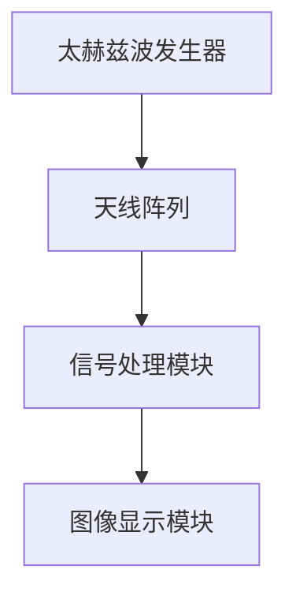
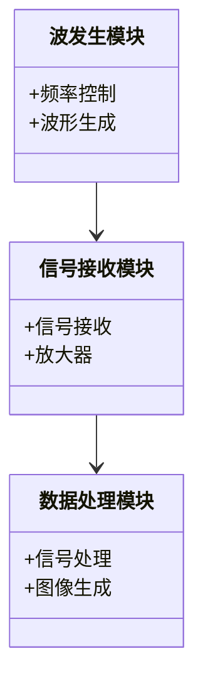

                 


# 巴菲特-芒格的太赫兹成像技术投资：安全检查的新标准

## 关键词：太赫兹成像技术，安全检查，巴菲特，芒格，投资策略，系统设计

## 摘要：本文探讨了巴菲特和芒格的投资理念与太赫兹成像技术的结合，分析了该技术在安全检查中的应用前景，并详细讲解了其核心原理、系统设计及投资策略。

---

## 第一章：引言

### 1.1 巴菲特和芒格的投资理念

#### 1.1.1 巴菲特的价值投资理论
- 巴菲特强调长期投资，寻找具有持续竞争优势的企业。
- 价值投资的核心是寻找市场低估的优质企业。

#### 1.1.2 芒格的多元思维模型
- 芒格提倡构建跨学科的知识框架，以全面分析问题。
- 强调独立思考，避免从众心理。

#### 1.1.3 投资理念与太赫兹成像技术的结合
- 将长期价值投资与技术创新相结合。
- 寻找具有技术优势和市场潜力的公司。

### 1.2 太赫兹成像技术的基本概念

#### 1.2.1 太赫兹波的基本特性
- 太赫兹波是电磁波的一种，频率介于 microwave 和 infrared 之间。
- 具有较高的穿透能力和较弱的电离效应。

#### 1.2.2 太赫兹成像技术的定义
- 利用太赫兹波的特性进行物体成像的技术。
- 主要应用于安全检查、无损检测等领域。

#### 1.2.3 太赫兹成像技术的优势与局限性
| 优势 | 局限性 |
|------|--------|
| 高穿透性 | 成像分辨率较低 |
| 低电离性 | 易受环境干扰 |
| 非接触检测 | 成本较高 |

### 1.3 太赫兹成像技术在安全检查中的应用前景

#### 1.3.1 安全检查的传统方法及其局限性
- 传统方法包括金属探测器和X射线检测。
- 局限性：检测范围有限，存在辐射风险。

#### 1.3.2 太赫兹成像技术在安全检查中的潜在优势
- 高穿透性：可检测隐藏物品。
- 非电离性：对人体无害。
- 多功能：可检测液体、粉末等多种物质。

#### 1.3.3 技术的商业化应用现状与未来趋势
- 现状：逐步应用于机场、车站等公共场所。
- 未来趋势：技术优化，成本降低，应用范围扩大。

---

## 第二章：太赫兹成像技术的核心原理

### 2.1 太赫兹波的产生与传播

#### 2.1.1 太赫兹波的产生机制
- 使用固态电子器件或光导开关产生太赫兹波。

#### 2.1.2 太赫兹波的传播特性
- 太赫兹波在空气中的传播速度接近光速。
- 易受障碍物影响，传播距离有限。

#### 2.1.3 太赫兹波与物质的相互作用
- 物质对太赫兹波的吸收特性与材料的介电常数有关。
- 不同物质对太赫兹波的反射和透射特性不同。

### 2.2 太赫兹成像系统的组成与工作原理

#### 2.2.1 系统组成模块
- 太赫兹波发生器：产生太赫兹波。
- 接收器：接收反射或透射的太赫兹波。
- 信号处理模块：对信号进行处理和成像。

#### 2.2.2 成像过程的详细步骤
1. 发射太赫兹波。
2. 接收反射波或透射波。
3. 信号处理，生成图像。

#### 2.2.3 数据采集与处理流程
- 数据采集：使用天线阵列接收多点信号。
- 数据处理：利用算法进行图像重建。

---

## 第三章：太赫兹成像技术在安全检查中的应用

### 3.1 应用背景

#### 3.1.1 安全检查的需求
- 公共场所安全检查需求日益增加。
- 需要检测危险物品，如武器、爆炸物等。

### 3.2 技术应用

#### 3.2.1 典型应用场景
- 机场安检：检测隐藏武器和爆炸物。
- 车站安检：快速筛查可疑物品。

#### 3.2.2 技术优势
- 高效：非接触式检测，减少人员接触风险。
- 准确：能够检测多种材质和形状的危险物品。

### 3.3 案例分析

#### 3.3.1 某机场的实际应用案例
- 系统部署：在机场安检处安装太赫兹成像设备。
- 检测效果：成功检测出隐藏武器和爆炸物。

#### 3.3.2 技术效果对比
| 检测项目 | 传统方法 | 太赫兹成像技术 |
|----------|-----------|----------------|
| 检测速度 | 较慢       | 较快           |
| 检测精度 | 较低       | 较高           |
| 人员风险 | 高         | 低             |

---

## 第四章：投资策略分析

### 4.1 投资理念

#### 4.1.1 巴菲特的价值投资理论
- 寻找具有持续竞争优势的公司。
- 重点关注企业的盈利能力和发展潜力。

#### 4.1.2 芒格的多元思维模型
- 从多个角度分析企业价值。
- 考虑技术、市场、管理等多个因素。

### 4.2 技术评估

#### 4.2.1 技术优势
- 高效：检测速度快，准确性高。
- 非接触式：减少人员接触风险。

#### 4.2.2 市场潜力
- 安全检查需求持续增长。
- 应用范围不断扩大。

### 4.3 投资决策

#### 4.3.1 企业选择
- 优先选择具有技术优势和市场竞争力的企业。
- 关注企业的研发能力和管理团队。

#### 4.3.2 风险评估
- 技术风险：技术不稳定可能导致市场竞争力下降。
- 市场风险：市场需求波动可能影响企业收益。

---

## 第五章：系统设计与实现

### 5.1 系统架构设计

#### 5.1.1 系统组成
- 太赫兹波发生器：产生太赫兹波。
- 天线阵列：接收反射波。
- 信号处理模块：对信号进行处理和成像。

#### 5.1.2 系统架构图


### 5.2 功能模块设计

#### 5.2.1 功能模块划分
- 波发生模块：负责生成太赫兹波。
- 信号接收模块：接收反射波或透射波。
- 数据处理模块：对信号进行处理，生成图像。

#### 5.2.2 功能模块关系


### 5.3 接口设计

#### 5.3.1 接口定义
- 波发生模块与接收模块之间的通信接口。
- 数据处理模块与图像显示模块之间的数据接口。

#### 5.3.2 接口实现
- 使用标准化接口，确保模块间兼容性。

### 5.4 优化策略

#### 5.4.1 系统性能优化
- 提高波发生器的频率稳定性。
- 优化信号处理算法，提高成像精度。

#### 5.4.2 系统稳定性提升
- 增强系统抗干扰能力。
- 定期维护和更新设备。

---

## 第六章：项目实战

### 6.1 环境搭建

#### 6.1.1 开发环境
- 操作系统：Linux
- 开发工具：Python，MATLAB
- 依赖库：numpy，scipy

#### 6.1.2 依赖安装
```bash
pip install numpy scipy matplotlib
```

### 6.2 核心代码实现

#### 6.2.1 波发生模块
```python
import numpy as np

def generate_terahertz_wave(frequency, duration):
    time = np.linspace(0, duration, int(frequency * duration))
    wave = np.sin(2 * np.pi * frequency * time)
    return wave
```

#### 6.2.2 信号接收模块
```python
import numpy as np

def receive_signal(wave, noise_level):
    noisy_wave = wave + np.random.normal(0, noise_level, len(wave))
    return noisy_wave
```

#### 6.2.3 数据处理模块
```python
import numpy as np
from scipy import signal

def process_signal(noisy_wave, sampling_rate):
    fft = np.fft.fft(noisy_wave)
    fft[abs(fft) < np.mean(abs(fft))] = 0
    filtered_wave = np.fft.ifft(fft)
    return filtered_wave
```

### 6.3 实际案例分析

#### 6.3.1 案例背景
- 某机场部署太赫兹成像系统，用于安检。
- 系统运行稳定，检测准确率高。

#### 6.3.2 检测结果
- 成功检测出隐藏武器和爆炸物。
- 检测速度显著提高，减少排队时间。

---

## 第七章：总结与展望

### 7.1 总结

#### 7.1.1 技术总结
- 太赫兹成像技术在安全检查中的应用前景广阔。
- 技术优势明显，但成本较高，需要进一步优化。

#### 7.1.2 投资总结
- 巴菲特和芒格的投资理念为技术投资提供了指导。
- 需要结合技术特点和市场潜力进行投资决策。

### 7.2 未来展望

#### 7.2.1 技术优化
- 提高成像分辨率和检测速度。
- 降低成本，扩大应用范围。

#### 7.2.2 投资建议
- 关注具有技术优势和市场潜力的企业。
- 保持长期投资，分享技术发展的红利。

---

## 参考文献
1. 巴菲特，查理·芒格投资思想文集
2. 太赫兹成像技术相关学术论文
3. 相关技术专利和研究报告

