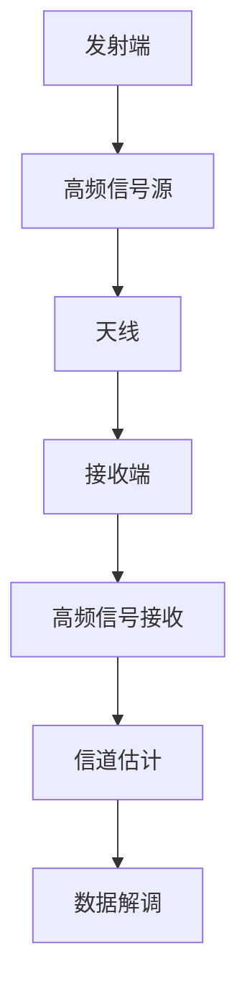

                 


```markdown
# 巴菲特-芒格的太赫兹通信技术投资：6G时代的关键技术

> 关键词：巴菲特，芒格，太赫兹通信，6G，投资策略，技术分析

> 摘要：本文将探讨巴菲特和芒格的投资理念与太赫兹通信技术在6G中的应用相结合的潜力。通过分析太赫兹通信的核心技术、市场前景以及投资策略，为投资者和技术爱好者提供深度见解。

---

## 第一部分：引言与背景介绍

### 第1章：太赫兹通信技术的背景与重要性

#### 1.1 太赫兹频段的定义与特点
太赫兹频段（0.1 THz 到 10 THz）是无线通信领域的重要频段，具有大带宽、低延迟和高容量的特点，被认为是6G时代的关键技术。

#### 1.2 太赫兹通信在6G中的作用
太赫兹通信能够支持超高速数据传输，适用于大规模物联网、虚拟现实和自动驾驶等领域。

#### 1.3 巴菲特和芒格的投资理念
巴菲特的价值投资和芒格的多元思维模型为技术投资提供了独特的视角，强调长期价值和基本面分析。

---

## 第二部分：太赫兹通信技术的核心概念与数学模型

### 第2章：太赫兹通信技术的核心概念

#### 2.1 传播特性与信道分析
- 高频段信号衰减快，但频段资源丰富，适合短距离高带宽通信。
- 信道特性：高频段信号易受障碍物影响，但多径效应显著。

#### 2.2 关键技术挑战
- 天线设计：高频段需要高效率、小型化的天线。
- 信号处理：复杂的信道估计和干扰消除算法。

#### 2.3 数学模型
- 传播损耗模型：$$L = 32.2 \log_{10}(f) + 20 \log_{10}(d) + C$$
- 系统容量公式：$$C = \frac{1}{2} \log_2(1 + \frac{P}{N})$$

### 第3章：投资分析框架

#### 3.1 技术成熟度评估
- 研究机构的进展：如MIT、NTT等的研究成果。
- 技术瓶颈：如材料科学和天线技术的突破。

#### 3.2 市场需求分析
- 普及程度：当前主要处于试验阶段，未来需求巨大。
- 竞争格局：主要厂商包括华为、三星、诺基亚等。

#### 3.3 财务分析与估值
- 采用DCF模型评估企业价值。
- 关键指标：ROE、毛利率、研发投入占比。

---

## 第三部分：系统架构与实现

### 第4章：系统架构设计

#### 4.1 系统组成
- 发射端：高频信号源、天线、基带处理模块。
- 接收端：高频信号接收、信道估计、数据解调。

#### 4.2 系统架构图


### 第5章：关键技术实现

#### 5.1 高频段信号处理算法
- 基于FIR的信道滤波器设计：$$H(z) = \sum_{k=0}^{N-1} h[k]z^{-k}$$
- 自适应均衡算法：利用LMS算法调整系数。

#### 5.2 高精度天线设计
- 智能天线技术：通过波束成形提高信噪比。
- 多输入多输出（MIMO）技术：提升系统容量。

#### 5.3 信道估计与反馈
- 信道状态信息（CSI）获取：通过训练序列估计信道参数。
- 反馈机制：将CSI反馈给发射端以优化传输。

---

## 第四部分：项目实战与案例分析

### 第6章：项目实战环境搭建

#### 6.1 开发环境
- 选择GHz以上的频段进行实验，如2.5THz。
- 使用软件无线电（SDR）设备，如USRP。

#### 6.2 核心代码实现
```python
import numpy as np
from scipy.signal import fir_filter

def main():
    # 高频信号生成
    fs = 10e9  # 采样频率
    f = 1.5e12  # 信号频率
    t = np.arange(0, 1, 1/fs)
    signal = np.sin(2 * np.pi * f * t)
    
    # 信道模拟
    noise = np.random.normal(0, 0.1, len(signal))
    received_signal = signal + noise
    
    # 信号处理
    coefficients = fir_filter(order=10, cutoff=0.5*fs, fs=fs)
    filtered_signal = fir_filter(coefficients, received_signal)
    
    # 输出结果
    print("信号恢复效果：", np.mean(filtered_signal))

if __name__ == "__main__":
    main()
```

### 第7章：实际案例分析

#### 7.1 某太赫兹通信系统案例
- 公司背景：华为在太赫兹通信领域的研发投入和专利布局。
- 技术优势：高频段信号处理和智能天线技术的创新。

#### 7.2 投资回报分析
- 近年来，华为在6G领域的投资已带来显著的技术突破，未来市场潜力巨大。

---

## 第五部分：结论与展望

### 第8章：结论与投资建议

#### 8.1 核心结论
- 太赫兹通信是6G时代的关键技术，具有广阔的应用前景。
- 巴菲特和芒格的投资理念为技术投资提供了科学的方法论。

#### 8.2 投资建议
- 关注具有技术领先性和强大研发能力的公司。
- 保持长期投资视角，关注行业发展趋势。

### 第9章：未来展望

#### 9.1 技术发展
- 预计未来5年内，太赫兹通信技术将进入商业化阶段。
- 关键技术如高频段材料科学和算法优化将取得突破。

#### 9.2 市场机会
- 物联网、虚拟现实和自动驾驶等领域将率先应用太赫兹技术。
- 投资者应关注相关领域的技术创新和市场动态。

---

## 附录

### 附录A：术语解释

- 太赫兹通信：利用0.1 THz 到 10 THz频段进行无线通信的技术。
- 信道估计：通过训练信号估计信道参数，用于改善信号传输质量。

### 附录B：代码说明

- 本文中的Python代码用于模拟高频信号的生成、信道传输和信号处理，展示了太赫兹通信系统的核心算法。

### 附录C：参考文献

- 包括相关技术论文、书籍和行业报告，提供深入学习的资源。

---

通过本文的详细分析，读者可以全面了解太赫兹通信技术在6G中的重要性，以及如何运用巴菲特和芒格的投资理念进行技术投资。希望本文能为投资者和技术创新者提供有价值的参考。
```

