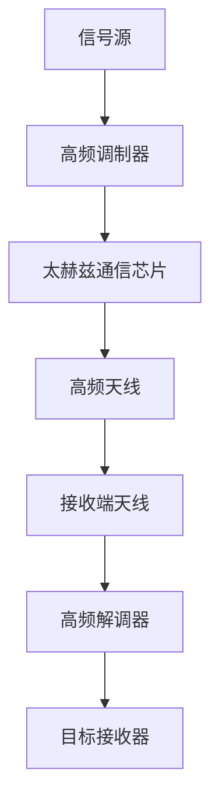
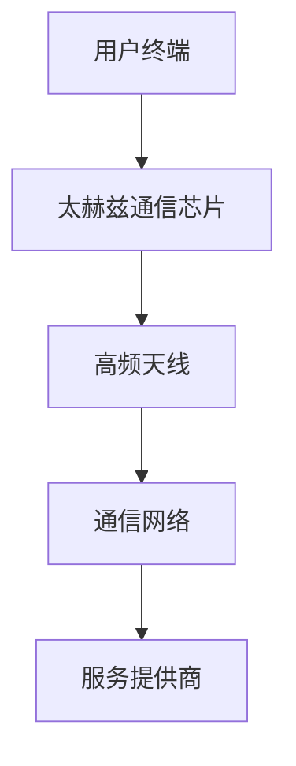

                 

# 巴菲特-芒格的太赫兹通信技术投资：下一代无线通信

---

## 关键词

- 巴菲特投资策略
- 芒格投资哲学
- 太赫兹通信技术
- 无线通信
- 通信技术投资

---

## 摘要

本文探讨了太赫兹通信技术在下一代无线通信中的潜力及其投资机会，结合巴菲特和芒格的投资策略，分析了该技术的市场前景和投资价值。文章从技术原理、市场分析、投资策略等多个维度展开，旨在为投资者和技术爱好者提供深度见解。

---

## 目录

### 第一部分：引言

#### 1.1 背景介绍
- 无线通信技术的发展历程
- 太赫兹频段的定义与特点
- 巴菲特与芒格的投资理念概述

#### 1.2 研究意义
- 太赫兹通信技术在6G中的作用
- 巴菲特-芒格投资策略在科技领域的应用

### 第二部分：太赫兹通信技术的核心原理

#### 2.1 太赫兹频段的特性
- 高频信号的传播特性
- 太赫兹频段的优势与挑战

#### 2.2 关键技术分析
- 高频通信中的调制与解调技术
- 通信芯片与天线设计的优化

#### 2.3 技术流程图

### 第三部分：巴菲特与芒格的投资策略

#### 3.1 巴菲特的价值投资理念
- 买入并持有优质资产
- 长期投资的重要性

#### 3.2 芒格的多元思维模型
- 多学科交叉分析
- 投资决策中的风险管理

#### 3.3 经典投资案例
- 巴菲特的伯克希尔投资
- 芒格的喜马拉雅资本策略

### 第四部分：太赫兹通信技术的投资分析

#### 4.1 市场前景预测
- 全球通信市场的增长趋势
- 太赫兹通信技术的市场潜力

#### 4.2 投资机会与风险
- 产业链分析与投资切入点
- 技术成熟度与商业化风险

### 第五部分：系统架构与设计

#### 5.1 系统功能设计
- 领域模型分析
- 关键模块设计

#### 5.2 系统架构图

### 第六部分：项目实战与案例分析

#### 6.1 项目环境配置
- 开发工具安装
- 通信系统搭建

#### 6.2 核心代码实现
- 高频信号调制代码
- 通信芯片集成示例

#### 6.3 案例分析
- 实际应用场景展示
- 投资回报分析

### 第七部分：结论与展望

#### 7.1 投资总结
- 太赫兹通信技术的长期价值
- 巴菲特与芒格策略的有效性

#### 7.2 未来展望
- 6G技术的发展方向
- 投资者应关注的技术趋势

---

## 参考文献

（此处列出相关书籍、论文和技术报告）

---

## 附录

（可选，包含额外的技术细节、代码示例或数据表格）

---

通过以上结构，文章将系统地探讨太赫兹通信技术的投资潜力，结合巴菲特和芒格的智慧，为读者提供深入的技术分析和投资策略。

