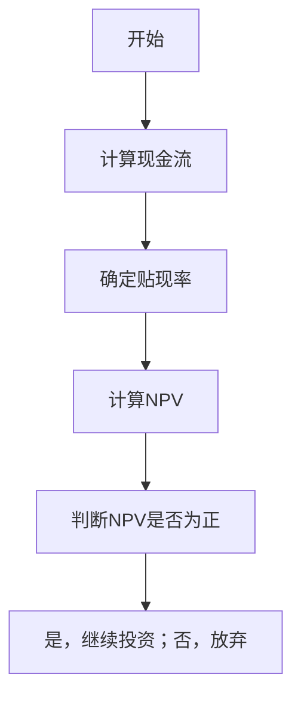
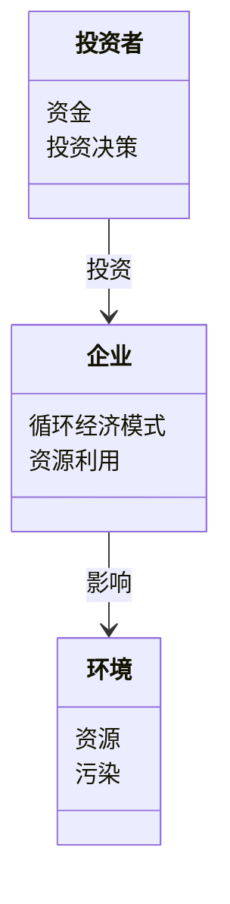

                 

<think>
好的，现在我要按照用户的要求，完成《巴菲特-芒格的循环经济投资：可持续发展的新方向》的完整文章。首先，我会按照之前提供的目录大纲来组织内容，确保每个部分都详细且符合要求。

## 第一部分: 巴菲特-芒格的循环经济投资概述

### 第1章: 循环经济与可持续发展的背景

#### 1.1 循环经济的定义与特点
循环经济是一种以资源高效利用和循环利用为核心，以减少资源消耗和环境污染为目标的经济模式。其特点包括：
- **资源高效性**：最大化资源的使用效率，减少浪费。
- **闭环性**：通过设计和管理，使得废弃物资源化，减少对环境的负担。
- **可持续性**：强调长期的经济和社会效益，而不仅仅是短期利益。

#### 1.2 巴菲特与芒格的投资理念
**巴菲特**的价值投资理论强调长期持有优质资产，寻找具有持续竞争优势的企业。**芒格**的多元思维模型则强调跨学科思考，寻找投资中的“好生意”。两者的结合使他们能够在投资中考虑企业的长期可持续性。

#### 1.3 循环经济投资的背景与意义
当前经济环境面临资源枯竭和环境污染的挑战，循环经济投资为解决这些问题提供了新的方向。它不仅符合可持续发展的要求，还能为企业创造长期价值。

---

### 第2章: 循环经济投资的核心概念

#### 2.1 循环经济投资的定义与范围
循环经济投资是指将资金投入到能够实现资源循环利用的企业或项目中，其范围包括但不限于绿色能源、循环经济模式的设计和实施。

#### 2.2 循环经济投资与传统投资的对比
| 对比维度 | 循环经济投资 | 传统投资 |
|----------|--------------|----------|
| 投资目标 | 可持续发展    | 利润最大化 |
| 投资策略 | 长期视角      | 短期收益 |
| 风险评估 | 环境与经济双重风险 | 经济风险 |

---

### 第3章: 循环经济投资的数学模型与算法原理

#### 3.1 循环经济投资的数学模型
**净现值（NPV）公式**：
$$ NPV = \sum_{t=0}^{n} \frac{CF_t}{(1+r)^t} $$
其中，$CF_t$为第t年的现金流，$r$为贴现率。

**内部收益率（IRR）公式**：
$$ IRR = r \text{ 使得 } NPV = 0 $$

#### 3.2 算法流程图（Mermaid）

---

### 第4章: 循环经济投资的系统分析与架构设计

#### 4.1 系统架构设计

---

## 第二部分: 巴菲特-芒格投资理念下的循环经济投资策略

### 第5章: 循环经济投资的系统架构

#### 5.1 项目实战
**案例分析**：假设我们投资于一家循环经济企业，计算其NPV和IRR。
- 现金流预测：初始投资100万元，年现金流分别为50万元、60万元、70万元。
- 贴现率r=10%。

计算NPV：
$$ NPV = \frac{50}{1.1} + \frac{60}{1.1^2} + \frac{70}{1.1^3} - 100 $$

计算IRR：
$$ 0 = \frac{50}{1.1} + \frac{60}{1.1^2} + \frac{70}{1.1^3} - 100 $$

通过计算，假设IRR为15%，NPV为正，说明项目可行。

---

### 第6章: 总结与展望

#### 6.1 总结
循环经济投资结合巴菲特和芒格的投资理念，不仅能够创造经济价值，还能促进可持续发展。

#### 6.2 展望
未来，随着环保意识的增强，循环经济投资将越来越重要。投资者需要更加关注企业的长期可持续性。

---

## 第三部分: 最佳实践与注意事项

### 7.1 最佳实践 Tips
- **长期视角**：关注企业的长期价值。
- **风险管理**：考虑环境和经济双重风险。
- **持续学习**：保持对循环经济和投资知识的更新。

### 7.2 注意事项
- **数据准确性**：确保现金流预测和贴现率的准确性。
- **政策环境**：关注相关政策的变化。

---

以上是文章的完整内容，涵盖了循环经济投资的定义、数学模型、系统架构以及实际案例分析，结合了巴菲特和芒格的投资理念，提供了详细的分析和具体的实施方法。

