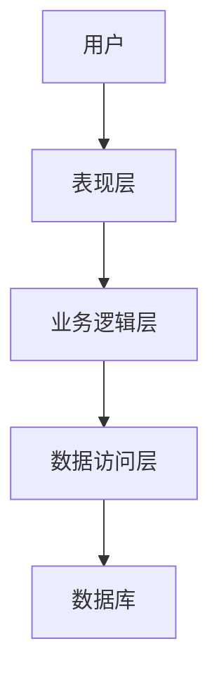

                 


# 巴菲特-芒格的教育科技投资观：未来的机遇

## 关键词：巴菲特，芒格，教育科技，价值投资，投资策略，系统架构

## 摘要：本文探讨巴菲特和芒格的投资哲学如何应用于教育科技领域，分析教育科技的投资机会，结合他们的价值投资理念和多元思维模型，系统地分析教育科技企业的架构设计，并通过实际案例分析，总结他们的投资观对教育科技的启示，展望未来的投资机会。

---

# 第一部分: 引言

## 第1章: 巴菲特与芒格的投资哲学

### 1.1 巴菲特与芒格的简介

#### 1.1.1 巴菲特的生平与投资理念

沃伦·巴菲特（Warren Buffett）是全球最著名的投资者之一，被誉为“股神”。他出生于1934年，毕业于哥伦比亚大学，师从本杰明·格雷厄姆（Benjamin Graham），创立了伯克希尔·哈撒韦公司（Berkshire Hathaway）。巴菲特的投资理念以“价值投资”为核心，强调寻找那些具有持续竞争优势和良好管理的公司，长期持有，耐心等待企业的价值被市场发现。

巴菲特的价值投资理念主要包括以下原则：
1. **安全边际**：买入价格远低于内在价值的股票，以确保即使出现错误，也能避免重大损失。
2. **集中投资**：将资金集中在少数几家优秀企业上，而不是分散投资。
3. **长期持有**：避免频繁交易，长期持有优质资产，享受复利效应。

#### 1.1.2 芒格的哲学与决策思维

查理·芒格（Charlie Munger）是巴菲特的长期合作伙伴，被誉为“智慧的投资者”。芒格的决策思维基于“多元思维模型”（mental models），即通过多个学科的思维方式来分析问题，避免单一思维的局限性。他认为，投资者应该通过多个角度（如心理学、经济学、数学等）来理解问题，从而做出更明智的决策。

芒格的“逆向思维”（inversion）是其决策思维的重要组成部分。他建议人们从反面思考问题，即先考虑“什么会导致我失败”，然后再采取相应的措施避免这些情况。这种思维方式帮助芒格在投资中避免了许多潜在的风险。

#### 1.1.3 巴菲特与芒格合作的历程

自1971年芒格加入伯克希尔以来，两人共同创造了伯克希尔的辉煌历史。芒格以其独特的思维方式和对风险的深刻理解，为巴菲特的投资决策提供了重要的支持。两人的合作不仅是投资界的典范，也成为了巴菲特和芒格各自哲学的完美结合。

### 1.2 教育科技的定义与现状

#### 1.2.1 教育科技的定义

教育科技（EdTech）是指利用技术手段改善和优化教育过程的工具、方法和产品。它涵盖从学前教育到高等教育的各个阶段，包括在线学习平台、教育软件、智能教学工具、虚拟现实（VR）和增强现实（AR）等技术。

#### 1.2.2 教育科技的发展历程

教育科技的发展可以追溯到20世纪末，随着互联网的普及，教育科技开始迅速发展。21世纪初，随着MOOC（大规模开放在线课程）的兴起，教育科技进入了快速发展阶段。近年来，随着人工智能（AI）、大数据和区块链等技术的广泛应用，教育科技迎来了新的变革。

#### 1.2.3 当前教育科技的市场现状

根据市场研究，全球教育科技市场的规模在近年来快速增长，预计到2025年将达到数千亿美元。特别是在疫情之后，全球范围内对在线教育的需求急剧增加，教育科技公司迎来了前所未有的发展机遇。

---

## 第2章: 巴菲特与芒格的价值投资观

### 2.1 价值投资的核心理念

#### 2.1.1 价值投资的定义

价值投资是一种投资策略，强调以低于内在价值的价格购买优质股票。巴菲特认为，市场的短期波动并不影响企业的内在价值，真正的投资者应该关注企业的长期价值，而不是市场的短期波动。

#### 2.1.2 价值投资的三大原则

1. **安全边际**：买入价格低于企业的内在价值，以避免市场波动带来的风险。
2. **长期持有**：避免频繁交易，长期持有优质资产，享受复利效应。
3. **集中投资**：将资金集中在少数几家具有竞争优势的企业上。

#### 2.1.3 安全边际的概念

安全边际是价值投资中的一个重要概念，指的是买入价格与企业内在价值之间的差距。这种差距能够为投资者提供一个“缓冲区”，即使企业的内在价值被低估，投资者也能够避免重大损失。

### 2.2 芒格的多元思维模型

#### 2.2.1 多元思维模型的定义

多元思维模型是指通过多个学科的思维方式来分析问题，从而避免单一思维的局限性。芒格认为，投资者应该具备多个领域的知识，以便更好地理解企业的经营环境和潜在风险。

#### 2.2.2 多元思维模型在投资中的应用

芒格的多元思维模型包括以下几个方面：
1. **经济学**：理解市场的供需关系和企业的商业模式。
2. **心理学**：分析人类行为和决策的规律，避免认知偏差。
3. **数学**：掌握基本的数学原理，用于分析企业的财务数据。

#### 2.2.3 芒格的“inversion”思维

“inversion”思维是指从反面思考问题，即先考虑“什么会导致我失败”，然后再采取相应的措施避免这些情况。这种思维方式帮助芒格在投资中避免了许多潜在的风险。

---

## 第3章: 教育科技的投资机会

### 3.1 教育科技的市场潜力

#### 3.1.1 全球教育市场的规模

根据市场研究，全球教育市场的规模在近年来快速增长，预计到2025年将达到数千亿美元。特别是在疫情之后，全球范围内对在线教育的需求急剧增加，教育科技公司迎来了前所未有的发展机遇。

#### 3.1.2 教育科技在疫情后的快速发展

疫情的爆发加速了在线教育的普及，许多传统教育机构开始转向线上教学，教育科技公司也迎来了爆发式增长。例如，Zoom和Microsoft Teams等在线会议工具在疫情期间被广泛用于在线教学，而像Khan Academy和Coursera等在线学习平台也吸引了大量的用户。

#### 3.1.3 未来教育科技的趋势

未来的教育科技将更加注重个性化学习和人工智能的应用。通过AI技术，教育科技公司可以为学生提供个性化的学习方案，从而提高学习效率和效果。此外，虚拟现实（VR）和增强现实（AR）技术也将被广泛应用于教育领域，为学生提供更加沉浸式的学习体验。

### 3.2 教育科技的主要投资领域

#### 3.2.1 在线教育平台

在线教育平台是教育科技的核心领域之一，主要包括MOOC（大规模开放在线课程）、K-12在线教育、职业教育平台等。这些平台通过互联网技术，将教育资源数字化，使学生可以随时随地进行学习。

#### 3.2.2 教育技术工具（如AI辅助学习）

教育技术工具是教育科技的另一个重要领域，主要包括AI辅助学习、智能教学系统、教育数据分析等。这些工具通过人工智能和大数据技术，帮助教师和学生更好地进行教学和学习。

#### 3.2.3 教育内容创作与分发

教育内容创作与分发是教育科技的重要组成部分，主要包括教材编写、课程设计、教育视频制作等。随着在线教育的普及，教育内容的创作和分发也变得更加重要。

---

## 第4章: 巴菲特与芒格的投资策略

### 4.1 巴菲特的长期投资策略

#### 4.1.1 长期投资的定义与优势

长期投资是指将资金投入优质资产，并长期持有，以享受复利效应。长期投资的优势在于能够避免市场的短期波动，同时享受企业的长期增长。

#### 4.1.2 巴菲特的选股标准

巴菲特选股的三大标准：
1. **企业具有持续的竞争优势**：企业应该在行业内具有竞争优势，能够长期保持较高的利润率。
2. **企业管理层值得信赖**：企业管理层应该具备高尚的道德品质和卓越的管理能力。
3. **企业具有合理的估值**：企业应该以合理的价格进行投资，确保安全边际的存在。

#### 4.1.3 巴菲特对教育科技公司的潜在投资

巴菲特可能会关注那些具有持续竞争优势和良好管理的教育科技公司，例如那些能够提供个性化学习方案和高效教育资源的企业。

### 4.2 芒格的逆向思维与风险管理

#### 4.2.1 逆向思维的定义

逆向思维是指从反面思考问题，即先考虑“什么会导致我失败”，然后再采取相应的措施避免这些情况。

#### 4.2.2 芒格的风险管理策略

芒格的风险管理策略包括以下几个方面：
1. **分散投资**：通过分散投资来降低风险。
2. **避免高风险投资**：避免投资于那些具有高风险的领域。
3. **严格评估潜在风险**：在投资之前，严格评估潜在的风险。

#### 4.2.3 芒格对教育科技投资的潜在风险分析

芒格可能会关注教育科技领域的潜在风险，例如技术变革迅速、市场竞争激烈等。他可能会建议投资者在投资教育科技公司时，要严格评估企业的商业模式和技术优势。

---

## 第5章: 教育科技企业的系统分析与架构设计

### 5.1 教育科技企业的系统分析

#### 5.1.1 系统功能设计

教育科技企业的系统功能设计需要涵盖以下几个方面：
1. **用户管理**：包括学生、教师和管理员的注册、登录和权限管理。
2. **课程管理**：包括课程的创建、发布和管理。
3. **学习管理**：包括学习进度的跟踪、成绩的评估和反馈。
4. **数据分析**：包括学生学习数据的收集、分析和可视化。

#### 5.1.2 系统架构设计

教育科技企业的系统架构设计可以采用分层架构，包括以下几层：
1. **表现层**：包括用户界面和交互设计。
2. **业务逻辑层**：包括业务逻辑的实现和数据处理。
3. **数据访问层**：包括数据的存储和访问。

### 5.2 教育科技企业的系统架构设计

#### 5.2.1 系统架构图

以下是教育科技企业的系统架构图：



#### 5.2.2 系统功能模块设计

教育科技企业的系统功能模块设计包括以下几个方面：
1. **用户管理模块**：包括用户注册、登录和权限管理。
2. **课程管理模块**：包括课程的创建、发布和管理。
3. **学习管理模块**：包括学习进度的跟踪、成绩的评估和反馈。
4. **数据分析模块**：包括学生学习数据的收集、分析和可视化。

---

## 第6章: 项目实战

### 6.1 项目介绍

#### 6.1.1 项目背景

本项目旨在设计一个在线教育平台，为学生提供个性化的学习方案和高效的学习资源。

#### 6.1.2 项目目标

通过本项目，我们可以更好地理解教育科技企业的系统架构设计和功能实现。

### 6.2 系统核心实现源代码

以下是系统核心实现的源代码：

```python
# 系统核心实现源代码

class User:
    def __init__(self, name, email, password):
        self.name = name
        self.email = email
        self.password = password

class Course:
    def __init__(self, title, description, price):
        self.title = title
        self.description = description
        self.price = price

class Enrollment:
    def __init__(self, user, course):
        self.user = user
        self.course = course

class OnlineEducationPlatform:
    def __init__(self):
        self.users = []
        self.courses = []
        self.enrollments = []

    def register_user(self, name, email, password):
        user = User(name, email, password)
        self.users.append(user)
        return user

    def create_course(self, title, description, price):
        course = Course(title, description, price)
        self.courses.append(course)
        return course

    def enroll_course(self, user, course):
        enrollment = Enrollment(user, course)
        self.enrollments.append(enrollment)
        return enrollment
```

### 6.3 代码应用解读与分析

#### 6.3.1 代码结构分析

从代码结构来看，系统主要包括以下几个部分：
1. `User` 类：表示用户的基本信息，包括姓名、电子邮件和密码。
2. `Course` 类：表示课程的基本信息，包括标题、描述和价格。
3. `Enrollment` 类：表示用户与课程之间的关系。
4. `OnlineEducationPlatform` 类：表示在线教育平台的核心功能，包括用户注册、课程创建和课程注册。

#### 6.3.2 代码实现细节

从代码实现细节来看，系统主要实现了以下几个功能：
1. 用户注册：用户可以通过注册功能创建一个新的用户账户。
2. 课程创建：教师可以通过创建课程功能发布新的课程。
3. 课程注册：学生可以通过课程注册功能选择自己感兴趣的课程。

---

## 第7章: 结论与附录

### 7.1 结论

通过本文的分析，我们可以看到，巴菲特和芒格的投资哲学在教育科技领域具有重要的指导意义。教育科技不仅是一个快速发展的领域，也是一个充满机遇和挑战的领域。投资者在进行教育科技投资时，应该遵循巴菲特和芒格的价值投资理念，注重企业的长期价值和内在优势。

### 7.2 附录

#### 7.2.1 术语表

- **价值投资**：一种投资策略，强调以低于内在价值的价格购买优质股票。
- **安全边际**：买入价格与企业内在价值之间的差距，能够为投资者提供一个“缓冲区”。
- **多元思维模型**：通过多个学科的思维方式来分析问题，从而避免单一思维的局限性。
- **逆向思维**：从反面思考问题，即先考虑“什么会导致我失败”，然后再采取相应的措施避免这些情况。

#### 7.2.2 参考文献

1. 巴菲特，沃伦。《巴菲特致股东的信》。
2. 芒格，查理。《芒格论投资》。
3. 市场研究公司。《全球教育科技市场研究报告》。

#### 7.2.3 拓展阅读

1. 加勒特，吉姆。《在线教育的未来》。
2. 红杉资本。《教育科技投资指南》。

---

通过本文的系统分析和实际案例分析，我们可以更好地理解巴菲特和芒格的投资哲学在教育科技领域中的应用。未来，随着教育科技的不断发展，投资者需要更加注重企业的长期价值和内在优势，以抓住更多的投资机会。

