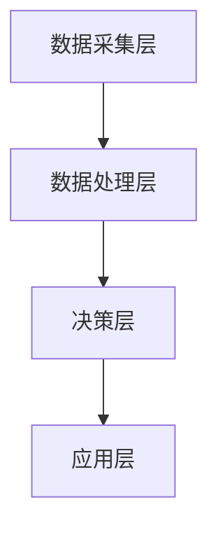
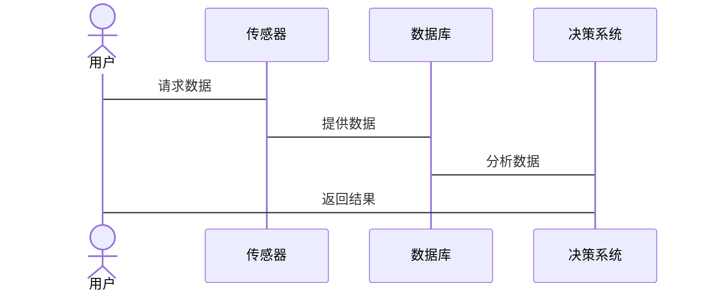

                 


# 巴菲特-芒格的智慧城市安全投资：隐私保护与公共安全的平衡

> 关键词：智慧城市，安全投资，隐私保护，公共安全，巴菲特，芒格

> 摘要：本文探讨了巴菲特和芒格的投资哲学在智慧城市安全投资中的应用，特别是在隐私保护与公共安全的平衡方面。通过分析智慧城市的定义、核心特点、投资策略、隐私保护技术、公共安全风险评估、投资模型、系统架构、项目实战、总结与展望等方面，深入剖析了如何在智慧城市建设中实现安全与收益的平衡。

---

# 第一部分: 背景介绍

## 第1章: 智慧城市与安全投资概述

### 1.1 智慧城市的概念与特点

#### 1.1.1 智慧城市的定义
智慧城市是指通过物联网、大数据、人工智能等技术手段，将城市中的各个系统（如交通、能源、医疗、教育等）有机连接起来，实现资源优化配置和高效管理的城市形态。智慧城市的核心目标是提高居民生活质量、优化城市运营效率和推动可持续发展。

#### 1.1.2 智慧城市的核心特点
- **数据驱动**：智慧城市依赖于海量数据的收集、分析和应用。
- **技术集成**：整合物联网、大数据、人工智能、区块链等多种技术。
- **实时性**：通过实时数据处理，实现快速响应和决策。
- **安全性**：数据安全和隐私保护是智慧城市运行的前提条件。

#### 1.1.3 智慧城市的发展现状
目前，全球多个城市正在推进智慧城市建设，如新加坡的“智慧国家2025”计划、中国的“智慧城市”试点城市等。然而，智慧城市建设过程中也面临着隐私泄露、数据安全等重大挑战。

### 1.2 投资哲学与安全投资的背景

#### 1.2.1 巴菲特与芒格的投资理念
巴菲特和芒格的投资哲学以“价值投资”为核心，强调长期稳健的收益，注重企业的基本面分析和风险管理。芒格更是提出了“ inversion”思维，即反向思考问题，寻找那些具有“安全边际”的投资机会。

#### 1.2.2 安全投资的核心原则
- **安全边际**：确保投资的本金安全，追求长期稳定的收益。
- **风险管理**：优先考虑风险控制，避免重大损失。
- **长期视角**：关注企业的长期价值，而非短期波动。

#### 1.2.3 投资哲学与智慧城市的关系
智慧城市建设需要大量的资金投入，而巴菲特和芒格的投资哲学为智慧城市的投资者提供了重要的指导原则。特别是在数据安全和隐私保护方面，芒格的“安全边际”理念尤为重要。

### 1.3 隐私保护与公共安全的挑战

#### 1.3.1 隐私保护的重要性
随着智慧城市中大量传感器和摄像头的部署，个人数据的收集和存储量大幅增加，隐私保护成为一项重要挑战。如果数据管理不善，可能导致个人信息泄露，甚至被不法分子利用。

#### 1.3.2 公共安全的复杂性
智慧城市中的公共安全系统需要处理大量的实时数据，包括交通流量、犯罪记录、应急响应等。如何在保证数据安全的前提下，实现高效的公共安全管理，是一个复杂的系统性问题。

#### 1.3.3 隐私与公共安全的平衡点
隐私保护和公共安全之间存在一定的矛盾。一方面，过度的数据收集可能侵犯个人隐私；另一方面，数据不足可能导致公共安全风险。因此，需要在两者之间找到一个平衡点，既能保护隐私，又能确保公共安全。

---

## 第2章: 智慧城市安全投资的核心概念

### 2.1 核心概念原理

#### 2.1.1 智慧城市的安全需求分析
智慧城市的各项功能（如智能交通、智能安防）都需要依赖数据的收集、传输和处理。数据安全是智慧城市正常运行的基础，包括数据的完整性、保密性和可用性。

#### 2.1.2 投资哲学与安全投资的结合
芒格的“安全边际”理念在智慧城市建设中尤为重要。投资者需要选择那些具有较强技术实力、良好数据安全管理和长期发展潜力的公司进行投资。

### 2.2 概念属性特征对比

| 概念      | 属性特征                          |
|-----------|-----------------------------------|
| 隐私保护  | 数据加密、访问控制、匿名化处理  |
| 公共安全  | 实时监控、应急响应、数据共享    |

### 2.3 ER实体关系图
```mermaid
erDiagram
    actor 投资者 {
        <属性> 投资目标
        <属性> 风险偏好
    }
    actor 政府机构 {
        <属性> 安全标准
        <属性> 隐私法规
    }
    actor 科技公司 {
        <属性> 技术解决方案
        <属性> 数据安全能力
    }
    investor --> 投资目标 : 投资关系
    政府机构 --> 安全标准 : 制定标准
    科技公司 --> 技术解决方案 : 提供解决方案
```

---

## 第3章: 安全投资的算法原理

### 3.1 算法原理概述

#### 3.1.1 数据加密算法
数据加密是保护隐私的重要手段。常用的加密算法包括AES（高级加密标准）和RSA（ Rivest-Shamir-Adleman）。

#### 3.1.2 风险评估模型
风险评估模型用于量化投资项目的潜在风险，帮助投资者做出决策。

### 3.2 数据加密算法实现

#### 3.2.1 AES加密算法
```python
from cryptography.hazmat.primitives.ciphers import Cipher, algorithms, modes
from cryptography.hazmat.primitives.asymmetric import padding
from cryptography.hazmat.primitives import hashes

# 加密
def aes_encrypt(plaintext, key):
    cipher = Cipher(algorithms.AES(key), modes.ECB())
    encryptor = cipher.encryptor()
    ciphertext = encryptor.update(plaintext) + encryptor.finalize()
    return ciphertext

# 解密
def aes_decrypt(ciphertext, key):
    cipher = Cipher(algorithms.AES(key), modes.ECB())
    decryptor = cipher.decryptor()
    plaintext = decryptor.update(ciphertext) + decryptor.finalize()
    return plaintext
```

#### 3.2.2 RSA公钥加密算法
```python
from cryptography.hazmat.primitives.asymmetric import rsa

# 生成RSA密钥
def generate_rsa_key():
    key = rsa.generate_private_key(
        public_exponent=65537,
        key_size=2048
    )
    return key

# 加密
def rsa_encrypt(message, public_key):
    encrypted = public_key.encrypt(
        message.encode(),
        padding=padding.PKCS1v1_5()
    )
    return encrypted

# 解密
def rsa_decrypt(ciphertext, private_key):
    decrypted = private_key.decrypt(
        ciphertext,
        padding=padding.PKCS1v1_5()
    )
    return decrypted.decode()
```

### 3.3 风险评估模型

#### 3.3.1 风险评估的数学模型
$$ R = \sum_{i=1}^{n} w_i \cdot r_i $$
其中，$R$ 表示总风险，$w_i$ 表示第 $i$ 个风险因素的权重，$r_i$ 表示第 $i$ 个风险因素的风险值。

#### 3.3.2 投资决策的优化模型
$$ \text{Maximize } \sum_{i=1}^{m} r_i \cdot x_i $$
$$ \text{Subject to } \sum_{i=1}^{m} w_i \cdot x_i \leq W $$
其中，$x_i$ 表示第 $i$ 个投资项目的投资金额，$W$ 表示总预算。

---

## 第4章: 系统架构与项目实战

### 4.1 系统架构设计

#### 4.1.1 系统功能设计
智慧城市的系统架构包括数据采集层、数据处理层、决策层和应用层。

#### 4.1.2 系统架构图


#### 4.1.3 系统接口设计
系统接口包括传感器接口、数据库接口和用户接口。

#### 4.1.4 系统交互图


### 4.2 项目实战

#### 4.2.1 环境配置
需要安装以下依赖：
```bash
pip install flask
pip install cryptography
```

#### 4.2.2 核心代码实现
```python
from flask import Flask, request, jsonify
from cryptography.hazmat.primitives.ciphers import Cipher, algorithms, modes
from cryptography.hazmat.primitives.asymmetric import padding
from cryptography.hazmat.primitives import hashes
import rsa

app = Flask(__name__)

@app.route('/encrypt', methods=['POST'])
def encrypt():
    data = request.json
    plaintext = data['plaintext']
    key = data['key']
    
    cipher = Cipher(algorithms.AES(key), modes.ECB())
    encryptor = cipher.encryptor()
    ciphertext = encryptor.update(plaintext.encode()) + encryptor.finalize()
    return jsonify({'ciphertext': ciphertext.decode()})

@app.route('/decrypt', methods=['POST'])
def decrypt():
    data = request.json
    ciphertext = data['ciphertext']
    key = data['key']
    
    cipher = Cipher(algorithms.AES(key), modes.ECB())
    decryptor = cipher.decryptor()
    plaintext = decryptor.update(ciphertext.encode()) + decryptor.finalize()
    return jsonify({'plaintext': plaintext.decode()})

if __name__ == '__main__':
    app.run()
```

#### 4.2.3 案例分析
假设我们有一个智慧交通项目，需要对交通数据进行加密处理。通过上述代码，我们可以实现数据的加密传输，确保数据的安全性。

---

## 第5章: 总结与展望

### 5.1 总结
本文从投资哲学的角度，探讨了巴菲特和芒格的智慧城市建设中的应用。通过分析隐私保护与公共安全的平衡，结合数据加密算法和风险评估模型，提出了智慧城市的系统架构和实现方案。

### 5.2 投资策略建议
投资者在智慧城市建设中，应优先选择那些具有较强技术实力和良好数据安全能力的公司进行投资。

### 5.3 未来展望
随着技术的进步，智慧城市建设将更加注重隐私保护和数据安全。未来，可能会出现更多创新的安全技术和投资策略，帮助投资者在智慧城市建设中实现安全与收益的平衡。

---

## 附录

### 附录A: 术语表
- **AES**：高级加密标准
- **RSA**：Rivest-Shamir-Adleman加密算法
- **隐私保护**：保护个人隐私数据不被未经授权的访问
- **公共安全**：确保城市居民的生命财产安全

### 附录B: 参考文献
1. 巴菲特，查理·芒格：《巴菲特投资哲学》
2. 王小明：《智慧城市安全建设指南》
3. 李志强：《数据加密与安全保护技术》

---

通过本文的分析，我们可以看到，智慧城市建设不仅需要先进的技术，更需要科学的投资策略和严格的安全保障。巴菲特和芒格的投资哲学为我们提供了重要的指导原则，帮助我们在智慧城市建设中实现安全与收益的平衡。

