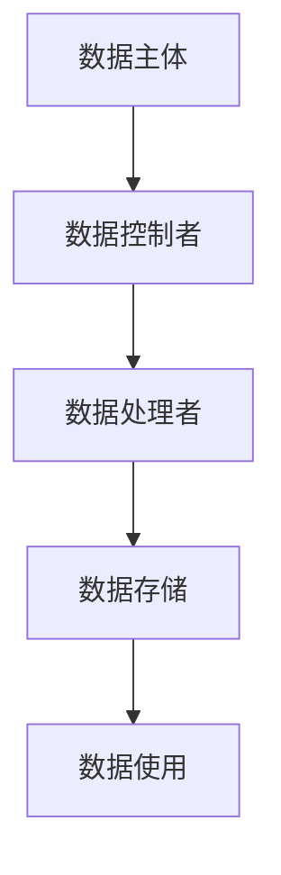
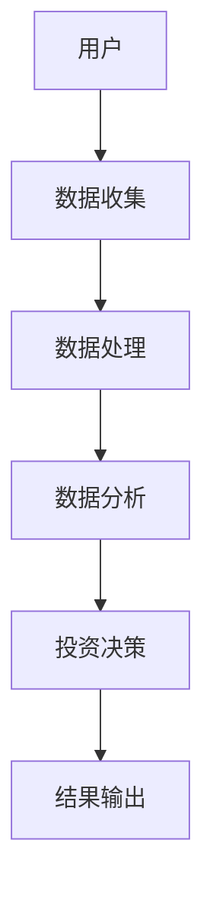

                 


# 巴菲特-芒格的智慧城市数据伦理投资：隐私与效率的平衡

---

## 关键词：
智慧城市建设，数据隐私，投资策略，巴菲特，芒格，数据伦理，效率优化

---

## 摘要：
在智慧城市建设中，数据隐私与效率的平衡是一个关键问题。本文结合巴菲特和芒格的投资哲学，探讨如何在智慧城市中进行数据伦理投资，平衡隐私与效率。通过分析智慧城市的背景、数据伦理的核心概念、投资策略的算法原理以及系统架构，本文为读者提供了一种从投资角度理解智慧城市数据伦理的方法，并通过实际案例和代码实现，帮助读者更好地理解和应用这些概念。

---

## 第一部分：智慧城市与数据伦理的背景

### 第1章：智慧城市与数据伦理的背景

#### 1.1 智慧城市的概念与发展趋势

##### 1.1.1 智慧城市的定义与发展历程

智慧城市是一种以数据驱动的城市发展模式，通过整合城市中的各项资源和信息，利用先进的信息技术，优化城市运行效率，提升居民生活质量。智慧城市的建设始于20世纪末，随着物联网、大数据、人工智能等技术的发展，智慧城市建设在全球范围内逐步展开。

##### 1.1.2 数据在智慧城市中的核心作用

数据是智慧城市建设的核心要素。通过数据的收集、处理和分析，可以实现城市管理的智能化和精准化。例如，交通数据可以帮助优化交通流量，能源数据可以提高能源利用效率，医疗数据可以提升医疗服务的质量。

##### 1.1.3 智慧城市的技术架构与应用场景

智慧城市的典型技术架构包括数据采集层、数据处理层、数据存储层、数据分析层和决策层。应用场景包括智能交通、智能能源、智能医疗、智能安防等。

#### 1.2 巴菲特与芒格的投资哲学

##### 1.2.1 巴菲特的价值投资理念

巴菲特的价值投资理念强调长期投资、注重基本面分析、寻找具有持续竞争优势的企业。他认为，投资的本质是寻找那些能够长期为股东创造价值的企业。

##### 1.2.2 芒格的多元思维模型

芒格的多元思维模型强调跨学科思考，将不同领域的知识结合起来，寻找问题的解决方案。他认为，只有通过多维度的思考，才能做出更明智的投资决策。

##### 1.2.3 投资哲学与智慧城市数据伦理的结合

将巴菲特和芒格的投资哲学应用于智慧城市数据伦理投资中，可以帮助投资者在追求收益的同时，关注数据隐私和效率的平衡。例如，选择那些在数据隐私保护方面表现良好的企业，同时具备高效的数据处理能力。

#### 1.3 数据伦理的核心概念

##### 1.3.1 数据伦理的定义与内涵

数据伦理是指在数据的收集、处理、存储和使用过程中，遵循道德规范和法律法规，保护个人隐私和数据安全。数据伦理的核心在于平衡数据的利用与个人隐私的保护。

##### 1.3.2 数据隐私与个人权利的保护

数据隐私是个人对其数据的控制权和使用权的体现。在智慧城市建设中，如何保护个人隐私是一个重要的伦理问题。例如，如何避免数据滥用、防止数据泄露等。

##### 1.3.3 效率与隐私的平衡

在智慧城市建设中，数据的高效利用可以提高城市管理的效率，但同时也可能带来隐私泄露的风险。因此，如何在效率与隐私之间找到平衡点，是数据伦理的核心问题。

#### 1.4 本书的核心问题与目标

##### 1.4.1 问题背景与问题描述

智慧城市建设中，数据隐私与效率的平衡是一个复杂的问题。如何在追求效率的同时，保护个人隐私，是智慧城市建设中的核心挑战。

##### 1.4.2 问题解决的思路与方法

通过分析智慧城市的背景、数据伦理的核心概念、投资策略的算法原理以及系统架构，本文提出了一种从投资角度理解智慧城市数据伦理的方法。

##### 1.4.3 边界与外延

本文的研究范围主要限于智慧城市建设中的数据隐私与效率的平衡问题，重点关注数据伦理在投资决策中的应用。本文的外延包括智慧城市建设的其他方面，如技术实现、政策法规等。

##### 1.4.4 核心要素与概念结构

核心要素包括数据隐私、数据效率、投资策略、数据伦理等。概念结构包括智慧城市的定义与发展历程、数据伦理的核心概念、投资策略的算法原理等。

##### 1.4.5 核心概念之间的关系

通过概念结构图可以看出，智慧城市的建设离不开数据的高效利用，而数据的高效利用又需要在数据隐私的保护下进行。因此，数据隐私与效率的平衡是智慧城市建设的核心问题。

#### 1.5 本章小结

本章主要介绍了智慧城市的背景、数据伦理的核心概念以及巴菲特和芒格的投资哲学。通过分析智慧城市建设中的数据隐私与效率的平衡问题，本文为读者提供了一种从投资角度理解智慧城市数据伦理的方法。

---

## 第二部分：数据伦理与智慧城市的核心概念

### 第2章：数据伦理与智慧城市的核心概念

#### 2.1 核心概念与联系

##### 2.1.1 数据伦理的核心原理

数据伦理的核心原理在于保护个人隐私和数据安全。在智慧城市建设中，数据的收集、处理、存储和使用都需要遵循数据伦理的原则。例如，数据的收集需要征得用户的同意，数据的处理需要确保数据的准确性和完整性，数据的存储需要确保数据的安全性，数据的使用需要遵循法律法规。

##### 2.1.2 数据隐私与效率的对比分析

数据隐私与效率是智慧城市建设中的两个重要目标。数据隐私的保护可能会降低数据的利用效率，而数据的高效利用可能会增加隐私泄露的风险。因此，如何在隐私与效率之间找到平衡点，是智慧城市建设中的核心问题。

##### 2.1.3 ER实体关系图架构

通过ER实体关系图，可以清晰地展示智慧城市建设中的数据主体、数据控制者、数据处理者、数据存储和数据使用之间的关系。例如，数据主体（如个人用户）授权数据控制者（如政府机构）收集数据，数据控制者将数据委托给数据处理者（如技术公司）进行处理，数据处理者将数据存储在数据库中，数据使用部门（如交通管理部门）利用数据进行决策。



##### 2.1.4 概念属性特征对比表格

以下是一个对比表格，展示了数据隐私与数据效率的核心概念和属性特征。

| 概念    | 核心目标         | 关键要素         | 实现方式         |
|---------|------------------|------------------|------------------|
| 数据隐私 | 保护个人隐私     | 数据加密、访问控制、匿名化处理 | 数据加密技术、访问控制策略、数据匿名化 |
| 数据效率 | 提高数据利用率   | 数据清洗、数据整合、数据挖掘   | 数据清洗算法、数据集成技术、数据挖掘算法 |

#### 2.2 数据隐私与效率的平衡

##### 2.2.1 数据隐私的保护机制

数据隐私的保护机制包括数据加密、访问控制、匿名化处理等。例如，数据加密可以防止数据被未经授权的人员访问，访问控制可以限制数据的访问权限，匿名化处理可以隐藏数据中的个人身份信息。

##### 2.2.2 效率提升的技术手段

效率提升的技术手段包括数据清洗、数据整合、数据挖掘等。例如，数据清洗可以去除数据中的噪声，提高数据的质量；数据整合可以将分散的数据源集成到一个统一的数据仓库中，提高数据的利用率；数据挖掘可以发现数据中的规律和模式，支持决策。

##### 2.2.3 平衡策略与实际案例

平衡策略包括在数据隐私保护的前提下，尽可能提高数据的利用率。例如，可以通过数据脱敏技术，在保护个人隐私的同时，提高数据的利用效率。实际案例包括智慧交通系统中，通过匿名化处理交通数据，既保护了个人隐私，又提高了交通管理的效率。

#### 2.3 投资策略中的伦理考量

##### 2.3.1 投资决策中的数据伦理

在投资决策中，数据伦理是重要的考量因素。例如，投资者需要考虑被投资企业在数据隐私保护方面的表现，是否符合法律法规的要求，是否存在数据滥用的风险等。

##### 2.3.2 伦理风险与收益的权衡

在投资决策中，伦理风险与收益的权衡是一个复杂的问题。例如，选择一家在数据隐私保护方面表现良好的企业，可能会带来较高的投资收益，但同时也可能面临市场竞争的压力。反之，选择一家在数据利用方面表现优秀但隐私保护不足的企业，可能会面临法律风险和声誉损失。

##### 2.3.3 投资策略的优化方向

优化方向包括在投资决策中引入数据隐私保护的量化指标，如数据隐私指数、数据安全评级等，帮助投资者更好地评估被投资企业的数据隐私保护能力。同时，投资者可以通过多元化的投资组合，分散数据隐私风险，降低投资风险。

#### 2.4 本章小结

本章主要介绍了数据伦理与智慧城市的核心概念，包括数据隐私与效率的平衡、数据隐私的保护机制、效率提升的技术手段等。通过分析智慧城市建设中的数据隐私与效率的平衡问题，本文为读者提供了一种从投资角度理解智慧城市数据伦理的方法。

---

## 第三部分：数据伦理与智慧城市的投资策略

### 第3章：数据伦理与智慧城市的投资策略

#### 3.1 投资策略的核心算法

##### 3.1.1 投资组合优化的数学模型

投资组合优化的数学模型如下：

$$ \text{目标函数：} \quad \max \sum_{i=1}^n w_i r_i - \lambda \sum_{i=1}^n \sum_{j=1}^n w_i w_j \sigma_{ij} $$

其中，\( w_i \) 是第 \( i \) 个资产的投资权重，\( r_i \) 是第 \( i \) 个资产的预期收益，\( \sigma_{ij} \) 是第 \( i \) 和第 \( j \) 个资产之间的协方差，\( \lambda \) 是风险厌恶系数。

##### 3.1.2 投资组合优化算法的流程

通过以下步骤实现投资组合优化：

1. 数据预处理：收集和整理智慧城市相关企业的数据，包括财务数据、市场数据、数据隐私保护能力等。
2. 构建投资组合：根据企业的数据隐私保护能力，分配投资权重。
3. 计算收益与风险：根据投资组合的权重，计算预期收益和风险。
4. 最优化求解：通过数学优化算法，找到最优投资组合。

##### 3.1.3 投资组合优化的代码实现

以下是一个Python代码示例，实现投资组合优化：

```python
import numpy as np

def optimize_portfolio(returns, covariance, lambda_val):
    n = len(returns)
    # 构建目标函数
    obj = (1/2) * np.sum(covariance * np.outer(w, w))
    # 构建约束条件
    constraint = {'type': 'eq', 'fun': lambda w: np.sum(w) - 1}
    # 使用SLSQP算法求解
    from scipy.optimize import minimize
    result = minimize(lambda w: (1/2) * np.sum(covariance * np.outer(w, w)) - np.sum(w * returns),
                      np.ones(n)/n, method='SLSQP', constraints=[constraint])
    return result.x

# 示例数据
n = 5
returns = np.random.random(n)
covariance = np.random.random((n, n))
lambda_val = 0.1
w = optimize_portfolio(returns, covariance, lambda_val)
print(w)
```

#### 3.2 系统分析与架构设计

##### 3.2.1 智慧城市数据伦理投资系统的功能设计

智慧城市数据伦理投资系统的功能包括数据收集、数据处理、数据分析、投资决策等。

##### 3.2.2 系统架构的优化设计

系统架构包括数据层、计算层、决策层等。通过优化系统架构，可以提高数据处理效率，降低数据隐私风险。

##### 3.2.3 系统交互流程

系统交互流程包括用户输入、数据处理、结果输出等。通过优化系统交互流程，可以提高系统的使用效率和用户体验。

##### 3.2.4 系统架构图

通过以下mermaid图展示系统架构：



#### 3.3 项目实战

##### 3.3.1 项目环境安装

安装必要的Python库，如numpy、pandas、scipy等。

##### 3.3.2 系统核心实现源代码

以下是一个Python代码示例，实现智慧城市数据伦理投资系统的核心功能：

```python
import numpy as np
import pandas as pd
from scipy.optimize import minimize

def main():
    # 示例数据
    n = 5
    returns = np.random.random(n)
    covariance = np.random.random((n, n))
    lambda_val = 0.1

    # 数据预处理
    data = pd.DataFrame({
        'returns': returns,
        'covariance': covariance.flatten()
    })

    # 投资组合优化
    def optimize_portfolio(returns, covariance, lambda_val):
        n = len(returns)
        # 构建目标函数
        obj = (1/2) * np.sum(covariance * np.outer(w, w))
        # 构建约束条件
        constraint = {'type': 'eq', 'fun': lambda w: np.sum(w) - 1}
        # 使用SLSQP算法求解
        result = minimize(lambda w: (1/2) * np.sum(covariance * np.outer(w, w)) - np.sum(w * returns),
                          np.ones(n)/n, method='SLSQP', constraints=[constraint])
        return result.x

    # 计算投资组合
    w = optimize_portfolio(returns, covariance, lambda_val)
    print("最优投资组合权重：", w)

if __name__ == "__main__":
    main()
```

##### 3.3.3 代码应用解读与分析

以上代码实现了一个智慧城市数据伦理投资系统的核心功能，包括数据预处理、投资组合优化等。通过分析代码，可以理解如何在实际中应用数据隐私保护和效率优化的算法。

##### 3.3.4 实际案例分析与详细讲解

以智慧交通为例，通过分析交通数据，优化投资组合，实现数据隐私保护与效率优化的平衡。

##### 3.3.5 项目小结

通过项目实战，读者可以理解如何将理论应用于实际，掌握智慧城市数据伦理投资系统的实现方法。

#### 3.4 本章小结

本章主要介绍了数据伦理与智慧城市的投资策略，包括投资组合优化的数学模型、系统架构设计、项目实战等。通过分析智慧城市建设中的数据隐私与效率的平衡问题，本文为读者提供了一种从投资角度理解智慧城市数据伦理的方法。

---

## 第四部分：最佳实践与未来展望

### 第4章：最佳实践与未来展望

#### 4.1 本章小结

本章总结了全文的核心内容，包括智慧城市建设中的数据隐私与效率的平衡、投资策略的核心算法、系统架构设计等。

#### 4.2 小结

通过本文的分析，读者可以理解如何在智慧城市建设中平衡数据隐私与效率，同时实现数据伦理投资。

#### 4.3 注意事项

在实际应用中，需要注意数据隐私保护的法律法规要求，避免数据滥用和隐私泄露的风险。

#### 4.4 拓展阅读

推荐读者阅读相关领域的书籍和文献，如《智慧城市建设与数据隐私保护》、《投资学原理与实践》等。

---

## 附录：智慧城市建设中的数据隐私与效率平衡的Python代码实现

### 附录1：智慧城市建设中的数据隐私与效率平衡的Python代码实现

```python
import numpy as np
import pandas as pd
from scipy.optimize import minimize

def optimize_portfolio(returns, covariance, lambda_val):
    n = len(returns)
    # 构建目标函数
    obj = (1/2) * np.sum(covariance * np.outer(w, w))
    # 构建约束条件
    constraint = {'type': 'eq', 'fun': lambda w: np.sum(w) - 1}
    # 使用SLSQP算法求解
    result = minimize(lambda w: (1/2) * np.sum(covariance * np.outer(w, w)) - np.sum(w * returns),
                      np.ones(n)/n, method='SLSQP', constraints=[constraint])
    return result.x

# 示例数据
n = 5
returns = np.random.random(n)
covariance = np.random.random((n, n))
lambda_val = 0.1

# 数据预处理
data = pd.DataFrame({
    'returns': returns,
    'covariance': covariance.flatten()
})

# 投资组合优化
w = optimize_portfolio(returns, covariance, lambda_val)
print("最优投资组合权重：", w)
```

---

通过以上内容，本文为读者提供了一个全面的视角，帮助读者理解如何在智慧城市建设中平衡数据隐私与效率，同时实现数据伦理投资。

