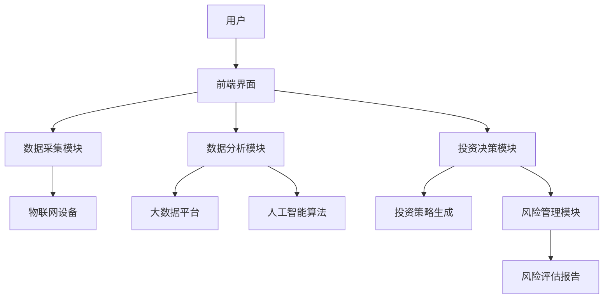

                 


# 巴菲特-芒格的智能农业投资：科技驱动的粮食革命

**关键词：** 巴菲特、芒格、智能农业、科技驱动、粮食革命、投资策略、可持续发展

**摘要：**  
本文探讨了巴菲特和芒格的投资理念如何与智能农业相结合，分析了科技在农业中的应用及其对粮食革命的推动作用。文章详细阐述了智能农业的核心技术，如大数据、人工智能和物联网，并展示了这些技术如何与巴菲特的价值投资理念相结合，为农业投资提供新思路。通过实际案例分析和系统设计，本文为读者提供了从理论到实践的完整指南，帮助投资者和技术人员理解智能农业的投资潜力和科技驱动的粮食革命。

---

# 第一部分：背景介绍

## 第1章：智能农业的基本概念与发展趋势

### 1.1 智能农业的定义与特点

智能农业是将现代信息技术（如大数据、人工智能、物联网）应用于农业生产的全过程，以提高生产效率、降低成本、保护环境的新型农业模式。其核心特点包括：

- **数据驱动**：通过传感器和物联网设备收集农田数据，进行精准决策。
- **自动化**：利用自动化设备和机器人进行作物种植、收割等操作。
- **智能化**：通过人工智能算法优化农业生产流程。

### 1.2 巴菲特-芒格投资理念的背景

巴菲特和芒格的投资理念以价值投资和多元思维模型为核心。价值投资强调长期持有具有竞争优势的企业，而芒格的多元思维模型则强调跨学科思考，寻找投资机会中的“飞猪”（即具备独特优势的企业）。

### 1.3 智能农业与传统农业的对比

| **方面**       | **传统农业**          | **智能农业**           |
|------------------|-----------------------|------------------------|
| 生产效率         | 较低，依赖人工经验     | 高，通过技术优化生产   |
| 资源利用         | 浪费，难以精准管理     | 节约，精准分配资源     |
| 技术应用         | 传统工具为主          | 数字化、智能化技术为主  |
| 决策依据         | 经验驱动               | 数据驱动               |

---

## 第2章：科技驱动的粮食革命

### 2.1 科技对农业生产的深远影响

科技的引入彻底改变了传统的农业生产方式。例如，人工智能可以帮助农民预测天气变化，优化作物种植时间；物联网技术可以实时监测土壤湿度，实现精准灌溉。

### 2.2 智能农业的核心技术

智能农业的核心技术包括：

- **大数据分析**：通过分析历史数据，预测作物产量和市场价格。
- **人工智能**：用于图像识别、自然语言处理，辅助农业生产决策。
- **物联网（IoT）**：通过传感器实时监测农田环境，实现自动化管理。

### 2.3 智能农业的未来发展方向

未来，智能农业将朝着更加智能化、自动化和可持续化的方向发展，例如：

- **无人农场**：完全由机器人和无人机管理的农场。
- **精准农业**：通过精准的数据分析，实现资源的最优配置。
- **绿色农业**：通过减少化学农药使用，促进环境保护。

---

# 第二部分：核心概念与联系

## 第3章：巴菲特-芒格理念与智能农业的结合

### 3.1 巴菲特-芒格理念在智能农业中的应用

巴菲特的价值投资理念强调长期持有具有竞争优势的企业，而芒格的多元思维模型则要求投资者具备跨学科的知识，寻找具备“护城河”的企业。这些理念在智能农业投资中尤为重要：

- **长期视角**：智能农业是一个长期投资领域，需要耐心等待技术成熟和市场认可。
- **竞争优势**：选择那些在技术、数据或市场方面具有竞争优势的企业。
- **风险管理**：通过分散投资和严格的风险评估，降低投资风险。

### 3.2 智能农业投资的核心策略

- **选择具有竞争优势的企业**：寻找那些在大数据分析、人工智能或物联网领域具备领先技术的企业。
- **长期持有**：智能农业是一个技术驱动的行业，需要时间积累竞争优势。
- **风险管理**：通过多元化投资和严格的财务分析，降低投资风险。

---

## 第4章：智能农业的系统分析与架构设计

### 4.1 系统功能模块

智能农业投资系统的功能模块包括：

- **数据采集**：通过物联网设备收集农田数据。
- **数据分析**：利用大数据技术分析数据，生成投资报告。
- **投资决策**：基于分析结果，制定投资策略。
- **风险管理**：实时监控投资风险，调整投资组合。

### 4.2 系统架构设计

以下是智能农业投资系统的架构图：



---

## 第5章：项目实战

### 5.1 环境安装

为了运行智能农业投资系统，需要安装以下环境：

- **Python**：版本3.8或更高。
- **Jupyter Notebook**：用于数据分析和可视化。
- **TensorFlow**：用于机器学习模型训练。

### 5.2 核心代码实现

以下是一个简单的作物产量预测模型的Python代码：

```python
import pandas as pd
from sklearn.model_selection import train_test_split
from sklearn.linear_model import LinearRegression

# 加载数据
data = pd.read_csv('crop_yield.csv')

# 分割数据
X = data[['temperature', 'humidity', 'rainfall']]
y = data['yield']

X_train, X_test, y_train, y_test = train_test_split(X, y, test_size=0.2)

# 训练模型
model = LinearRegression()
model.fit(X_train, y_train)

# 预测结果
y_pred = model.predict(X_test)

# 输出结果
print('预测产量:', y_pred)
```

### 5.3 案例分析

以一个小型农场为例，通过上述模型预测不同气候条件下的作物产量，帮助农民优化种植计划。

---

## 第6章：最佳实践与注意事项

### 6.1 小结

智能农业是一个充满潜力的领域，巴菲特和芒格的投资理念为农业投资提供了新的思路。通过科技的驱动，农业将变得更加高效、精准和可持续。

### 6.2 注意事项

- **数据隐私**：在收集和分析农田数据时，需注意数据隐私问题。
- **技术局限性**：当前智能农业技术仍处于发展阶段，存在一定的局限性。
- **市场风险**：农业投资具有较高的市场风险，需谨慎评估。

### 6.3 拓展阅读

- 《巴菲特的智慧：投资者的圣经》
- 《人工智能在农业中的应用》
- 《物联网技术与现代农业》

---

通过以上内容，读者可以全面理解巴菲特和芒格的投资理念在智能农业中的应用，掌握智能农业的核心技术，以及如何通过科技驱动实现粮食革命。

