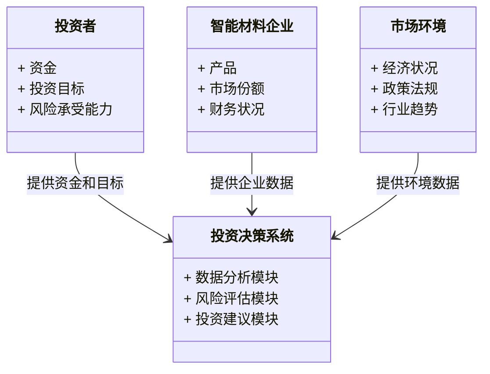
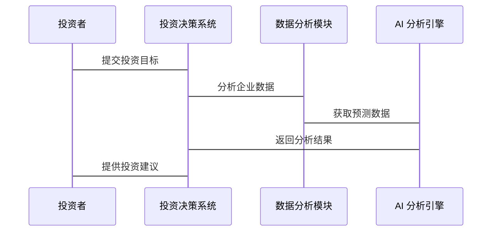

                 


# 巴菲特-芒格的智能材料投资：未来制造业的革命

## 关键词：
- 巴菲特投资理念
- 芒格思维模型
- 智能材料
- 未来制造业
- 数字化转型

## 摘要：
本文深入探讨了巴菲特和芒格的投资哲学与智能材料在制造业中的应用，分析了智能材料的技术发展、市场潜力以及如何通过价值投资策略优化智能材料投资。文章结合实际案例，详细阐述了智能材料对制造业革命的影响，为投资者和制造商提供了实用的见解和策略。

---

## 第一部分: 巴菲特与芒格的投资哲学

### 第1章: 巴菲特与芒格的投资哲学概述

#### 1.1 巴菲特与芒格的投资理念
##### 1.1.1 巴菲特的价值投资原则
- 巴菲特的价值投资核心：寻找市场低估的优秀企业，注重企业的内在价值。
- 投资策略：长期持有，关注企业的ROE（净资产收益率）和现金流。
- 例子：巴菲特对可口可乐和苹果的投资案例。

##### 1.1.2 芒格的多元思维模型
- 芒格强调跨学科思维，将多个领域的知识融会贯通。
- 投资决策：基于概率和风险控制，寻找确定性的投资机会。
- 例子：芒格对伯克希尔 Hathaway的投资策略。

##### 1.1.3 两人投资理念的共同点与差异
- 共同点：长期投资、价值投资、注重企业质量。
- 差异：巴菲特更注重财务指标，芒格更注重概率和系统性思维。

#### 1.2 制造业的现状与未来趋势
##### 1.2.1 当前制造业的挑战
- 传统制造业的低效和高成本问题。
- 环境问题：资源浪费和环境污染。

##### 1.2.2 智能化与数字化的推动
- 工业4.0的概念：智能化生产、数据驱动决策。
- 数字化转型：企业通过数据和AI优化生产流程。

##### 1.2.3 未来制造业的核心方向
- 智能制造：自动化、数据化、智能化。
- 可持续发展：绿色制造、循环经济。

#### 1.3 智能材料的定义与重要性
##### 1.3.1 智能材料的基本概念
- 智能材料：能够感知环境变化并做出响应的材料。
- 类型：形状记忆合金、压电材料、智能高分子等。

##### 1.3.2 智能材料的特性与优势
- 智能响应性：对外界刺激（如温度、压力、电场）产生反应。
- 自适应性：材料性能可根据环境变化自动调整。
- 高效性：提高生产效率，降低成本。

##### 1.3.3 智能材料在制造业中的应用前景
- 智能传感器：用于工业自动化和物联网。
- 智能复合材料：应用于航空航天和汽车制造。
- 智能包装：用于食品和药品的智能监测。

### 第2章: 智能材料的核心技术与应用

#### 2.1 智能材料的分类与技术发展
##### 2.1.1 智能材料的分类
- 按响应类型：形状记忆材料、压电材料、磁性材料。
- 按应用领域：智能纺织、智能建筑、智能医疗。

##### 2.1.2 各类智能材料的技术特点
- 形状记忆合金：可恢复原始形状，用于航空航天。
- 压电材料：将机械能转化为电能，用于传感器和执行器。
- 智能高分子：具有自修复能力，用于包装和电子设备。

##### 2.1.3 技术发展的驱动力
- 科技进步：纳米技术、材料科学的发展。
- 市场需求：制造业对高效、智能材料的需求增加。

#### 2.2 智能材料在制造业中的应用案例
##### 2.2.1 智能材料在汽车制造中的应用
- 智能悬架系统：根据路况自动调整悬架硬度。
- 智能刹车系统：实时监测刹车片磨损，提前预警。

##### 2.2.2 智能材料在航空航天中的应用
- 智能翼材：根据飞行条件调整机翼形状。
- 智能复合材料：减轻重量，提高强度。

##### 2.2.3 智能材料在电子设备中的应用
- 智能显示屏：响应外部触摸，实现交互功能。
- 智能电池：实时监测温度和压力，优化充电效率。

### 第3章: 巴菲特与芒格投资理念的深度分析

#### 3.1 巴菲特的价值投资策略
##### 3.1.1 价值投资的核心要素
- 企业质量：ROE高、现金流稳定。
- 市场估值：寻找低估的企业。
- 长期持有：避免短期波动，获取长期收益。

##### 3.1.2 投资决策的关键指标
- 市盈率（P/E）：评估企业估值。
- 市净率（P/B）：评估企业资产价值。
- 股息率：评估企业收益能力。

##### 3.1.3 长期投资的重要性
- 避免短期波动，捕捉长期趋势。
- 企业成长：投资具有持续增长潜力的企业。

#### 3.2

---

## 第二部分: 智能材料投资策略

### 第4章: 巴菲特与芒格的智能材料投资策略

#### 4.1 巴菲特的智能材料投资策略
##### 4.1.1 投资标的选择
- 选择具有竞争优势的智能材料企业。
- 重点关注企业的ROE和现金流。

##### 4.1.2 投资组合构建
- 分散投资：降低风险。
- 重仓优质企业：集中投资于少数优秀企业。

#### 4.2 芒格的智能材料投资策略
##### 4.2.1 多元思维模型的应用
- 结合宏观经济、行业趋势和技术发展分析投资标的。
- 评估企业的竞争优势和市场地位。

##### 4.2.2 风险管理
- 识别行业风险：如政策风险、技术风险。
- 分散投资：避免过度集中。

#### 4.3 智能材料投资的风险与机会
##### 4.3.1 行业风险
- 技术更新快，企业需要不断创新。
- 市场竞争激烈，企业盈利能力可能下降。

##### 4.3.2 投资机会
- 智能制造：需求增长快。
- 绿色制造：环保政策支持。

### 第5章: 智能材料投资的系统架构设计

#### 5.1 系统功能设计
##### 5.1.1 领域模型（Mermaid 类图）


##### 5.1.2 系统架构设计（Mermaid 架构图）


##### 5.1.3 系统接口设计
- 投资者与系统接口：提交投资目标和资金。
- 系统与企业数据接口：获取企业财务数据。
- 系统与市场环境接口：获取经济指标和政策法规。

#### 5.2 系统交互设计（Mermaid 序列图）


### 第6章: 智能材料投资的实战分析

#### 6.1 环境安装
- 投资分析工具：Excel、Python（pandas、numpy）。
- 数据来源：公司财报、行业报告、市场分析报告。

#### 6.2 核心实现源代码
##### 6.2.1 企业估值模型（Python）
```python
import pandas as pd
import numpy as np

def calculate_roe(revenue, equity):
    return revenue / equity

def calculate_pe_ratio(price, earnings_per_share):
    return price / earnings_per_share

def calculate_intrinsic_value(price, roe, book_value):
    return (price * (1 + roe * 0.05)) / (1 + 0.08)
```

##### 6.2.2 数据可视化（Matplotlib）
```python
import matplotlib.pyplot as plt

# 示例数据
companies = ['Company A', 'Company B', 'Company C']
roe = [0.2, 0.15, 0.18]
pe_ratio = [15, 20, 18]

plt.bar(companies, roe, label='ROE')
plt.plot(companies, pe_ratio, label='PE Ratio')
plt.title('ROE vs PE Ratio Analysis')
plt.legend()
plt.show()
```

#### 6.3 实际案例分析
##### 6.3.1 案例一：智能传感器公司
- 公司背景：专注于智能传感器研发，技术领先。
- 财务数据：ROE=15%，PE=20，股价=50美元。
- 估值分析：ROE高，股价合理，具有投资价值。

##### 6.3.2 案例二：智能复合材料公司
- 公司背景：应用于航空航天，市场前景广阔。
- 财务数据：ROE=12%，PE=25，股价=60美元。
- 估值分析：PE略高，但ROE稳定，具有长期增长潜力。

#### 6.4 项目小结
- 技术分析的重要性：结合技术趋势和企业财务数据。
- 市场分析：关注行业趋势和政策影响。
- 风险管理：分散投资，避免过度集中。

### 第7章: 智能材料投资的未来展望

#### 7.1 制造业的未来趋势
##### 7.1.1 技术融合：AI、大数据与智能材料的结合。
##### 7.1.2 绿色制造：环保政策推动智能材料广泛应用。
##### 7.1.3 数字化转型：企业通过数据优化生产流程。

#### 7.2 智能材料投资的未来机会
##### 7.2.1 新兴行业：新能源汽车、智能医疗。
##### 7.2.2 区域市场：新兴市场的需求增长。
##### 7.2.3 创新驱动：技术创新带来投资机会。

#### 7.3 投资策略建议
##### 7.3.1 长期投资：抓住行业增长趋势。
##### 7.3.2 价值投资：选择具有竞争优势的企业。
##### 7.3.3 风险管理：分散投资，控制风险。

#### 7.4 最佳实践 tips
##### 7.4.1 保持学习：关注行业动态和技术发展。
##### 7.4.2 谨慎决策：基于数据和事实进行投资。
##### 7.4.3 长期视角：避免短期波动，捕捉长期价值。

---

## 第三部分: 结语

### 第8章: 总结与展望

#### 8.1 总结
- 巴菲特和芒格的投资理念为智能材料投资提供了理论基础。
- 智能材料技术的发展为制造业革命提供了动力。
- 投资者需要结合技术和市场趋势，制定科学的投资策略。

#### 8.2 展望
- 智能材料将继续推动制造业智能化。
- 投资者需关注技术创新和市场趋势，抓住投资机会。

---

## 附录

### 附录A: 进一步阅读的资源

#### 1. 巴菲特的股东大会演讲
- 《巴菲特股东大会演讲：价值投资的真谛》

#### 2. 芒格的《穷查理宝典》
- 《The Charlie Munger孖 enslaver》

#### 3. 智能材料技术发展报告
- 《智能材料与未来制造业白皮书》

### 附录B: 工具与平台

#### 1. 投资分析工具
- Morningstar：企业估值分析。
- Yahoo Finance：实时数据和市场分析。

#### 2. 数据分析工具
- Python（Pandas、NumPy）：数据处理和分析。
- Tableau：数据可视化。

---

通过以上结构和内容，文章详细分析了巴菲特和芒格的投资哲学，结合智能材料的技术发展和应用，为投资者和制造商提供了科学的投资策略和实践指导。

