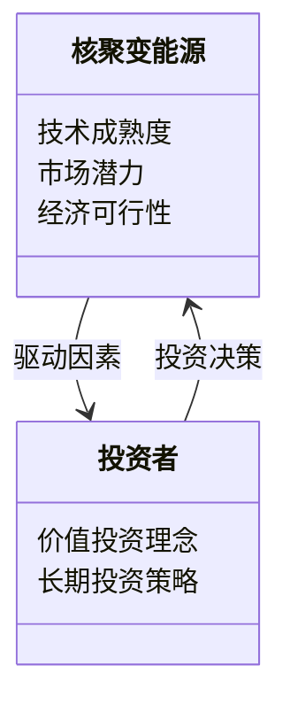
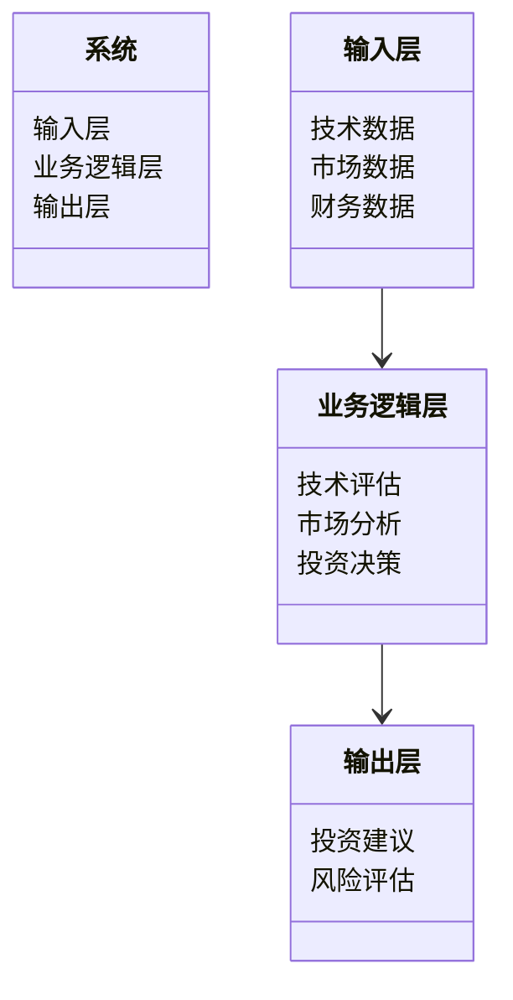
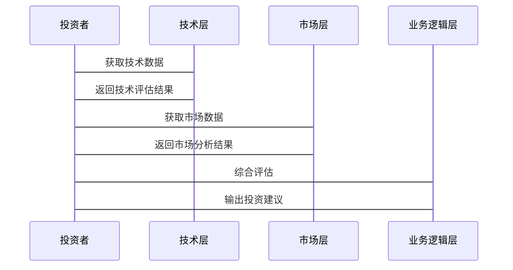

                 

# 巴菲特-芒格的核聚变能源投资：未来能源的终极解决方案

## 关键词：巴菲特, 芒格, 核聚变能源, 投资策略, 可再生能源, 能源转型

## 摘要：  
核聚变能源被视为未来能源的终极解决方案，它具有清洁、安全、资源丰富的特点，能够从根本上解决全球能源危机。本文将探讨巴菲特和芒格的投资理念如何与核聚变能源投资相结合，分析其背后的逻辑、策略和成功案例。通过系统化的分析和实战案例，本文将为投资者提供如何在核聚变能源领域做出明智投资决策的指导。

---

## 第1章：核聚变能源的基本概念与优势

### 1.1 核聚变的基本原理

#### 1.1.1 核聚变的定义与基本反应式  
核聚变是指两个轻核在高温高压条件下结合成一个较重的核，并释放出巨大能量的过程。其基本反应式为：  
$$ 2H → He + $$  
其中，H表示氢的同位素（如氘或氚），He表示氦-3或氦-4，$Q$表示释放的能量。

#### 1.1.2 核聚变与核裂变的区别  
核裂变（如铀-235裂变）需要重元素在中子撞击下分裂，释放大量能量，但存在放射性废料和核扩散风险。核聚变则完全不同：  
1. **安全性**：核聚变反应不会产生长期放射性废料。  
2. **资源丰富性**：氢的同位素在地球上储量丰富，海水中氘的含量尤其丰富。  
3. **可持续性**：核聚变的燃料几乎取之不尽。  

#### 1.1.3 核聚变能源的优势与挑战  
核聚变的优势包括清洁、安全、可持续，但其商业化仍面临技术难题，如高温等离子体控制、材料耐久性等。  

---

### 1.2 核聚变能源的技术现状与未来展望

#### 1.2.1 当前核聚变技术的发展阶段  
目前，核聚变研究主要集中在实验装置（如 ITER）和私营企业的研发项目上。ITER是国际热核聚变实验堆计划，旨在验证核聚变的可行性。  

#### 1.2.2 核聚变能源的商业化潜力  
一旦技术突破，核聚变能源将为全球提供几乎无限的清洁能源。预计到2040年左右，核聚变能源可能实现商业化。  

#### 1.2.3 核聚变能源对全球能源结构的潜在影响  
核聚变能源的普及将改变全球能源格局，减少对化石能源的依赖，缓解气候变化压力。  

---

## 第2章：巴菲特与芒格的投资理念

### 2.1 巴菲特的价值投资理论

#### 2.1.1 价值投资的核心理念  
巴菲特的价值投资强调寻找被市场低估的优质企业，关注企业的长期盈利能力、护城河和管理层素质。  

#### 2.1.2 安全边际的概念与应用  
安全边际是指企业实际价值与市场价格之间的差距，确保投资的安全性。  

#### 2.1.3 长期投资与企业护城河  
巴菲特偏好那些具有强大竞争优势（如品牌、技术、市场地位）的企业。  

### 2.2 芒格的多元思维模型

#### 2.2.1 多元思维模型的定义  
芒格的多元思维模型是指将多个学科的原理交叉应用，以做出更全面的决策。  

#### 2.2.2 芒格思维模型在投资中的应用  
芒格强调对投资对象的深刻理解，包括技术、市场、财务等多个维度。  

#### 2.2.3 芒格决策框架与核聚变能源投资的结合  
芒格的决策框架要求投资者具备跨学科知识，能够评估技术的可行性和市场的潜力。  

---

## 第3章：核聚变能源的投资逻辑

### 3.1 核聚变能源的技术评估

#### 3.1.1 技术成熟度评估  
核聚变技术目前仍处于研发阶段，需评估企业的技术路线和研发进展。  

#### 3.1.2 技术可行性分析  
通过分析企业的技术方案、专利布局和研发团队，评估其技术可行性。  

#### 3.1.3 技术经济性分析  
核聚变能源的成本是否具有竞争力，是否能够实现商业化。  

### 3.2 核聚变能源的市场分析

#### 3.2.1 市场潜力评估  
全球能源需求增长和环保政策推动核聚变能源的市场需求。  

#### 3.2.2 市场竞争格局  
分析现有竞争者和潜在进入者，评估企业的市场定位。  

#### 3.2.3 市场风险分析  
政策风险、技术风险和市场接受度风险。  

### 3.3 核聚变能源的投资策略

#### 3.3.1 价值投资策略  
寻找具有技术优势、良好管理团队和强大市场的核聚变能源企业。  

#### 3.3.2 长期投资策略  
核聚变能源的商业化需要时间，投资者需具备长期持有的耐心。  

#### 3.3.3 风险控制策略  
通过分散投资、严格筛选标的等方式降低投资风险。  

---

## 第4章：核聚变能源投资的系统分析与架构设计

### 4.1 系统分析

#### 4.1.1 领域模型  

#### 4.1.2 系统架构  

### 4.2 系统交互设计

#### 4.2.1 系统交互流程  

---

## 第5章：核聚变能源投资的项目实战

### 5.1 项目背景与目标

#### 5.1.1 项目背景  
选择一家核聚变能源公司（如General Fusion或TAE Technologies）作为研究对象。  

#### 5.1.2 项目目标  
评估该公司的投资价值，提供投资建议。  

### 5.2 技术评估

#### 5.2.1 技术方案分析  
分析公司的技术路线和研发进展。  

#### 5.2.2 技术可行性评估  
评估技术是否可行，是否存在重大风险。  

### 5.3 市场分析

#### 5.3.1 市场需求分析  
分析全球能源市场的需求，评估核聚变能源的市场空间。  

#### 5.3.2 竞争分析  
分析竞争对手的情况，评估公司的市场地位。  

### 5.4 投资评估

#### 5.4.1 财务状况分析  
分析公司的财务报表，评估其财务健康状况。  

#### 5.4.2 估值分析  
使用DCF模型等方法，评估公司的估值。  

---

## 第6章：核聚变能源投资的最佳实践与注意事项

### 6.1 最佳实践

#### 6.1.1 跨学科学习  
投资者需要具备核聚变技术、市场、财务等多方面的知识。  

#### 6.1.2 长期视角  
核聚变能源的投资需要耐心，关注企业的长期价值。  

### 6.2 注意事项

#### 6.2.1 技术风险  
核聚变技术的不确定性可能导致投资失败。  

#### 6.2.2 市场风险  
市场需求不足或政策变化可能影响投资价值。  

#### 6.2.3 财务风险  
企业的财务状况不佳可能导致投资损失。  

---

## 第7章：总结与展望

### 7.1 总结  
核聚变能源具有改变全球能源结构的潜力，巴菲特和芒格的投资理念为投资者提供了重要的指导。  

### 7.2 展望  
未来，随着技术进步和政策支持，核聚变能源的投资将更加具有吸引力。  

### 7.3 对投资者的建议  
投资者应保持长期视角，选择具有强大技术优势和市场潜力的企业，同时注重风险控制。  

---

## 附录：相关资源与进一步阅读

-巴菲特和芒格的经典著作推荐  
-核聚变能源领域的关键文献和报告  
-相关技术博客和投资分析文章  

---

**小结：** 巴菲特和芒格的投资理念为核聚变能源投资提供了独特的视角，结合技术评估和市场分析，投资者可以在这一领域找到潜在的高回报机会。

