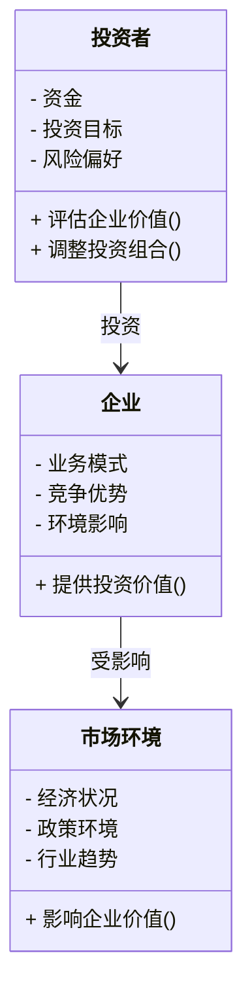

                 


# 巴菲特-芒格的气候变化投资观：风险与机遇并存

> **关键词**：巴菲特、芒格、气候变化投资、风险管理、投资策略、可持续发展、绿色金融  
> 
> **摘要**：本文深入探讨了巴菲特和芒格在气候变化投资领域的独特见解，分析了气候变化带来的投资风险与机遇，结合其投资哲学与策略，提出了在气候变化背景下的投资方法论，包括风险评估、投资组合优化和长期价值投资的策略建议。

---

## 第一部分：巴菲特与芒格的投资理念概述

### 第1章：巴菲特与芒格的投资哲学

#### 1.1 巴菲特的价值投资理念
巴菲特的价值投资理念的核心是寻找具有持续竞争优势、良好治理和稳定现金流的企业，并以合理的价格买入并长期持有。他强调企业内在价值的重要性，认为市场的短期波动不应影响长期投资决策。

#### 1.2 芒格的多元思维模型
芒格倡导“多元思维模型”，即通过多学科的知识框架来理解问题，避免单一视角的局限性。他强调投资者需要从物理学、心理学、经济学等多角度分析问题，以做出更明智的投资决策。

#### 1.3 两人投资理念的异同点
- **相同点**：都强调长期投资、价值投资和企业基本面分析。
- **不同点**：巴菲特更注重企业的财务指标和竞争优势，而芒格更强调系统性思维和多维度分析。

---

### 第2章：气候变化对投资的影响

#### 2.1 气候变化的定义与特征
气候变化是指全球气候系统长期的变化趋势，包括温度上升、极端天气事件增多等。其特征包括不可逆性、全球性和复杂性。

#### 2.2 气候变化对全球经济的影响
气候变化对全球经济的影响包括：  
1. **经济损失**：极端天气事件导致的财产损失和生产中断。  
2. **行业转型**：传统高碳行业面临转型压力，绿色产业迎来发展机遇。  
3. **政策变化**：各国纷纷制定碳中和目标，推动政策支持绿色产业。

#### 2.3 投资视角下的气候变化问题
气候变化不仅是环境问题，更是经济和投资问题。投资者需要关注气候变化对企业估值、行业格局和政策环境的影响。

---

## 第二部分：气候变化的投资风险与机遇

### 第3章：气候变化带来的投资机会

#### 3.1 可再生能源行业的投资潜力
可再生能源（如太阳能、风能）是应对气候变化的核心领域。随着技术进步和成本下降，可再生能源的投资回报率逐渐提高。

#### 3.2 绿色科技的创新与发展
绿色科技包括电动汽车、智能电网、能源存储等领域，这些领域的发展将推动全球向低碳经济转型。

#### 3.3 循环经济与可持续发展
循环经济模式强调资源的高效利用和废弃物的再利用，这为投资提供了新的方向。

---

### 第4章：气候变化带来的投资风险

#### 4.1 传统能源行业的转型压力
传统能源企业（如石油、煤炭行业）面临政策限制和市场需求下降的风险，需要进行转型才能在未来的低碳经济中生存。

#### 4.2 政策不确定性对企业的影响
各国碳中和政策的不确定性可能对企业的经营环境和投资决策产生重大影响。

#### 4.3 环境风险对金融资产的影响
环境风险可能导致企业估值下降、资产减值甚至 bankruptcy，从而对金融市场产生连锁反应。

---

## 第三部分：气候变化背景下的投资策略与风险管理

### 第5章：投资策略与风险管理

#### 5.1 长期投资与价值投资的结合
在气候变化背景下，投资者应关注具有长期竞争优势的企业，尤其是那些在绿色技术、可持续发展等领域具有领先地位的企业。

#### 5.2 风险评估与投资组合优化
通过建立气候风险评估模型，投资者可以识别高风险行业，并通过资产配置优化投资组合，降低整体风险。

---

## 第四部分：系统分析与架构设计

### 第6章：系统架构与投资分析

#### 6.1 领域模型类图（Mermaid）


#### 6.2 系统架构图（Mermaid）
```mermaid
graph TD
    投资者 --> 投资策略: 确定投资目标
    投资者 --> 风险评估: 分析气候风险
    投资者 --> 投资组合优化: 优化资产配置
    投资策略 --> 企业分析: 评估企业价值
    风险评估 --> 市场环境: 监测政策变化
    投资组合优化 --> 资产配置: 调整投资比例
```

---

## 第五部分：项目实战与总结

### 第7章：未来展望与投资趋势

#### 7.1 绿色金融的发展前景
绿色金融将随着碳中和目标的推进而快速发展，包括绿色债券、ESG投资等。

#### 7.2 技术创新对投资的影响
人工智能、大数据等技术将为气候变化投资提供新的工具和方法，帮助投资者更好地评估风险和机会。

---

## 附录

### 附录A：术语表
- **ESG投资**：环境、社会和公司治理因素的投资策略。  
- **碳中和**：通过减少温室气体排放和碳汇等方式，使净碳排放为零。  

### 附录B：数据来源与参考文献
- 数据来源：全球气候变化报告、金融数据分析平台。  
- 参考文献：巴菲特和芒格的公开演讲、学术论文等。

---

通过以上结构，本文系统地分析了巴菲特和芒格在气候变化投资领域的观点，结合技术方法和实际案例，为投资者提供了有价值的参考和启示。

