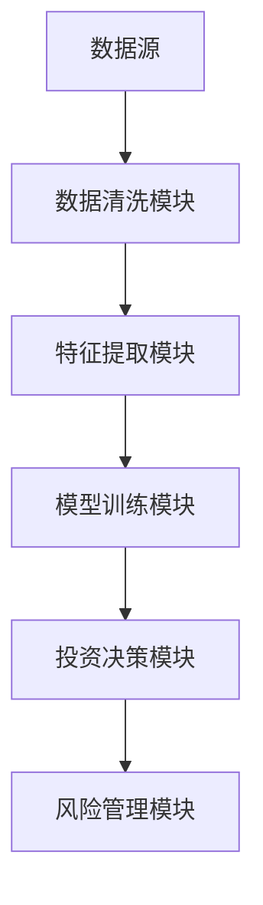

                 


# 巴菲特-芒格的气候适应性投资：应对全球变暖的策略

## 关键词：巴菲特，芒格，气候适应性投资，气候变化，可持续投资，风险管理

## 摘要：  
本文深入探讨巴菲特和芒格的投资理念如何与应对全球变暖的气候适应性投资相结合。通过分析气候变化对全球经济和金融市场的影响，结合长期主义和安全边际的投资原则，本文提出了构建气候适应性投资策略的方法，包括投资框架、数据驱动的决策支持和风险管理策略。文章还通过实际案例和数学模型，展示了如何将这些理念转化为具体的投资实践。

---

# 第一部分：背景介绍与核心概念

## 第1章：气候适应性投资的背景与意义

### 1.1 气候变化的全球性挑战  
气候变化是21世纪最严峻的全球性问题之一。随着温室气体排放的增加，全球气温上升导致极端天气事件频发，对经济、社会和生态系统造成深远影响。投资者需要意识到气候变化不仅是环境问题，更是经济和社会系统性风险的来源。

### 1.2 投资领域的气候风险与机遇  
气候变化对金融市场的冲击体现在多个方面：  
1. **企业风险**：碳排放较高的企业可能面临更高的合规成本和市场风险。  
2. **资产贬值**：气候变化可能导致某些地区的资产（如房地产）贬值。  
3. **投资机会**：绿色能源、可持续技术等领域迎来新的投资机会。  

### 1.3 巴菲特-芒格投资理念的气候视角  
巴菲特和芒格的投资理念以长期主义、安全边际和多元思维模型为核心。在应对气候变化时，这些理念可以转化为气候适应性投资的指导原则。例如，芒格的多元思维模型可以帮助投资者更好地理解气候变化对不同行业的长期影响。

---

# 第二部分：气候适应性投资的核心框架

## 第2章：气候适应性投资的定义与核心要素

### 2.1 气候适应性投资的定义  
气候适应性投资是指通过识别和投资那些在气候变化中具有韧性和可持续性的企业或资产。这种投资策略不仅关注企业的财务表现，还考虑其对环境的适应能力和对社会的积极影响。

### 2.2 核心概念与属性对比  
以下是气候适应性投资与传统投资的关键区别：

| **属性**            | **传统投资**                     | **气候适应性投资**               |
|----------------------|----------------------------------|----------------------------------|
| 投资目标            | 追求财务回报                     | 追求财务回报与环境可持续性         |
| 风险管理            | 侧重市场风险和流动性风险         | 包括气候风险和环境风险             |
| 行业偏好            | 偏好高收益但高碳排放的行业       | 偏好绿色能源、可持续技术等行业     |
| 时间跨度            | 短期至中期回报驱动               | 长期视角，注重企业的长期适应能力   |

### 2.3 气候适应性投资的三要素  
1. **韧性**：企业在气候变化中的生存和恢复能力。  
2. **可持续性**：企业的商业模式和运营对环境的友好程度。  
3. **长期性**：投资需考虑未来几十年的气候变化趋势。

---

# 第三部分：气候适应性投资的策略与实践

## 第3章：数据驱动的气候适应性投资框架

### 3.1 数据收集与清洗  
为了构建气候适应性投资模型，首先需要收集多源数据：  
- **企业层面**：碳排放数据、ESG（环境、社会、治理）评分、财务数据。  
- **行业层面**：行业的碳排放强度、政策法规变化。  
- **宏观层面**：全球气温变化趋势、政策动向。  

### 3.2 数据分析与建模  
使用Python进行数据分析和建模。以下是核心步骤：  

```python
import pandas as pd
import numpy as np

# 加载数据
df = pd.read_csv('climate_data.csv')

# 数据清洗
df.dropna(inplace=True)
df = pd.get_dummies(df)

# 建立回归模型
from sklearn.linear_model import LinearRegression
model = LinearRegression()
model.fit(df[['temperature', 'emissions']], df['return'])
```

### 3.3 气候适应性投资的数学模型  
以下是一个简化的气候适应性投资模型：  

$$ \text{投资收益} = \beta_0 + \beta_1 \times \text{碳排放强度} + \beta_2 \times \text{ESG评分} + \epsilon $$  

其中，$\beta_1$和$\beta_2$是回归系数，表示碳排放强度和ESG评分对投资收益的影响。

---

## 第4章：系统架构与风险管理

### 4.1 系统功能设计  
以下是气候适应性投资系统的功能模块：  



### 4.2 系统架构设计  
以下是系统的总体架构：  


### 4.3 风险管理策略  
1. **情景分析**：模拟不同气候变化情景下的投资表现。  
2. **动态调整**：根据气候变化趋势动态优化投资组合。  
3. **分散投资**：通过多元化投资降低气候相关风险。  

---

## 第5章：项目实战与案例分析

### 5.1 项目环境与数据准备  
假设我们有一个包含企业碳排放数据、财务数据和ESG评分的数据集。使用Python进行数据清洗和特征工程：  

```python
import pandas as pd

# 加载数据
df = pd.read_csv('climate_data.csv')

# 数据清洗
df.dropna(inplace=True)
df = pd.get_dummies(df)

# 特征工程
from sklearn.preprocessing import StandardScaler
scaler = StandardScaler()
df_scaled = scaler.fit_transform(df[['revenue', 'emissions', 'ESG']])
```

### 5.2 模型实现与优化  
构建一个基于机器学习的气候适应性投资模型：  

```python
from sklearn.model_selection import train_test_split
from sklearn.ensemble import RandomForestRegressor

# 数据分割
X_train, X_test, y_train, y_test = train_test_split(df_scaled, df['return'], test_size=0.2)

# 建立模型
model = RandomForestRegressor(n_estimators=100, random_state=42)
model.fit(X_train, y_train)

# 模型评估
print(model.score(X_test, y_test))
```

### 5.3 案例分析  
假设我们投资于一家绿色能源公司。通过模型预测，该公司的碳排放强度较低，ESG评分为85，预计未来三年的年化回报率为15%。这表明它是一个具有气候适应性的投资标的。

---

## 第6章：最佳实践与未来展望

### 6.1 最佳实践 tips  
1. **持续学习**：关注气候变化的最新研究和政策动向。  
2. **数据驱动**：利用大数据和人工智能优化投资决策。  
3. **风险管理**：定期评估投资组合的气候风险敞口。  

### 6.2 未来展望  
随着全球向低碳经济转型，气候适应性投资将变得越来越重要。投资者需要结合技术进步和政策变化，不断优化投资策略，以应对日益严峻的气候变化挑战。

---

## 结语  
气候适应性投资不仅是应对全球变暖的必要策略，也是实现可持续发展的关键路径。通过将巴菲特和芒格的投资理念与现代技术相结合，投资者可以在不确定的环境中找到新的机会，实现长期稳健的投资回报。

