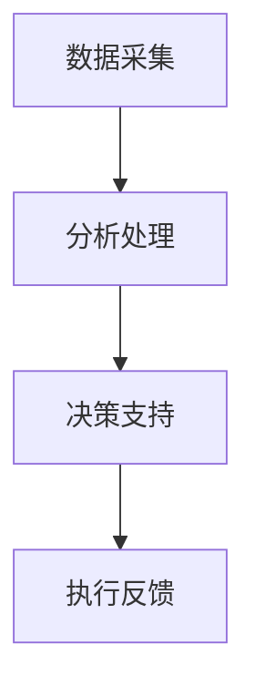
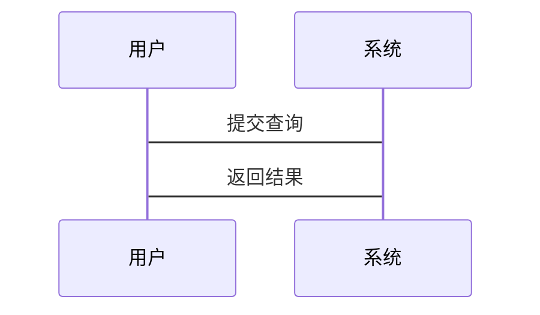

                 

# 巴菲特-芒格的水资源投资：稀缺资源的战略价值

> 关键词：巴菲特，芒格，水资源投资，稀缺资源，战略价值，投资策略，风险管理

> 摘要：本文深入分析了巴菲特和芒格在水资源投资领域的策略，探讨了水资源的稀缺性及其战略价值，结合实际案例和系统分析，提供了全面的投资框架和风险管理策略，为读者提供了实用的见解和指导。

---

## 第一部分：巴菲特与芒格投资理念的背景与基础

### 第1章：水资源的稀缺性与战略价值

#### 1.1 水资源的全球分布与稀缺性

##### 1.1.1 全球水资源分布现状
全球水资源分布极不均匀，中东、非洲和南美洲部分地区水资源极度匮乏，而北美洲和欧洲相对丰富。随着人口增长和工业化，水资源短缺问题日益严重。

##### 1.1.2 水资源稀缺性的驱动因素
气候变化、污染、过度开发和分配不均是导致水资源稀缺的主要原因。这些因素相互作用，加剧了水资源的短缺问题。

##### 1.1.3 水资源对经济和社会的影响
水资源短缺直接影响农业、工业和生活用水，可能导致经济衰退、社会不稳定和环境恶化。水资源是人类生存和经济发展的基础。

#### 1.2 水资源投资的背景与机会

##### 1.2.1 水资源行业的投资现状
水资源行业包括供水、污水处理、节水技术等领域，投资机会广泛。随着技术进步和政策支持，水资源投资逐渐成为热点。

##### 1.2.2 水资源短缺带来的投资机会
水资源短缺推动了节水技术、污水处理和水资源管理行业的快速发展，为投资者提供了丰厚的回报潜力。

##### 1.2.3 水资源行业的未来趋势
未来，水资源行业的技术进步和政策支持将进一步推动投资，特别是在智能水务和循环经济领域。

#### 1.3 巴菲特与芒格的投资哲学

##### 1.3.1 巴菲特的价值投资理念
巴菲特强调长期价值投资，注重企业的基本面和管理层质量，追求安全边际和持续增长。

##### 1.3.2 芒格的多元思维模型
芒格强调跨学科思维，将不同领域的知识整合，以做出更全面的投资决策。

##### 1.3.3 两人投资理念的结合
巴菲特和芒格的理念结合了长期价值和多元思维，注重风险管理和可持续发展。

---

## 第二部分：水资源投资的分析与评估

### 第2章：水资源投资的核心概念与框架

#### 2.1 水资源投资的核心要素

##### 2.1.1 水资源项目的经济性分析
包括项目的盈利能力、投资回收期和净现值等指标。

##### 2.1.2 水资源项目的社会影响
关注项目对社会就业、社区发展和环境的影响。

##### 2.1.3 水资源项目的环境影响
评估项目对水生态、水质和气候变化的影响。

#### 2.2 水资源投资的评估方法

##### 2.2.1 财务指标分析
使用净现值、内部收益率和投资回收期等指标评估项目的财务可行性。

##### 2.2.2 风险评估模型
通过情景分析和蒙特卡洛模拟评估项目的风险。

##### 2.2.3 可持续性评估
采用生命周期评估方法，分析项目的环境和社会影响。

### 第3章：水资源投资的系统分析与架构设计

#### 3.1 系统分析方法

##### 3.1.1 系统分析的基本概念
系统分析是一种通过分解和综合方法，研究系统各部分及其相互关系的方法。

##### 3.1.2 系统分析在水资源投资中的应用
通过系统分析，识别关键因素，优化资源配置，降低风险。

#### 3.2 系统架构设计

##### 3.2.1 水资源投资系统的模块划分
包括数据采集、分析处理、决策支持和执行反馈模块。

##### 3.2.2 系统架构的Mermaid图示

#### 3.3 系统接口与交互设计

##### 3.3.1 系统接口设计
包括数据输入接口、用户界面和外部系统接口。

##### 3.3.2 系统交互的Mermaid序列图

---

## 第三部分：水资源投资的实践与案例

### 第4章：巴菲特与芒格的水资源投资策略

#### 4.1 巴菲特的水资源投资案例

##### 4.1.1 可口可乐公司的投资
巴菲特投资可口可乐，因为其稳定的现金流和强大的品牌，间接控制了水资源的使用。

##### 4.1.2 其他相关案例分析
包括投资水务公司和污水处理厂，注重企业的长期盈利能力。

#### 4.2 芒格的水资源投资策略

##### 4.2.1 伯克希尔哈撒韦的水资源投资
伯克希尔哈撒韦通过控股公司间接投资于水务行业，注重长期价值和风险控制。

##### 4.2.2 芒格的多元思维在水资源投资中的应用
芒格的跨学科思维帮助他识别潜在风险和机会，优化投资组合。

### 第5章：水资源投资中的风险管理

#### 5.1 风险管理的基本概念

##### 5.1.1 风险的定义与分类
包括市场风险、环境风险和政策风险。

##### 5.1.2 风险管理的重要性
有效管理风险可以降低损失，提高投资回报。

#### 5.2 水资源投资中的主要风险

##### 5.2.1 环境风险
气候变化和污染可能影响水资源的可用性。

##### 5.2.2 政策风险
政策变化可能影响项目的合规性和盈利能力。

##### 5.2.3 市场风险
市场需求波动和竞争可能影响项目的收益。

#### 5.3 风险管理的具体方法

##### 5.3.1 风险评估模型
使用情景分析和蒙特卡洛模拟评估风险。

##### 5.3.2 风险应对策略
包括分散投资、购买保险和加强合规管理。

---

## 第四部分：总结与展望

### 第6章：水资源投资的总结与展望

#### 6.1 投资策略总结
巴菲特和芒格的投资策略强调长期价值和风险管理，注重企业的基本面和社会责任。

#### 6.2 未来展望
随着技术进步和政策支持，水资源投资将继续增长，特别是在智能水务和循环经济领域。

---

通过以上分析，我们可以看出，水资源投资具有重要的战略价值，巴菲特和芒格的投资理念为投资者提供了宝贵的指导。未来，随着技术进步和政策支持，水资源投资将继续成为热点，为投资者带来丰厚的回报。

