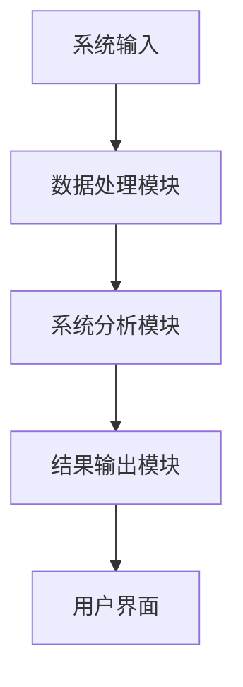
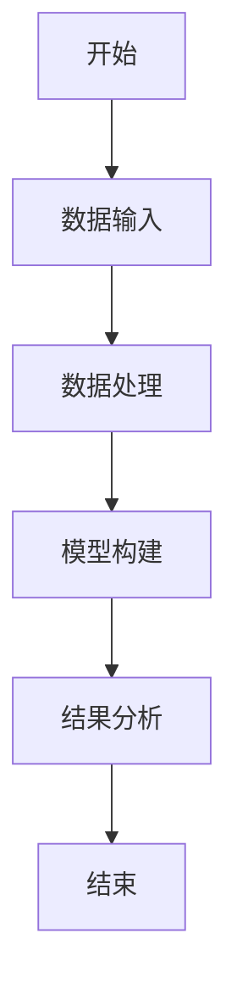

                 


## # 巴菲特-芒格的海洋能源投资：可再生能源的新前沿

### # 关键词：
- 巴菲特
- 芒格
- 海洋能源
- 可再生能源
- 投资策略
- 价值投资
- 多元思维模型

### # 摘要：
本文探讨了巴菲特和芒格的投资理念与海洋能源领域的结合，分析了他们在可再生能源领域的投资策略及其对行业发展的深远影响。通过详细分析海洋能源的定义、分类、现状及投资机会，结合巴菲特和芒格的投资哲学，构建了一个基于价值投资的海洋能源投资模型，并通过具体案例分析了其可行性与应用前景。文章最后总结了巴菲特和芒格的投资理念对海洋能源投资的启示，并展望了未来的发展方向。

---

## # 第一部分: 巴菲特-芒格投资理念与海洋能源的结合

### ## 第1章: 巴菲特与芒格投资理念概述

#### ### 1.1 巴菲特投资理念的核心要素
- **1.1.1 巴菲特的价值投资理论**
  - 价值投资的核心定义
  - 投资的本质：寻找具有持续竞争优势的企业
  - 安全边际的概念
- **1.1.2 芒格的多元思维模型**
  - 多元思维模型的定义
  - 芒格的“格栅”理论
  - 多元思维模型在投资决策中的应用
- **1.1.3 巴菲特与芒格投资理念的异同**
  - 巴菲特的价值投资与芒格的多元思维模型的结合
  - 两者的共同点与差异点

#### ### 1.2 巴菲特与芒格的长期投资策略
- **1.2.1 长期价值投资的定义**
  - 长期投资的核心理念
  - 长期投资与短期投资的对比
- **1.2.2 巴菲特与芒格的投资组合构建**
  - 投资组合的核心要素
  - 投资组合的分散化原则
- **1.2.3 巴菲特与芒格的风险管理策略**
  - 风险管理的核心原则
  - 如何通过安全边际控制风险

### ## 第2章: 海洋能源的定义与发展现状

#### ### 2.1 海洋能源的定义与分类
- **2.1.1 海洋能源的定义**
  - 海洋能源的定义与内涵
  - 海洋能源的资源特点
- **2.1.2 海洋能源的主要类型**
  - 潮汐能、波浪能、海流能、温差能、盐差能的定义与特点
  - 各种海洋能源的优缺点对比
- **2.1.3 海洋能源的全球分布与潜力**
  - 全球海洋能源资源的分布
  - 各大洲海洋能源开发的潜力分析

#### ### 2.2 全球海洋能源发展现状
- **2.2.1 全球海洋能源开发的现状**
  - 各国海洋能源开发的现状
  - 全球海洋能源技术的最新进展
- **2.2.2 主要国家的海洋能源开发进展**
  - 美国、欧洲、中国、日本等国家的海洋能源开发情况
  - 各国在海洋能源技术与政策上的特点
- **2.2.3 海洋能源技术的最新进展**
  - 各种海洋能源技术的最新发展
  - 技术瓶颈与未来发展方向

### ## 第3章: 巴菲特-芒格投资理念与海洋能源的结合

#### ### 3.1 巴菲特-芒格投资理念与海洋能源的契合点
- **3.1.1 巴菲特-芒格投资理念的核心要素与海洋能源的契合**
  - 价值投资与海洋能源资源的契合
  - 多元思维模型与海洋能源技术的契合
- **3.1.2 巴菲特-芒格投资理念在海洋能源领域的应用**
  - 价值投资理念在海洋能源项目评估中的应用
  - 多元思维模型在海洋能源技术分析中的应用

#### ### 3.2 巴菲特-芒格投资理念对海洋能源投资的指导意义
- **3.2.1 巴菲特-芒格投资理念对海洋能源投资的指导作用**
  - 价值投资理念对海洋能源项目选择的指导
  - 多元思维模型对海洋能源技术评估的指导
- **3.2.2 巴菲特-芒格投资理念对海洋能源投资风险的控制**
  - 如何通过安全边际降低投资风险
  - 多元思维模型对风险控制的辅助作用

### ## 第4章: 巴菲特-芒格投资理念在海洋能源投资中的应用

#### ### 4.1 巴菲特-芒格投资理念在海洋能源投资中的具体应用
- **4.1.1 巴菲特-芒格投资理念在海洋能源投资中的具体实践**
  - 如何通过价值投资理念选择海洋能源项目
  - 如何通过多元思维模型评估海洋能源技术
- **4.1.2 巴菲特-芒格投资理念对海洋能源投资决策的影响**
  - 价值投资理念对投资决策的指导
  - 多元思维模型对投资决策的辅助

#### ### 4.2 巴菲特-芒格投资理念对海洋能源投资的启示
- **4.2.1 巴菲特-芒格投资理念对海洋能源投资的启示**
  - 从巴菲特和芒格的投资实践中吸取的经验
  - 如何将巴菲特和芒格的投资理念应用于海洋能源投资
- **4.2.2 巴菲特-芒格投资理念对海洋能源投资未来发展的展望**
  - 未来海洋能源投资的趋势
  - 巴菲特和芒格投资理念对海洋能源投资未来发展的指导作用

### ## 第5章: 巴菲特-芒格投资理念与海洋能源投资的未来展望

#### ### 5.1 巴菲特-芒格投资理念对海洋能源投资未来趋势的预测
- **5.1.1 巴菲特-芒格投资理念对海洋能源投资未来趋势的预测**
  - 未来海洋能源投资的主要方向
  - 巴菲特和芒格投资理念对这些方向的指导作用
- **5.1.2 巴菲特-芒格投资理念对海洋能源投资未来发展的指导作用**
  - 如何通过巴菲特和芒格的投资理念优化海洋能源投资策略

#### ### 5.2 巴菲特-芒格投资理念对海洋能源投资的长期影响
- **5.2.1 巴菲特-芒格投资理念对海洋能源投资的长期影响**
  - 长期价值投资对海洋能源行业的深远影响
  - 多元思维模型对海洋能源技术创新的推动作用
- **5.2.2 巴菲特-芒格投资理念对全球可再生能源发展的启示**
  - 巴菲特和芒格的投资理念对全球可再生能源投资的借鉴意义
  - 如何将巴菲特和芒格的投资理念应用于其他可再生能源领域

## # 第二部分: 巴菲特-芒格投资理念与海洋能源投资的系统分析

### ## 第6章: 巴菲特-芒格投资理念与海洋能源投资的系统分析

#### ### 6.1 海洋能源投资的系统分析框架
- **6.1.1 系统分析框架的构建**
  - 系统分析的核心要素
  - 系统分析框架的构建步骤
- **6.1.2 海洋能源投资的系统分析模型**
  - 系统分析模型的定义
  - 系统分析模型的核心模块
- **6.1.3 系统分析模型的实现步骤**
  - 数据收集与处理
  - 模型构建与验证
  - 结果分析与优化

#### ### 6.2 巴菲特-芒格投资理念在系统分析中的应用
- **6.2.1 价值投资理念在系统分析中的应用**
  - 价值投资理念对系统分析目标的指导
  - 价值投资理念对系统分析方法的影响
- **6.2.2 多元思维模型在系统分析中的应用**
  - 多元思维模型对系统分析框架的优化
  - 多元思维模型对系统分析结果的验证

### ## 第7章: 巴菲特-芒格投资理念与海洋能源投资的项目实战

#### ### 7.1 海洋能源投资项目的环境分析
- **7.1.1 项目背景介绍**
  - 项目的基本情况
  - 项目所处的环境
- **7.1.2 项目的目标与范围**
  - 项目的目标
  - 项目范围的界定
- **7.1.3 项目的关键成功因素**
  - 项目成功的关键因素
  - 项目失败的主要风险

#### ### 7.2 项目可行性分析
- **7.2.1 技术可行性分析**
  - 项目技术的可行性
  - 技术的成熟度与可扩展性
- **7.2.2 经济可行性分析**
  - 项目的经济可行性
  - 投资回报率的预测
- **7.2.3 市场可行性分析**
  - 项目市场的可行性
  - 市场需求的预测

#### ### 7.3 项目实施计划
- **7.3.1 项目实施的步骤**
  - 项目的具体实施步骤
  - 各步骤的时间安排
- **7.3.2 项目实施的风险管理**
  - 项目实施中的主要风险
  - 风险的控制与应对措施
- **7.3.3 项目实施的资源分配**
  - 项目所需的资源
  - 资源分配的计划

### ## 第8章: 巴菲特-芒格投资理念与海洋能源投资的系统架构设计

#### ### 8.1 系统架构设计概述
- **8.1.1 系统架构设计的核心原则**
  - 系统架构设计的核心要素
  - 系统架构设计的原则
- **8.1.2 系统架构设计的步骤**
  - 需求分析
  - 模块划分
  - 模块间关系的确定
- **8.1.3 系统架构设计的优化**
  - 系统架构的可扩展性优化
  - 系统架构的可维护性优化

#### ### 8.2 系统架构设计的实现
- **8.2.1 系统功能模块设计**
  - 系统的主要功能模块
  - 各功能模块的实现方式
- **8.2.2 系统数据流设计**
  - 系统的数据流图
  - 数据流的流向与处理
- **8.2.3 系统接口设计**
  - 系统的主要接口
  - 接口的定义与实现

### ## 第9章: 巴菲特-芒格投资理念与海洋能源投资的未来展望

#### ### 9.1 巴菲特-芒格投资理念对海洋能源投资的长期影响
- **9.1.1 长期价值投资对海洋能源行业的深远影响**
  - 价值投资理念对海洋能源行业的推动作用
  - 长期投资对海洋能源技术进步的促进
- **9.1.2 多元思维模型对海洋能源技术创新的推动作用**
  - 多元思维模型对海洋能源技术发展的指导
  - 多元思维模型对海洋能源创新的促进

#### ### 9.2 巴菲特-芒格投资理念对全球可再生能源发展的启示
- **9.2.1 巴菲特和芒格的投资理念对全球可再生能源投资的借鉴意义**
  - 价值投资理念对可再生能源投资的指导
  - 多元思维模型对可再生能源技术创新的推动
- **9.2.2 巴菲特和芒格投资理念对可再生能源未来发展的展望**
  - 可再生能源投资的未来趋势
  - 巴菲特和芒格投资理念对可再生能源未来发展的预测

## # 第三部分: 巴菲特-芒格投资理念与海洋能源投资的最佳实践

### ## 第10章: 巴菲特-芒格投资理念与海洋能源投资的最佳实践

#### ### 10.1 最佳实践的定义与原则
- **10.1.1 最佳实践的定义**
  - 最佳实践的定义与内涵
  - 最佳实践的核心要素
- **10.1.2 最佳实践的原则**
  - 最佳实践的原则与标准
  - 最佳实践的实施指南

#### ### 10.2 巴菲特-芒格投资理念在海洋能源投资中的最佳实践
- **10.2.1 价值投资理念在海洋能源投资中的最佳实践**
  - 价值投资理念在海洋能源投资中的具体应用
  - 价值投资理念的最佳实践案例
- **10.2.2 多元思维模型在海洋能源投资中的最佳实践**
  - 多元思维模型在海洋能源投资中的具体应用
  - 多元思维模型的最佳实践案例

### ## 第11章: 巴菲特-芒格投资理念与海洋能源投资的小结

#### ### 11.1 巴菲特-芒格投资理念与海洋能源投资的核心总结
- **11.1.1 巴菲特-芒格投资理念与海洋能源投资的核心观点**
  - 巴菲特和芒格投资理念的核心观点
  - 这些理念在海洋能源投资中的具体应用
- **11.1.2 巴菲特-芒格投资理念与海洋能源投资的未来展望**
  - 未来海洋能源投资的趋势
  - 巴菲特和芒格投资理念对海洋能源投资未来发展的指导作用

#### ### 11.2 巴菲特-芒格投资理念与海洋能源投资的注意事项
- **11.2.1 投资者在海洋能源投资中的注意事项**
  - 投资者在海洋能源投资中需要注意的事项
  - 如何避免投资风险
- **11.2.2 巴菲特-芒格投资理念在海洋能源投资中的局限性**
  - 巴菲特和芒格投资理念在海洋能源投资中的局限性
  - 如何克服这些局限性

### ## 第12章: 巴菲特-芒格投资理念与海洋能源投资的拓展阅读

#### ### 12.1 拓展阅读的定义与重要性
- **12.1.1 拓展阅读的定义**
  - 拓展阅读的定义与内涵
  - 拓展阅读的重要性
- **12.1.2 拓展阅读的资源与渠道**
  - 拓展阅读的资源与渠道
  - 如何选择合适的拓展阅读材料

#### ### 12.2 巴菲特-芒格投资理念与海洋能源投资的拓展阅读推荐
- **12.2.1 巴菲特和芒格的经典著作推荐**
  - 巴菲特和芒格的经典著作推荐
  - 如何通过阅读这些著作提升投资理念
- **12.2.2 海洋能源领域的拓展阅读推荐**
  - 海洋能源领域的经典著作推荐
  - 如何通过阅读这些著作提升对海洋能源的理解

## # 附录: 巴菲特-芒格投资理念与海洋能源投资的数学模型与公式

### ## 附录A: 巴菲特-芒格投资理念与海洋能源投资的数学模型

#### ### A.1 净现值（Net Present Value, NPV）公式
$$
NPV = \sum_{t=0}^{n} \frac{C_t}{(1 + r)^t}
$$
其中：
- $C_t$ 是第 $t$ 年的现金流
- $r$ 是贴现率
- $n$ 是项目的寿命

#### ### A.2 内部收益率（Internal Rate of Return, IRR）公式
$$
NPV = 0 = \sum_{t=0}^{n} \frac{C_t}{(1 + IRR)^t}
$$

#### ### A.3 资本资产定价模型（CAPM）公式
$$
E(R_i) = R_f + \beta_i (E(R_m) - R_f)
$$
其中：
- $E(R_i)$ 是资产 $i$ 的期望回报率
- $R_f$ 是无风险利率
- $\beta_i$ 是资产 $i$ 的贝塔系数
- $E(R_m)$ 是市场期望回报率

### ## 附录B: 巴菲特-芒格投资理念与海洋能源投资的系统架构图

#### ### B.1 系统架构图


### ## 附录C: 巴菲特-芒格投资理念与海洋能源投资的算法流程图

#### ### C.1 算法流程图


### ## 附录D: 巴菲特-芒格投资理念与海洋能源投资的项目实战代码

#### ### D.1 项目实战代码
```python
# 定义海洋能源项目的净现值计算函数
def calculate_npv(cash_flows, discount_rate):
    npv = 0
    for t, cash_flow in enumerate(cash_flows):
        npv += cash_flow / (1 + discount_rate) ** t
    return npv

# 定义内部收益率计算函数
def calculate_irr(cash_flows):
    return np.irr(cash_flows)

# 定义资本资产定价模型函数
def calculate_capm(risk_free_rate, beta, market_return):
    return risk_free_rate + beta * (market_return - risk_free_rate)
```

## # 结束语

通过本文的详细分析，我们可以看到巴菲特和芒格的投资理念在海洋能源投资中的巨大潜力。未来，随着海洋能源技术的不断进步和全球对可再生能源需求的增加，巴菲特和芒格的投资理念将继续为海洋能源投资提供重要的指导和启示。

