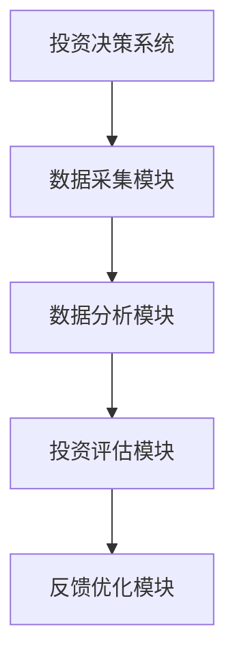

                 


# 巴菲特-芒格的深海资源开发投资：蓝色经济的新前沿

## 关键词：
巴菲特，芒格，深海资源开发，蓝色经济，投资策略，价值投资，可持续发展

## 摘要：
本文探讨了巴菲特和芒格的价值投资理念在深海资源开发中的应用，分析了蓝色经济的新前沿。通过系统分析和实际案例，本文展示了如何将长期、安全边际和企业分析等投资原则应用于深海资源投资，推动蓝色经济的可持续发展。

---

## 第一章 巴菲特与芒格的投资哲学

### 1.1 巴菲特与芒格的背景介绍
- **1.1.1 巴菲特的投资哲学**
  巴菲特是价值投资的代表人物，强调购买优质资产，长期持有，关注企业的内在价值。
- **1.1.2 芒格的多元思维模型**
  芒格提倡通过多学科思维模型来分析问题，避免单一视角的局限性。
- **1.1.3 两人合作的投资理念**
  巴菲特和芒格共同强调安全边际、长期投资和企业基本面分析。

### 1.2 蓝色经济的定义与背景
- **1.2.1 蓝色经济的定义**
  蓝色经济指以海洋资源为基础的经济活动，涵盖渔业、能源、运输和旅游等领域。
- **1.2.2 深海资源开发的现状与潜力**
  深海资源包括矿产、能源和生物资源，开发潜力巨大，但面临技术和环境挑战。
- **1.2.3 蓝色经济与传统经济的对比**
  蓝色经济更依赖可持续发展，强调生态平衡和资源高效利用。

### 1.3 巴菲特与芒格投资理念的核心要素
- **1.3.1 价值投资的核心要素**
  寻找具有持续竞争优势、良好管理和财务健康的企业。
- **1.3.2 蓝色经济中的投资机会**
  深海资源开发具有高回报潜力，但需要谨慎评估风险。
- **1.3.3 深海资源开发的长期性与风险**
  投资者需考虑技术和政策风险，注重长期价值。

---

## 第二章 价值投资的核心原理

### 2.1 价值投资的定义与特点
- **2.1.1 价值投资的定义**
  价值投资寻找市场价格低于内在价值的股票，追求安全边际。
- **2.1.2 价值投资的特点**
  长期投资、注重基本面、寻找低估资产。

### 2.2 巴菲特与芒格的价值投资策略
- **2.2.1 购买优秀的公司而非便宜的股票**
  选择具有强大护城河和管理团队的企业。
- **2.2.2 长期持有与分散投资**
  避免频繁交易，分散投资以降低风险。
- **2.2.3 安全边际的概念**
  购买价格低于内在价值，确保安全空间。

### 2.3 深海资源开发中的价值投资分析
- **2.3.1 深海资源开发的经济价值**
  矿产、能源和生物资源具有高经济价值。
- **2.3.2 深海资源开发的长期投资价值**
  需要长期视角，考虑技术和政策变化。
- **2.3.3 深海资源开发中的风险与机遇**
  技术挑战与政策不确定性是主要风险，但潜在回报巨大。

---

## 第三章 深海资源开发的现状与投资机会

### 3.1 深海资源的类型与开发模式
- **3.1.1 深海矿产资源**
  包括多金属结核、多金属硫化物等，分布广泛但开发难度大。
- **3.1.2 深海能源资源**
  如可燃冰和深海风电，能源密度高但开发成本高。
- **3.1.3 深海生物资源**
  包括深海鱼类和微生物，具有高商业价值。

### 3.2 深海资源开发的投资模式
- **3.2.1 企业直接投资**
  大型企业直接投资开发项目，控制资源和技术。
- **3.2.2 金融资本投资**
  机构投资者通过股票、债券等金融工具间接投资。
- **3.2.3 公私合作模式**
  政府与企业合作，分担风险和共享收益。

---

## 第四章 系统分析与架构设计

### 4.1 系统功能设计
- **4.1.1 投资决策系统**
  包括数据采集、分析、评估和反馈模块。
- **4.1.2 风险评估模块**
  使用数学模型评估项目风险，如净现值（NPV）和内部收益率（IRR）。

### 4.2 系统架构设计


### 4.3 系统接口设计
- **4.3.1 数据接口**
  从多个来源获取数据，如企业财务报表和市场报告。
- **4.3.2 用户界面**
  提供直观的界面供投资者进行分析和决策。

---

## 第五章 项目实战

### 5.1 环境安装与工具准备
- **5.1.1 安装Python环境**
  使用Anaconda安装Python 3.8以上版本。
- **5.1.2 安装必要的库**
  如pandas、numpy、matplotlib和scikit-learn。

### 5.2 核心代码实现
```python
import pandas as pd
import numpy as np
from sklearn.metrics import accuracy_score

# 示例数据：深海资源项目投资回报分析
data = pd.DataFrame({
    '项目成本': [100, 150, 200],
    '预期收益': [120, 180, 220]
})

# 计算净现值（NPV）
def calculate_npv(cash_flows, discount_rate):
    return np.npv(discount_rate, *cash_flows)

# 示例计算
cash_flows = [100, 150, 200]
discount_rate = 0.08
npv = calculate_npv(cash_flows, discount_rate)
print(f"净现值: {npv}")
```

### 5.3 投资项目分析
- **5.3.1 项目背景**
  某深海矿产开发项目，预期投资回报率高，但风险较大。
- **5.3.2 项目评估**
  使用NPV和IRR模型评估项目可行性，考虑技术和政策风险。

---

## 第六章 结论与展望

### 6.1 总结
巴菲特和芒格的投资理念为深海资源开发提供了新的视角，结合长期投资和价值评估，推动蓝色经济的发展。

### 6.2 展望
未来，蓝色经济将更加依赖可持续发展，技术进步和政策支持将推动深海资源开发的投资潜力。

---

## 参考文献
1. 巴菲特股东大会演讲集
2. 芒格的《穷查理宝典》
3. 国际海底管理局报告
4. 相关学术论文和研究报告

---

以上为完整的技术博客文章，详细分析了巴菲特和芒格的价值投资理念在深海资源开发中的应用，结合系统分析和实战案例，为投资者提供了有价值的参考。

