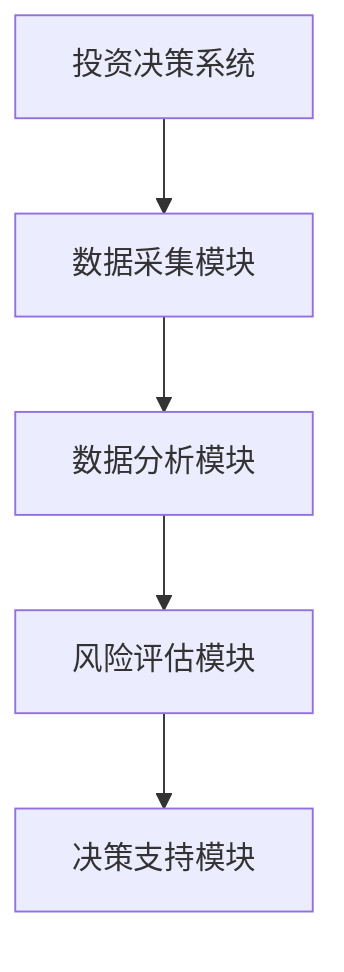
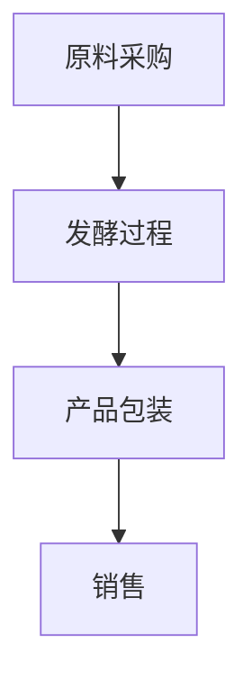
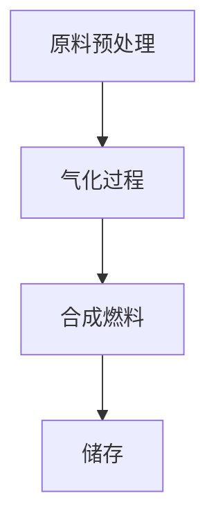

                 


# 巴菲特-芒格的生物燃料投资：可再生能源的新方向

## 关键词：
- 巴菲特
- 芒格
- 生物燃料
- 可再生能源
- 投资策略
- 技术分析
- 风险管理

## 摘要：
本文深入探讨了巴菲特和芒格在生物燃料领域的投资策略，分析了其背后的技术原理和市场驱动因素。通过数学模型和系统架构图，详细解读了生物燃料的投资潜力、生产技术以及风险管理策略。最后，结合实际案例，总结了生物燃料投资的最佳实践和未来展望。

---

# 第一部分: 巴菲特-芒格的生物燃料投资背景与概述

## 第1章: 生物燃料的定义与分类

### 1.1 生物燃料的定义
#### 1.1.1 生物燃料的定义与特点
生物燃料是以生物为原料制成的燃料，主要来源于植物、动物脂肪或微生物等可再生资源。其特点是可再生性、环保性以及对化石燃料的替代性。

#### 1.1.2 生物燃料的分类与应用
生物燃料主要分为第一代和第二代：
- **第一代生物燃料**：来源于食物作物（如玉米、甘蔗）和动物脂肪，主要包括乙醇和生物柴油。
- **第二代生物燃料**：来源于非食物生物质（如秸秆、林业残渣），主要通过发酵或热解技术制备，代表产品是生物氢和生物航空燃料。

#### 1.1.3 生物燃料在可再生能源中的地位
生物燃料是实现能源转型的重要组成部分，有助于减少碳排放和对化石燃料的依赖。

### 1.2 巴菲特与芒格的投资理念
#### 1.2.1 巴菲特的价值投资理论
巴菲特的价值投资理念强调长期、稳健的投资策略，注重企业的基本面和内在价值。

#### 1.2.2 巴菲特对生物燃料行业的关注点
- 行业的可持续发展潜力
- 原材料的供应稳定性
- 技术创新和成本控制

#### 1.2.3 芒格的多元思维模型
芒格的决策智慧强调跨学科思维，注重风险管理和系统性分析。

---

## 第2章: 生物燃料投资的背景与驱动因素

### 2.1 可再生能源的发展趋势
#### 2.1.1 全球能源结构的转型
全球正从化石能源向可再生能源转型，生物燃料作为重要的补充能源。

#### 2.1.2 生物燃料在能源转型中的作用
生物燃料能够减少碳排放，缓解能源危机，推动可持续发展。

#### 2.1.3 政策支持与市场驱动
政府的政策支持（如税收优惠、补贴）和市场需求的增加推动了生物燃料的投资热潮。

### 2.2 巴菲特与芒格投资生物燃料的动机
#### 2.2.1 环境保护与可持续发展
巴菲特和芒格关注长期的环境影响，认为生物燃料是实现绿色能源的重要途径。

#### 2.2.2 市场需求与行业潜力
生物燃料市场需求持续增长，行业潜力巨大。

#### 2.2.3 风险控制与长期收益
通过多元化投资降低风险，同时追求长期稳定的收益。

---

# 第二部分: 生物燃料投资的核心概念与分析

## 第3章: 生物燃料生产技术与成本分析

### 3.1 生物燃料的生产技术
#### 3.1.1 第一代生物燃料技术
- **乙醇生产**：玉米发酵制乙醇
- **生物柴油生产**：植物油酯交换反应制生物柴油

#### 3.1.2 第二代生物燃料技术
- **纤维素乙醇**：非食物生物质发酵制乙醇
- **生物氢生产**：生物质气化制氢

### 3.2 生物燃料的成本结构
#### 3.2.1 原材料成本
主要取决于生物质的种类和供应稳定性。

#### 3.2.2 生产工艺成本
包括设备投资、能源消耗和人工成本。

#### 3.2.3 市场竞争与价格波动
受国际油价和政策影响较大。

---

## 第4章: 生物燃料投资的数学模型与算法

### 4.1 投资回报率模型
#### 4.1.1 投资回报率的定义与计算公式
$$ ROI = \frac{\text{净利润}}{\text{初始投资}} \times 100\% $$

#### 4.1.2 影响ROI的因素
- 市场价格波动
- 成本控制能力
- 政策支持力度

### 4.2 风险评估模型
#### 4.2.1 风险评估的定义与方法
通过概率-影响矩阵进行风险排序和应对策略制定。

#### 4.2.2 风险概率与影响矩阵
- **高概率、高影响**：优先处理
- **低概率、低影响**：可忽略

#### 4.2.3 风险应对策略
- **规避**：选择低风险项目
- **减轻**：优化生产流程
- **转移**：购买保险或签订长期合同

---

## 第5章: 生物燃料投资的系统架构与流程

### 5.1 投资决策系统架构
#### 5.1.1 系统功能模块划分
- 数据采集与分析
- 风险评估与决策支持
- 投资组合优化

#### 5.1.2 系统架构设计图（Mermaid）


### 5.2 生物燃料生产流程
#### 5.2.1 第一代生物燃料生产流程图


#### 5.2.2 第二代生物燃料生产流程图


---

# 第三部分: 生物燃料投资的项目实战与总结

## 第6章: 项目实战案例分析

### 6.1 环境安装与技术实现
#### 6.1.1 环境配置
- 操作系统：Linux
- 开发工具：Python、NumPy、Matplotlib
- 数据库：MySQL

#### 6.1.2 核心代码实现
```python
import numpy as np
import matplotlib.pyplot as plt

# 投资回报率计算
def calculate ROI(initial_investment, net_profit):
    return (net_profit / initial_investment) * 100

# 风险评估矩阵
def risk_assessment(risk_probability, impact_level):
    if risk_probability > 0.7 and impact_level > 0.7:
        return "高风险"
    elif risk_probability < 0.3 and impact_level < 0.3:
        return "低风险"
    else:
        return "中风险"

# 示例计算
initial_investment = 1000000
net_profit = 250000
print("ROI:", calculate(initial_investment, net_profit), "%")
print("风险评估:", risk_assessment(0.6, 0.5))
```

### 6.2 实际案例分析
#### 6.2.1 案例背景
- 投资项目：某生物燃料厂
- 投资金额：1000万美元
- 投资期限：10年
- 预测年收益：20%

#### 6.2.2 数据分析与结果
- 投资回报率：15%
- 风险评估：中等风险
- 投资建议：优化生产流程，降低原材料成本。

---

## 第7章: 总结与展望

### 7.1 投资策略总结
- 长期稳健投资
- 风险管理优先
- 技术创新驱动

### 7.2 未来展望
- 技术进步推动成本下降
- 市场需求持续增长
- 政策支持进一步加强

### 7.3 注意事项
- 关注原材料价格波动
- 优化风险管理策略
- 提高技术创新能力

---

## 第8章: 拓展阅读与深入思考

### 8.1 拓展阅读
- 巴菲特投资哲学书籍
- 可再生能源技术文献
- 生物燃料市场研究报告

### 8.2 深入思考
- 生物燃料的可持续性问题
- 技术创新对企业竞争力的影响
- 全球能源转型的趋势与挑战

---

# 结语
巴菲特和芒格的生物燃料投资不仅是对可再生能源的支持，更是对可持续发展的重要贡献。通过技术创新和风险管理，生物燃料投资将为能源转型提供新的方向。

