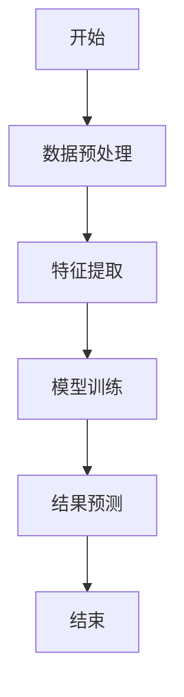
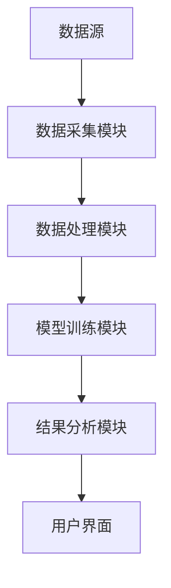

                 


# 巴菲特-芒格的生物计算投资：计算能力的生物学突破

## 关键词：巴菲特, 芒格, 生物计算, 投资策略, 计算能力, 生物学, 人工智能

## 摘要：  
本文探讨了生物计算投资的概念与实践，结合巴菲特和芒格的投资理念，分析了计算能力在生物学中的应用及其对投资策略的深远影响。通过详细解析生物计算的核心原理、算法模型以及系统架构，本文旨在揭示这一新兴领域的潜力，并为读者提供深入的技术见解。

---

# 第一部分: 生物计算投资的背景与意义

## 第1章: 生物计算投资的背景与起源

### 1.1 生物计算投资的起源
#### 1.1.1 生物计算投资的定义
生物计算投资是一种结合生物学原理与计算技术的投资策略，通过分析生物数据（如基因组、蛋白质结构等）来预测和优化投资决策。

#### 1.1.2 巴菲特与芒格的投资理念
巴菲特和芒格以价值投资闻名，强调长期视角和基本面分析。生物计算投资将这些理念与现代计算技术结合，为投资决策提供了新的工具。

#### 1.1.3 生物计算投资的背景与意义
随着生物技术的进步和计算能力的提升，生物数据的规模和复杂性急剧增加。生物计算投资利用这些数据，为投资者提供了前所未有的洞察力。

---

## 第2章: 生物计算投资的核心概念

### 2.1 生物计算的基本原理
#### 2.1.1 生物计算的定义与特征
生物计算通过模拟生物系统（如DNA、蛋白质）的行为，利用计算模型来分析和解决问题。其核心特征包括并行性、容错性和适应性。

#### 2.1.2 生物计算的核心要素
生物计算的核心要素包括生物数据、计算模型和算法。这些要素共同构成了生物计算的基础。

#### 2.1.3 生物计算与传统计算的对比
传统计算依赖确定性规则，而生物计算则模拟生物系统的不确定性。生物计算具有更强的并行性和容错性，适用于复杂问题的求解。

### 2.2 投资中的计算能力
#### 2.2.1 计算能力的定义
计算能力是指计算机在单位时间内处理数据的能力，通常以FLOPS（浮点运算次数）或QPS（查询处理速度）衡量。

#### 2.2.2 生物计算能力在投资中的应用
生物计算能力可以用于分析生物数据，预测药物研发的成败，从而优化投资决策。

#### 2.2.3 生物计算能力的评估与优化
评估生物计算能力的关键指标包括处理速度、准确性和稳定性。优化方法包括算法改进和硬件加速。

### 2.3 生物学与计算能力的结合
#### 2.3.1 生物学的基本原理
生物学研究生命系统的结构、功能和演化规律。生物数据的复杂性为计算能力的应用提供了广阔的空间。

#### 2.3.2 计算能力在生物学中的应用
计算能力可以用于模拟生物过程、分析生物数据和预测生物系统的演变。

#### 2.3.3 生物计算能力的突破与创新
生物计算能力的突破主要体现在算法优化、数据处理能力和硬件加速方面。这些突破推动了生物计算投资的发展。

---

## 第3章: 生物计算投资的算法原理与数学模型

### 3.1 生物计算投资的算法原理
#### 3.1.1 算法原理概述
生物计算投资算法通常包括数据预处理、特征提取、模型训练和结果预测四个步骤。

#### 3.1.2 算法流程图
以下是生物计算投资算法的流程图：



#### 3.1.3 算法的数学模型
生物计算投资算法的数学模型通常包括回归分析、聚类分析和神经网络模型。以下是一个简单的回归模型示例：

$$ y = \beta_0 + \beta_1x_1 + \beta_2x_2 + \epsilon $$

其中，$y$ 是目标变量，$\beta_0$、$\beta_1$、$\beta_2$ 是回归系数，$x_1$、$x_2$ 是特征变量，$\epsilon$ 是误差项。

### 3.2 算法的实现代码
以下是一个简单的生物计算投资算法的Python代码示例：

```python
import numpy as np
from sklearn.linear_model import LinearRegression

# 示例数据
X = np.array([[1, 2], [3, 4], [5, 6]])
y = np.array([7, 8, 9])

# 模型训练
model = LinearRegression()
model.fit(X, y)

# 预测结果
print(model.predict([[7, 8]]))
```

### 3.3 数学模型的优化
数学模型的优化可以通过参数调整、算法改进和数据增强实现。例如，可以使用正则化方法（如Lasso回归）来优化模型的泛化能力。

---

## 第4章: 生物计算投资的系统架构与项目实战

### 4.1 系统架构设计
#### 4.1.1 系统功能设计
生物计算投资系统的功能模块包括数据采集、数据处理、模型训练和结果分析。

#### 4.1.2 系统架构图
以下是生物计算投资系统的架构图：



### 4.2 项目实战
#### 4.2.1 环境安装
需要安装Python、NumPy、Scikit-learn等库。

#### 4.2.2 核心代码实现
以下是一个简单的生物计算投资算法的实现代码：

```python
import numpy as np
from sklearn.model_selection import train_test_split
from sklearn.metrics import accuracy_score

# 示例数据
X = np.array([[1, 2], [3, 4], [5, 6], [7, 8]])
y = np.array([0, 1, 1, 0])

# 数据分割
X_train, X_test, y_train, y_test = train_test_split(X, y, test_size=0.25)

# 模型训练
from sklearn.svm import SVC
model = SVC()
model.fit(X_train, y_train)

# 预测结果
y_pred = model.predict(X_test)

# 准确率计算
print(accuracy_score(y_test, y_pred))
```

### 4.3 实际案例分析
以下是一个实际案例分析：

假设我们有一组生物技术公司的财务数据和基因组数据，我们需要预测这些公司的股票表现。通过构建一个机器学习模型，我们可以利用这些数据进行预测。

---

## 第5章: 生物计算投资的总结与展望

### 5.1 总结
生物计算投资是一种结合生物学和计算技术的投资策略，具有广阔的应用前景。通过分析生物数据，投资者可以做出更科学的决策。

### 5.2 展望
随着生物技术和计算能力的进一步发展，生物计算投资将更加精准和高效。未来的研究方向包括算法优化、数据共享和跨学科合作。

---

## 总结
生物计算投资的结合了生物学和计算技术，为投资决策提供了新的工具。通过深入分析生物数据，投资者可以做出更科学的决策。未来，随着技术的进步，生物计算投资将发挥更大的作用。

