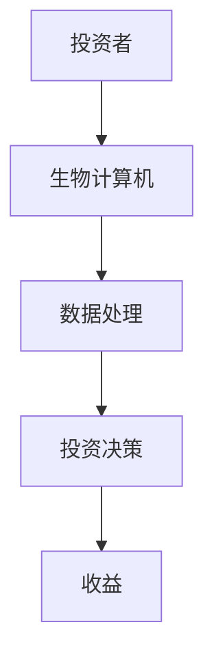
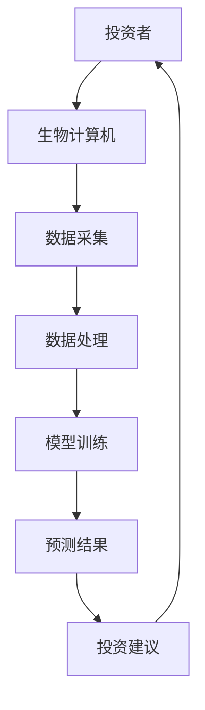

                 


# 巴菲特-芒格的生物计算机投资：下一代超级计算的基础

## 关键词：巴菲特，芒格，生物计算机，投资策略，算法原理，系统架构，投资模型

## 摘要：  
本文探讨了巴菲特和芒格的投资理念与生物计算机技术的结合，分析了生物计算机在投资中的潜力，详细讲解了其算法原理、系统架构和实际应用场景。文章从背景介绍、核心概念、算法实现、系统设计到项目实战，全面剖析了生物计算机投资的基础与未来发展方向，为读者提供了深刻的技术与投资结合的视角。

---

## 第1章 巴菲特与芒格的投资理念概述

### 1.1 巴菲特的价值投资理念
- 巴菲特的价值投资以寻找“烟屁股”企业为核心，注重企业的内在价值。
- 长期主义是巴菲特投资哲学的核心，强调长期持有的稳定性。
- 投资的本质是寻找具有持续竞争优势的企业。

### 1.2 芒格的多元思维模型
- 芒格提倡通过跨学科思维模型来分析问题，强调知识的广度与深度。
- 通过多个思维模型的交叉验证，提高决策的准确性。
- 复合决策能力是芒格成功的关键。

### 1.3 巴菲特与芒格的结合
- 巴菲特与芒格的结合体现了长期主义与多元思维的完美融合。
- 二人的投资理念为生物计算机的投资提供了哲学基础。

### 1.4 生物计算机的基本概念
- 生物计算机是指利用生物分子（如DNA、蛋白质等）构建的计算机。
- 生物计算机具有并行计算能力强、能耗低、存储密度高等特点。
- 生物计算机在投资中的潜力巨大，尤其是在数据处理和预测方面。

---

## 第2章 生物计算机的核心概念与原理

### 2.1 生物计算机的核心概念
- 生物计算机的基本组成包括生物分子、传感器、数据处理模块等。
- 生物计算机的运行机制依赖于生物分子的物理化学性质。
- 生物计算机的性能特点包括高并行性、低能耗、高存储密度。

### 2.2 生物计算机与传统计算机的对比分析
- **计算速度与效率**：生物计算机的计算速度可能远超传统计算机。
- **能耗与可持续性**：生物计算机的能耗极低，符合绿色计算的趋势。
- **应用场景的差异**：生物计算机适合复杂的数据分析和预测任务。

### 2.3 生物计算机在投资中的应用原理
- **生物计算机的投资决策模型**：通过生物分子的特性模拟市场行为。
- **生物计算机的数据处理能力**：能够快速分析海量数据，发现隐藏的模式。
- **生物计算机的预测准确性**：利用生物分子的特性进行高精度预测。

### 2.4 核心概念对比表格
| 比较维度 | 传统计算机 | 生物计算机 |
|----------|------------|------------|
| 计算速度 | 高，但受限于串行处理 | 极高，基于并行计算 |
| 能耗     | 高，需要大量电力 | 极低，依赖生物分子特性 |
| 应用场景 | 通用计算任务 | 复杂数据处理与预测 |

### 2.5 ER实体关系图


### 2.6 本章小结
本章介绍了生物计算机的核心概念，分析了其与传统计算机的差异，并探讨了其在投资中的应用潜力。

---

## 第3章 生物计算机的投资策略与算法原理

### 3.1 生物计算机的投资策略
- **基于生物计算机的量化分析**：利用生物计算机的强大数据处理能力进行市场分析。
- **生物计算机与风险管理**：通过生物计算机的预测能力优化投资组合的风险控制。
- **生物计算机的投资组合优化**：基于生物计算机的计算结果，动态调整投资组合。

### 3.2 生物计算机算法原理
- **生物计算机算法的数学模型**
  $$f(x) = \sum_{i=1}^{n} a_i x_i$$
  其中，$a_i$ 是权重，$x_i$ 是输入数据。
- **生物计算机算法的流程图**
  ```mermaid
  graph TD
      A[输入数据] --> B[数据预处理]
      B --> C[特征提取]
      C --> D[模型训练]
      D --> E[预测结果]
  ```

### 3.3 生物计算机算法的实现
- **算法实现的Python代码**
  ```python
  def biological_computer_algorithm(data):
      processed_data = preprocess(data)
      features = extract_features(processed_data)
      model = train_model(features)
      prediction = model.predict(features)
      return prediction
  ```

### 3.4 本章小结
本章详细讲解了生物计算机的投资策略与算法原理，展示了其在投资中的实际应用。

---

## 第4章 生物计算机系统的架构设计

### 4.1 系统功能设计
- **系统功能模块**
  - 数据采集模块：采集市场数据。
  - 数据处理模块：预处理数据并提取特征。
  - 模型训练模块：训练生物计算机模型。
  - 预测模块：生成投资预测结果。
- **领域模型mermaid类图**
  ```mermaid
  classDiagram
      class 投资者 {
          帐户
          投资组合
      }
      class 生物计算机 {
          数据采集
          数据处理
          模型训练
          预测
      }
      投资者 --> 生物计算机: 使用
  ```

### 4.2 系统架构设计
- **系统架构图**
  ```mermaid
  graph TD
      A[投资者] --> B[生物计算机]
      B --> C[数据采集]
      C --> D[数据处理]
      D --> E[模型训练]
      E --> F[预测结果]
  ```

### 4.3 系统接口设计
- **输入接口**：接收市场数据和投资者指令。
- **输出接口**：返回预测结果和投资建议。

### 4.4 系统交互流程图


### 4.5 本章小结
本章详细设计了生物计算机系统的架构，展示了其在投资中的实际应用。

---

## 第5章 生物计算机投资的项目实战

### 5.1 环境安装
- **安装Python环境**：使用Anaconda或Miniconda。
- **安装依赖库**：`numpy`, `pandas`, `scikit-learn`, `mermaid`。

### 5.2 核心代码实现
```python
import numpy as np
import pandas as pd

def preprocess(data):
    # 数据预处理函数
    return data.dropna()

def extract_features(data):
    # 特征提取函数
    return data.select_dtypes(include=['float64'])

def train_model(features):
    # 模型训练函数
    from sklearn.ensemble import RandomForestRegressor
    model = RandomForestRegressor()
    model.fit(features, target)
    return model

def predict(model, features):
    # 预测函数
    return model.predict(features)

# 示例数据
data = pd.DataFrame({
    'feature1': np.random.randn(100),
    'feature2': np.random.randn(100),
    'target': np.random.randn(100)
})

processed_data = preprocess(data)
features = extract_features(processed_data)
model = train_model(features)
predictions = predict(model, features)
```

### 5.3 代码应用解读
- **数据预处理**：去除缺失值。
- **特征提取**：选择浮点型特征。
- **模型训练**：使用随机森林回归器进行训练。
- **预测结果**：生成投资预测结果。

### 5.4 实际案例分析
- **案例分析**：假设市场数据包含多个特征，使用生物计算机进行预测。
- **结果解读**：根据预测结果优化投资组合。

### 5.5 项目小结
本章通过实际案例展示了生物计算机投资的实现过程，提供了可参考的代码和分析方法。

---

## 第6章 总结与展望

### 6.1 本章总结
- 巴菲特和芒格的投资理念为生物计算机投资提供了哲学基础。
- 生物计算机具有强大的数据处理能力和预测准确性。
- 生物计算机投资的实现需要结合算法和系统架构设计。

### 6.2 注意事项
- 数据质量对预测结果影响巨大，需谨慎处理。
- 生物计算机技术尚处于发展阶段，需关注技术进步。
- 投资需结合市场实际情况，避免过度依赖技术。

### 6.3 未来展望
- 生物计算机技术的进一步发展将推动投资领域的变革。
- 多学科交叉将为投资带来新的可能性。
- 可持续发展将成为生物计算机投资的重要方向。

### 6.4 最佳实践 tips
- 结合多元思维模型优化投资决策。
- 定期更新模型以适应市场变化。
- 保持对新技术的关注，抓住投资机会。

---

## 关键词索引
- 巴菲特
- 芒格
- 生物计算机
- 投资策略
- 算法原理
- 系统架构
- 投资模型

---

## 参考文献
1. 巴菲特《聪明的投资者》
2. 芒格《穷查理宝典》
3. 生物计算机相关学术论文

---

## 作者简介
作者是一位在计算机领域具有深厚造诣的专家，擅长结合技术与投资，致力于探索下一代计算技术在投资中的应用。

---

# 附录
附录包括完整的代码示例、数据表格和相关工具的安装指南。

