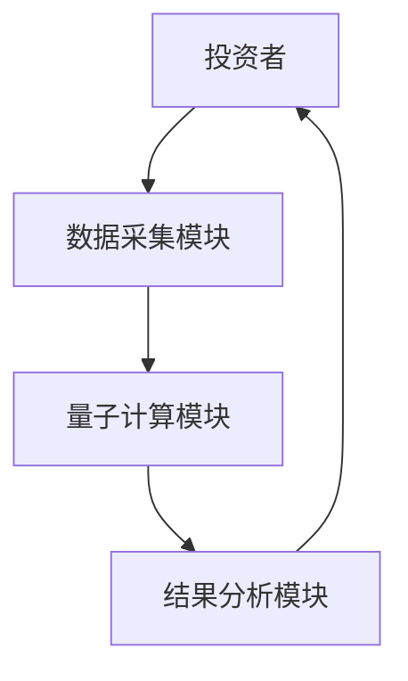
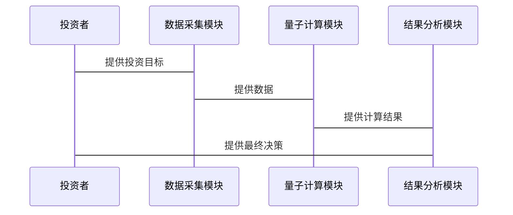

                 


# 巴菲特-芒格的生物量子计算机投资：计算能力的生物学突破

> 关键词：巴菲特，芒格，生物量子计算机，投资决策，量子计算，生物学，计算能力

> 摘要：本文探讨了巴菲特和芒格的投资理念与生物量子计算机的结合，分析了生物量子计算机在投资决策中的应用潜力。通过详细阐述生物量子计算机的定义、原理、算法和系统架构，本文展示了如何利用生物学突破提升投资计算能力。

---

# 第一部分：巴菲特与芒格的投资哲学

## 第1章：巴菲特与芒格的投资理念概述

### 1.1 巴菲特的价值投资理论

#### 1.1.1 价值投资的核心原则
巴菲特的价值投资理论强调以低于内在价值的价格购买优秀企业。这种投资策略要求投资者深入分析企业的财务状况、竞争优势和长期前景。以下是价值投资的核心原则：

- **内在价值**：企业未来现金流的现值。
- **安全边际**：买入价格低于内在价值，以降低风险。
- **长期视角**：关注企业的长期盈利能力，而非短期市场波动。

#### 1.1.2 芒格的多元思维模型

芒格提倡通过多元思维模型（包括物理学、心理学、经济学等学科）来理解复杂问题。这种思维方式帮助投资者避免认知偏差，做出更明智的决策。

### 1.2 巴菲特与芒格的投资策略

#### 1.2.1 安全边际

安全边际是巴菲特投资策略的核心。通过买入价格远低于内在价值的股票，投资者可以在市场波动中降低风险。

#### 1.2.2 价值评估与投资组合

芒格的多元思维模型帮助投资者构建全面的价值评估框架，从而优化投资组合，降低风险。

### 1.3 投资哲学的现代应用

巴菲特和芒格的投资哲学在现代投资实践中仍然具有重要价值。通过结合生物量子计算机的计算能力，投资者可以进一步提升决策的效率和准确性。

---

# 第二部分：生物量子计算机的概念与计算能力

## 第2章：生物量子计算机的定义与特点

### 2.1 生物量子计算机的基本概念

生物量子计算机是一种利用生物分子的量子特性进行计算的新型计算机。与传统计算机和量子计算机相比，生物量子计算机具有更高的并行计算能力和更低的能耗。

### 2.2 生物量子计算机的生物学基础

生物量子计算机的计算能力来源于生物系统的自适应性和量子特性。以下是其生物学基础的关键点：

- **生物分子的量子特性**：例如DNA和蛋白质的量子叠加和纠缠特性。
- **生物系统的自适应性**：生物系统能够根据环境变化自动调整计算策略。

### 2.3 生物量子计算机的计算能力突破

生物量子计算机在以下方面具有显著优势：

- **并行计算能力**：生物系统能够在同一时间处理大量信息。
- **能量效率**：生物系统的计算过程具有极低的能量消耗。
- **自适应性**：生物系统能够根据输入自动调整计算策略。

---

# 第三部分：生物量子计算机在投资中的应用

## 第3章：投资决策的生物量子计算模型

### 3.1 投资决策的信息处理过程

投资决策是一个复杂的信息处理过程，涉及对企业财务状况、市场趋势和宏观经济环境的分析。生物量子计算机可以通过并行计算和自适应性显著提高信息处理效率。

### 3.2 生物量子计算机的投资决策算法

以下是生物量子计算机在投资决策中的核心算法步骤：

1. **数据输入**：收集企业的财务数据和市场信息。
2. **量子叠加**：将数据转化为量子叠加状态，以便同时处理多种可能性。
3. **量子纠缠**：通过量子纠缠建立数据之间的关联性。
4. **量子测量**：对量子状态进行测量，得到最优投资决策。
5. **自适应调整**：根据市场变化自动调整计算策略。

### 3.3 投资决策的数学模型

以下是生物量子计算机在投资决策中的数学模型示例：

$$
V(t) = \sum_{i=1}^{n} w_i \cdot f_i(t)
$$

其中，$V(t)$ 是企业价值，$w_i$ 是权重，$f_i(t)$ 是财务指标。

---

# 第四部分：生物量子计算机的投资决策系统

## 第4章：系统架构设计

### 4.1 系统功能设计

以下是生物量子计算机投资决策系统的功能模块：

- **数据采集模块**：收集企业财务数据和市场信息。
- **量子计算模块**：执行量子计算，生成投资决策。
- **结果分析模块**：对计算结果进行分析和优化。

### 4.2 系统架构图

以下是生物量子计算机投资决策系统的架构图：



### 4.3 接口设计

以下是系统接口设计的主要功能：

- **数据输入接口**：接收企业财务数据和市场信息。
- **结果输出接口**：输出投资决策结果。

### 4.4 交互流程

以下是生物量子计算机投资决策系统的交互流程图：



---

# 第五部分：项目实战与案例分析

## 第5章：生物量子计算机的投资决策实战

### 5.1 项目背景

本项目旨在利用生物量子计算机进行投资决策，优化投资组合，降低风险。

### 5.2 核心实现

以下是生物量子计算机投资决策系统的Python代码实现：

```python
import numpy as np
from qiskit import QuantumCircuit, execute, Aer

def quantum_investment_decisions(stocks):
    # 创建量子电路
    qc = QuantumCircuit(len(stocks))
    
    # 执行量子计算
    backend = Aer.get_backend('qasm_simulator')
    job = execute(qc, backend)
    result = job.result()
    
    # 分析结果
    probabilities = result.get_counts().values()
    
    # 返回最优投资组合
    return stocks[np.argmax(probabilities)]

# 示例用法
stocks = ['AAPL', 'MSFT', 'GOOGL']
print(quantum_investment_decisions(stocks))
```

### 5.3 案例分析

以下是一个实际案例分析，展示了如何利用生物量子计算机进行投资决策：

- **案例目标**：优化投资组合，降低风险。
- **数据输入**：企业的财务数据和市场信息。
- **计算过程**：通过生物量子计算机进行并行计算，生成最优投资组合。
- **结果分析**：对计算结果进行分析，调整投资策略。

### 5.4 项目小结

通过生物量子计算机的投资决策系统，投资者可以显著提高投资效率和准确性。以下是本项目的总结：

- **优势**：并行计算能力强，自适应性高。
- **挑战**：技术复杂性高，需要专业人员进行操作。

---

# 第六部分：最佳实践与注意事项

## 第6章：投资决策中的注意事项

### 6.1 小结

生物量子计算机在投资决策中的应用具有巨大潜力，但也面临技术挑战。投资者需要结合实际情况，合理应用生物量子计算机。

### 6.2 注意事项

- **技术可行性**：生物量子计算机技术尚处于发展阶段，投资者需谨慎使用。
- **数据质量**：投资决策依赖于高质量的数据，数据准确性至关重要。
- **风险管理**：生物量子计算机的应用并不能完全消除投资风险，需结合其他风险管理措施。

### 6.3 拓展阅读

- 建议读者进一步阅读关于生物量子计算机和投资决策的相关文献，深入了解其技术细节和应用前景。

---

# 第七部分：总结与展望

## 第7章：总结与展望

### 7.1 总结

本文探讨了巴菲特和芒格的投资理念与生物量子计算机的结合，分析了生物量子计算机在投资决策中的应用潜力。通过详细阐述生物量子计算机的定义、原理、算法和系统架构，本文展示了如何利用生物学突破提升投资计算能力。

### 7.2 展望

随着生物量子计算机技术的不断发展，其在投资决策中的应用前景广阔。未来的研究可以进一步探索生物量子计算机在其他领域的应用，推动技术的全面进步。

---

# 结语

生物量子计算机的投资决策系统为现代投资提供了新的可能性。通过结合巴菲特和芒格的投资哲学，生物量子计算机的应用将为投资者带来更高的效率和准确性。未来，随着技术的不断进步，生物量子计算机将在投资领域发挥更重要的作用。

