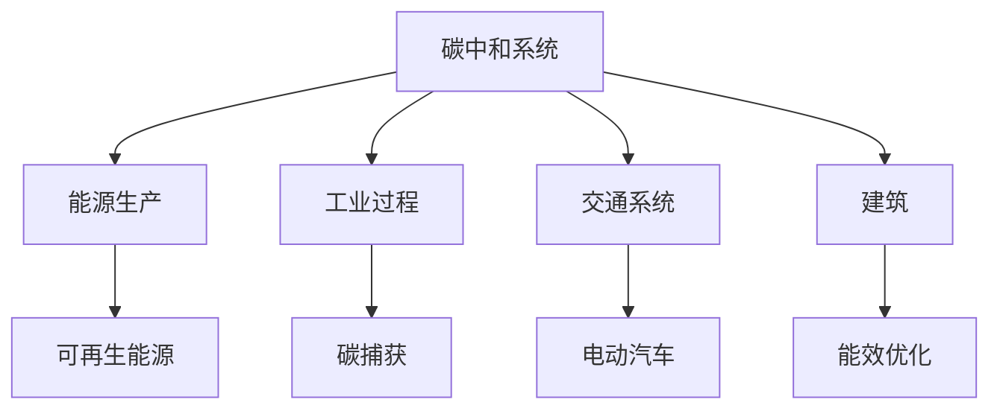
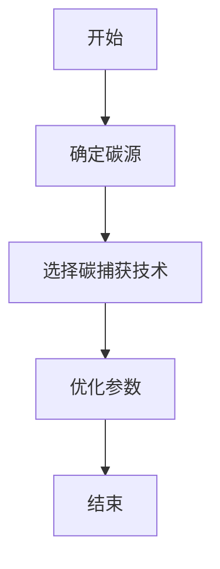
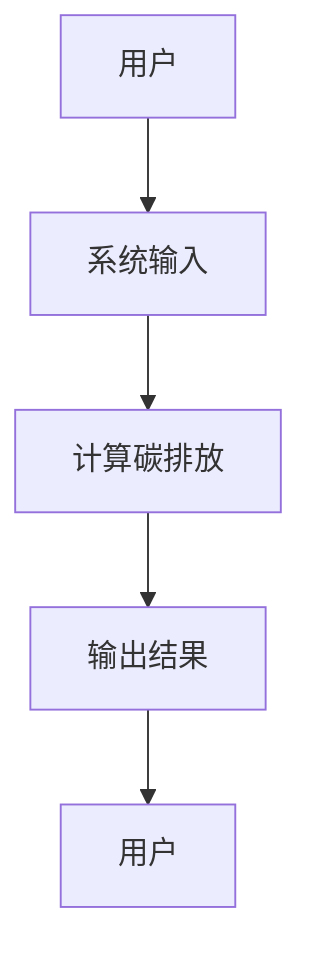

                 


# 巴菲特-芒格的碳中和技术投资：应对气候变化的创新

> 关键词：巴菲特，芒格，碳中和，技术创新，投资策略，气候变化，可持续发展

> 摘要：本文探讨了巴菲特和芒格在碳中和技术投资领域的创新策略，分析了碳中和技术创新的核心概念、系统架构、算法原理以及实际项目案例。文章从碳中和的背景与挑战入手，结合巴菲特和芒格的投资理念，详细阐述了碳中和技术创新的系统架构、算法原理、项目实战、法律与政策影响以及未来展望。通过本文，读者可以深入了解碳中和技术创新的核心要素，以及巴菲特和芒格如何通过投资创新技术应对气候变化。

---

## 第1章：碳中和的背景与挑战

### 1.1 碳中和的定义与目标

碳中和是指在一定时间内，通过减少温室气体排放和增加碳汇等方式，使二氧化碳的净排放量为零。其核心目标是应对全球气候变化，实现可持续发展。

#### 1.1.1 碳中和的基本概念
碳中和是通过减少碳排放和增加碳汇来实现二氧化碳的净零排放。这包括能源生产、工业过程、交通和建筑等多个领域。

#### 1.1.2 全球气候变化的背景
全球气候变化是由人类活动导致的温室气体排放增加所引起。根据联合国数据，全球平均气温上升幅度已接近1.1摄氏度，远超巴黎协定设定的1.5摄氏度目标。

#### 1.1.3 碳中和的目标与意义
碳中和的目标是到2050年实现净零排放。这一目标对全球经济转型、能源结构优化和技术创新提出了巨大挑战，同时也带来了巨大的投资机会。

### 1.2 巴菲特与芒格的投资理念

#### 1.2.1 巴菲特的价值投资理论
巴菲特的价值投资理论强调长期投资、安全边际和企业竞争优势。他认为，投资的本质是寻找具有持续竞争优势的企业。

#### 1.2.2 芒格的多元思维模型
芒格的多元思维模型强调跨学科思考，通过多维度分析问题，寻找投资机会。他认为，投资是认知的变现。

#### 1.2.3 两人投资理念的结合
巴菲特和芒格的投资理念结合了长期价值投资和多元思维模型，强调对企业基本面的深入分析和对风险的严格控制。

---

## 第2章：碳中和与技术创新

### 2.1 碳中和的技术领域

#### 2.1.1 可再生能源技术
可再生能源技术包括太阳能、风能和生物质能等。这些技术是实现碳中和的核心手段之一。

#### 2.1.2 碳捕获与封存技术
碳捕获与封存技术通过捕获工业过程中的二氧化碳并将其封存在地下，是实现碳中和的重要技术。

#### 2.1.3 能源存储技术
能源存储技术（如电池储能）是解决可再生能源 intermittency问题的关键技术。

### 2.2 碳中和技术创新的投资机会

#### 2.2.1 清洁能源的投资潜力
清洁能源技术的投资潜力巨大，尤其是太阳能和风能领域。

#### 2.2.2 绿色交通技术的应用前景
电动汽车和智能交通系统的推广将显著减少碳排放。

#### 2.2.3 循环经济模式的创新
循环经济模式通过资源的重复利用减少浪费，是实现碳中和的重要途径。

---

## 第3章：巴菲特-芒格投资策略与碳中和

### 3.1 巴菲特-芒格的投资哲学

#### 3.1.1 长期价值投资的核心要素
长期价值投资强调企业的持续盈利能力、竞争优势和管理层素质。

#### 3.1.2 股东价值最大化的原则
股东价值最大化是巴菲特和芒格投资的核心目标。

#### 3.1.3 风险控制与安全边际
巴菲特和芒格非常注重风险控制，强调安全边际的重要性。

### 3.2 碳中和领域的投资策略

#### 3.2.1 选择具有长期竞争优势的企业
巴菲特和芒格倾向于投资那些在碳中和领域具有技术优势和市场领导地位的企业。

#### 3.2.2 投资技术创新的驱动因素
技术创新是碳中和的核心驱动力，巴菲特和芒格倾向于投资那些能够推动技术创新的企业。

#### 3.2.3 风险评估与投资组合优化
碳中和领域的投资风险较高，巴菲特和芒格强调风险评估和投资组合优化。

---

## 第4章：碳中和技术创新的系统分析

### 4.1 碳中和技术创新的系统架构

#### 4.1.1 系统整体架构图


#### 4.1.2 关键技术模块分析
以下是碳中和系统的关键技术模块：

| 技术领域 | 关键技术 | 描述 |
|----------|----------|------|
| 可再生能源 | 太阳能、风能 | 可再生能源的生产和储存技术 |
| 碳捕获 | 碳捕获与封存 | 捕获工业过程中的二氧化碳并封存 |
| 能源存储 | 电池储能 | 储存可再生能源以应对能源需求波动 |

#### 4.1.3 系统功能需求分析
碳中和系统的功能需求包括能源生产、碳捕获、能源存储和能效优化。

### 4.2 碳中和技术创新的算法原理

#### 4.2.1 碳中和模型的数学公式
$$ \text{碳排放量} = \text{能源消耗} \times \text{排放因子} $$

#### 4.2.2 碳捕获技术的优化算法
碳捕获技术的优化算法如下：



---

## 第5章：碳中和技术创新的项目实战

### 5.1 项目环境与工具安装

#### 5.1.1 开发环境配置
建议使用Linux系统和Python编程语言。

#### 5.1.2 项目工具链安装
安装必要的工具，如Git、Python、Jupyter Notebook等。

### 5.2 核心算法实现

#### 5.2.1 碳排放计算代码
```python
def calculate_carbon_emission(energy_consumption, emission_factor):
    return energy_consumption * emission_factor
```

#### 5.2.2 碳捕获优化算法实现
```python
def optimize_carbon_capturing_parameters(parameters):
    # 算法实现
    return optimized_parameters
```

#### 5.2.3 系统交互流程图


---

## 第6章：碳中和技术创新的法律与政策

### 6.1 全球碳中和政策框架

#### 6.1.1 《巴黎协定》的核心条款
《巴黎协定》要求各国在2050年前实现碳中和。

#### 6.1.2 各国碳中和政策的比较
不同国家的碳中和政策存在差异，但总体目标一致。

#### 6.1.3 国际碳交易机制
国际碳交易机制通过碳信用额的买卖实现碳中和。

### 6.2 美国碳中和政策与投资环境

#### 6.2.1 美国碳中和目标的法律框架
美国通过《气候行动计划》等政策推动碳中和。

#### 6.2.2 政府补贴与税收优惠政策
政府通过补贴和税收优惠鼓励碳中和技术创新。

#### 6.2.3 美国碳中和政策对投资的影响
美国的碳中和政策为技术创新和投资提供了有利环境。

---

## 第7章：碳中和技术创新的未来展望

### 7.1 碳中和技术创新的趋势

#### 7.1.1 新能源技术的突破方向
未来，新能源技术将在储能和能效优化方面取得突破。

#### 7.1.2 碳捕获技术的未来发展
碳捕获技术将更加高效和经济。

#### 7.1.3 循环经济模式的深化
循环经济模式将在全球范围内得到进一步推广。

### 7.2 巴菲特-芒格投资策略的演变

#### 7.2.1 投资理念的持续创新
巴菲特和芒格的投资理念将不断适应碳中和领域的变化。

#### 7.2.2 碳中和领域的长期机会
碳中和领域将为投资者提供长期的高回报机会。

#### 7.2.3 投资者应关注的趋势
投资者应关注技术创新和政策变化。

---

## 附录：碳中和技术创新与投资的实用指南

### 附录A：碳中和相关术语表
- 碳中和：通过减少碳排放和增加碳汇使二氧化碳的净排放量为零。
- 可再生能源：来自自然界的能源，如太阳能和风能。

### 附录B：巴菲特-芒格投资经典案例分析
- 投资案例：巴菲特投资于可再生能源公司。

### 附录C：碳中和技术创新的政策文件摘录
- 政策文件：《巴黎协定》的相关条款。

---

## 参考文献与拓展阅读

1. 巴菲特《巴菲特致股东的信》
2. 芒格《穷查理宝典》
3. 联合国气候变化报告
4. 《巴黎协定》文本

---

通过本文，读者可以深入了解巴菲特和芒格在碳中和技术投资领域的创新策略，以及碳中和技术创新的核心要素。

