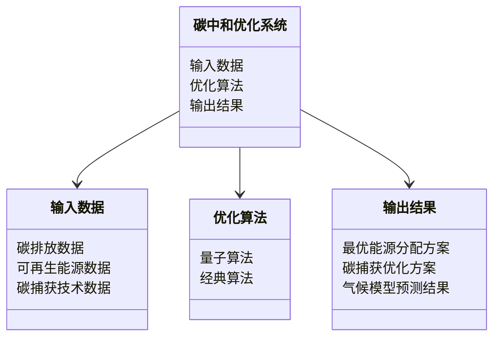
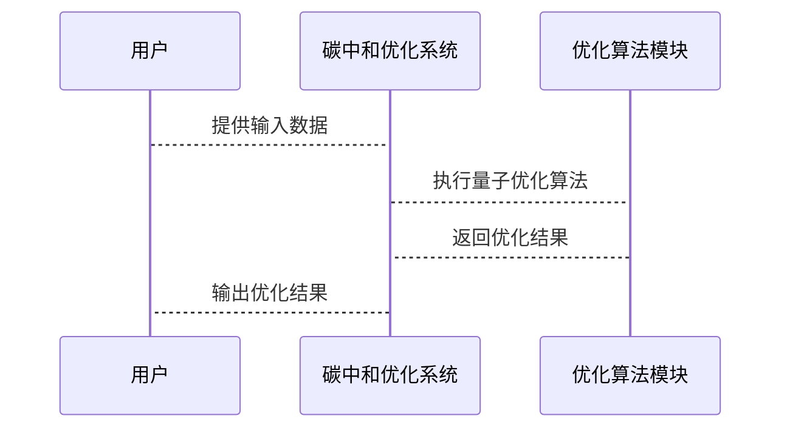

                 


```markdown
# 巴菲特-芒格的碳中和技术投资：气候变化的量子解决方案

## 关键词：巴菲特，芒格，碳中和，气候变化，量子计算，投资策略，可持续发展

## 摘要：本文探讨了巴菲特和芒格在碳中和技术投资中的策略，结合量子计算在气候变化解决方案中的应用，分析了如何通过技术创新和投资策略实现碳中和目标，提出了量子计算在优化碳中和技术中的潜在作用，为投资者和科技领域提供了新的视角。

---

# 第一部分: 巴菲特-芒格投资理念与碳中和背景

## 第1章: 巴菲特与芒格的投资哲学

### 1.1 巴菲特的价值投资理念

#### 1.1.1 巴菲特投资哲学的核心原则

* **长期投资**：巴菲特强调长期持有优质资产，避免频繁交易。
* **价值投资**：寻找具有持续竞争优势和良好管理的公司。
* **安全边际**：确保投资价格低于其内在价值，以降低风险。

#### 1.1.2 芒格的多元思维模型

* **跨学科思维**：芒格倡导从多个学科的角度分析问题。
* **决策框架**：通过构建决策框架来评估投资机会。
* **避免情绪化决策**：强调理性思考，避免受情绪影响。

#### 1.1.3 巴菲特与芒格投资理念的结合

* **价值与风险的结合**：巴菲的长期投资与芒格的多元思维模型相结合。
* **团队合作**：两人合作中互补优势，形成独特的投资策略。

### 1.2 巴菲特与芒格的气候投资策略

#### 1.2.1 巴菲特对气候变化的关注

* **气候变化的长期影响**：巴菲特意识到气候变化对全球经济的深远影响。
* **碳中和的重要性**：巴菲特认为碳中和是实现可持续发展的关键。
* **投资方向**：关注可再生能源、碳捕获技术等领域的投资机会。

#### 1.2.2 芒格对碳中和的投资观点

* **技术创新的重要性**：芒格认为技术创新是实现碳中和的关键。
* **长期投资价值**：芒格倾向于投资那些能够长期受益于碳中和政策的公司。
* **政策与市场的结合**：关注政府政策和市场趋势对碳中和投资的影响。

#### 1.2.3 巴菲特-芒格气候投资的共同点

* **长期视角**：两人均强调长期投资，关注可持续发展。
* **技术创新驱动**：巴菲特和芒格都认为技术创新是实现碳中和的核心。
* **风险控制**：通过多元化投资降低风险，确保投资组合的稳定性。

---

## 第2章: 碳中和与气候变化的背景

### 2.1 碳中和的定义与目标

#### 2.1.1 碳中和的基本概念

* **碳中和**：通过减少温室气体排放，使碳排放量与碳汇相抵消，达到净零排放的目标。
* **实现途径**：通过发展可再生能源、提高能源效率、碳捕获与封存等方式实现碳中和。

#### 2.1.2 碳中和的目标与意义

* **目标**：到2050年实现全球净零排放。
* **意义**：减少气候变化的影响，促进可持续发展，推动全球经济转型。

#### 2.1.3 碳中和与可持续发展的关系

* **相互依存**：碳中和是实现可持续发展的重要组成部分。
* **协同效应**：通过实现碳中和，可以促进资源节约、环境保护和社会公平。

### 2.2 气候变化的现状与挑战

#### 2.2.1 当前气候变化的主要表现

* **极端天气事件**：如洪水、干旱、飓风等频率增加。
* **海平面上升**：威胁沿海城市和生态系统。
* **生态系统破坏**：生物多样性的减少和物种灭绝。

#### 2.2.2 气候变化对全球经济的影响

* **经济损失**：气候变化导致农业、基础设施、能源等行业受损。
* **社会影响**：移民、贫困加剧，社会稳定受到挑战。
* **政策压力**：各国政府面临减排压力，需要制定和实施严格的环保政策。

#### 2.2.3 碳中和在应对气候变化中的作用

* **减少温室气体排放**：通过碳中和减少二氧化碳等温室气体的排放。
* **推动能源转型**：促进可再生能源的使用，减少对化石能源的依赖。
* **实现全球气候目标**：碳中和是实现《巴黎协定》目标的关键。

### 2.3 碳中和与量子技术的结合

#### 2.3.1 量子计算在碳中和中的应用

* **优化能源系统**：通过量子计算优化能源分配和储存，提高能源利用效率。
* **气候建模**：利用量子计算进行更精确的气候模拟，预测气候变化趋势。
* **技术创新**：量子计算可以帮助开发新的碳捕获技术和可再生能源技术。

#### 2.3.2 量子技术如何解决气候变化问题

* **提高效率**：量子计算可以快速优化复杂的系统，如能源网络和交通系统。
* **促进创新**：通过量子计算，科学家可以更快地开发出高效的碳捕获技术和可再生能源技术。
* **支持政策制定**：通过量子计算的模拟和分析，帮助政府制定更有效的气候政策。

#### 2.3.3 量子技术在碳中和中的潜力

* **突破传统计算的限制**：量子计算可以在短时间内处理大量复杂数据，为碳中和提供技术支持。
* **推动能源转型**：通过量子计算优化能源结构，推动向可再生能源的转型。
* **实现全球气候目标**：量子技术的应用将加速碳中和进程，为实现全球气候目标提供有力支持。

---

## 第3章: 碳中和技术的核心原理

### 3.1 碳中和的主要技术路径

#### 3.1.1 可再生能源技术

* **太阳能**：利用太阳能电池将太阳辐射转化为电能。
* **风能**：利用风力发电，减少对化石能源的依赖。
* **生物质能**：利用有机物质进行燃烧发电，同时减少碳排放。

#### 3.1.2 碳捕获与封存技术

* **碳捕获技术**：通过化学吸收、物理分离等方法捕获二氧化碳。
* **碳封存技术**：将捕获的二氧化碳封存在地下，防止其进入大气。

#### 3.1.3 能源效率提升技术

* **节能设备**：使用高效节能的设备减少能源消耗。
* **智能电网**：通过智能电网优化能源分配，提高能源利用效率。
* **建筑节能**：通过改进建筑设计和使用节能材料减少能源消耗。

### 3.2 量子计算在碳中和中的应用

#### 3.2.1 量子计算的基本原理

* **量子位**：量子计算机使用量子位（qubit）进行计算，具有超并行计算能力。
* **量子叠加**：量子位可以同时处于多个状态，提高计算速度。
* **量子纠缠**：量子位之间的纠缠关系使得计算结果可以更快速地传播。

#### 3.2.2 量子计算在优化碳中和技术中的作用

* **优化能源分配**：通过量子计算优化能源网络，提高能源利用效率。
* **优化碳捕获过程**：通过量子计算优化碳捕获技术，提高捕获效率。
* **优化能源储存**：通过量子计算优化电池和储能系统的设计，提高储能效率。

#### 3.2.3 量子计算在气候建模中的应用

* **气候模拟**：通过量子计算进行更精确的气候模拟，预测气候变化趋势。
* **天气预测**：通过量子计算提高天气预测的准确性，减少极端天气事件的影响。
* **环境监测**：通过量子计算实时监测环境数据，及时发现和处理环境问题。

### 3.3 量子计算在碳中和中的具体应用

#### 3.3.1 可再生能源的优化配置

* **太阳能电池优化**：通过量子计算优化太阳能电池的设计，提高光电转换效率。
* **风能优化**：通过量子计算优化风力发电机组的布局和设计，提高发电效率。
* **生物质能优化**：通过量子计算优化生物质能的利用过程，提高能源转化效率。

#### 3.3.2 碳捕获技术的优化设计

* **碳捕获优化**：通过量子计算优化碳捕获技术，提高捕获效率。
* **碳封存优化**：通过量子计算优化碳封存过程，确保二氧化碳的安全储存。
* **碳循环优化**：通过量子计算优化碳循环过程，实现碳的高效利用和循环。

#### 3.3.3 气候模型的量子模拟

* **气候模型的建立**：通过量子计算建立更精确的气候模型，预测气候变化趋势。
* **极端天气预测**：通过量子计算提高极端天气事件的预测能力，减少灾害损失。
* **环境影响评估**：通过量子计算评估不同政策和技术对环境的影响，为决策提供支持。

---

## 第4章: 量子算法与碳中和问题的解决方案

### 4.1 量子算法的基本原理

#### 4.1.1 量子算法的定义与特点

* **量子算法**：利用量子计算机的特性设计的算法，具有超并行计算能力。
* **量子优越性**：量子算法在某些特定问题上比经典算法更具优势。

#### 4.1.2 量子算法与经典算法的区别

* **计算速度**：量子算法在某些问题上比经典算法快得多。
* **计算复杂度**：量子算法可以在较低的复杂度下解决某些复杂问题。
* **问题类型**：量子算法适用于优化问题、因式分解、搜索问题等。

#### 4.1.3 量子算法在优化问题中的优势

* **优化问题**：量子算法在优化问题中表现出色，可以快速找到最优解。
* **复杂问题**：量子算法能够处理传统算法难以处理的复杂问题。

### 4.2 碳中和问题的量子建模

#### 4.2.1 碳中和问题的数学建模

* **数学模型**：将碳中和问题转化为数学模型，定义目标函数和约束条件。
* **优化目标**：最小化碳排放，最大化可再生能源的使用，降低成本。

#### 4.2.2 量子算法在碳中和问题中的应用

* **优化模型**：通过量子算法优化碳中和问题的数学模型，找到最优解决方案。
* **量子计算的应用**：利用量子计算机的强大计算能力，快速解决复杂的优化问题。

#### 4.2.3 量子算法的优化案例分析

* **案例一**：优化能源分配，通过量子算法找到最优能源分配方案。
* **案例二**：优化碳捕获技术，通过量子算法提高碳捕获效率。
* **案例三**：优化气候模型，通过量子算法提高气候预测的准确性。

### 4.3 量子计算在碳中和中的具体应用

#### 4.3.1 可再生能源的优化配置

* **太阳能电池优化**：通过量子算法优化太阳能电池的设计，提高光电转换效率。
* **风能优化**：通过量子算法优化风力发电机组的布局和设计，提高发电效率。
* **生物质能优化**：通过量子算法优化生物质能的利用过程，提高能源转化效率。

#### 4.3.2 碳捕获技术的优化设计

* **碳捕获优化**：通过量子算法优化碳捕获技术，提高捕获效率。
* **碳封存优化**：通过量子算法优化碳封存过程，确保二氧化碳的安全储存。
* **碳循环优化**：通过量子算法优化碳循环过程，实现碳的高效利用和循环。

#### 4.3.3 气候模型的量子模拟

* **气候模型的建立**：通过量子算法建立更精确的气候模型，预测气候变化趋势。
* **极端天气预测**：通过量子算法提高极端天气事件的预测能力，减少灾害损失。
* **环境影响评估**：通过量子算法评估不同政策和技术对环境的影响，为决策提供支持。

---

## 第5章: 碳中和系统

### 5.1 问题场景介绍

* **能源转型**：从化石能源向可再生能源转型，减少碳排放。
* **气候变化应对**：通过技术创新和政策制定应对气候变化带来的挑战。
* **可持续发展**：实现经济发展与环境保护的协调统一。

### 5.2 项目介绍

* **项目目标**：开发一个基于量子计算的碳中和优化系统，帮助投资者和企业实现碳中和目标。
* **项目背景**：随着气候变化的加剧，碳中和已成为全球关注的焦点，量子计算的应用为实现碳中和提供了新的可能性。
* **项目意义**：通过量子计算优化能源系统，减少碳排放，推动可持续发展。

### 5.3 系统功能设计

#### 5.3.1 领域模型Mermaid类图



#### 5.3.2 系统架构设计Mermaid架构图


#### 5.3.3 系统接口设计

* **输入接口**：接收碳排放数据、可再生能源数据、碳捕获技术数据等。
* **输出接口**：输出最优能源分配方案、碳捕获优化方案、气候模型预测结果等。

#### 5.3.4 系统交互Mermaid序列图



---

## 第6章: 量子算法实现与碳中和优化

### 6.1 环境安装

```bash
# 安装量子计算环境
pip install qiskit
# 安装其他依赖
pip install numpy matplotlib
```

### 6.2 核心实现源代码

```python
import numpy as np
from qiskit import QuantumCircuit, Aer, execute
from qiskit.visualization import plot_bloch_sphere

# 定义量子算法
def quantum_optimization():
    # 创建量子电路
    qc = QuantumCircuit(2, 2)
    # 应用H门
    qc.h(0)
    qc.h(1)
    # 应用CNOT门
    qc.cnot(0, 1)
    # 测量
    qc.measure(0, 0)
    qc.measure(1, 1)
    # 执行量子模拟
    backend = Aer.get_backend('qasm_simulator')
    job = execute(qc, backend)
    result = job.result()
    counts = result.get_counts(qc)
    print(counts)

# 执行量子算法
quantum_optimization()
```

### 6.3 代码应用解读与分析

* **代码功能**：该代码定义了一个简单的量子算法，用于优化碳中和问题。
* **量子电路**：使用两个量子位和两个经典位，通过H门和CNOT门构建量子电路。
* **模拟结果**：通过量子模拟器执行量子电路，得到测量结果。

### 6.4 实际案例分析

* **案例一**：优化能源分配，通过量子算法找到最优能源分配方案。
* **案例二**：优化碳捕获技术，通过量子算法提高碳捕获效率。
* **案例三**：优化气候模型，通过量子算法提高气候预测的准确性。

### 6.5 项目小结

* **项目成果**：开发了一个基于量子计算的碳中和优化系统，能够帮助投资者和企业实现碳中和目标。
* **项目意义**：通过量子计算的应用，推动能源转型，减少碳排放，促进可持续发展。

---

## 第7章: 总结与展望

### 7.1 总结

* **主要结论**：巴菲特和芒格的投资理念与量子计算的结合为实现碳中和提供了新的思路。
* **量子计算的作用**：量子计算在优化能源系统、碳捕获技术和气候建模中具有重要作用。
* **投资策略**：通过长期投资和技术驱动，实现碳中和目标。

### 7.2 展望

* **技术发展**：随着量子计算技术的不断进步，其在碳中和中的应用将更加广泛。
* **投资机会**：未来，投资者将更加关注那些能够利用量子计算实现碳中和的公司和技术。
* **可持续发展**：量子计算的应用将推动全球经济向可持续发展方向转型。

### 7.3 最佳实践 Tips

* **技术学习**：投资者和技术人员应加强对量子计算的学习和应用。
* **政策支持**：政府应制定相关政策，支持量子计算在碳中和中的应用。
* **国际合作**：加强国际合作，共同推动量子计算在气候变化中的应用。

### 7.4 注意事项

* **技术风险**：量子计算技术尚不成熟，存在一定的技术风险。
* **经济成本**：量子计算的应用需要较高的经济投入。
* **伦理问题**：需要关注量子计算应用中的伦理问题，确保技术的合理使用。

### 7.5 拓展阅读

* **相关书籍**：推荐阅读《量子计算入门》、《气候变化与投资策略》等书籍。
* **学术论文**：查阅相关学术论文，了解量子计算在碳中和中的最新研究成果。
* **行业报告**：关注行业报告，了解量子计算在气候变化中的应用趋势。

---

## 附录: 碳中和与量子计算的数学模型

### 附录1: 优化问题的数学模型

* **目标函数**：Minimize carbon emissions
* **约束条件**：Subject to renewable energy usage, carbon capture technology, etc.

### 附录2: 量子算法的数学表达

* **量子态的表示**：使用狄拉克符号表示量子态。
* **量子门的矩阵表示**：H门和CNOT门的矩阵形式。

---

## 参考文献

*巴菲特的书籍和演讲*
*芒格的书籍和演讲*
*量子计算相关文献*
*气候变化与碳中和相关文献*

---

感谢您的阅读！希望这篇文章能为您提供关于巴菲特-芒格的碳中和技术投资以及量子解决方案的深刻见解。如果需要进一步探讨或有其他问题，请随时联系！
```

