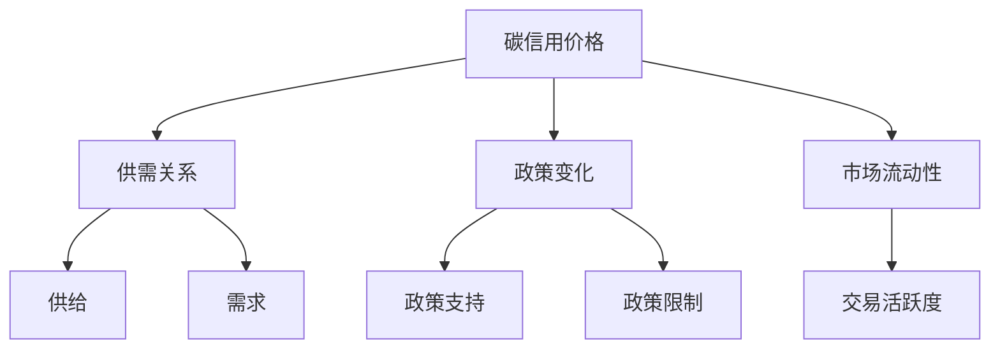

                 

# 巴菲特-芒格的碳信用投资：环保与经济效益的结合

> 关键词：碳信用，巴菲特，芒格，投资策略，环保，经济效益

> 摘要：本文深入分析了巴菲特和芒格在碳信用投资领域的策略与实践，探讨了碳信用作为一种环保工具如何与经济效益相结合，为投资者创造价值。通过系统性地分析碳信用的运作机制、定价模型及投资策略，本文为读者提供了全面的视角来理解这一新兴的投资领域。

---

# 第1章 碳信用投资的背景与概念

## 1.1 碳信用的基本概念
### 1.1.1 碳信用的定义与核心要素
碳信用是一种用于抵消碳排放的金融工具，通过量化企业或个人的碳排放量，并允许其通过购买信用来抵消超额排放。碳信用的核心要素包括：
- **排放配额**：政府或监管机构分配的碳排放额度。
- **信用生成**：通过减少碳排放或参与环保项目生成信用。
- **交易机制**：碳信用在市场上的买卖机制。

### 1.1.2 碳信用的起源与发展
碳信用的概念起源于《京都议定书》，其后在全球范围内逐步发展，成为各国实现碳减排目标的重要工具。碳信用市场的规模不断扩大，覆盖的行业也逐渐增多。

### 1.1.3 碳信用与环境保护的关系
碳信用通过经济手段激励企业减少碳排放，是环境保护与经济发展相结合的重要桥梁。

## 1.2 巴菲特与芒格的投资理念
### 1.2.1 巴菲特的价值投资原则
巴菲特倡导长期价值投资，注重企业的基本面和竞争优势。

### 1.2.2 芒格的多元思维模型
芒格强调跨学科思维，关注复杂系统的相互作用。

### 1.2.3 两人投资理念的结合
巴菲特和芒格的投资理念结合了长期价值和跨学科分析，为碳信用投资提供了独特的视角。

## 1.3 碳信用投资的背景与现状
### 1.3.1 全球碳市场的现状
全球碳市场交易额持续增长，成为减排的重要工具。

### 1.3.2 碳信用在投资中的潜力
碳信用市场潜力巨大，吸引越来越多投资者的关注。

### 1.3.3 巴菲特与芒格为何关注碳信用
两位投资者意识到碳信用市场的长期潜力，将其纳入投资组合中。

## 1.4 本章小结
本章介绍了碳信用的基本概念及其在投资中的潜力，并分析了巴菲特和芒格为何关注这一领域。

---

# 第2章 碳信用的核心机制与运作

## 2.1 碳信用的运作机制
### 2.1.1 碳排放配额的分配
政府或监管机构根据企业历史排放和行业标准分配配额。

### 2.1.2 碳信用的生成与交易
企业通过减排项目生成信用，通过市场进行交易。

### 2.1.3 碳信用的核查与认证
独立机构对信用的合规性进行审核和认证。

## 2.2 碳信用的类型与特点
### 2.2.1 核电信用
由核电项目产生的信用。

### 2.2.2 可再生能源信用
由风能、太阳能等可再生能源项目产生的信用。

### 2.2.3 节能项目信用
由能效提升项目产生的信用。

## 2.3 碳信用的评估与定价
### 2.3.1 碳信用的价格影响因素
供需关系、政策变化、市场流动性等。

### 2.3.2 碳信用的市场供需分析
供不应求时价格上涨，供过于求时价格下跌。

### 2.3.3 碳信用的风险评估
包括市场风险、政策风险和操作风险。

## 2.4 本章小结
本章详细介绍了碳信用的运作机制及其不同类型，分析了影响碳信用价格的因素。

---

# 第3章 巴菲特与芒格的碳信用投资策略

## 3.1 巴菲特的长期价值投资策略
### 3.1.1 低市盈率与高ROE的投资标准
巴菲特倾向于投资低市盈率、高净资产收益率的企业。

### 3.1.2 碳信用企业的财务分析
分析企业的财务状况、盈利能力和发展潜力。

### 3.1.3 企业竞争优势的评估
评估企业的市场地位、技术优势和成本优势。

## 3.2 芒格的多元思维模型在碳信用投资中的应用
### 3.2.1 环保政策的理解与分析
芒格通过跨学科视角理解环保政策的复杂性。

### 3.2.2 碳信用市场的复杂性与风险
分析市场的复杂性和潜在风险。

### 3.2.3 碳信用投资的长期视角
芒格强调长期视角，关注市场的长期趋势。

## 3.3 巴菲特与芒格投资策略的结合
### 3.3.1 碳信用投资的长期价值
结合长期价值和多元思维模型，挖掘碳信用市场的投资机会。

### 3.3.2 碳信用市场的结构性机会
寻找市场中的结构性机会，如政策支持的行业。

### 3.3.3 投资组合的优化与风险控制
优化投资组合，分散风险，确保稳健收益。

## 3.4 本章小结
本章分析了巴菲特和芒格的碳信用投资策略，并探讨了两者结合的优势。

---

# 第4章 碳信用投资的数学模型与算法原理

## 4.1 碳信用定价的数学模型
### 4.1.1 碳信用价格的影响因素分

### 4.1.2 碳信用定价的数学公式

$$ \text{碳信用价格} = \alpha \times \text{供给} + \beta \times \text{需求} + \gamma \times \text{政策影响} $$

其中，$\alpha$、$\beta$、$\gamma$ 是系数，代表各自因素对价格的影响程度。

---

通过以上章节的分析，我们可以全面了解巴菲特和芒格如何在碳信用投资中实现环保与经济效益的结合。接下来的章节将深入探讨碳信用投资的系统架构、项目实战及最佳实践，为读者提供更全面的视角。

