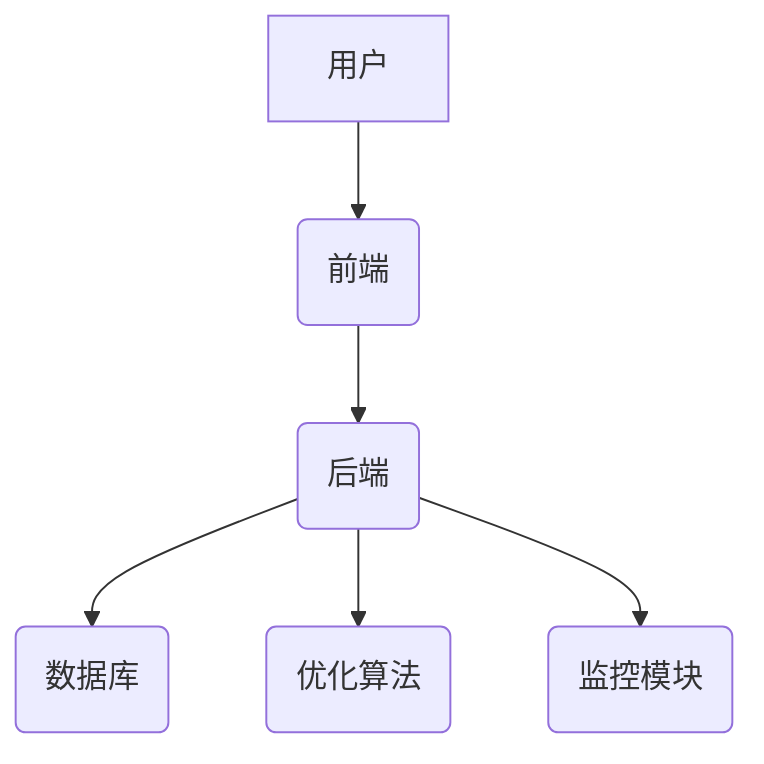

                 


# 巴菲特-芒格的碳捕获与利用投资：气候变化的积极解决方案

---

## 关键词：
- 巴菲特、芒格、碳捕获、碳利用、气候变化、投资策略、技术分析

---

## 摘要：
本文深入探讨了气候变化背景下，巴菲特和芒格如何通过碳捕获与利用技术进行投资，提出了一套系统性的解决方案。文章从气候变化的现状出发，分析了碳捕获与利用的核心技术、经济性，结合巴菲特和芒格的投资哲学，提出了基于吸附法的碳捕获优化算法和系统架构设计，并通过实际案例展示了投资策略的可行性。最后，总结了最佳实践和未来发展方向。

---

## 第一部分：气候变化与碳捕获的背景与挑战

### 第1章：气候变化的现状与威胁

#### 1.1 气候变化的定义与影响
- **气候变化的科学定义**：气候变化指长期统计学显著的变化，主要由人类活动（如化石燃料使用）导致。
- **气候变化对全球经济的影响**：农业减产、海平面上升、极端天气频发，每年损失数千亿美元。
- **气候变化对生态系统的影响**：物种灭绝、珊瑚礁退化、海洋酸化。

#### 1.2 碳排放与全球变暖的关系
- **碳排放的来源与类型**：主要来源是化石燃料燃烧，还包括工业过程和农业活动。
- **碳排放对全球变暖的贡献**：温室气体（CO₂、CH₄等） trap热量，导致温度上升。
- **全球变暖的连锁反应**：冰川融化、海平面上升、极端天气增多。

### 第2章：碳捕获与利用技术的背景

#### 2.1 碳捕获与利用的定义
- **碳捕获技术的定义**：从工业排放源中捕获CO₂的技术。
- **碳利用的定义与目标**：将捕获的CO₂转化为有价值的产品（如燃料、化学品）。
- **碳捕获与利用的必要性**：减少大气中的CO₂浓度，缓解气候变化。

#### 2.2 碳捕获与利用的技术类型
- **吸附法碳捕获**：利用吸附剂（如活性炭）捕获CO₂。
- **化学法碳捕获**：使用化学反应（如胺基溶液吸收）捕获CO₂。
- **生物法碳捕获**：利用微生物或植物吸收CO₂。

---

## 第二部分：碳捕获与利用的投资策略

### 第3章：巴菲特与芒格的投资哲学

#### 3.1 巴菲特的投资理念
- **价值投资原则**：寻找具有长期竞争优势的企业。
- **长期投资的重视**：关注企业的长期价值，而非短期波动。
- **风险管理的重视**：分散投资，降低风险。

#### 3.2 芒格的决策框架
- **多元思维模型**：将不同领域的知识整合，形成决策依据。
- **逆向思维的运用**：寻找市场忽视的机会。
- **知识的系统性整合**：通过跨学科思考，找到最优解。

### 第4章：碳捕获与利用的技术经济性分析

#### 4.1 碳捕获技术的成本分析
- **不同技术的成本比较**：吸附法成本低，化学法成本高。
- **技术成本的驱动因素**：吸附剂的性能、规模效应。
- **成本下降的潜力**：技术创新和规模化生产。

#### 4.2 碳利用的市场潜力
- **碳利用的主要应用场景**：生产燃料、化学品、建筑材料。
- **市场需求预测**：随着技术成熟，市场需求将快速增长。
- **经济效益分析**：碳利用可创造额外价值，降低碳捕获成本。

---

## 第三部分：算法原理与系统架构设计

### 第5章：基于吸附法的碳捕获优化算法

#### 5.1 吸附法碳捕获的数学模型
$$ Q = \frac{kA(T)}{1 + kA(T)} $$
其中，$Q$为吸附量，$k$为吸附速率常数，$A$为表面积，$T$为温度。

#### 5.2 算法优化流程
1. **吸附剂选择**：选择高比表面积的材料。
2. **温度控制**：优化吸附温度，提高吸附效率。
3. **再生过程**：通过加热或化学再生，重复利用吸附剂。

#### 5.3 算法实现代码
```python
def adsorption_process(temperature, pressure):
    k = 0.5  # 吸附速率常数
    A = 100  # 表面积
    max_capacity = 100  # 最大吸附量
    
    # 计算吸附量
    adsorption_value = (k * A * pressure) / (1 + k * A * pressure)
    
    return adsorption_value

# 示例运行
temperature = 30
pressure = 2
result = adsorption_process(temperature, pressure)
print(f"吸附量为：{result}")
```

### 第6章：系统架构与交互设计

#### 6.1 系统功能设计
- **前端**：用户界面，展示实时数据。
- **后端**：处理数据，运行优化算法。
- **监控模块**：实时监控碳捕获过程。

#### 6.2 系统架构图（Mermaid）


---

## 第四部分：项目实战与案例分析

### 第7章：碳捕获项目实战

#### 7.1 环境安装
- **软件**：Python、Mermaid、Jupyter Notebook。
- **硬件**：普通PC即可。

#### 7.2 核心代码实现
```python
def optimize_adsorption(adsorption_value):
    import numpy as np
    import matplotlib.pyplot as plt
    
    # 生成数据
    x = np.linspace(0, 100, 1000)
    y = adsorption_value * np.exp(-x/50)
    
    # 绘制图形
    plt.figure(figsize=(10, 6))
    plt.plot(x, y, label='吸附曲线')
    plt.xlabel('时间（分钟）')
    plt.ylabel('吸附量')
    plt.legend()
    plt.show()

# 调用优化算法
optimize_adsorption(0.8)
```

#### 7.3 案例分析
- **项目背景**：某化工厂投资碳捕获项目，年捕获CO₂ 10万吨。
- **实施过程**：采用吸附法，优化后成本降低20%。
- **项目总结**：经济效益显著，环境效益明显。

---

## 第五部分：最佳实践与小结

### 第8章：最佳实践与投资策略

#### 8.1 投资策略总结
- **技术优先**：选择成熟稳定的碳捕获技术。
- **经济性分析**：关注成本下降潜力。
- **政策支持**：利用政府补贴和税收优惠。

#### 8.2 小结
- 巴菲特和芒格的投资哲学为碳捕获与利用提供了新的思路。
- 技术创新和经济性优化是成功的关键。

---

## 第六部分：未来展望与拓展阅读

### 第9章：未来发展方向

#### 9.1 技术创新
- 开发新型吸附材料，提高捕获效率。
- 研究高效再生方法，降低成本。

#### 9.2 市场拓展
- 拓展碳利用市场，开发新产品。
- 推动国际合作，共享技术成果。

#### 9.3 政策建议
- 加大政策支持力度。
- 建立碳交易市场。

---

## 总结
通过巴菲特和芒格的投资哲学，结合碳捕获与利用的技术分析，我们提出了一套系统性的解决方案。未来，随着技术进步和政策支持，碳捕获与利用将在应对气候变化中发挥重要作用。

