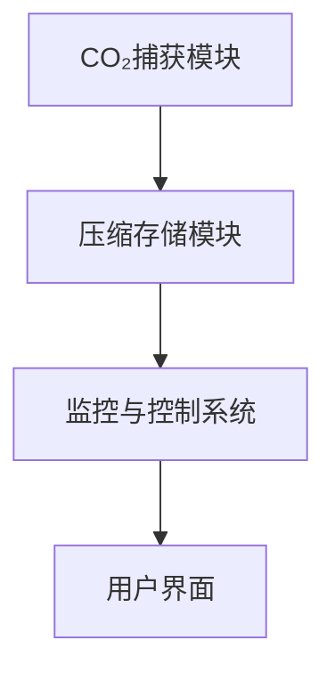

                 


# 巴菲特-芒格的碳捕获技术投资：应对气候变化的关键

## 关键词：碳捕获技术，巴菲特，芒格，气候变化，投资策略，可持续发展

## 摘要：  
本文深入探讨了巴菲特和芒格在碳捕获技术领域的投资策略，分析了碳捕获技术的原理、分类及其在应对气候变化中的关键作用。通过结合两位投资大师的理念，文章详细阐述了碳捕获技术的经济性、可持续性以及未来投资机会，为读者提供了全面的视角和深入的见解。

---

# 第一部分: 巴菲特-芒格的碳捕获技术投资概述

## 第1章: 碳捕获技术与气候变化应对

### 1.1 碳捕获技术的基本概念

#### 1.1.1 碳捕获技术的定义  
碳捕获技术（Carbon Capture Technology）是指通过物理、化学或生物方法，从排放源中捕获二氧化碳（CO₂），并将其储存或转化为其他物质的技术。它是应对气候变化的关键技术之一，能够有效减少温室气体的排放。

#### 1.1.2 碳捕获技术的核心原理  
碳捕获技术的核心在于通过特定的材料或化学反应捕获CO₂，随后将其压缩、运输并储存，或者将其转化为燃料、化学品或其他有价值的产品。这一过程可以减少大气中CO₂的浓度，从而减缓气候变化。

#### 1.1.3 碳捕获技术的边界与外延  
碳捕获技术的边界包括从CO₂的捕获、运输到储存或利用的全过程。其外延则涉及相关技术的经济性、政策支持以及与可再生能源的结合。

### 1.2 碳捕获技术的分类与特点

#### 1.2.1 吸收法  
吸收法通过使用化学吸收剂（如胺类）捕获CO₂。其优点是捕获效率高，但成本较高且能耗较大。

#### 1.2.2 转化法  
转化法将CO₂转化为燃料或化学品。例如，通过催化反应将CO₂转化为甲醇或乙醇，实现资源化利用。

#### 1.2.3 埋存法  
埋存法将捕获的CO₂注入地下深处的地质结构中，如盐水层或枯竭的油气藏。这种方法能够长期储存CO₂，但需要考虑地质稳定性。

#### 1.2.4 各种技术的优缺点对比  
| 技术类型 | 优点 | 缺点 |
|----------|------|------|
| 吸收法   | 高效率 | 成本高 |
| 转化法   | 资源化 | 技术复杂 |
| 埋存法   | 稳定性 | 风险存在 |

---

## 第2章: 巴菲特-芒格与碳捕获技术的结合

### 2.1 碳捕获技术的经济性分析

#### 2.1.1 投资成本分析  
碳捕获技术的投资成本较高，但随着技术进步和规模效应，成本正在逐步降低。

#### 2.1.2 经济回报模型  
碳捕获技术的经济回报取决于碳价格和政策支持。例如，较高的碳税会增加对碳捕获技术的需求，从而提升其经济回报。

#### 2.1.3 政策支持的影响  
政府的碳减排政策（如碳交易机制）对碳捕获技术的投资具有重要影响。政策支持可以降低投资风险，提高经济回报。

### 2.2 巴菲特-芒格投资策略的碳捕获技术应用

#### 2.2.1 碳捕获技术的投资逻辑  
巴菲特和芒格的投资逻辑强调长期价值和可持续性。他们认为碳捕获技术是应对气候变化的重要手段，具有广阔的应用前景。

#### 2.2.2 投资组合的构建  
巴菲特和芒格倾向于投资那些具有核心技术优势和良好管理团队的公司。他们关注碳捕获技术的商业化潜力和市场竞争力。

#### 2.2.3 风险管理与控制  
通过多元化投资和严格的风险评估，巴菲特和芒格能够有效控制碳捕获技术投资的风险。

---

# 第二部分: 碳捕获技术的核心原理与数学模型

## 第3章: 碳捕获技术的核心原理与数学模型

### 3.1 碳捕获技术的化学反应机制

#### 3.1.1 吸收法的化学反应  
吸收法的核心反应是胺类吸收剂与CO₂的化学反应：  
$$ \text{胺} + \text{CO}_2 \rightarrow \text{胺碳酸盐} $$  

#### 3.1.2 转化法的化学反应  
转化法的核心反应是CO₂与氢气在催化剂作用下的反应：  
$$ \text{CO}_2 + 2\text{H}_2 \rightarrow \text{CH}_3\text{OH} + \text{H}_2\text{O} $$  

#### 3.1.3 埋存法的物理机制  
埋存法通过高压将CO₂注入地下，利用地质结构的封存能力实现长期储存。

### 3.2 数学模型与公式

#### 3.2.1 碳捕获效率计算公式  
碳捕获效率可以通过以下公式计算：  
$$ \text{捕获效率} = \frac{\text{捕获的碳量}}{\text{排放的总碳量}} $$  

#### 3.2.2 经济回报模型  
经济回报模型可以表示为：  
$$ \text{净收益} = \text{总收入} - \text{总成本} $$  

---

## 第4章: 碳捕获技术的系统架构与实现

### 4.1 碳捕获技术的系统架构

#### 4.1.1 系统功能设计  
碳捕获系统的功能模块包括：  
1. CO₂捕获模块  
2. 压缩存储模块  
3. 监控与控制系统  

#### 4.1.2 系统架构图  
以下是碳捕获系统的架构图：  


---

## 第5章: 项目实战：碳捕获技术的投资与实现

### 5.1 环境安装

#### 5.1.1 技术环境  
建议使用Python和相关库（如NumPy、Matplotlib）进行数据分析和可视化。

### 5.2 核心代码实现

#### 5.2.1 碳捕获效率计算  
以下是计算碳捕获效率的Python代码：  
```python
def calculate_capture_efficiency(captured_carbon, total_emission):
    return captured_carbon / total_emission

captured_carbon = 100  # 假设捕获的碳量为100单位
total_emission = 500    # 总排放量为500单位
efficiency = calculate_capture_efficiency(captured_carbon, total_emission)
print(f"捕获效率为：{efficiency}")
```

#### 5.2.2 经济回报分析  
以下是经济回报分析的Python代码：  
```python
def calculate_net_profit(revenue, cost):
    return revenue - cost

revenue = 200  # 假设收入为200单位
cost = 150     # 假设成本为150单位
profit = calculate_net_profit(revenue, cost)
print(f"净收益为：{profit}")
```

---

## 第6章: 未来展望与投资机会

### 6.1 碳捕获技术的未来发展方向  
未来，碳捕获技术将朝着高效化、低成本化和资源化利用方向发展。例如，通过技术创新进一步降低能耗，提高捕获效率。

### 6.2 投资机会分析  
随着全球碳减排目标的推进，碳捕获技术的投资机会将不断增加。特别是在政策支持和技术进步的双重驱动下，碳捕获技术的投资回报潜力巨大。

---

## 结语  
巴菲特和芒格的投资策略为碳捕获技术的发展提供了重要支持。通过技术创新和政策引导，碳捕获技术将在应对气候变化中发挥关键作用，为可持续发展提供有力保障。

--- 

# 附录  
- 术语表  
- 数据图表  
- 参考文献  

--- 

感谢您的阅读！如需进一步了解，请关注后续内容。

