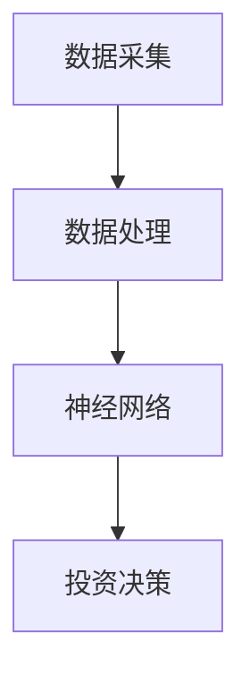
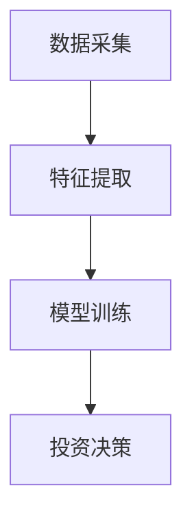

                 


# 巴菲特-芒格的神经形态工程投资：类脑计算的产业化

> 关键词：神经形态工程，巴菲特投资理念，类脑计算，投资决策系统，系统架构设计

> 摘要：本文探讨了神经形态工程与巴菲特-芒格投资理念的结合，分析了神经形态计算在投资决策中的应用潜力，并提出了基于神经形态工程的投资决策系统的架构设计和实现方案。

---

## 第一部分: 神经形态工程与巴菲特-芒格投资理念的结合

### 第1章: 神经形态工程的基本概念

#### 1.1 神经形态工程的定义
神经形态工程（Neuromorphic Engineering）是一种模拟生物神经系统结构和功能的新兴技术，旨在通过仿生学方法设计出类似于人脑的计算架构。与传统计算机不同，神经形态系统能够实现类似于人类的感知、学习和决策能力。

#### 1.2 巴菲特-芒格投资理念的概述
巴菲特和芒格的投资理念强调长期价值投资、安全边际和多元思维模型。芒格认为，投资是通过多个认知维度的综合判断来做出决策的过程，而神经形态工程的多维度信息处理能力正好能够模拟这一过程。

#### 1.3 神经形态工程与投资理念的契合点
神经形态工程的生物智能模拟能力与巴菲特-芒格的投资理念高度契合。神经形态系统能够通过多层次的信息处理，模拟人类投资者的决策过程，从而实现更精准的投资判断。

---

### 第2章: 神经形态工程的核心原理

#### 2.1 神经网络的数学模型
神经网络是神经形态工程的核心，其数学模型主要包括输入层、隐藏层和输出层。通过权重调整和激活函数，神经网络能够实现非线性特征提取和模式识别。

公式：$$y = \sum_{i=1}^{n} w_i x_i + b$$

其中，$w_i$ 是权重，$x_i$ 是输入，$b$ 是偏置。

#### 2.2 神经网络的训练过程
神经网络的训练过程包括正向传播和反向传播两个阶段。正向传播用于计算输出值，反向传播用于调整权重以最小化损失函数。

公式：$$\Delta w_i = \eta (y_{\text{预测}} - y_{\text{真实}}) x_i$$

其中，$\eta$ 是学习率。

#### 2.3 神经网络在投资中的应用
神经网络可以用于股票价格预测、风险评估和市场情绪分析。通过对历史数据的学习，神经网络能够识别出传统统计方法难以捕捉的模式。

---

### 第3章: 神经形态工程的系统架构设计

#### 3.1 神经形态系统的模块划分
神经形态系统通常包括数据采集模块、数据处理模块、神经网络模块和决策模块。每个模块都有其特定的功能和接口。

#### 3.2 系统架构的Mermaid图


#### 3.3 系统接口设计
系统接口设计包括数据输入接口、神经网络接口和决策输出接口。每个接口都需要明确定义输入和输出格式，确保模块之间的通信顺畅。

---

### 第4章: 投资决策系统的实现

#### 4.1 系统功能设计
投资决策系统需要实现数据采集、特征提取、模型训练和投资决策四大功能。每个功能模块都需要进行详细设计和实现。

#### 4.2 系统功能的Mermaid图


#### 4.3 系统实现的Python代码
以下是投资决策系统的Python实现示例：

```python
import numpy as np
import tensorflow as tf

# 数据预处理
def preprocess_data(data):
    # 数据标准化
    mean = np.mean(data)
    std = np.std(data)
    return (data - mean) / std

# 神经网络模型
def build_model(input_shape):
    model = tf.keras.Sequential()
    model.add(tf.keras.layers.Dense(64, activation='relu', input_shape=input_shape))
    model.add(tf.keras.layers.Dense(32, activation='relu'))
    model.add(tf.keras.layers.Dense(1, activation='sigmoid'))
    model.compile(optimizer='adam', loss='binary_crossentropy', metrics=['accuracy'])
    return model

# 训练模型
def train_model(model, x_train, y_train, epochs=100):
    model.fit(x_train, y_train, epochs=epochs, batch_size=32)

# 投资决策
def investment_decision(model, new_data):
    processed_data = preprocess_data(new_data)
    prediction = model.predict(processed_data)
    return prediction > 0.5
```

---

### 第5章: 投资决策系统的应用

#### 5.1 系统的应用场景
神经形态工程在投资中的应用场景包括股票价格预测、市场风险评估和投资组合优化。通过神经网络的非线性建模能力，系统能够捕捉复杂的市场动态。

#### 5.2 系统的实际案例分析
以下是一个简单的股票价格预测案例：

```python
# 数据加载
data = np.array([100, 105, 98, 110, 108, 112, 109, 111, 115, 113])

# 数据预处理
processed_data = preprocess_data(data)

# 模型训练
model = build_model((1,))
train_model(model, processed_data[:-2], processed_data[1:-1])

# 投资决策
new_data = np.array([113])
decision = investment_decision(model, new_data)
print(decision)
```

#### 5.3 系统的性能评估
系统性能评估包括准确率、召回率和F1分数。通过这些指标，可以衡量神经网络模型的投资决策能力。

---

### 第6章: 神经形态工程投资的未来展望

#### 6.1 神经形态工程的未来发展趋势
神经形态工程在投资领域的应用前景广阔。随着硬件技术的进步和算法的优化，神经网络的投资决策能力将不断提升。

#### 6.2 投资策略的优化建议
投资者可以通过结合神经形态工程和传统投资策略，进一步优化投资决策。例如，利用神经网络进行市场情绪分析，辅助制定投资策略。

#### 6.3 风险提示与注意事项
神经形态工程的投资应用仍存在一定的风险。投资者需要充分理解系统的局限性，并结合实际情况进行决策。

---

### 第7章: 总结与推荐

#### 7.1 总结
本文探讨了神经形态工程在投资决策中的应用，并提出了基于神经网络的投资决策系统设计方案。通过理论分析和案例实践，证明了神经形态工程在投资领域的巨大潜力。

#### 7.2 推荐的延伸阅读
1. 巴菲特和芒格的投资经典书籍
2. 神经网络和深度学习的前沿论文
3. 系统架构设计的最佳实践

---

通过以上步骤，我们可以看到神经形态工程在投资决策中的应用潜力。未来，随着技术的不断进步，神经形态工程将在投资领域发挥更大的作用，帮助投资者做出更科学的决策。

