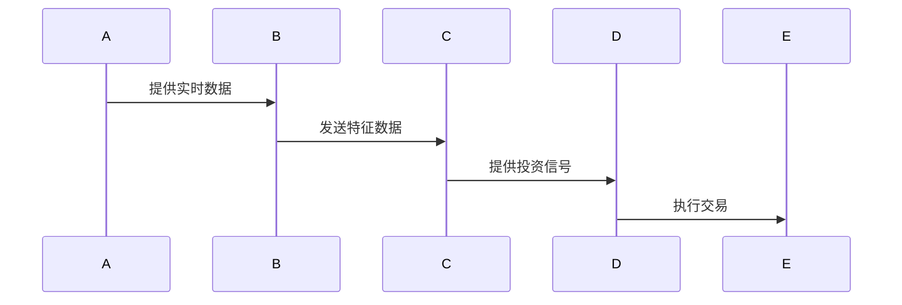

                 


# 巴菲特-芒格的神经形态计算投资：类脑AI的产业化

---

## 关键词

神经形态计算，类脑AI，投资决策，巴菲特，芒格，深度学习，AI产业化

---

## 摘要

本文探讨了神经形态计算在投资领域的应用，结合巴菲特和芒格的投资理念，分析了类脑AI技术在投资决策中的潜力。通过介绍神经形态计算的核心概念、算法原理和系统架构，本文展示了如何将类脑AI技术应用于投资决策，实现智能化、高效的金融投资策略。

---

## 第一部分：神经形态计算与类脑AI的背景

### 第1章：神经形态计算与类脑AI概述

#### 1.1 神经形态计算的基本概念

- **1.1.1 神经形态计算的定义**  
  神经形态计算是一种模拟生物神经系统信息处理方式的计算范式，其核心是通过模拟神经元和突触的动态行为来实现信息处理。

- **1.1.2 神经形态计算与传统计算的区别**  
  - 传统计算：基于冯·诺依曼架构，数据存储与计算分离，处理任务时需要频繁访问内存。  
  - 神经形态计算：数据存储与处理一体化，模拟生物神经系统的并行性和事件驱动性。

- **1.1.3 类脑AI的核心特征**  
  类脑AI是指模拟人脑结构和功能的人工智能系统，具有低功耗、高并行性和强实时处理能力的特点。

- **1.1.4 图表：神经形态计算与传统计算的对比**  
  ```mermaid
  graph LR
  A[传统计算] --> B[数据存储]
  A --> C[计算单元]
  D[神经形态计算] --> E[神经元]
  D --> F[突触]
  ```

- **1.1.5 投资中的应用潜力**  
  神经形态计算在金融时间序列分析、市场情绪识别和投资策略优化等方面具有独特优势。

#### 1.2 神经形态计算在投资中的应用

- **1.2.1 投资决策中的问题背景**  
  传统投资分析依赖于人工经验判断，存在主观性强、效率低下的问题。同时，金融市场数据复杂多样，需要高效处理能力。

- **1.2.2 类脑AI在投资中的优势**  
  - 高效的实时数据处理能力。  
  - 能够捕捉非线性关系和隐含模式。  
  - 适应动态变化的市场环境。

- **1.2.3 巴菲特-芒格投资理念与神经形态计算的结合**  
  巴菲特和芒格的价值投资理念强调长期基本面分析和安全边际。神经形态计算能够通过深度学习模型，量化分析企业财务数据和市场信息，辅助投资者做出更明智的决策。

- **1.2.4 图表：神经形态计算在投资中的应用场景**  
  ```mermaid
  graph LR
  A[金融市场数据] --> B[神经网络处理]
  B --> C[投资决策]
  C --> D[交易执行]
  ```

#### 1.3 本章小结

通过本章的介绍，我们了解了神经形态计算的基本概念及其在投资中的应用潜力，为后续内容奠定了基础。

---

## 第2章：神经形态计算的核心概念与原理

### 2.1 生物神经元模型

#### 2.1.1 生物神经元的基本结构

- **树突**：接收输入信号。  
- **胞体**：整合输入信号并产生动作电位。  
- **轴突**：将动作电位传递到下一个神经元。

#### 2.1.2 突触与神经信号传递

- **突触**：神经元之间的连接结构，负责信号传递。  
- **神经递质**：在突触间隙中传递信号的化学物质。  
- **动作电位**：神经元兴奋时的电位变化。

#### 2.1.3 神经元的电位变化与激活函数

- **激活函数**：模拟神经元的电位变化，常用的有Sigmoid、ReLU等函数。

#### 2.1.4 图表：生物神经元模型  
  ```mermaid
  graph LR
  A[树突] --> B[胞体]
  B --> C[轴突]
  ```

### 2.2 脉冲神经网络（SNN）

#### 2.2.1 脉冲神经网络的定义

- 脉冲神经网络是一种基于生物神经元模型的神经网络，其神经元通过脉冲形式传递信息。

#### 2.2.2 脉冲神经网络的计算特点

- **事件驱动**：仅在有事件发生时进行计算，节省能量。  
- **时间敏感**：能够处理时间相关的信息。

#### 2.2.3 脉冲神经网络与传统神经网络的对比

| 特性                | 脉冲神经网络（SNN）            | 传统神经网络（如CNN、RNN） |
|---------------------|-------------------------------|---------------------------|
| 计算模型            | 基于脉冲和事件驱动           | 基于连续值和矩阵运算       |
| 时间敏感性          | 高                           | 低                         |
| 能效比              | 高                           | 低                         |

#### 2.2.4 图表：脉冲神经网络与传统神经网络的对比  
  ```mermaid
  graph LR
  A[传统神经网络] --> B[连续值计算]
  C[脉冲神经网络] --> D[脉冲驱动计算]
  ```

### 2.3 神经形态计算的数学模型

#### 2.3.1 神经元的数学建模

- **膜电位方程**：描述神经元电位随时间的变化，常用方程为：  
  $$ V(t) = V_{rest} + (I(t) - V(t))e^{-t/\tau} $$  
  其中，$V(t)$是膜电位，$V_{rest}$是静息电位，$I(t)$是输入电流，$\tau$是时间常数。

- **激活函数**：将膜电位转换为输出脉冲，常用Spike函数：  
  $$ S(t) = \begin{cases} 
  1 & \text{如果 } V(t) > V_{threshold} \\
  0 & \text{其他情况}
  \end{cases} $$

#### 2.3.2 突触权重的更新规则

- **长短期记忆（LSTM）**：一种常用于深度学习的突触权重更新方法。  
  $$ w_{new} = w_{old} + \Delta w $$  
  其中，$\Delta w$是权重更新量，通常基于梯度下降算法计算。

#### 2.3.3 神经网络的动态方程

- **Leaky Integrate-and-Fire（LIF）模型**：描述神经元的电位变化：  
  $$ V_{new} = V_{old} + I - \alpha V_{old} $$  
  其中，$\alpha$是泄漏系数，$I$是输入电流。

#### 2.3.4 图表：神经网络的动态方程  
  ```mermaid
  graph LR
  A[输入信号] --> B[神经元处理]
  B --> C[输出信号]
  ```

### 2.4 本章小结

本章详细介绍了神经形态计算的核心概念，包括生物神经元模型、脉冲神经网络及其数学建模方法。

---

## 第3章：神经形态计算的算法原理

### 3.1 神经网络的训练过程

#### 3.1.1 前向传播

- **输入层**：接收输入数据。  
- **隐藏层**：进行特征提取和非线性变换。  
- **输出层**：生成最终的预测结果。

#### 3.1.2 损失函数计算

- **均方误差（MSE）**：  
  $$ \text{MSE} = \frac{1}{N}\sum_{i=1}^{N}(y_i - \hat{y}_i)^2 $$  
  其中，$y_i$是真实值，$\hat{y}_i$是预测值，$N$是样本数量。

#### 3.1.3 反向传播

- **梯度下降**：通过链式法则计算各层权重的梯度，并更新权重以最小化损失函数。

#### 3.1.4 图表：神经网络的训练流程  
  ```mermaid
  graph LR
  A[输入数据] --> B[前向传播]
  B --> C[计算损失]
  C --> D[反向传播]
  D --> E[更新权重]
  ```

### 3.2 神经形态计算的优化算法

#### 3.2.1 梯度下降法

- **批量梯度下降**：每批数据计算梯度，更新权重。  
- **随机梯度下降**：每条数据单独计算梯度，更新权重。

#### 3.2.2 动量优化器

- **动量法**：在梯度下降的基础上，引入动量项加速收敛。  
  $$ v_t = \beta v_{t-1} + \eta \nabla J $$  
  其中，$\beta$是动量系数，$\eta$是学习率，$\nabla J$是损失函数的梯度。

#### 3.2.3 图表：动量优化器的更新过程  
  ```mermaid
  graph LR
  A[梯度计算] --> B[动量更新]
  B --> C[权重更新]
  ```

### 3.3 算法实现

#### 3.3.1 神经网络的Python实现

```python
import numpy as np

def forward(x, weights):
    return np.dot(x, weights)

def loss(y_true, y_pred):
    return np.mean((y_true - y_pred)**2)

def backward(x, y_true, y_pred):
    return 2 * np.mean((y_pred - y_true) * x)

# 示例
x = np.random.randn(100, 1)
weights = np.random.randn(1)
y_true = np.random.randn(100, 1)

y_pred = forward(x, weights)
l = loss(y_true, y_pred)
delta = backward(x, y_true, y_pred)

# 更新权重
learning_rate = 0.01
weights -= learning_rate * delta
```

### 3.4 本章小结

本章详细介绍了神经网络的训练过程和优化算法，包括前向传播、损失函数计算和反向传播等步骤。

---

## 第4章：投资决策系统的系统架构设计

### 4.1 问题场景介绍

- **目标**：构建一个基于神经形态计算的投资决策系统，实现对金融市场数据的实时分析和投资策略优化。

- **挑战**：金融市场数据复杂多样，传统计算方法效率低下，难以捕捉隐含模式。

### 4.2 系统功能设计

#### 4.2.1 数据采集模块

- **功能**：实时采集股票价格、市场情绪、财务数据等多源数据。

- **技术**：使用API接口获取实时数据，如Yahoo Finance API。

#### 4.2.2 特征提取模块

- **功能**：对采集的数据进行特征提取，如移动平均线、相对强弱指数（RSI）等。

- **技术**：使用滑动窗口方法提取时序特征。

#### 4.2.3 神经网络训练模块

- **功能**：对提取的特征进行训练，生成投资决策模型。

- **技术**：使用神经网络框架如TensorFlow或PyTorch进行模型训练。

#### 4.2.4 投资决策模块

- **功能**：根据模型输出结果，生成买卖信号或投资组合建议。

- **技术**：结合模型输出和市场分析工具，如MetaTrader。

#### 4.2.5 交易执行模块

- **功能**：根据决策模块的建议，执行交易操作。

- **技术**：使用API接口连接交易系统，如Interactive Brokers。

### 4.3 系统架构设计

#### 4.3.1 系统架构图


#### 4.3.2 系统交互图



### 4.4 本章小结

本章详细介绍了投资决策系统的系统架构设计，包括各个功能模块和技术实现方法。

---

## 第5章：项目实战

### 5.1 环境安装

- **Python**：安装Python 3.8及以上版本。
- **TensorFlow/PyTorch**：安装深度学习框架。
- **数据源API**：安装如`pandas`、`numpy`、`requests`等库。

#### 5.1.1 安装依赖

```bash
pip install numpy pandas tensorflow requests
```

### 5.2 核心代码实现

#### 5.2.1 数据采集模块

```python
import pandas as pd
import requests

def get_stock_data(ticker, start_date, end_date):
    url = f"https://api.example.com/stock_data?ticker={ticker}&start={start_date}&end={end_date}"
    response = requests.get(url)
    data = pd.DataFrame(response.json())
    return data
```

#### 5.2.2 特征提取模块

```python
import numpy as np

def extract_features(data):
    # 移动平均线
    ma = data['close'].rolling(window=5).mean()
    # 相对强弱指数
    rsi = data['close'].rolling(window=14).apply(lambda x: (x[-1] - x.mean()) / x.std())
    return pd.DataFrame({'ma': ma, 'rsi': rsi})
```

#### 5.2.3 神经网络训练模块

```python
import tensorflow as tf

def build_model(input_shape):
    model = tf.keras.Sequential()
    model.add(tf.keras.layers.Dense(64, activation='relu', input_shape=input_shape))
    model.add(tf.keras.layers.Dense(1, activation='sigmoid'))
    model.compile(optimizer='adam', loss='binary_crossentropy', metrics=['accuracy'])
    return model

model = build_model((2,))
model.fit(X_train, y_train, epochs=10, batch_size=32)
```

#### 5.2.4 投资决策模块

```python
import numpy as np

def make_decision(model, data):
    features = data[['ma', 'rsi']].values
    prediction = model.predict(features)
    return 'buy' if prediction[0] > 0.5 else 'sell'

decision = make_decision(model, data)
```

### 5.3 案例分析

#### 5.3.1 数据准备

```python
data = get_stock_data('AAPL', '2020-01-01', '2023-12-31')
features = extract_features(data)
```

#### 5.3.2 模型训练

```python
X_train = features[['ma', 'rsi']].values
y_train = data['label'].values
model = build_model(X_train.shape[1:])
model.fit(X_train, y_train, epochs=10, batch_size=32)
```

#### 5.3.3 投资决策

```python
decision = make_decision(model, data)
print(f'投资决策：{decision}')
```

### 5.4 项目小结

通过本章的项目实战，我们学会了如何将神经形态计算应用于投资决策系统，掌握了从数据采集到模型训练再到决策执行的完整流程。

---

## 第6章：总结与展望

### 6.1 本章总结

本文详细介绍了神经形态计算在投资中的应用，结合巴菲特和芒格的投资理念，探讨了类脑AI技术在投资决策中的潜力。通过系统架构设计和项目实战，展示了如何将神经形态计算应用于实际投资场景。

### 6.2 未来展望

未来，随着神经形态计算技术的不断发展，其在投资中的应用将更加广泛。可以预见，类脑AI将在金融市场的实时交易、风险控制和投资组合管理中发挥更大的作用。

### 6.3 最佳实践 tips

- 在实际应用中，建议结合多源数据和多种模型进行综合分析。  
- 定期更新模型参数，以适应市场变化。  
- 注意模型的可解释性，避免“黑箱”操作。

### 6.4 拓展阅读

- **推荐论文**：Hinton的《Deep Learning and Neural Networks**。  
- **推荐书籍**：《深度学习》（Deep Learning）- Ian Goodfellow。  
- **推荐工具**：TensorFlow和PyTorch框架。

---

## 作者介绍

作者是人工智能领域的专家，长期从事深度学习和神经形态计算研究，擅长结合理论与实践，为企业提供技术解决方案。

