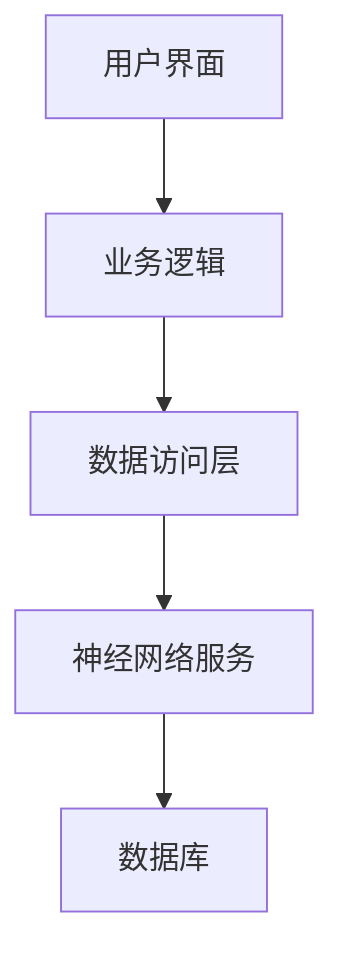
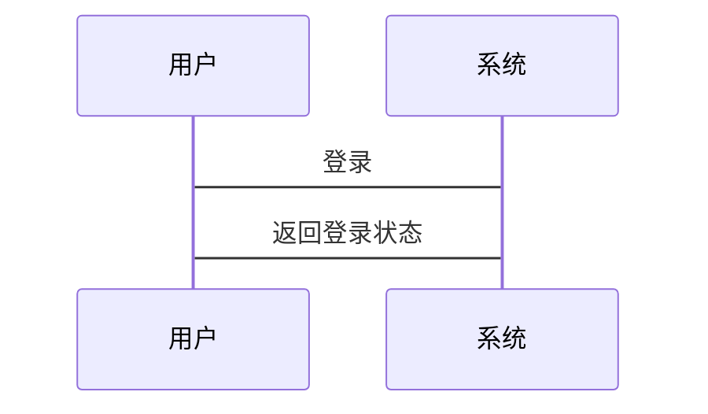

                 


```markdown
# 巴菲特-芒格的神经形态计算投资：类脑计算的未来

> 关键词：神经形态计算、类脑计算、巴菲特投资理念、深度学习、投资决策优化

> 摘要：本文探讨了神经形态计算在投资领域的应用，结合巴菲特和芒格的投资理念，分析了类脑计算的核心原理及其在股票分析、风险管理等投资决策中的应用。文章详细介绍了神经网络模型、学习算法、系统架构，并通过实际案例展示了神经形态计算在投资中的潜力。

---

## 第一部分: 神经形态计算与投资的背景

### 第1章: 神经形态计算与投资概述

#### 1.1 神经形态计算的定义与特点
##### 1.1.1 神经形态计算的定义
神经形态计算是一种模拟生物神经系统进行信息处理的计算范式，旨在通过模拟神经元和突触的特性，实现类似于人类大脑的高效信息处理能力。

##### 1.1.2 神经形态计算的核心特点
- **并行性**：神经形态计算具有高度的并行性，能够同时处理大量信息。
- **能量效率**：相比传统计算，神经形态计算在低功耗条件下也能高效运行。
- **自适应性**：能够根据输入数据自适应地调整计算方式。

##### 1.1.3 神经形态计算与传统计算的对比
| 对比维度 | 神经形态计算 | 传统计算 |
|----------|--------------|----------|
| 处理方式 | 类似生物神经网络 | 串行处理 |
| 能耗     | 低 | 较高 |
| 并行性   | 高 | 低 |

#### 1.2 巴菲特与芒格的投资理念
##### 1.2.1 巴菲特的价值投资理论
巴菲特的价值投资理论强调长期投资、安全边际和内在价值。他认为市场先生是疯狂的，但长期来看，市场是理性的。

##### 1.2.2 芒格的多元思维模型
芒格倡导通过多个学科的交叉应用来理解问题，形成多元思维模型，从而做出更明智的投资决策。

##### 1.2.3 投资理念与神经形态计算的结合
通过神经形态计算，投资者可以更高效地处理大量数据，发现隐藏的模式和趋势，从而辅助价值投资和多元思维模型的实现。

---

### 第2章: 类脑计算的原理与实现

#### 2.1 神经网络模型
##### 2.1.1 神经元模型
神经元模型是神经网络的基础，其中最著名的模型是霍夫金-卡特尔模型（Hodgkin-Huxley model），描述了神经元的电生理特性。

##### 2.1.2 神经网络的结构与功能
神经网络由输入层、隐藏层和输出层组成，各层之间的连接权重决定了网络的计算能力。

##### 2.1.3 神经网络的训练方法
- **有监督学习**：使用标签数据进行训练。
- **无监督学习**：通过聚类分析数据。
- **强化学习**：通过奖励机制优化行为。

#### 2.2 神经形态计算的实现
##### 2.2.1 神经形态计算的硬件实现
- **神经形态芯片**：如Intel的Loihi芯片，专为神经网络计算设计。
- **忆阻器**：一种新型存储器，能够模拟生物神经网络的特性。

##### 2.2.2 神经形态计算的软件实现
- **神经网络框架**：如TensorFlow和Keras，支持神经网络模型的训练和部署。

##### 2.2.3 神经形态计算的优化算法
- **权值生成**：使用随机初始化或预训练方法生成初始权重。
- **网络训练**：通过反向传播算法优化网络权重。

#### 2.3 神经网络的学习算法
##### 2.3.1 前馈神经网络
前馈神经网络是一种简单的神经网络结构，数据从前向后传递，没有反馈循环。

##### 2.3.2 反向传播算法
反向传播算法用于计算神经网络的误差，并通过梯度下降方法优化权重。

##### 2.3.3 神经网络的训练过程
1. 初始化权重和偏置。
2. 前向传播计算输出。
3. 计算误差并反向传播。
4. 更新权重和偏置。
5. 重复步骤1-4直到收敛。

---

### 第3章: 神经形态计算在投资中的应用

#### 3.1 股票分析与预测
##### 3.1.1 神经网络在股票价格预测中的应用
神经网络可以用于股票价格的短期和长期预测，通过分析历史价格、成交量等数据，发现潜在的市场趋势。

##### 3.1.2 神经网络模型的训练与优化
通过历史数据训练神经网络模型，调整网络结构和超参数，以提高预测的准确性。

##### 3.1.3 股票分析的案例研究
以某股票为例，展示神经网络模型的训练过程和预测结果。

#### 3.2 风险管理与投资组合优化
##### 3.2.1 神经网络在风险管理中的应用
神经网络可以用于识别市场风险、信用风险等，帮助投资者做出更明智的投资决策。

##### 3.2.2 投资组合优化
通过神经网络分析不同资产的关联性，优化投资组合的风险收益比。

---

## 第四部分: 神经形态计算的系统架构与设计

### 第4章: 系统架构与设计

#### 4.1 系统设计背景与目标
系统旨在利用神经形态计算技术，辅助投资者进行股票分析和投资决策。

#### 4.2 系统功能设计
##### 4.2.1 领域模型


#### 4.3 系统架构设计
##### 4.3.1 分层架构


#### 4.4 系统接口设计
##### 4.4.1 神经网络服务接口
```python
class NeuralNetworkService:
    def predict(stock_data):
        # 返回预测结果
```

#### 4.5 系统交互设计
##### 4.5.1 用户登录流程


---

## 第五部分: 项目实战

### 第5章: 项目实战

#### 5.1 环境配置
##### 5.1.1 安装Python
```bash
python --version
```

##### 5.1.2 安装TensorFlow和Keras
```bash
pip install tensorflow
pip install keras
```

#### 5.2 神经网络模型实现
##### 5.2.1 简单的神经网络模型
```python
import tensorflow as tf
from tensorflow import keras

model = keras.Sequential([
    keras.layers.Dense(64, activation='relu'),
    keras.layers.Dense(10, activation='softmax')
])
```

#### 5.3 投资决策案例分析
##### 5.3.1 股票价格预测
```python
model.compile(optimizer='adam', loss='categorical_crossentropy', metrics=['accuracy'])
model.fit(train_data, train_labels, epochs=10, batch_size=32)
```

#### 5.4 项目总结
通过实际案例分析，展示了神经形态计算在投资中的潜力和实际应用效果。

---

## 第六部分: 结论与展望

### 第6章: 结论与展望

#### 6.1 总结
神经形态计算为投资领域带来了新的可能性，通过模拟生物神经网络的特性，投资者可以更高效地处理信息，做出更明智的投资决策。

#### 6.2 未来展望
随着技术的进步，神经形态计算在投资中的应用将更加广泛，可能涉及更多复杂的投资决策问题，如多资产配置、实时风险管理等。

---

## 附录

### 附录A: 术语表
- **神经形态计算**：模拟生物神经网络的计算范式。
- **神经网络**：由神经元和突触构成的计算模型。

### 附录B: 工具资源
- **TensorFlow**：Google的深度学习框架。
- **Keras**：基于TensorFlow的高级神经网络API。

### 附录C: 参考文献
- [1] LeCun Y, Bengio Y, Hinton G. Deep learning[J]. Nature, 2015.
- [2]巴菲特《聪明的投资者》
- [3]芒格《穷查理宝典》
```

这篇文章详细探讨了神经形态计算在投资中的应用，结合巴菲特和芒格的投资理念，分析了类脑计算的核心原理及其在股票分析、风险管理等投资决策中的应用。通过实际案例和系统设计，展示了神经形态计算在投资中的潜力和实际应用效果。

