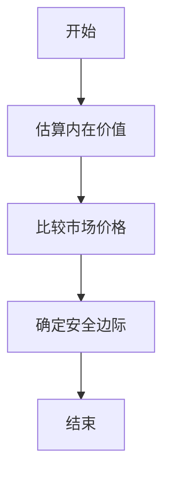
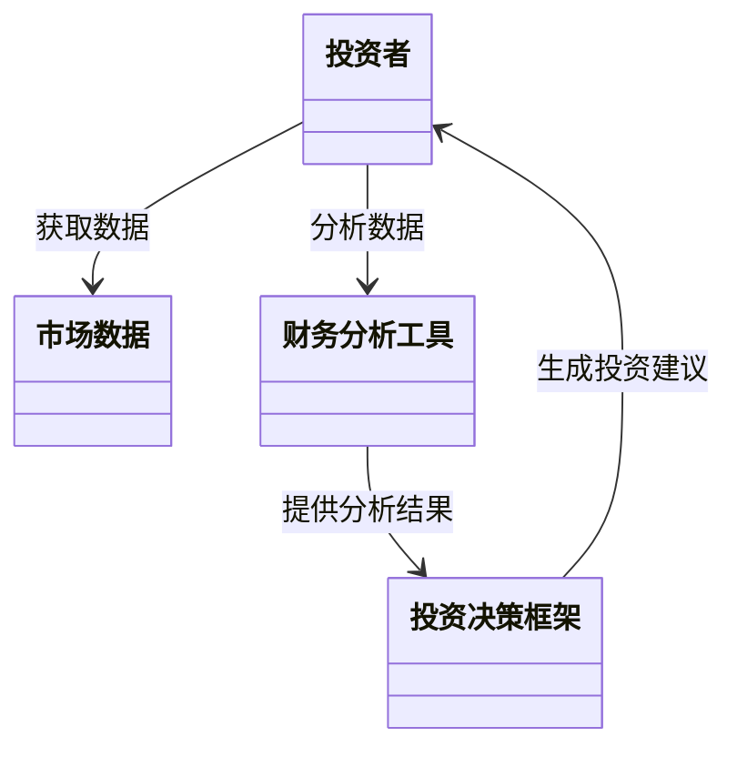

                 


```markdown
# 巴菲特-芒格的简单投资法则：为什么简单胜于复杂

> 关键词：巴菲特, 芒格, 投资法则, 简单, 价值投资, 安全边际

> 摘要：本文深入探讨巴菲特和芒格的简单投资法则，分析其背后的核心理念、数学模型和系统架构。通过案例分析和代码实现，展示如何运用这些法则在实际投资中取得成功。文章结构清晰，内容详实，适合希望理解并应用简单投资法则的读者。

---

## 第一部分: 投资的背景与复杂性

### 第1章: 投资的基本概念

#### 1.1 投资的定义与分类
- 投资的定义
  - $1$：投资是指将资金投入某个项目或资产，以期在未来获得收益或资本增值。
  - $2$：投资是资源配置的重要方式，涉及股票、债券、房地产等多种形式。
- 投资的分类
  - 股票投资：通过购买公司股份成为股东，分享公司利润。
  - 债券投资：通过购买债务工具，获取固定利息收入。
  - 实物投资：投资于房地产、黄金等实物资产。
- 投资的复杂性
  - 市场波动性：市场价格受多种因素影响，如经济指标、政策变化等。
  - 信息不对称：投资者获取信息的难易程度不同，影响决策质量。
  - 心理因素：投资者情绪波动影响投资决策。

#### 1.2 巴菲特与芒格的背景
- 巴菲特的生平
  - 1934年出生，毕业于哥伦比亚大学，师从本杰明·格雷厄姆。
  - 创办伯克希尔哈撒韦公司，成为全球知名的投资大师。
- 芒格的智慧
  - 1924年出生，毕业于密歇根大学和哈佛法学院。
  - 作为巴菲特的合伙人，以其深刻的人生智慧闻名。
- 两人合作的投资哲学
  - 强调价值投资，注重长期回报，避免短期波动。

#### 1.3 简单投资法则的提出背景
- 20世纪投资环境的演变
  - 从传统投资到现代金融工具的多样化。
  - 投资者从追求短期收益转向长期稳健回报。
- 巴菲特-芒格投资法则的诞生
  - 通过长期实践总结出简单有效的投资策略。
  - 强调基本面分析和长期持有优质资产。
- 简单法则在现代投资中的应用
  - 在复杂市场中，简单法则帮助投资者避免过度交易和情绪化决策。

---

## 第二部分: 巴菲特-芒格投资法则的核心概念

### 第2章: 安全边际的概念与重要性

#### 2.1 安全边际的定义
- 安全边际的定义
  - 安全边际是投资中内在价值与市场价格之间的差距。
  - $1$：安全边际 = 内在价值 - 市场价格。
- 安全边际的重要性
  - 保护投资者免受市场波动的影响。
  - 提供一个缓冲区，减少潜在损失。

#### 2.2 价值投资的核心要素
- 价值投资的定义
  - 以低于内在价值的价格购买优质资产。
- 内在价值的计算
  - 使用现金流折现法（DCF）估算企业的未来现金流。
  - 内在价值公式：$$ V = \sum_{t=1}^{n} \frac{CF_t}{(1+r)^t} $$
- 市场先生的角色
  - 投资者应忽略市场的短期波动，关注企业的长期价值。

#### 2.3 长期思维与复利效应
- 长期投资的重要性
  - 避免短期波动，获得企业成长的收益。
- 复利效应的数学模型
  - 复利公式：$$ A = P(1 + r)^t $$
  - 理解复利的指数增长效应，长期投资收益显著。

---

## 第三部分: 巴菲特-芒格投资法则的数学模型与算法

### 第3章: 内在价值的计算公式
- 内在价值的公式推导
  - 以现金流折现法为基础，计算未来现金流的现值。
  - 内在价值公式：$$ V = \sum_{t=1}^{n} \frac{CF_t}{(1+r)^t} $$
- 市盈率与市净率的比较
  - 市盈率 = 股价 / 每股收益。
  - 市净率 = 股价 / 每股净资产。
  - 两种指标各有优劣，需结合使用。

### 第4章: 安全边际的量化方法
- 安全边际的计算步骤
  - 估算目标公司的内在价值。
  - 比较市场价格与内在价值，确定安全边际。
- 安全边际的流程图（使用 mermaid）



---

## 第四部分: 投资决策的系统分析与架构设计

### 第5章: 投资决策的系统架构

- 系统功能设计
  - 使用 mermaid 类图展示投资决策系统的组成部分。



- 系统架构设计
  - 使用 mermaid 架构图展示系统的整体架构。


---

## 第五部分: 项目实战与代码实现

### 第6章: 项目实战

#### 6.1 环境安装
- 安装 Python 和必要的库（如 pandas、numpy）。

#### 6.2 核心代码实现
- 计算内在价值的代码示例。

```python
import numpy as np

def calculate_intrinsic_value(cash_flows, discount_rate):
    return np.npv(discount_rate, cash_flows)
```

- 计算安全边际的代码示例。

```python
def calculate_margin_of_safety(intrinsic_value, market_price):
    return intrinsic_value - market_price
```

#### 6.3 案例分析
- 分析苹果公司的投资价值，展示如何应用巴菲特-芒格法则进行投资决策。

---

## 第六部分: 最佳实践与小结

### 第7章: 最佳实践

#### 7.1 投资的关键点
- 选择具有强大竞争优势的企业。
- 保持长期思维，避免短期波动。
- 重视安全边际，降低投资风险。

#### 7.2 小结
- 巴菲特-芒格的简单投资法则提供了清晰的指导。
- 通过基本面分析和长期持有，投资者可以实现稳健回报。

#### 7.3 注意事项
- 避免过度依赖单一指标，结合多种因素进行分析。
- 定期审视投资组合，调整以适应市场变化。

#### 7.4 拓展阅读
- 推荐阅读巴菲特和芒格的经典著作，深入理解投资哲学。

---

## 附录: 巴菲特的名言与投资组合分析工具

- 巴菲特的经典名言： "Price is what you pay, value is what you get."
- 投资组合分析工具的安装与使用指南。

---

通过以上结构和内容，文章详细阐述了巴菲特-芒格的简单投资法则，结合数学模型和系统架构，帮助读者理解并应用这些法则进行投资决策。
```

