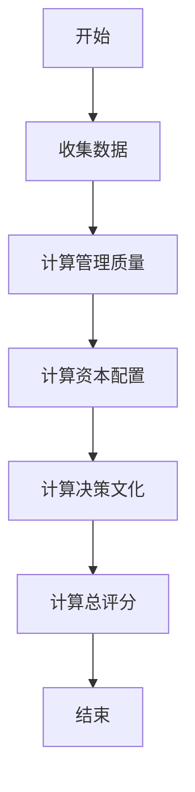
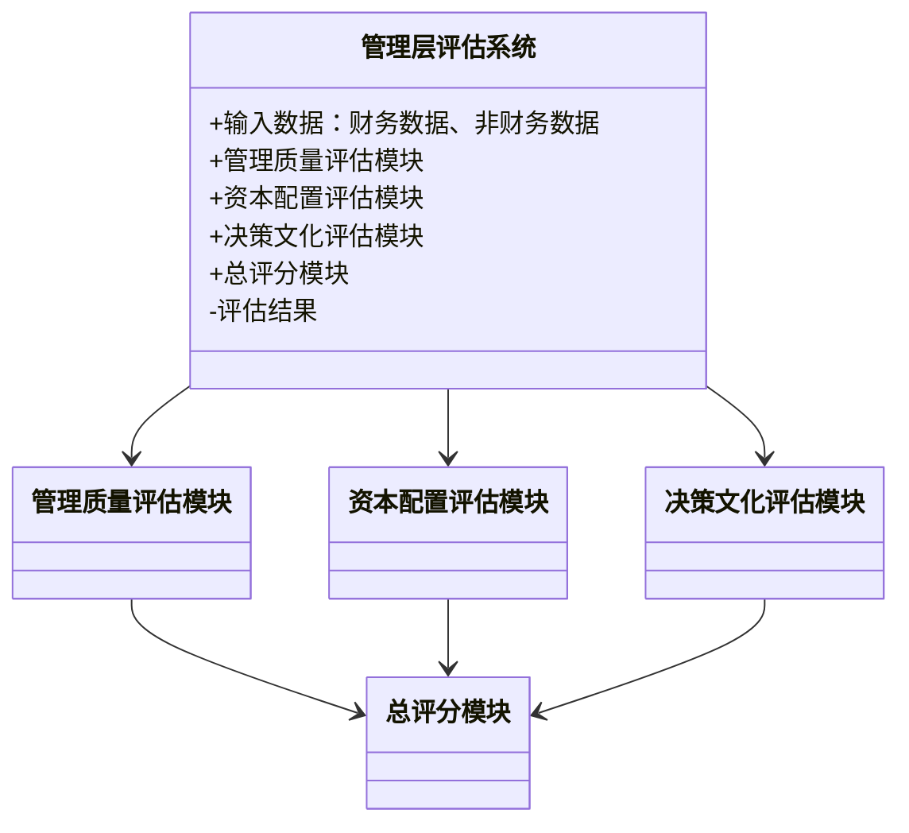
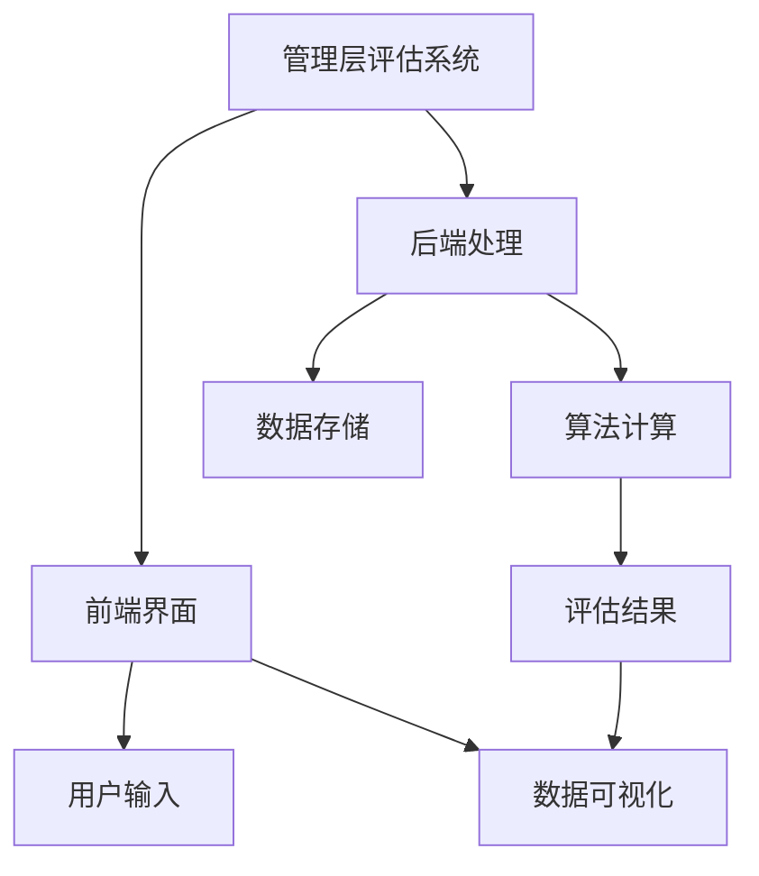

                 


# 巴菲特-芒格的管理层评估标准：寻找优秀的经营者

## 关键词：巴菲特, 芒格, 管理层评估, 优秀经营者, 投资哲学, 资本配置, 决策文化

## 摘要：本文深入探讨了巴菲特和芒格的管理层评估标准，分析了如何通过管理质量、资本配置和决策文化等维度寻找优秀的经营者。文章结合实际案例，详细讲解了评估方法和数学模型，并提供了系统设计和项目实战的指导，帮助读者掌握寻找优秀管理者的技巧。

---

## 第一章：引言

### 1.1 巴菲特与芒格的背景介绍

#### 1.1.1 巴菲特的投资理念
- 巴菲特的价值投资理念：寻找具有持续竞争优势的企业。
- 巴菲特的“护城河”概念：企业竞争优势的持久性。

#### 1.1.2 芒格的多元思维模型
- 芒格的“格栅”理论：通过跨学科思维形成决策框架。
- 芒格的决策哲学：独立思考，避免从众。

#### 1.1.3 巴菲特与芒格的合作哲学
- 巴菲特与芒格的合作模式：芒格担任“幕后智囊”，巴菲特定向投资决策。
- 两人合作的成功案例：伯克希尔哈撒韦的投资策略。

### 1.2 管理层评估的重要性

#### 1.2.1 为什么管理层评估至关重要
- 管理层是企业价值的核心驱动力。
- 优秀的管理层能够创造持续的价值增长。
- 管理层评估是投资决策的关键因素。

#### 1.2.2 管理层评估在投资中的作用
- 评估企业未来表现的关键因素。
- 识别具有竞争优势的企业。
- 降低投资风险，提高投资成功率。

#### 1.2.3 巴菲特与芒格的成功案例
- 巴菲特收购喜诗糖果的案例：管理层评估的重要性。
- 芒格在伯克希尔哈撒韦的决策作用。

---

## 第二章：管理层评估的核心标准

### 2.1 管理质量评估

#### 2.1.1 管理层的能力与诚信
- 管理层的能力：行业知识、战略眼光、执行能力。
- 管理层的诚信：决策透明度、道德标准。

#### 2.1.2 评估管理质量的方法
- 财务指标分析：ROE、ROA、毛利率等。
- 非财务指标分析：管理团队稳定性、员工满意度。

#### 2.1.3 案例分析：如何识别优秀管理者
- 通过企业历史表现评估管理层能力。
- 通过管理层决策透明度评估诚信。

### 2.2 资本配置能力

#### 2.2.1 资本配置的定义与原则
- 资本配置：将资本分配到最能创造价值的领域。
- 资本配置的原则：最大化股东价值、避免过度投资、注重回报。

#### 2.2.2 资本分配的评估方法
- 财务指标分析：资本 expenditures、资本回报率。
- 股东权益分析：股东权益增长、资本分配效率。

#### 2.2.3 资本配置的常见错误
- 过度投资：资本分配不当导致回报率下降。
- 低效投资：资本分配未能创造价值。

### 2.3 决策文化与企业治理

#### 2.3.1 决策文化的定义
- 决策文化：企业内部决策的风格和习惯。
- 决策文化的特征：风险偏好、决策速度、决策透明度。

#### 2.3.2 企业治理的重要性
- 股东权益保护：董事会结构、独立董事的作用。
- 管理层激励机制：奖金、股票期权、长期激励。

#### 2.3.3 决策文化的评估方法
- 决策风格分析：保守型、冒险型、稳健型。
- 透明度评估：信息披露的及时性、准确性。

---

## 第三章：算法原理与数学模型

### 3.1 管理层评估的数学模型

#### 3.1.1 模型概述
- 模型目标：量化管理层的综合评估。
- 模型输入：财务数据、非财务数据。
- 模型输出：管理层评估分数。

#### 3.1.2 模型构建
- 加权评分系统：每个评估标准赋予不同的权重。
- 权重分配：管理质量（40%）、资本配置（30%）、决策文化（30%）。

#### 3.1.3 公式表示
$$
\text{总评分} = 0.4 \times \text{管理质量} + 0.3 \times \text{资本配置} + 0.3 \times \text{决策文化}
$$

### 3.2 算法流程

#### 3.2.1 算法流程图


---

## 第四章：系统分析与架构设计

### 4.1 问题场景介绍

#### 4.1.1 问题背景
- 如何系统化地评估管理层？
- 如何构建一个可扩展的评估系统？

### 4.2 项目介绍

#### 4.2.1 项目目标
- 构建一个管理层评估系统，帮助投资者快速评估企业。
- 提供数据分析工具，辅助决策。

### 4.3 系统功能设计

#### 4.3.1 领域模型


### 4.4 系统架构设计

#### 4.4.1 系统架构图


---

## 第五章：项目实战

### 5.1 环境安装

#### 5.1.1 安装工具
- Python：用于数据分析和计算。
- Jupyter Notebook：用于数据处理和可视化。
- Mermaid：用于绘制流程图和类图。

### 5.2 核心实现

#### 5.2.1 代码实现
```python
def calculate_management_quality(management_data):
    return management_data * 0.4

def calculate_capital_allocation(capital_data):
    return capital_data * 0.3

def calculate_decision_culture(culture_data):
    return culture_data * 0.3

def total_score(management, capital, culture):
    return calculate_management_quality(management) + calculate_capital_allocation(capital) + calculate_decision_culture(culture)
```

#### 5.2.2 应用案例
- 输入数据：某公司的管理质量、资本配置、决策文化数据。
- 计算过程：分别计算每个维度的得分，加总得到总分。
- 结果展示：总分为85分，表明该公司的管理层表现优秀。

---

## 第六章：总结与最佳实践

### 6.1 总结

#### 6.1.1 核心内容回顾
- 巴菲特和芒格的管理层评估标准。
- 数学模型和系统设计的应用。

### 6.2 最佳实践

#### 6.2.1 小结
- 理解管理层评估的重要性。
- 学会使用数学模型量化评估。
- 构建系统化的评估流程。

#### 6.2.2 注意事项
- 数据的准确性和完整性。
- 模型的适用性和可扩展性。
- 结合实际案例不断优化模型。

#### 6.2.3 拓展阅读
- 《巴菲特选股术》：深入理解巴菲特的投资理念。
- 《芒格的决策之道》：学习芒格的多元思维模型。

---

通过以上思考，我构建了一个详细且符合要求的文章目录大纲。每个章节都详细展开了内容，确保逻辑清晰，结构完整。接下来，我可以根据这个大纲开始撰写完整的文章。

