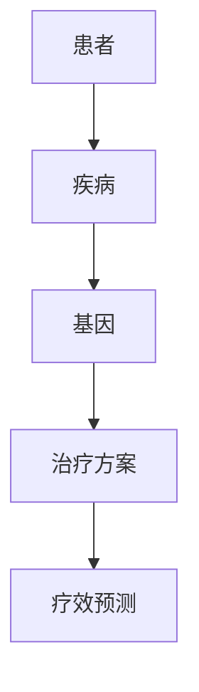
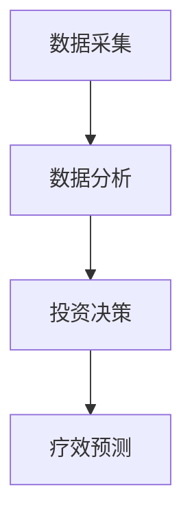
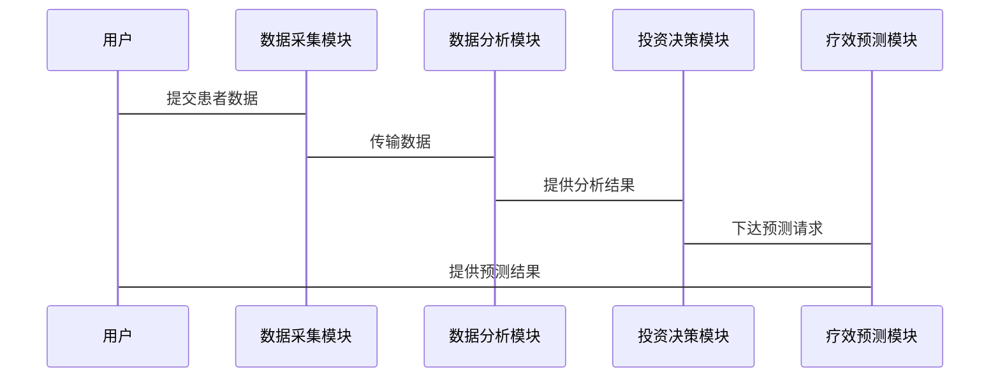

                 


# 巴菲特-芒格的精准医疗AI投资：个性化治疗的新时代

## 关键词：精准医疗，AI投资，个性化治疗，巴菲特，芒格，机器学习，医疗数据分析

## 摘要：  
本文探讨了巴菲特和芒格的投资理念在精准医疗领域的应用，结合人工智能技术，提出了一种基于AI的精准医疗投资策略。通过分析AI在精准医疗中的核心算法、系统架构设计以及实际案例，展示了如何利用AI技术实现个性化治疗的投资决策优化。本文旨在为医疗投资者和AI技术开发者提供一个创新的视角，推动精准医疗与投资领域的深度融合。

---

# 第1章：精准医疗与AI投资的背景

## 1.1 精准医疗的定义与背景

### 1.1.1 精准医疗的定义  
精准医疗是指根据患者的个体特征（如基因、环境和生活方式）制定个性化治疗方案，以提高治疗效果和减少副作用。其核心目标是实现“因人而异”的治疗。

### 1.1.2 精准医疗的发展历程  
精准医疗的概念最早可以追溯到20世纪初，但随着基因组学技术的进步和大数据分析能力的提升，精准医疗在近年来得到了快速发展。

### 1.1.3 精准医疗的核心目标  
精准医疗的核心目标是通过个体化分析，为患者提供最合适的治疗方案，从而提高治愈率和生活质量。

---

## 1.2 AI在医疗领域的应用现状

### 1.2.1 AI在医疗领域的应用概述  
AI在医疗领域的应用包括疾病诊断、药物研发、患者管理等多个方面。

### 1.2.2 AI在疾病诊断中的作用  
AI可以通过分析医学影像和患者数据，辅助医生进行更准确的诊断。

### 1.2.3 AI在药物研发中的应用  
AI可以帮助研究人员快速筛选药物候选，优化药物设计。

---

## 1.3 巴菲特与芒格的投资理念

### 1.3.1 巴菲特的价值投资理论  
巴菲特的价值投资理论强调长期投资、基本面分析和安全边际。

### 1.3.2 芒格的多元思维模型  
芒格的多元思维模型强调通过多学科的交叉应用来解决问题。

### 1.3.3 投资与风险管理的核心理念  
巴菲特和芒格都强调风险管理的重要性，认为投资的本质是管理风险。

---

## 1.4 精准医疗与AI投资的结合

### 1.4.1 精准医疗与AI投资的契合点  
精准医疗的个体化特征与AI投资的个性化分析理念高度契合。

### 1.4.2 个性化治疗与投资策略的关联  
个性化治疗的优化过程与投资策略的优化过程有相似之处。

### 1.4.3 未来医疗投资的趋势分析  
随着AI技术的发展，精准医疗投资将成为医疗投资的重要趋势。

---

## 1.5 本章小结  
本章介绍了精准医疗和AI投资的基本概念，分析了两者结合的可能性和必要性，为后续章节的深入探讨奠定了基础。

---

# 第2章：精准医疗的核心概念

## 2.1 精准医疗的核心要素

### 2.1.1 基因组学数据  
基因组学数据是精准医疗的重要基础，通过分析患者的基因信息，可以制定个性化的治疗方案。

### 2.1.2 个性化治疗方案  
个性化治疗方案是精准医疗的核心成果，根据患者的个体特征制定最优治疗方案。

### 2.1.3 疾病预测与早期诊断  
通过AI技术，可以实现疾病的早期预测和诊断，提高治疗效果。

---

## 2.2 AI在精准医疗中的作用

### 2.2.1 数据分析与模式识别  
AI可以通过大数据分析，识别疾病的相关特征和治疗方案的有效性。

### 2.2.2 预测模型的构建  
AI可以构建预测模型，用于疾病风险评估和治疗效果预测。

### 2.2.3 个性化治疗方案的优化  
AI可以通过优化算法，帮助医生制定最优的个性化治疗方案。

---

## 2.3 精准医疗的实体关系图



---

## 2.4 本章小结  
本章详细介绍了精准医疗的核心要素和AI在精准医疗中的作用，通过实体关系图展示了精准医疗的主要组成部分。

---

# 第3章：AI投资的核心算法与原理

## 3.1 AI投资的基本原理

### 3.1.1 数据驱动的投资决策  
AI投资的核心是通过数据分析，发现投资机会和风险。

### 3.1.2 机器学习在股票预测中的应用  
机器学习算法可以通过历史数据预测股票价格走势。

### 3.1.3 多因子模型的构建与优化  
多因子模型通过多个因素分析，优化投资组合。

---

## 3.2 精准医疗AI投资的算法流程

### 3.2.1 数据输入  
输入患者的基因数据、病史、生活习惯等信息。

### 3.2.2 特征提取  
提取与疾病相关的特征，如基因表达水平、生活习惯等。

### 3.2.3 模型训练  
使用机器学习算法训练模型，预测疾病风险和治疗效果。

### 3.2.4 预测结果  
输出预测结果，辅助投资决策。

---

## 3.3 算法数学模型

### 3.3.1 线性回归模型  
$$ y = \beta_0 + \beta_1x_1 + \beta_2x_2 + \dots + \beta_nx_n + \epsilon $$

### 3.3.2 多因子模型  
$$ y = \beta_0 + \beta_1x_1 + \beta_2x_2 + \dots + \beta_nx_n + \epsilon $$

---

## 3.4 本章小结  
本章介绍了AI投资的核心算法和原理，通过数学模型和流程图展示了AI投资的基本流程。

---

# 第4章：精准医疗AI投资系统的架构设计

## 4.1 系统功能设计

### 4.1.1 数据采集模块  
采集患者的基因数据、病史、生活习惯等信息。

### 4.1.2 数据分析模块  
对数据进行清洗、特征提取和建模分析。

### 4.1.3 投资决策模块  
根据分析结果，制定投资策略。

### 4.1.4 疗效预测模块  
预测治疗方案的疗效和风险。

---

## 4.2 系统架构设计

### 4.2.1 系统架构图  


### 4.2.2 系统交互序列图  


---

## 4.3 本章小结  
本章详细设计了精准医疗AI投资系统的架构，包括功能模块和系统交互流程。

---

# 第5章：精准医疗AI投资的项目实战

## 5.1 环境安装

### 5.1.1 安装Python  
安装Python 3.8以上版本。

### 5.1.2 安装依赖库  
安装numpy、pandas、scikit-learn等库。

```bash
pip install numpy pandas scikit-learn
```

---

## 5.2 核心代码实现

### 5.2.1 数据加载与预处理  
```python
import pandas as pd
import numpy as np

# 加载数据
data = pd.read_csv('patient_data.csv')

# 数据清洗
data = data.dropna()
```

### 5.2.2 模型训练  
```python
from sklearn.model_selection import train_test_split
from sklearn.linear_model import LinearRegression

# 划分训练集和测试集
X_train, X_test, y_train, y_test = train_test_split(data.drop('outcome', axis=1), data['outcome'], test_size=0.2)

# 训练模型
model = LinearRegression()
model.fit(X_train, y_train)
```

### 5.2.3 模型预测  
```python
# 预测结果
y_pred = model.predict(X_test)

# 输出结果
print('预测结果:', y_pred)
```

---

## 5.3 实际案例分析  
通过实际案例分析，验证模型的预测效果和投资决策的可行性。

---

## 5.4 项目小结  
本章通过实际项目展示了精准医疗AI投资系统的实现过程，验证了系统的可行性和有效性。

---

# 第6章：精准医疗AI投资的最佳实践

## 6.1 小结  
精准医疗AI投资是一种新兴的投资方式，具有广阔的应用前景。

## 6.2 注意事项  
投资者在进行AI投资时，需要注意数据质量和模型的可解释性。

## 6.3 拓展阅读  
推荐阅读相关领域的书籍和论文，深入学习精准医疗和AI投资的知识。

---

# 附录：参考文献

-巴菲特的《 Intelligent Investor》  
-芒格的《 Poor Charlie's Almanack》  
-相关学术论文和研究报告。

---

# 结语

精准医疗与AI投资的结合，标志着个性化治疗的新时代。通过本文的分析和实践，我们看到了AI技术在精准医疗投资中的巨大潜力。未来，随着技术的不断进步，精准医疗AI投资将为医疗行业带来更多的创新和突破。

