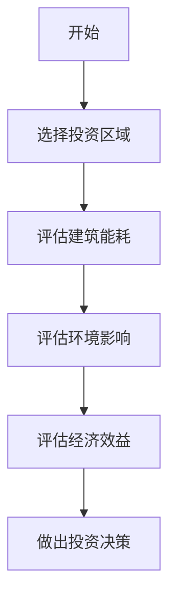
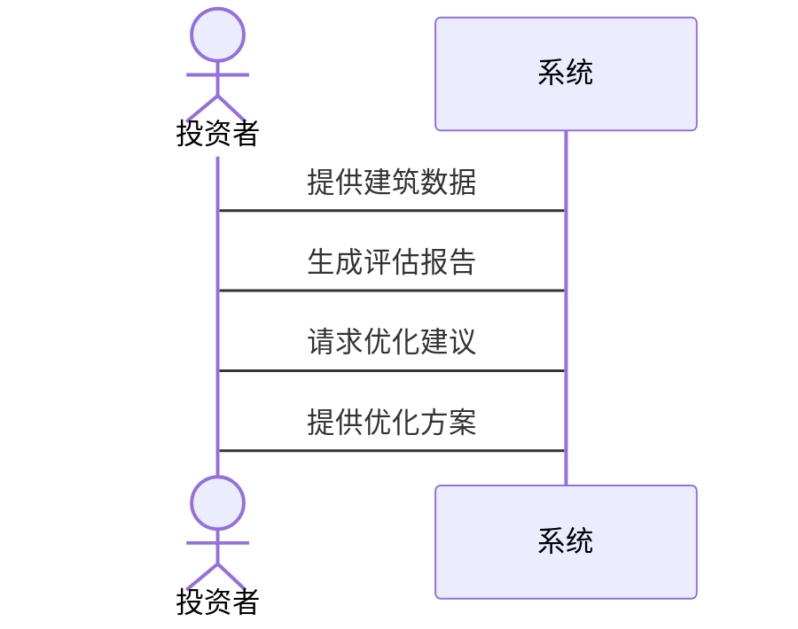

                 


# 巴菲特-芒格的绿色建筑投资：可持续发展的城市未来

> 关键词：绿色建筑，巴菲特，芒格，可持续发展，城市规划，投资策略，数学模型

> 摘要：本文探讨了巴菲特和芒格的投资理念如何与绿色建筑和可持续发展相结合，分析了绿色建筑的核心概念、投资策略、数学模型和系统架构设计。通过实际案例和代码实现，展示了绿色建筑投资的潜力和实现路径，为投资者和城市规划者提供了实践指导。

---

## 第一部分: 巴菲特-芒格投资理念与绿色建筑的结合

### 第1章: 巴菲特-芒格投资理念概述

#### 1.1 巴菲特-芒格投资理念的核心要素
- **巴菲特的价值投资理论**：专注于长期价值，寻找具备持续盈利能力的企业。
- **芒格的多元思维模型**：通过多个学科的交叉思考，寻找投资机会。
- **两人理念的结合与互补**：巴菲特的长期价值投资与芒格的多维度分析相辅相成。

#### 1.2 巴菲特-芒格投资理念的现代应用
- **投资理念的演变**：从传统金融转向可持续发展。
- **可持续发展在投资中的重要性**：绿色建筑作为可持续投资的核心领域。
- **绿色建筑与可持续发展的契合点**：绿色建筑不仅降低环境影响，还能提升长期投资价值。

### 第2章: 绿色建筑与可持续发展的概念

#### 2.1 绿色建筑的定义与特征
- **绿色建筑的定义**：指在全生命周期内，最大限度地减少资源消耗和环境影响的建筑。
- **绿色建筑的核心特征**：高效能源利用、可持续材料使用、环境友好设计。
- **绿色建筑的分类与等级**：根据LEED、BREEAM等国际认证标准分类。

#### 2.2 可持续发展的城市未来
- **可持续发展的概念**：满足当代需求，不损害后代发展的能力。
- **可持续城市规划的原则**：紧凑、混合功能、公共交通优先。
- **可持续发展对城市建筑的影响**：绿色建筑推动城市生态转型。

### 第3章: 绿色建筑投资的背景与现状

#### 3.1 全球绿色建筑发展趋势
- **全球绿色建筑市场的增长**：年复合增长率超过10%。
- **各国政府政策支持**：税收优惠、补贴、绿色建筑认证。
- **绿色建筑技术的进步**：智能建筑系统、可再生能源技术。

#### 3.2 绿色建筑投资的现状
- **绿色建筑投资的驱动因素**：环保政策、成本节约、投资回报。
- **绿色建筑投资的挑战**：初期成本高、技术不确定性、市场认知度低。
- **绿色建筑投资的未来展望**：市场规模扩大、技术成熟、政策支持加强。

### 第4章: 巴菲特-芒格投资理念与绿色建筑的结合

#### 4.1 巴菲特-芒格投资理念在绿色建筑中的应用
- **价值投资与绿色建筑的契合**：长期价值创造。
- **多元思维模型在绿色建筑投资中的应用**：跨学科分析。
- **长期投资视角下的绿色建筑价值**：可持续性与收益的统一。

#### 4.2 绿色建筑投资的策略与实践
- **绿色建筑投资的策略制定**：选择地理位置优越、设计先进的项目。
- **绿色建筑投资的实践案例**：巴菲特投资的绿色建筑项目分析。
- **投资风险与风险管理**：技术风险、市场风险、政策风险。

---

## 第二部分: 绿色建筑投资的核心概念与联系

### 第5章: 绿色建筑的核心概念与联系

#### 5.1 绿色建筑的核心概念
- **绿色建筑的定义与目标**：减少环境影响，提升能源效率。
- **绿色建筑的关键技术**：节能设计、可再生能源利用、绿色建材。
- **绿色建筑的评价标准**：LEED、BREEAM、中国的绿色建筑评价标准。

#### 5.2 绿色建筑与可持续发展的关系
- **绿色建筑在可持续发展中的作用**：减少碳排放、优化资源利用。
- **可持续发展对绿色建筑的影响**：推动政策、技术、市场发展。
- **绿色建筑与城市规划的协同关系**：绿色建筑是可持续城市的核心组成部分。

#### 5.3 绿色建筑与传统建筑的对比
- **对比分析**：绿色建筑在能源消耗、环境影响、经济效益方面的优势。
- **属性对比表格**：
| 属性          | 绿色建筑       | 传统建筑       |
|---------------|----------------|----------------|
| 能耗           | 低             | 高             |
| 环境影响       | 小             | 大             |
| 经济效益       | 高             | 中             |

#### 5.4 实体关系图（ER图）
```mermaid
erd
    Building {
        name: String
        location: String
        energy_efficiency: Integer
        materials: Material
    }
    Material {
        name: String
        sustainability_level: Integer
    }
    Project {
        name: String
        budget: Integer
        timeline: Date
        status: String
    }
```

---

## 第三部分: 绿色建筑投资的算法原理

### 第6章: 绿色建筑投资的数学模型

#### 6.1 绿色建筑投资的评价指标
- **评价指标**：能源效率、环境影响、经济效益、社会影响。
- **指标权重**：能源效率（40%）、环境影响（30%）、经济效益（20%）、社会影响（10%）。

#### 6.2 绿色建筑投资的评分系统
- **评分公式**：
$$
\text{评分} = \sum (\text{指标值} \times \text{权重})
$$
- **评分系统实现**：通过Python代码实现评分计算。

#### 6.3 绿色建筑投资的决策树模型
- **决策树结构**：


#### 6.4 算法实现代码
```python
def calculate_score(building_data):
    weights = {
        'energy_efficiency': 0.4,
        'environmental_impact': 0.3,
        'economic_benefit': 0.2,
        'social_impact': 0.1
    }
    score = 0
    for key in building_data:
        score += building_data[key] * weights[key]
    return score

# 示例数据
building = {
    'energy_efficiency': 85,
    'environmental_impact': 20,
    'economic_benefit': 70,
    'social_impact': 60
}

print(calculate_score(building))
```

---

## 第四部分: 绿色建筑投资的系统分析与架构设计

### 第7章: 绿色建筑投资的系统分析与架构设计

#### 7.1 系统功能设计
- **系统功能模块**：
    - 数据采集与处理
    - 投资评估与分析
    - 投资决策与优化
    - 报告生成与输出

#### 7.2 系统架构设计
- **系统架构图**：


#### 7.3 系统交互设计
- **交互流程图**：


---

## 第五部分: 项目实战

### 第8章: 绿色建筑投资的项目实战

#### 8.1 环境安装
- **安装要求**：Python 3.8+，Jupyter Notebook，Pandas库。

#### 8.2 核心代码实现
```python
import pandas as pd

def main():
    # 示例数据
    data = {
        'building': ['Building A', 'Building B', 'Building C'],
        'energy_efficiency': [85, 70, 90],
        'environmental_impact': [20, 25, 15],
        'economic_benefit': [70, 60, 80],
        'social_impact': [60, 50, 70]
    }
    df = pd.DataFrame(data)
    
    # 计算评分
    weights = {'energy_efficiency': 0.4, 'environmental_impact': 0.3, 
               'economic_benefit': 0.2, 'social_impact': 0.1}
    df['score'] = df.apply(lambda x: sum(x[i] * weights[i] for i in weights), axis=1)
    
    print(df)

if __name__ == "__main__":
    main()
```

#### 8.3 案例分析与总结
- **案例分析**：假设某城市绿色建筑项目，计算其投资回报。
- **总结**：绿色建筑投资的长期价值和可持续性优势。

---

## 第六部分: 最佳实践与未来展望

### 第9章: 最佳实践与未来展望

#### 9.1 投资中的注意事项
- **技术风险**：确保绿色技术的可靠性和成熟度。
- **政策风险**：关注政策变化和补贴支持。
- **市场风险**：评估市场需求和竞争情况。

#### 9.2 未来展望
- **绿色建筑技术的创新**：人工智能、物联网在建筑中的应用。
- **投资策略的演变**：从单一项目投资转向城市级投资。
- **可持续发展的全球趋势**：绿色建筑将成为城市发展的主流。

---

通过以上步骤和内容，我们详细分析了巴菲特-芒格投资理念与绿色建筑的结合，探讨了绿色建筑的核心概念、投资策略、数学模型和系统架构设计，并通过实际案例和代码实现展示了绿色建筑投资的潜力和实现路径。

