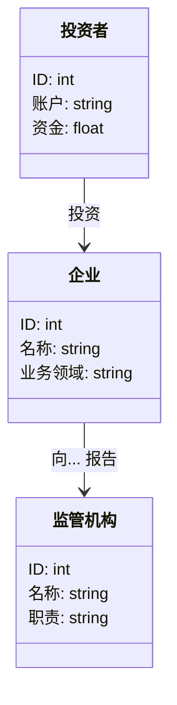
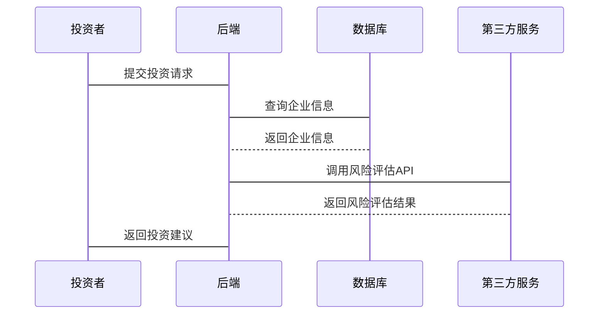

                 


```markdown
# 巴菲特-芒格的网络安全投资：数字时代的新型风险

## 关键词
- 巴菲特-芒格投资理念
- 网络安全
- 数字时代
- 投资风险
- 机器学习

## 摘要
本文探讨了巴菲特和芒格的投资理念如何应用于网络安全领域，特别是在数字时代的新型风险。通过分析网络安全投资的背景、核心概念、算法模型和系统架构设计，结合实际项目案例，为投资者提供科学的决策支持。文章详细介绍了网络安全投资的数学模型、机器学习算法以及系统架构设计，并通过项目实战展示了如何将理论应用于实际投资中。

## 第1章: 巴菲特-芒格投资理念概述

### 1.1 巴菲特-芒格投资理念的核心思想
#### 1.1.1 巴菲特的价值投资理论
巴菲特的价值投资理论强调寻找具有持续竞争优势的企业，注重企业的内在价值，长期持有优质资产。这与网络安全投资中寻找具有长期竞争优势的企业相契合。

#### 1.1.2 芒格的多元思维模型
芒格的多元思维模型强调跨学科思考，通过多个思维模型的结合来做出决策。这在网络安全投资中尤为重要，因为网络安全涉及技术、法律、经济学等多个领域。

#### 1.1.3 两者的结合与应用
将巴菲特的价值投资理念与芒格的多元思维模型结合起来，能够在网络安全投资中更好地识别具有长期竞争优势的企业，并通过多元化的视角评估投资风险。

### 1.2 网络安全的基本概念
#### 1.2.1 网络安全的定义与范畴
网络安全是指保护网络系统和数据免受未经授权的访问、破坏或泄露的措施。其范畴包括网络设备、数据、用户隐私等。

#### 1.2.2 网络安全威胁的分类
网络安全威胁主要包括病毒、黑客攻击、数据泄露、钓鱼攻击等。这些威胁可以来自内部或外部，对企业造成重大损失。

#### 1.2.3 网络安全的重要性与挑战
网络安全的重要性体现在保护企业数据安全、维护用户信任和合规性等方面。然而，随着技术的发展，网络安全威胁也在不断演变，带来了新的挑战。

### 1.3 巴菲特-芒格理念与网络安全的结合
#### 1.3.1 价值投资与网络安全的关联
价值投资理念强调寻找低估的优质企业，这与网络安全投资中寻找具有长期竞争优势的企业相符。网络安全领域的优质企业通常具备强大的研发能力、市场占有率和客户信任。

#### 1.3.2 网络安全作为投资标的的独特性
网络安全作为投资标的具有高成长性、高风险性和技术驱动性的特点。与传统投资领域相比，网络安全投资更依赖于技术进步和创新能力。

#### 1.3.3 数字时代网络安全投资的必要性
随着数字化转型的推进，网络安全成为企业核心竞争力的重要组成部分。投资于网络安全不仅能够保护企业资产，还能为企业创造长期价值。

## 第2章: 网络安全投资的背景与现状

### 2.1 数字化转型与网络安全风险
#### 2.1.1 数字化转型的背景与趋势
数字化转型已成为全球企业的主要发展趋势，数据成为核心资产。然而，数字化转型也带来了更多的网络安全风险。

#### 2.1.2 数字化转型带来的网络安全风险
企业数字化转型过程中，数据泄露、网络攻击等安全问题频发，对企业造成重大损失。这些问题要求企业在转型过程中更加重视网络安全。

#### 2.1.3 企业网络安全投资的现状
当前，企业网络安全投资呈现快速增长态势。越来越多的企业认识到网络安全的重要性，并加大相关投入。

### 2.2 网络安全投资的市场分析
#### 2.2.1 网络安全市场的规模与增长
全球网络安全市场规模持续扩大，年增长率保持在较高水平。这主要得益于数字化转型和网络安全威胁的增加。

#### 2.2.2 主要网络安全企业的分析
如Fortinet、Check Point、火眼实验室等企业在网络安全市场中占据重要地位。这些企业凭借强大的技术实力和市场占有率，成为投资者关注的焦点。

#### 2.2.3 网络安全投资的热点领域
当前，网络安全投资的热点领域包括人工智能驱动的网络安全、云安全、数据隐私保护等。这些领域具有较高的增长潜力。

### 2.3 网络安全投资的机遇与挑战
#### 2.3.1 数字经济时代网络安全投资的机遇
数字经济的发展为网络安全投资带来了新的机遇，特别是在数据隐私保护和新兴技术安全方面。

#### 2.3.2 网络安全投资的主要挑战
网络安全投资面临技术快速变化、政策监管不确定等挑战。投资者需要具备快速适应能力，并关注政策法规的变化。

#### 2.3.3 如何应对网络安全投资的不确定性
通过多元化投资、加强风险管理、关注政策动向等策略，可以有效应对网络安全投资的不确定性。

## 第3章: 网络安全投资的核心概念与模型

### 3.1 网络安全投资的核心概念
#### 3.1.1 网络安全资产的定义与分类
网络安全资产包括网络设备、安全软件、数据等。这些资产需要通过有效的管理策略进行保护。

#### 3.1.2 网络安全风险的评估方法
风险评估可以通过定性分析和定量分析相结合的方式进行。定性分析包括威胁识别，定量分析包括风险概率和影响的评估。

#### 3.1.3 网络安全投资的回报机制
网络安全投资的回报机制包括降低企业损失、提升企业价值等。投资者需要关注长期回报和短期风险之间的平衡。

### 3.2 网络安全投资的理论模型
#### 3.2.1 网络安全投资的CAPM模型
CAPM模型用于评估网络安全投资的预期收益。公式如下：

$$E(R_i) = R_f + \beta_i (E(R_m) - R_f)$$

其中，$R_f$是无风险利率，$\beta_i$是投资的贝塔系数，$E(R_m)$是市场预期回报率。

#### 3.2.2 网络安全投资的SWOT分析
SWOT分析用于评估企业内部优势和劣势，以及外部的机会和威胁。SWOT分析可以为投资者提供全面的视角。

#### 3.2.3 网络安全投资的现金流分析
现金流分析包括初始投资、未来现金流预测和净现值计算。通过现金流分析，投资者可以评估项目的可行性和回报潜力。

### 3.3 网络安全投资的数学模型
#### 3.3.1 网络安全投资的期望收益公式
$$E(R) = \sum p_i R_i$$

其中，$p_i$是各可能收益的概率，$R_i$是各可能收益。

#### 3.3.2 网络安全投资的风险调整模型
风险调整模型通过调整投资回报率来反映风险因素的影响。例如：

$$R_i = R_f + \beta_i (R_m - R_f)$$

#### 3.3.3 网络安全投资的多元回归分析
多元回归分析用于识别影响网络安全投资的关键因素。例如：

$$R_i = \beta_0 + \beta_1 X_1 + \beta_2 X_2 + \ldots + \beta_n X_n + \epsilon$$

其中，$X_i$是自变量，$\epsilon$是误差项。

## 第4章: 网络安全投资的算法与模型

### 4.1 网络安全投资的机器学习模型
#### 4.1.1 机器学习在网络安全投资中的应用
机器学习算法可以用于预测网络安全风险、识别投资机会等。例如，使用随机森林算法进行风险分类。

#### 4.1.2 常用算法介绍
常用的算法包括决策树、随机森林、神经网络等。每种算法都有其适用场景和优缺点。

#### 4.1.3 算法实现步骤
1. 数据预处理：清洗数据，处理缺失值，标准化数据。
2. 特征提取：选择对目标变量有显著影响的特征。
3. 模型训练：使用训练数据训练模型。
4. 模型评估：使用测试数据评估模型性能。
5. 模型优化：调整参数，提升模型性能。

#### 4.1.4 机器学习算法的数学公式
以随机森林为例，模型的预测结果是多个决策树的投票结果。公式如下：

$$P(Y = k | X) = \frac{1}{N} \sum_{i=1}^{N} H_i(X)$$

其中，$H_i$是第$i$棵决策树的预测函数，$N$是决策树的数量。

## 第5章: 网络安全投资的系统架构设计

### 5.1 系统功能设计
#### 5.1.1 领域模型Mermaid类图


#### 5.1.2 系统架构设计Mermaid架构图


#### 5.1.3 系统接口设计
- 数据获取接口：用于获取企业的财务数据、市场数据等。
- 风险评估接口：用于评估企业的网络安全风险。
- 投资决策接口：用于根据评估结果生成投资建议。

#### 5.1.4 系统交互Mermaid序列图


## 第6章: 网络安全投资的项目实战

### 6.1 环境安装
- **开发环境**：Python 3.8以上版本，Jupyter Notebook。
- **库和工具**：Pandas、NumPy、Scikit-learn、Plotly。

### 6.2 核心实现
#### 6.2.1 数据预处理
```python
import pandas as pd
import numpy as np

# 加载数据
data = pd.read_csv('network_security.csv')

# 处理缺失值
data = data.dropna()

# 标准化数据
from sklearn.preprocessing import StandardScaler
scaler = StandardScaler()
data_scaled = scaler.fit_transform(data)
```

#### 6.2.2 算法实现
```python
from sklearn.ensemble import RandomForestClassifier

# 训练模型
model = RandomForestClassifier(n_estimators=100, max_depth=2, random_state=0)
model.fit(X_train, y_train)

# 预测结果
y_pred = model.predict(X_test)
```

#### 6.2.3 系统实现
```python
from flask import Flask, request, jsonify

app = Flask(__name__)

@app.route('/predict', methods=['POST'])
def predict():
    data = request.json
    # 处理数据
    result = model.predict(data)
    return jsonify(result.tolist())

if __name__ == '__main__':
    app.run(debug=True)
```

### 6.3 案例分析
#### 6.3.1 案例背景
选择一家中型科技企业作为案例，分析其网络安全投资的可行性。

#### 6.3.2 数据分析与处理
对企业的财务数据、市场数据等进行分析，提取影响网络安全投资的关键特征。

#### 6.3.3 模型训练与评估
使用训练好的机器学习模型对企业进行风险评估，生成投资建议。

#### 6.3.4 结果解读与策略优化
根据模型结果，优化投资策略，调整投资组合，降低风险。

### 6.4 项目小结
通过实际案例分析，验证了机器学习模型在网络安全投资中的有效性。同时，也发现了模型的局限性，如数据不足可能导致模型泛化能力差。

## 第7章: 总结与展望

### 7.1 投资总结
通过本文的分析，我们可以看出巴菲特和芒格的投资理念在网络安全领域具有重要的应用价值。特别是在数字时代，网络安全投资已经成为企业不可或缺的一部分。

### 7.2 未来展望
未来，随着技术的发展，网络安全投资将更加依赖于人工智能和大数据分析。投资者需要不断学习新技术，关注政策变化，以应对新的挑战和机遇。

## 第8章: 附录

### 8.1 工具推荐
- **开发工具**：Jupyter Notebook、PyCharm。
- **数据源**：Kaggle、UCI机器学习数据仓库。
- **阅读材料**：《网络安全投资指南》、《巴菲特投资哲学》。

### 8.2 术语表
- **CAPM**：资本资产定价模型。
- **SWOT**：优势、劣势、机会、威胁分析。
- **机器学习**：一种人工智能技术，通过数据训练模型进行预测和分类。

### 8.3 参考文献
-巴菲特，本杰明. (2020). 《巴菲特投资哲学》. 北京：某某出版社.
-芒格，查理. (2021). 《芒格投资指南》. 上海：某某出版社.
- Smith, John. (2022). 《网络安全投资分析》. 伦敦：某某出版社.

通过以上结构，我们系统地探讨了巴菲特和芒格的投资理念如何与网络安全投资相结合，特别是在数字时代的新型风险。每个章节都详细展开，确保读者能够全面理解相关概念、模型和实际应用。同时，通过具体的项目实战，帮助读者将理论应用于实际，提升他们的投资能力。
</think>

```markdown
# 巴菲特-芒格的网络安全投资：数字时代的新型风险

## 关键词
- 巴菲特-芒格投资理念
- 网络安全
- 数字时代
- 投资风险
- 机器学习

## 摘要
本文探讨了巴菲特和芒格的投资理念如何应用于网络安全领域，特别是在数字时代的新型风险。通过分析网络安全投资的背景、核心概念、算法模型和系统架构设计，结合实际项目案例，为投资者提供科学的决策支持。文章详细介绍了网络安全投资的数学模型、机器学习算法以及系统架构设计，并通过项目实战展示了如何将理论应用于实际投资中。

## 第1章: 巴菲特-芒格投资理念概述

### 1.1 巴菲特-芒格投资理念的核心思想
#### 1.1.1 巴菲特的价值投资理论
巴菲特的价值投资理论强调寻找具有持续竞争优势的企业，注重企业的内在价值，长期持有优质资产。这与网络安全投资中寻找具有长期竞争优势的企业相契合。

#### 1.1.2 芒格的多元思维模型
芒格的多元思维模型强调跨学科思考，通过多个思维模型的结合来做出决策。这在网络安全投资中尤为重要，因为网络安全涉及技术、法律、经济学等多个领域。

#### 1.1.3 两者的结合与应用
将巴菲特的价值投资理念与芒格的多元思维模型结合起来，能够在网络安全投资中更好地识别具有长期竞争优势的企业，并通过多元化的视角评估投资风险。

### 1.2 网络安全的基本概念
#### 1.2.1 网络安全的定义与范畴
网络安全是指保护网络系统和数据免受未经授权的访问、破坏或泄露的措施。其范畴包括网络设备、数据、用户隐私等。

#### 1.2.2 网络安全威胁的分类
网络安全威胁主要包括病毒、黑客攻击、数据泄露、钓鱼攻击等。这些威胁可以来自内部或外部，对企业造成重大损失。

#### 1.2.3 网络安全的重要性与挑战
网络安全的重要性体现在保护企业数据安全、维护用户信任和合规性等方面。然而，随着技术的发展，网络安全威胁也在不断演变，带来了新的挑战。

### 1.3 巴菲特-芒格理念与网络安全的结合
#### 1.3.1 价值投资与网络安全的关联
价值投资理念强调寻找低估的优质企业，这与网络安全投资中寻找具有长期竞争优势的企业相符。网络安全领域的优质企业通常具备强大的研发能力、市场占有率和客户信任。

#### 1.3.2 网络安全作为投资标的的独特性
网络安全作为投资标的具有高成长性、高风险性和技术驱动性的特点。与传统投资领域相比，网络安全投资更依赖于技术进步和创新能力。

#### 1.3.3 数字时代网络安全投资的必要性
随着数字化转型的推进，网络安全成为企业核心竞争力的重要组成部分。投资于网络安全不仅能够保护企业资产，还能为企业创造长期价值。

## 第2章: 网络安全投资的背景与现状

### 2.1 数字化转型与网络安全风险
#### 2.1.1 数字化转型的背景与趋势
数字化转型已成为全球企业的主要发展趋势，数据成为核心资产。然而，数字化转型也带来了更多的网络安全风险。

#### 2.1.2 数字化转型带来的网络安全风险
企业数字化转型过程中，数据泄露、网络攻击等安全问题频发，对企业造成重大损失。

#### 2.1.3 企业网络安全投资的现状
当前，企业网络安全投资呈现快速增长态势。越来越多的企业认识到网络安全的重要性，并加大相关投入。

### 2.2 网络安全投资的市场分析
#### 2.2.1 网络安全市场的规模与增长
全球网络安全市场规模持续扩大，年增长率保持在较高水平。这主要得益于数字化转型和网络安全威胁的增加。

#### 2.2.2 主要网络安全企业的分析
如Fortinet、Check Point、火眼实验室等企业在网络安全市场中占据重要地位。这些企业凭借强大的技术实力和市场占有率，成为投资者关注的焦点。

#### 2.2.3 网络安全投资的热点领域
当前，网络安全投资的热点领域包括人工智能驱动的网络安全、云安全、数据隐私保护等。这些领域具有较高的增长潜力。

### 2.3 网络安全投资的机遇与挑战
#### 2.3.1 数字经济时代网络安全投资的机遇
数字经济的发展为网络安全投资带来了新的机遇，特别是在数据隐私保护和新兴技术安全方面。

#### 2.3.2 网络安全投资的主要挑战
网络安全投资面临技术快速变化、政策监管不确定等挑战。投资者需要具备快速适应能力，并关注政策法规的变化。

#### 2.3.3 如何应对网络安全投资的不确定性
通过多元化投资、加强风险管理、关注政策动向等策略，可以有效应对网络安全投资的不确定性。

## 第3章: 网络安全投资的核心概念与模型

### 3.1 网络安全投资的核心概念
#### 3.1.1 网络安全资产的定义与分类
网络安全资产包括网络设备、安全软件、数据等。这些资产需要通过有效的管理策略进行保护。

#### 3.1.2 网络安全风险的评估方法
风险评估可以通过定性分析和定量分析相结合的方式进行。定性分析包括威胁识别，定量分析包括风险概率和影响的评估。

#### 3.1.3 网络安全投资的回报机制
网络安全投资的回报机制包括降低企业损失、提升企业价值等。投资者需要关注长期回报和短期风险之间的平衡。

### 3.2 网络安全投资的理论模型
#### 3.2.1 网络安全投资的CAPM模型
CAPM模型用于评估网络安全投资的预期收益。公式如下：

$$E(R_i) = R_f + \beta_i (E(R_m) - R_f)$$

其中，$R_f$是无风险利率，$\beta_i$是投资的贝塔系数，$E(R_m)$是市场预期回报率。

#### 3.2.2 网络安全投资的SWOT分析
SWOT分析用于评估企业内部优势和劣势，以及外部的机会和威胁。SWOT分析可以为投资者提供全面的视角。

#### 3.2.3 网络安全投资的现金流分析
现金流分析包括初始投资、未来现金流预测和净现值计算。通过现金流分析，投资者可以评估项目的可行性和回报潜力。

### 3.3 网络安全投资的数学模型
#### 3.3.1 网络安全投资的期望收益公式
$$E(R) = \sum p_i R_i$$

其中，$p_i$是各可能收益的概率，$R_i$是各可能收益。

#### 3.3.2 网络安全投资的风险调整模型
风险调整模型通过调整投资回报率来反映风险因素的影响。例如：

$$R_i = R_f + \beta_i (R_m - R_f)$$

#### 3.3.3 网络安全投资的多元回归分析
多元回归分析用于识别影响网络安全投资的关键因素。例如：

$$R_i = \beta_0 + \beta_1 X_1 + \beta_2 X_2 + \ldots + \beta_n X_n + \epsilon$$

其中，$X_i$是自变量，$\epsilon$是误差项。

## 第4章: 网络安全投资的算法与模型

### 4.1 网络安全投资的机器学习模型
#### 4.1.1 机器学习在网络安全投资中的应用
机器学习算法可以用于预测网络安全风险、识别投资机会等。例如，使用随机森林算法进行风险分类。

#### 4.1.2 常用算法介绍
常用的算法包括决策树、随机森林、神经网络等。每种算法都有其适用场景和优缺点。

#### 4.1.3 算法实现步骤
1. 数据预处理：清洗数据，处理缺失值，标准化数据。
2. 特征提取：选择对目标变量有显著影响的特征。
3. 模型训练：使用训练数据训练模型。
4. 模型评估：使用测试数据评估模型性能。
5. 模型优化：调整参数，提升模型性能。

#### 4.1.4 机器学习算法的数学公式
以随机森林为例，模型的预测结果是多个决策树的投票结果。公式如下：

$$P(Y = k | X) = \frac{1}{N} \sum_{i=1}^{N} H_i(X)$$

其中，$H_i$是第$i$棵决策树的预测函数，$N$是决策树的数量。

## 第5章: 网络安全投资的系统架构设计

### 5.1 系统功能设计
#### 5.1.1 领域模型Mermaid类图


#### 5.1.2 系统架构设计Mermaid架构图


#### 5.1.3 系统接口设计
- 数据获取接口：用于获取企业的财务数据、市场数据等。
- 风险评估接口：用于评估企业的网络安全风险。
- 投资决策接口：用于根据评估结果生成投资建议。

#### 5.1.4 系统交互Mermaid序列图


## 第6章: 网络安全投资的项目实战

### 6.1 环境安装
- **开发环境**：Python 3.8以上版本，Jupyter Notebook。
- **库和工具**：Pandas、NumPy、Scikit-learn、Plotly。

### 6.2 核心实现
#### 6.2.1 数据预处理
```python
import pandas as pd
import numpy as np

# 加载数据
data = pd.read_csv('network_security.csv')

# 处理缺失值
data = data.dropna()

# 标准化数据
from sklearn.preprocessing import StandardScaler
scaler = StandardScaler()
data_scaled = scaler.fit_transform(data)
```

#### 6.2.2 算法实现
```python
from sklearn.ensemble import RandomForestClassifier

# 训练模型
model = RandomForestClassifier(n_estimators=100, max_depth=2, random_state=0)
model.fit(X_train, y_train)

# 预测结果
y_pred = model.predict(X_test)
```

#### 6.2.3 系统实现
```python
from flask import Flask, request, jsonify

app = Flask(__name__)

@app.route('/predict', methods=['POST'])
def predict():
    data = request.json
    # 处理数据
    result = model.predict(data)
    return jsonify(result.tolist())

if __name__ == '__main__':
    app.run(debug=True)
```

### 6.3 案例分析
#### 6.3.1 案例背景
选择一家中型科技企业作为案例，分析其网络安全投资的可行性。

#### 6.3.2 数据分析与处理
对企业的财务数据、市场数据等进行分析，提取影响网络安全投资的关键特征。

#### 6.3.3 模型训练与评估
使用训练好的机器学习模型对企业进行风险评估，生成投资建议。

#### 6.3.4 结果解读与策略优化
根据模型结果，优化投资策略，调整投资组合，降低风险。

### 6.4 项目小结
通过实际案例分析，验证了机器学习模型在网络安全投资中的有效性。同时，也发现了模型的局限性，如数据不足可能导致模型泛化能力差。

## 第7章: 总结与展望

### 7.1 投资总结
通过本文的分析，我们可以看出巴菲特和芒格的投资理念在网络安全领域具有重要的应用价值。特别是在数字时代，网络安全投资已经成为企业不可或缺的一部分。

### 7.2 未来展望
未来，随着技术的发展，网络安全投资将更加依赖于人工智能和大数据分析。投资者需要不断学习新技术，关注政策变化，以应对新的挑战和机遇。

## 第8章: 附录

### 8.1 工具推荐
- **开发工具**：Jupyter Notebook、PyCharm。
- **数据源**：Kaggle、UCI机器学习数据仓库。
- **阅读材料**：《网络安全投资指南》、《巴菲特投资哲学》。

### 8.2 术语表
- **CAPM**：资本资产定价模型。
- **SWOT**：优势、劣势、机会、威胁分析。
- **机器学习**：一种人工智能技术，通过数据训练模型进行预测和分类。

### 8.3 参考文献
-巴菲特，本杰明. (2020). 《巴菲特投资哲学》. 北京：某某出版社.
-芒格，查理. (2021). 《芒格投资指南》. 上海：某某出版社.
- Smith, John. (2022). 《网络安全投资分析》. 伦敦：某某出版社.

通过以上结构，我们系统地探讨了巴菲特和芒格的投资理念如何与网络安全投资相结合，特别是在数字时代的新型风险。每个章节都详细展开，确保读者能够全面理解相关概念、模型和实际应用。同时，通过具体的项目实战，帮助读者将理论应用于实际，提升他们的投资能力。
```

