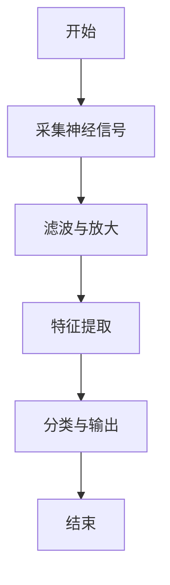
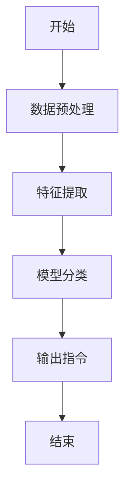
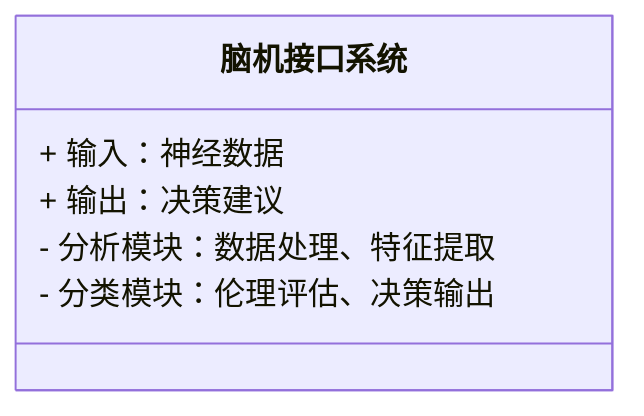
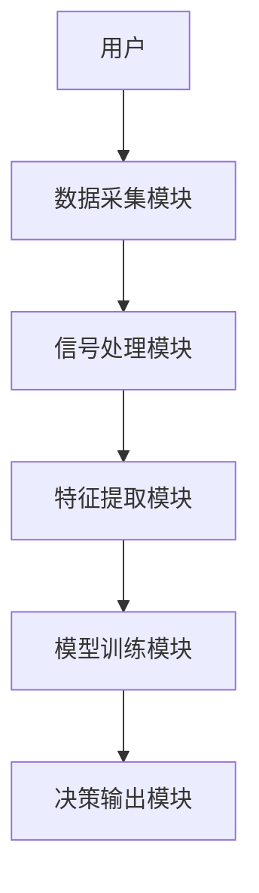
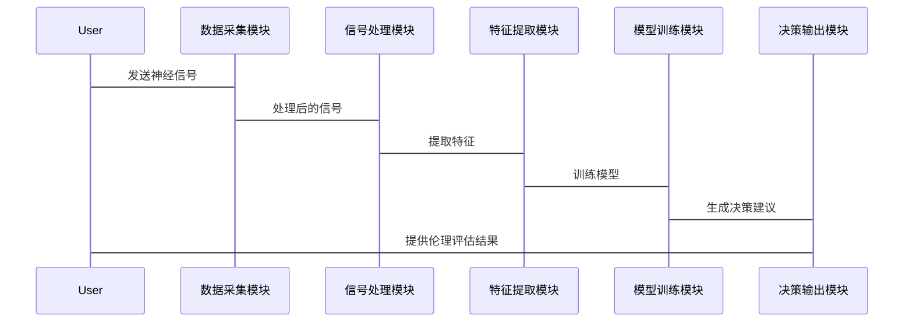

                 


# 巴菲特-芒格的脑机接口伦理投资：人类增强的未来

## 关键词：
- 脑机接口
- 投资伦理
- 巴菲特
- 芒格
- 人类增强
- 人工智能

## 摘要：
本文探讨了脑机接口技术在投资伦理中的应用，结合巴菲特和芒格的投资理念，分析了脑机接口如何增强人类决策能力，并提出了未来投资伦理发展的方向。

---

## 第一部分: 背景介绍

### 第1章: 脑机接口与伦理投资的背景

#### 1.1 脑机接口技术的定义与现状
- **1.1.1 脑机接口的基本概念**  
  脑机接口（Brain-Computer Interface, BCI）是一种连接人类大脑与外部设备的桥梁，通过采集和分析大脑信号，实现对设备的控制。

- **1.1.2 脑机接口技术的发展历程**  
  自20世纪70年代以来，脑机接口技术经历了从实验室研究到实际应用的演变，尤其是在医疗领域取得了显著进展。

- **1.1.3 当前脑机接口技术的应用领域**  
  脑机接口技术在医疗、教育、娱乐和军事等领域有广泛应用，尤其在辅助行动不便的患者方面表现出巨大潜力。

#### 1.2 投资伦理的定义与挑战
- **1.2.1 投资伦理的核心概念**  
  投资伦理关注投资行为对社会、环境和经济的影响，强调在追求收益的同时兼顾社会责任。

- **1.2.2 传统投资中的伦理问题**  
  包括短期主义、过度投机和利益输送等问题，这些行为可能对社会造成负面影响。

- **1.2.3 现代投资伦理的演变**  
  随着ESG（环境、社会、治理）投资理念的兴起，投资伦理逐渐从单纯的财务回报扩展到可持续发展。

#### 1.3 脑机接口与投资伦理的结合
- **1.3.1 脑机接口在投资决策中的潜在应用**  
  利用脑机接口技术分析投资者情绪和认知，优化决策过程。

- **1.3.2 投资伦理与脑机接口技术的结合意义**  
  通过脑机接口实时监测投资者的心理状态，确保投资决策符合伦理标准。

- **1.3.3 未来发展趋势与研究方向**  
  研究重点将放在脑机接口技术在投资伦理中的实际应用和潜在风险上。

### 第2章: 巴菲特与芒格的投资理念

#### 2.1 巴菲特的价值投资理论
- **2.1.1 价值投资的核心原则**  
  价值投资强调以合理价格购买具备内在价值的优秀企业，长期持有。

- **2.1.2 巴菲特的投资策略与成功案例**  
  巴菲特通过分析企业的财务状况、竞争优势和管理层质量，选择具有长期增长潜力的企业。

- **2.1.3 巴菲特投资理念的现代挑战**  
  数字化时代下，价值投资如何应对信息不对称和技术变革的挑战？

#### 2.2 芒格的多元思维模型
- **2.2.1 多元思维模型的定义与特点**  
  芒格提倡构建多学科的知识框架，以全面分析问题。

- **2.2.2 芒格思维模型在投资中的应用**  
  通过跨学科分析，识别投资机会和潜在风险。

- **2.2.3 多元思维模型与脑机接口技术的结合**  
  利用脑机接口技术，整合多学科知识，优化投资决策。

#### 2.3 巴菲特与芒格投资理念的现代意义
- **2.3.1 传统投资理念的数字化转型**  
  将价值投资和多元思维模型与现代技术相结合，提升投资效率。

- **2.3.2 脑机接口技术对投资决策的影响**  
  利用脑机接口实时分析投资者的心理和认知，辅助决策。

- **2.3.3 投资伦理的未来发展方向**  
  在技术驱动下，投资伦理将更加注重可持续性和社会责任。

---

## 第二部分: 核心概念与联系

### 第3章: 脑机接口的核心原理

#### 3.1 脑机接口的基本原理
- **3.1.1 神经信号的采集与处理**  
  使用电极采集大脑电信号，通过滤波和放大处理，提取有用的信号。

- **3.1.2 数据分析与特征提取**  
  利用机器学习算法分析信号，提取与任务相关的特征。

- **3.1.3 输出指令的生成与反馈**  
  基于特征分析生成控制指令，并通过反馈机制优化输出。

#### 3.2 脑机接口的关键技术
- **3.2.1 神经信号的采集方法**  
  包括EEG、fMRI等技术，各有优缺点。

- **3.2.2 数据处理算法**  
  常见算法包括滤波、独立成分分析（ICA）和机器学习方法。

- **3.2.3 输出指令的实现方式**  
  通过控制外部设备或提供反馈信号，实现人与机器的交互。

#### 3.3 脑机接口的伦理问题
- **3.3.1 用户隐私与数据安全**  
  神经数据的采集和处理涉及用户隐私，需严格保护。

- **3.3.2 技术使用的边界与限制**  
  脑机接口的应用可能引发伦理争议，如操控用户行为。

- **3.3.3 脑机接口对人类行为的潜在影响**  
  技术误用可能导致人类认知和行为的改变。

### 第4章: 投资伦理的核心框架

#### 4.1 投资伦理的基本原则
- **4.1.1 道德风险与利益冲突**  
  投资者需避免因个人利益而忽视社会责任。

- **4.1.2 投资决策的透明性与公正性**  
  透明的决策过程有助于建立信任，确保公平性。

- **4.1.3 投资行为的社会责任**  
  投资者应关注投资对社会和环境的影响，避免负面后果。

#### 4.2 投资伦理的评估标准
- **4.2.1 投资项目的伦理评分体系**  
  制定评分标准，评估项目在环境、社会和治理方面的表现。

- **4.2.2 投资决策的伦理审查流程**  
  建立审查机制，确保决策符合伦理标准。

- **4.2.3 投资行为的伦理影响评估**  
  定期评估投资行为对社会和环境的长期影响。

#### 4.3 脑机接口与投资伦理的结合框架
- **4.3.1 脑机接口在伦理评估中的应用**  
  实时监测投资者心理状态，辅助伦理评估。

- **4.3.2 伦理决策的脑机接口实现方式**  
  利用脑机接口优化决策过程，确保符合伦理标准。

- **4.3.3 脑机接口技术对投资伦理的潜在影响**  
  提升决策效率和准确性，推动投资伦理的进步。

---

## 第三部分: 算法原理讲解

### 第5章: 脑机接口数据处理

#### 5.1 脑机接口数据采集与处理


#### 5.2 数据分析与特征提取
```python
import numpy as np
from scipy.signal import butterworth

def preprocess_signal(data, sampling_rate):
    # 滤波处理
    filtered = butterworth(data, cutoff=sampling_rate/2, order=2)
    # 特征提取
    features = np.mean(filtered), np.std(filtered)
    return features

# 示例数据
data = np.random.randn(1000)
sampling_rate = 100
features = preprocess_signal(data, sampling_rate)
print(features)
```

#### 5.3 分类与输出


---

## 第四部分: 系统分析与架构设计方案

### 第6章: 系统架构设计

#### 6.1 问题场景介绍
- 投资者需要实时监控心理状态，确保投资决策符合伦理标准。

#### 6.2 系统功能设计


#### 6.3 系统架构设计


#### 6.4 系统接口设计


---

## 第五部分: 项目实战

### 第7章: 实战案例分析

#### 7.1 环境安装
- 安装必要的库和工具，如Python、numpy、scipy和mermaid。

#### 7.2 核心代码实现
```python
def evaluate_ethical_investment(neural_data):
    # 数据预处理
    processed_data = preprocess_signal(neural_data)
    # 特征提取
    features = extract_features(processed_data)
    # 伦理评估
    ethical_score = assess_ethics(features)
    return ethical_score

# 示例应用
neural_data = generate_neural_signal()
score = evaluate_ethical_investment(neural_data)
print(f"伦理评分：{score}")
```

#### 7.3 案例分析与解读
- 通过实际案例分析，展示系统的应用效果和潜在问题。

#### 7.4 项目小结
- 总结项目成果，提出改进建议。

---

## 第六部分: 总结与展望

### 第8章: 总结与展望

#### 8.1 最佳实践 tips
- 注重数据隐私保护，确保用户信息安全。
- 定期更新模型，适应新的伦理标准和技术发展。

#### 8.2 小结
- 脑机接口技术为投资伦理的优化提供了新思路，结合巴菲特和芒格的投资理念，未来将推动投资决策的智能化和伦理化。

#### 8.3 注意事项
- 技术应用需遵循伦理规范，避免滥用导致负面影响。
- 加强跨学科合作，推动技术与投资伦理的深度融合。

#### 8.4 拓展阅读
- 推荐阅读相关书籍和论文，深入理解脑机接口和投资伦理的结合。

---

通过以上结构，文章详细探讨了脑机接口技术在投资伦理中的应用，结合巴菲特和芒格的投资理念，为未来的投资决策提供了新的视角和方法。

