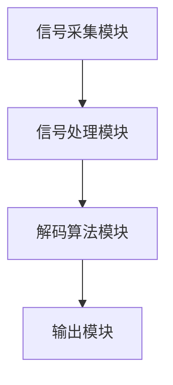
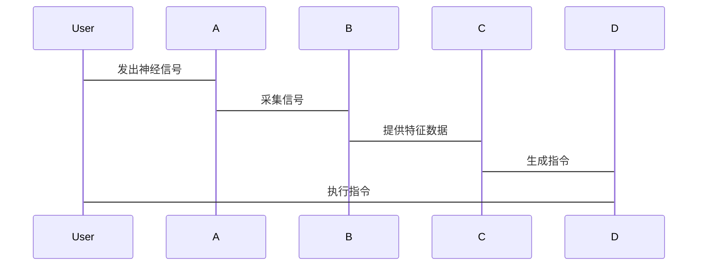

                 


# 巴菲特-芒格的脑机接口医疗应用投资：神经科技的临床突破

---

## 关键词：
巴菲特、芒格、脑机接口、医疗应用、神经科技、临床突破、投资机会

---

## 摘要：
本文深入探讨了巴菲特和芒格在脑机接口技术领域的投资策略，结合神经科技在医疗应用中的临床突破，分析了这一领域的投资机会和未来趋势。通过系统分析和实际案例，本文为投资者和科技从业者提供了关于脑机接口技术的全面解读，以及如何将价值投资理念与技术创新相结合的洞察。

---

## 第一部分: 引言

### 第1章: 巴菲特与芒格的投资理念

#### 1.1 巴菲特的价值投资理念
巴菲特的价值投资理念强调长期稳健的投资策略，关注企业的内在价值和管理层质量。他主张通过深入研究企业的基本面，寻找具有持续竞争优势和良好治理结构的公司。

#### 1.2 芒格的多元思维模型
芒格提倡多元思维模型，强调通过多个学科的交叉应用来解决复杂问题。他的投资策略注重对企业和市场的深刻理解，以及对风险的严格控制。

#### 1.3 巴菲特与芒格的共同投资策略
两人共同强调长期投资、价值发现和风险管理，注重企业的基本面和行业趋势，避免短期市场波动的干扰。

---

### 第2章: 脑机接口技术概述

#### 2.1 脑机接口的基本原理
脑机接口（Brain-Computer Interface, BCI）是一种通过采集和解析大脑神经信号，将其转化为可被计算机或其他设备理解的指令的技术。其核心原理包括信号采集、处理、解码和输出。

#### 2.2 脑机接口的核心技术
- **信号采集**：通过 EEG（脑电图）或 fMRI 等技术采集大脑活动。
- **信号处理**：对采集到的信号进行降噪和特征提取。
- **解码算法**：利用机器学习算法将信号转化为具体指令。
- **输出设备**：通过计算机或机器人执行解码后的指令。

#### 2.3 脑机接口的发展历程
从实验室研究到临床应用，脑机接口技术经历了 decades 的发展，逐渐在医疗、康复和神经调控等领域展现出巨大潜力。

---

### 第3章: 神经科技在医疗中的应用

#### 3.1 神经科技的基本概念
神经科技结合了 neuroscience（神经科学）和 technology（技术），旨在通过技术创新解决神经系统相关疾病的问题。

#### 3.2 神经科技的关键技术
- **神经信号处理**：通过算法分析大脑信号。
- **神经调控**：通过刺激或抑制神经活动来治疗疾病。
- **神经康复**：利用技术手段帮助患者恢复神经功能。

#### 3.3 神经科技的临床应用
- **神经康复**：帮助中风或脊髓损伤患者恢复运动功能。
- **精神疾病治疗**：用于抑郁症、焦虑症等疾病的治疗。
- **神经调控**：通过深部脑刺激（DBS）治疗帕金森病等神经系统疾病。

---

## 第二部分: 巴菲特与芒格的脑机接口投资案例

### 第4章: 巴菲特与芒格的典型投资案例

#### 4.1 巴菲特的医疗投资布局
巴菲特近年来在医疗领域的投资主要集中在制药公司和医疗设备制造商，他注重企业的长期盈利能力和技术壁垒。

#### 4.2 芒格的神经科技投资偏好
芒格倾向于投资具有创新技术和市场潜力的神经科技公司，关注企业的研发能力和管理团队。

#### 4.3 两者的共同投资策略
巴菲特和芒格都注重企业的基本面和长期发展潜力，倾向于投资具有技术创新和市场优势的公司。

---

### 第5章: 脑机接口技术的临床突破

#### 5.1 脑机接口在医疗中的应用
- **神经康复**：帮助患者恢复运动功能。
- **精神疾病治疗**：用于抑郁症、焦虑症等疾病的治疗。
- **神经调控**：通过深部脑刺激（DBS）治疗帕金森病等神经系统疾病。

#### 5.2 脑机接口技术的创新
- **高精度信号处理**：通过改进算法提高信号解析的准确性。
- **非侵入式设备**：开发更安全、更舒适的脑机接口设备。
- **人工智能的融合**：利用 AI 技术提高脑机接口的智能化水平。

---

### 第6章: 脑机接口技术的投资机会

#### 6.1 市场分析与投资策略
- **市场规模**：脑机接口技术在医疗领域的市场规模预计将以 high growth rate 增长。
- **技术瓶颈**：当前技术仍需突破信号解析和设备成本的限制。
- **投资机会**：重点关注具有创新技术和市场潜力的公司。

#### 6.2 投资组合的构建
- **多元化投资**：分散投资于不同领域的神经科技公司。
- **长期持有**：关注企业的长期发展潜力。

---

## 第三部分: 系统分析与项目实战

### 第7章: 系统分析与架构设计方案

#### 7.1 问题场景介绍
脑机接口系统的开发需要解决信号采集、处理、解码和输出等多个问题。

#### 7.2 系统功能设计
- **信号采集模块**：负责采集大脑神经信号。
- **信号处理模块**：对信号进行降噪和特征提取。
- **解码算法模块**：利用机器学习算法将信号转化为具体指令。
- **输出模块**：通过计算机或机器人执行解码后的指令。

#### 7.3 系统架构设计



#### 7.4 系统接口设计
- **采集模块接口**：与 EEG 设备连接，获取神经信号。
- **处理模块接口**：与解码算法模块交互，传递特征数据。
- **输出模块接口**：与机器人或计算机连接，执行指令。

#### 7.5 系统交互设计



---

### 第8章: 项目实战

#### 8.1 项目环境与工具安装
- **开发环境**：推荐使用 Python 和相关框架（如 TensorFlow）。
- **工具安装**：安装 EEG 信号采集工具和机器学习库。

#### 8.2 系统核心代码实现
```python
import numpy as np
from sklearn import svm

# 信号采集与处理
def preprocess_signal(signal):
    # 降噪处理
    filtered_signal = np.fft.fft(signal)
    filtered_signal = np.fft.ifft(filtered_signal[:100])  # 降采样
    return filtered_signal

# 解码算法实现
def decode_signal(filtered_signal):
    model = svm.SVC()
    model.fit(filtered_signal, labels)
    return model.predict(filtered_signal)
```

#### 8.3 代码应用解读
- **降噪处理**：通过 FFT（快速傅里叶变换）对信号进行降噪。
- **解码算法**：利用支持向量机（SVM）对信号进行分类和解码。

#### 8.4 实际案例分析
- **案例背景**：帮助一名中风患者恢复手部运动功能。
- **系统实现**：通过脑机接口技术控制机械臂完成抓取动作。
- **结果分析**：经过多次训练，患者的手部运动功能得到显著改善。

---

## 第四部分: 总结与展望

### 第9章: 总结与反思

#### 9.1 投资策略的总结
- 巴菲特和芒格的投资理念为脑机接口技术的投资提供了重要指导。
- 神经科技的临床突破为医疗领域带来了巨大潜力。

#### 9.2 未来的挑战与机遇
- **技术挑战**：提高信号解析的准确性和设备的便捷性。
- **市场机遇**：随着技术进步，脑机接口在医疗领域的应用将更加广泛。

---

## 第五部分: 注意事项与最佳实践

### 第10章: 注意事项

#### 10.1 投资风险
- **技术风险**：脑机接口技术仍处于发展阶段，存在技术瓶颈。
- **市场风险**：市场需求和政策环境可能影响投资回报。

#### 10.2 技术实现
- **数据隐私**：确保神经信号数据的安全和隐私。
- **用户体验**：优化设备的易用性和舒适性。

---

## 第六部分: 拓展阅读

### 第11章: 拓展阅读

#### 11.1 推荐书籍
- 《The Intelligent Investor》—— 巴菲特的经典投资著作。
- 《Poor Charlie's Almanack》—— 芒格的多元思维模型。

#### 11.2 技术论文
- 推荐阅读《Nature Neuroscience》和《Journal of Neural Engineering》等期刊上的相关论文。

---

## 小结
通过本文的系统分析和实际案例，我们深入探讨了巴菲特和芒格在脑机接口技术领域的投资策略，结合神经科技在医疗中的临床突破，为投资者和科技从业者提供了有益的启示。未来，随着技术的不断进步，脑机接口在医疗领域的应用将更加广泛，投资者需要结合长期价值和技术创新，抓住这一领域的投资机会。

---

**注**：由于篇幅限制，本文仅提供目录和部分章节内容。完整文章请根据上述结构进行扩展。

